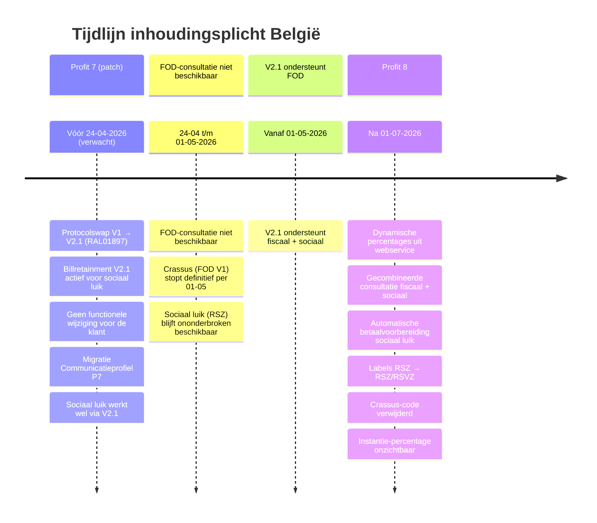

# Ontwerp Profit 7 → Profit 8 — Inhoudingsplicht België

| Onderdeel | Waarde |
| --- | --- |
| Project | RFI00731 |
| Datum | 31-03-2026 |
| Status | Gebrieft |
| Doel | Wat moet er veranderen om van Profit 7 naar Profit 8 te komen |

### Versiehistorie

| Versie | Datum | Auteur | Wijziging |
| --- | --- | --- | --- |
| 0.1 | 26-03-2026 | Eric Zaal | Eerste opzet op basis van RFI00731 en RAL01897 |
| 0.2 | 27-03-2026 | Eric Zaal | Wijzigingstabel W01–W12 uitgewerkt, procesflow en user stories toegevoegd |
| 0.3 | 28-03-2026 | Eric Zaal | §5 Content en documentatie toegevoegd, technische codes verwijderd |
| 0.4 | 30-03-2026 | Eric Zaal | InSite-aandachtspunten (§3.3) en conversiescripts (§4) toegevoegd, W13/W14 aangevuld |
| 0.5 | 31-03-2026 | Eric Zaal | Versiehistorie toegevoegd |
| 0.6 | 31-03-2026 | Eric Zaal | Gebrieft |
| **0.7** | **01-04-2026** | **Eric Zaal** | **W15 toegevoegd: actieknop hernoemen naar "Inhoudingsplicht bijwerken"** |

## 1. Inleiding

### 1.1 Aanleiding

Voor Belgische inkoopfacturen moet je kunnen bepalen of inhoudingsplicht geldt voor het fiscale en sociale luik. In Profit 7 verloopt dit via twee aparte consultatieroutes en een vast percentage op de instantie. De fiscale route (Crassus/V1) stopt definitief per 01-05-2026. Daarnaast is inhoudingsplicht alleen beschikbaar voor klanten met de bouwmodule, terwijl ook klanten in andere sectoren (bewaking, art. 30ter) hier gebruik van moeten kunnen maken.

Dit ontwerp beschrijft de wijzigingen om van de Profit 7-werking naar de Profit 8-werking te komen.

### 1.2 Resultaat

Na realisatie:

- Werkt inhoudingsplicht via één gecombineerde consultatieroute (Billretainment V2.1) voor zowel het fiscale als het sociale luik.
- Worden inhoudingspercentages dynamisch ontvangen uit de webservice en vastgelegd op de crediteur in plaats van vast op de instantie.
- Wordt het type inhouding en de inhoudingsbedragen automatisch voorgesteld op de factuur.
- Kunnen in België ook niet-bouwklanten inhoudingsplicht activeren via een aparte activering.
- Is de oude fiscale consultatieroute verwijderd en zijn de communicatieprofielen samengevoegd.

### 1.3 Afbakening

**In scope**:

- Alle wijzigingen beschreven in hoofdstuk 3 (W01–W14)
- Twee conversiescripts bij upgrade
- Labelwijziging RSZ → RSZ/RSVZ
- Aparte activering los van bouwmodule voor België

**Buiten scope**:

- Aanvullende velden op de openstaande post — eventuele auditvelden (snapshot consultatiestatus, -datum, foutdetail) op de factuur worden in een apart ontwerp uitgewerkt
- Validatie op 50% percentage — de controle of een inhoudingspercentage niet hoger is dan 50% wordt niet geïmplementeerd; gebruiker kan handmatig bedrag aanpassen

**Ongewijzigd**:

- US04 (Handmatige terugval bij storing) — de mogelijkheid om bij storingen handmatig type inhouding, bedragen en kenmerk betaling RSZ in te voeren blijft ongewijzigd beschikbaar


### 1.4 Randvoorwaarden

- RAL01897 (protocolswap V1 → V2.1) moet vóór dit project zijn afgerond.
- De FOD-consultatie is niet beschikbaar van 24-04 t/m 01-05-2026. Vanaf 01-05-2026 ondersteunt V2.1 het fiscale luik.
- Geplande oplevering: na 01-07-2026 (Profit 8).

### 1.5 Tijdlijn



### 1.6 Begrippen

| Term | Betekenis |
| --- | --- |
| Inhoudingsplicht | Verplichte inhouding op betaling in de Belgische context |
| Fiscaal luik | Inhouding richting FOD Financiën |
| Sociaal luik | Inhouding richting Rijksdienst voor Sociale Zekerheid/Sociale Verzekeringen (RSZ/RSVZ) |
| Instantie inhoudingsplicht | Configuratie-entiteit per luik met crediteur, afdeling, bankrekening en berichtsjabloon |
| Raadplegingsnummer RSZ | Uniek referentienummer van de RSZ-raadpleging; nodig voor betaalvoorbereiding sociaal luik |
| Kenmerk betaling RSZ | Gestructureerde mededeling die nodig is voor de sociale betaling |
| Activering | Organisatiebrede instelling die functionaliteit beschikbaar maakt |
| Conditie | Technische guard die zichtbaarheid van schermen en velden aanstuurt |

### Samenvatting

| Nr | Wijziging |
| --- | --- |
| W01 | Nieuwe velden op crediteur |
| W02 | Nieuwe velden invullen bij bijwerken consultatie |
| W03 | Foutdetail invullen bij fout |
| W04 | Percentage uit crediteur halen in plaats van instantie |
| W05 | Betaling aanmelden en betalingskenmerk ophalen via nieuwe route |
| W06 | Conversiescript: percentage van instantie naar crediteuren |
| W07 | Percentage verbergen bij instantie |
| W08 | Schermlabels aanpassen van RSZ naar RSZ/RSVZ |
| W09 | Nieuwe activering "Inhoudingsplicht België" |
| W10 | Conditie wijzigen overal waar nu gcConKnBEfunc wordt gebruikt |
| W11 | Conversiescript: activering aanzetten bij klanten |
| W12 | RSZ communicatieprofiel gebruiken voor zowel FOD + RSZ |
| W13 | FOD communicatieprofiel verwijderen |
| W14 | RSZ communicatieprofiel hernoemen naar "Inhoudingsplicht" |
| W15 | Actieknop hernoemen naar "Inhoudingsplicht bijwerken" |

## 3. Wijzigingen

### W01 — Nieuwe velden op crediteur

**User story**: US01-AC5

**Wat**: Vier nieuwe velden toevoegen aan de crediteur op het tabblad Inhoudingsplicht.

| Veld | Toelichting |
| --- | --- |
| Percentage inhouding fiscaal | Percentage uit V2.1 response |
| Percentage inhouding sociaal | Percentage uit V2.1 response |
| Raadplegingsnummer RSZ | Referentienummer uit V2.1 response |
| Foutdetail | Toelichting bij consultatiefout |

**Scherm Profit Windows**: Velden toevoegen aan de groep Inhoudingsplicht op de crediteur. Percentage inhouding fiscaal onder de FOD-groep, Percentage inhouding sociaal en Raadplegingsnummer RSZ onder de RSZ-groep, Foutdetail onderaan.

**Mockup — Crediteur tabblad Inhoudingsplicht (Profit Windows)**:

```
┌──────────────────────────────────────────────────────────────────┐
│  Crediteur > Inhoudingsplicht                                    │
├──────────────────────────────────────────────────────────────────┤
│  FOD Financiën                                                   │
│  Status FOD              [Heeft schulden       ] (bestaand)      │
│  Laatste controle FOD    [15-03-2026           ] (bestaand)      │
│  Geldig t/m FOD          [15-06-2026           ] (bestaand)      │
│  Perc. inhouding fiscaal [15,00%               ] (NIEUW)         │
├──────────────────────────────────────────────────────────────────┤
│  RSZ/RSVZ                                                        │
│  Status RSZ/RSVZ         [Heeft schulden       ] (bestaand)      │
│  Laatste controle RSZ    [15-03-2026           ] (bestaand)      │
│  Geldig t/m RSZ          [15-06-2026           ] (bestaand)      │
│  Perc. inhouding sociaal [35,00%               ] (NIEUW)         │
│  Raadplegingsnummer RSZ  [REF-2026-123456      ] (NIEUW)         │
├──────────────────────────────────────────────────────────────────┤
│  Foutdetail              [                     ] (NIEUW)         │
└──────────────────────────────────────────────────────────────────┘
```


**Scherm InSite**: In InSite heeft de crediteur één tabblad Inhoudingsplicht met drie veldgroepen: FOD Financiën, RSZ/RSVZ en Foutmelding Inhoudingsplicht België.

**Mockup — Crediteur tabblad InSite (Profit 8)**:

```
┌──────────────────────────────────────────────────────────────────┐
│  Crediteur > Inhoudingsplicht                                    │
├──────────────────────────────────────────────────────────────────┤
│  FOD Financiën                                                   │
│  Status FOD              [Heeft schulden       ] (bestaand)      │
│  Laatste controle FOD    [15-03-2026           ] (bestaand)      │
│  Geldig t/m FOD          [15-06-2026           ] (bestaand)      │
│  Perc. inhouding fiscaal [15,00%               ] (NIEUW)         │
├──────────────────────────────────────────────────────────────────┤
│  RSZ/RSVZ                                                        │
│  Status RSZ/RSVZ         [Heeft schulden       ] (bestaand)      │
│  Laatste controle RSZ    [15-03-2026           ] (bestaand)      │
│  Geldig t/m RSZ          [15-06-2026           ] (bestaand)      │
│  Perc. inhouding sociaal [35,00%               ] (NIEUW)         │
│  Raadplegingsnummer RSZ  [REF-2026-123456      ] (NIEUW)         │
├──────────────────────────────────────────────────────────────────┤
│  Foutmelding Inhoudingsplicht België                    (NIEUW)  │
│  Foutdetail              [                     ] (NIEUW)         │
└──────────────────────────────────────────────────────────────────┘
```


---

### W02 — Nieuwe velden invullen bij bijwerken

**User story**: US01-AC1, US01-AC6, US01-AC7, US01-AC8

**Wat**: Bij een geslaagde consultatie (bijwerken) moeten de nieuwe crediteurvelden worden gevuld vanuit de V2.1 response.

**Triggermechanismen bij opslaan crediteur**

De consultatie wordt bij het opslaan van een crediteur automatisch gestart in de volgende situaties:

| Trigger | Toelichting | AC |
| --- | --- | --- |
| Status nog nooit bepaald | Nieuwe crediteur met ondernemingsnummer die nog niet eerder is geconsulteerd | AC6 |
| Goedkeuren nieuwe inkooprelatie | Bij goedkeuren (ook via InSite) wordt consultatie uitgevoerd | AC7 |
| Wijziging ondernemingsnummer | Bij wijziging van het ondernemingsnummer op een bestaande crediteur | AC8 |

De consultatie verloopt op de achtergrond; de gebruiker hoeft geen actie te ondernemen. Na opslaan zijn de bijgewerkte velden direct zichtbaar op het tabblad Inhoudingsplicht.

Dit triggermechanisme is bestaand. De wijziging zit in de resultaatverwerking: de V2.1 response vult nu ook de nieuwe velden (W01).

**Resultaatverwerking**:

| V2.1 response-veld | Crediteurveld |
| --- | --- |
| Percentage fiscale inhouding | Percentage inhouding fiscaal |
| Percentage sociale inhouding | Percentage inhouding sociaal |
| Raadplegingsreferentie | Raadplegingsnummer RSZ |

- Bij succes: Foutdetail leegmaken.
- Afstemmen met PHS (Profit Hosting Services) voor de mapping van V2.1-velden.
- De bestaande velden (Status FOD, Laatste controle FOD, Geldig t/m FOD, Status RSZ, Laatste controle RSZ, Geldig t/m RSZ) worden ongewijzigd gevuld.

---

### W03 — Foutdetail invullen bij fout

**User story**: US01-AC9

**Wat**: Bij een mislukte consultatie bij bijwerken (opslaan of batch) moet het foutdetail worden gevuld.

**Gedrag**:

- Bij consultatiefout: Foutdetail vullen met een leesbare toelichting uit de foutresponse.
- De vorige status (Status FOD, Status RSZ) en overige velden blijven ongewijzigd.
- Percentage inhouding fiscaal, Percentage inhouding sociaal en Raadplegingsnummer RSZ blijven op hun vorige waarde.

---

### W04 — Percentage uit crediteur halen in plaats van instantie

**User story**: US02

**Wat**: Bij het berekenen van inhoudingsbedragen op de openstaande post (inkoopfactuur) moet het percentage worden gelezen uit de crediteur in plaats van uit de instantie.

**Huidig (Profit 7)**: Percentage wordt gelezen uit het percentage op de instantie inhoudingsplicht.

**Nieuw (Profit 8)**: Percentage wordt gelezen uit de crediteur:
- Fiscaal bedrag = factuurbedrag excl. btw × Percentage inhouding fiscaal
- Sociaal bedrag = factuurbedrag excl. btw × Percentage inhouding sociaal

**Automatisch voorstel type inhouding**: Op basis van de gecombineerde crediteurstatus wordt het type inhouding automatisch voorgesteld (Fiscaal, Sociaal, Beide of Geen).

**Herberekening**: De bestaande herberekeningscascade (batchverwerking, statuswijziging crediteur, geplande taak) werkt ongewijzigd; alleen de bron van het percentage wijzigt van instantie naar crediteur. Guards (RV07, RV08, RV09, RV10) blijven ongewijzigd van toepassing.

```
┌──────────────────────────────────────────────────────────────────┐
│  Inkoopfactuur > Inhoudingsplicht                                 │
├──────────────────────────────────────────────────────────────────┤
│  Type inhouding    [Beide                    ] (automatisch)      │
│  Bedrag FOD        [€ 1.500,00                ] (15% van € 10.000) │
│  Bedrag RSZ/RSVZ   [€ 3.500,00                ] (35% van € 10.000) │
│  Kenmerk RSZ/RSVZ  [                         ]                    │
└──────────────────────────────────────────────────────────────────┘
  Percentage komt uit crediteur i.p.v. instantie.
  Type inhouding wordt automatisch voorgesteld o.b.v. crediteurstatus.
```


**Guards**: Ongewijzigd (RV07, RV08, RV09, RV10).

---

### W05 — Betaling aanmelden en betalingskenmerk ophalen via nieuwe route

**User story**: US03

**Wat**: De betaalvoorbereiding voor het sociale luik moet via de V2.1-route verlopen. Het kenmerk betaling RSZ wordt opgehaald bij een geslaagde voorbereiding.

**Gedrag**: Functioneel ongewijzigd; het protocol wijzigt van V1 naar V2.1.

---

### W06 — Conversiescript: percentage van instantie naar crediteuren

**User story**: US06-AC8

**Wat**: Bij de upgrade naar Profit 8 een eenmalige conversie uitvoeren die het percentage per luik kopieert van de instantie naar de crediteur.

**Logica**:

| Stap | Actie |
| --- | --- |
| 1 | Selecteer crediteuren met FOD-schuldstatus (Status FOD = "heeft schuld") |
| 2 | Zet Percentage inhouding fiscaal = percentage van de FOD-instantie |
| 3 | Selecteer crediteuren met RSZ-schuldstatus (Status RSZ = "heeft schuld") |
| 4 | Zet Percentage inhouding sociaal = percentage van de RSZ-instantie |
| 5 | Crediteuren zonder schuldstatus: percentages blijven leeg |

---

### W07 — Percentage verbergen bij instantie

**User story**: US06-AC5

**Wat**: Het percentage-veld op de instantie inhoudingsplicht onzichtbaar maken.

**Gedrag**: Het veld blijft bestaan in de database, maar wordt niet meer getoond op het scherm. Overige velden op de instantie (crediteur, afdeling, bankrekening, berichtsjabloon) blijven ongewijzigd.

**Mockup — Instantie inhoudingsplicht (Profit 8)**:

```
┌──────────────────────────────────────────────────┐
│  Instantie inhoudingsplicht                       │
├──────────────────────────────────────────────────┤
│  Crediteur        [100001 - Bouwbedrijf NV   ]    │
│  Afdeling         [Crediteuren               ]    │
│  Bankrekening     [BE68 5390 0754 7034       ]    │
│  Berichtsjabloon  [Inhoudingsplicht          ]    │
│  Percentage       [█████ VERBORGEN █████████]    │
└──────────────────────────────────────────────────┘
      Profit 7: Percentage zichtbaar
      Profit 8: Percentage verborgen
```


---

### W08 — Schermlabels aanpassen van RSZ naar RSZ/RSVZ

**User story**: US06-AC7

**Wat**: Alle schermlabels waar "RSZ" staat wijzigen naar "RSZ/RSVZ".

**Locaties**: Tabblad Inhoudingsplicht op de crediteur, factuurscherm, instantie-scherm, omschrijving op de betaalregel bij aanmelden sociale inhouding, en eventuele andere plekken waar het label voorkomt.

**Instantie hernoemen**: De tabelwaarde "Rijksdienst voor Sociale Zekerheid" (code RSZ) wordt hernoemd naar "Rijksdienst voor Sociale Zekerheid/Sociale Verzekeringen (RSZ/RSVZ)".

**Aangepaste meldingen — inkoopfactuur**:

- Het is niet mogelijk om inhoudingsplicht '\{1\}' te kiezen, omdat de instantie inhoudingsplicht 'Rijksdienst voor Sociale Zekerheid/Sociale Verzekeringen' niet is ingericht in de financiele instellingen.
- Het is niet mogelijk om inhoudingsplicht '\{1\}' te kiezen, omdat de instantie inhoudingsplicht 'Rijksdienst voor Sociale Zekerheid/Sociale Verzekeringen' is geblokkeerd.
- Het is alleen mogelijk om het veld '\{1\}' te vullen bij inhoudingsplicht 'FOD Financiën' of 'FOD Financiën en Rijksdienst voor Sociale Zekerheid/Sociale Verzekeringen'.
- Het veld '\{1\}' moet groter zijn dan nul bij inhoudingsplicht 'FOD Financiën' of 'FOD Financiën en Rijksdienst voor Sociale Zekerheid/Sociale Verzekeringen'.
- Het is alleen mogelijk om het veld '\{1\}' te vullen bij inhoudingsplicht 'Rijksdienst voor Sociale Zekerheid/Sociale Verzekeringen' of 'FOD Financiën en Rijksdienst voor Sociale Zekerheid/Sociale Verzekeringen'.
- Het veld '\{1\}' moet groter zijn dan nul bij inhoudingsplicht 'Rijksdienst voor Sociale Zekerheid/Sociale Verzekeringen' of 'FOD Financiën en Rijksdienst voor Sociale Zekerheid/Sociale Verzekeringen'.
- De velden met betrekking tot FOD en RSZ/RSVZ kunnen alleen gevuld worden bij inkoopfacturen.
- De velden met betrekking tot FOD en RSZ/RSVZ zijn alleen beschikbaar onder de licentie 'België'.
- Weet je zeker dat je het veld 'Bedrag RSZ/RSVZ' wilt aanpassen? Het bedrag RSZ/RSVZ is groter dan \{1\}% procent van het factuurbedrag \{2\}. Het huidige bedrag RSZ/RSVZ is \{3\}% van het factuurbedrag.

**Aangepaste meldingen — betaling**:

- Voor factuur '\{1\}' wordt er geen betaling aan de RSZ/RSVZ gedaan terwijl crediteur '\{2\}' wel een schuld heeft bij de RSZ/RSVZ. Weet je zeker dat je de betaling wilt verwerken?
- Voor factuur '\{1\}' wordt er een betaling aan de RSZ/RSVZ gedaan terwijl crediteur '\{2\}' geen schuld heeft bij de RSZ/RSVZ. Weet je zeker dat je de betaling wilt verwerken?
- Het is niet gelukt om factuur '\{1\}' aan te melden bij de RSZ/RSVZ. Probeer het opnieuw of meld de factuur handmatig aan en vul de referentie RSZ/RSVZ handmatig op de factuur.
- Het is niet mogelijk om de betaling aan te melden bij de RSZ/RSVZ. Het veld 'Telefoon' is leeg in de administratie instellingen.
- Het is niet mogelijk om de betaling aan te melden bij de RSZ/RSVZ. Het veld 'Nummer KvK' is leeg in de administratie instellingen.

---

### W09 — Nieuwe activering "Inhoudingsplicht België"

**User story**: US07-AC1

**Wat**: Een nieuwe activering Inhoudingsplicht België aanmaken, onafhankelijk van de bouwactivering. Alle tabelvelden met inhoudingsplicht stonden onder conditie "België (functionaliteit)" (120123). De nieuwe activering vervangt deze conditie voor inhoudingsplicht.

**Gedrag**: Na activering zijn het tabblad Inhoudingsplicht op de crediteur, de inhoudingsvelden op de factuur, de instantie inhoudingsplicht en de geplande taak beschikbaar. Zonder activering is niets zichtbaar.

---

### W10 — Conditie wijzigen overal waar nu gcConKnBEfunc wordt gebruikt

**User story**: US07-AC2

**Wat**: Overal waar nu de bouwconditie wordt gebruikt als guard voor inhoudingsplicht, deze vervangen door de nieuwe conditie Inhoudingsplicht België.

**Impacttabel**:

| Onderdeel | Conditie oud | Conditie nieuw |
| --- | --- | --- |
| Tabblad Inhoudingsplicht op crediteur | Bouw België + land = België | Inhoudingsplicht België + land = België |
| Inhoudingsvelden op factuur | Bouw België | Inhoudingsplicht België |
| Instantie inhoudingsplicht (menu en scherm) | Bouw België | Inhoudingsplicht België |
| Geplande taak Inhoudingsplicht bijwerken | Bouw België | Inhoudingsplicht België |

---

### W11 — Conversiescript: activering aanzetten bij klanten

**User story**: US07-AC5

**Wat**: Bij de upgrade naar Profit 8 een conversiescript uitvoeren dat de nieuwe activering automatisch aanzet voor bestaande klanten.

**Logica**: Klanten met een actieve instantie inhoudingsplicht krijgen de activering Inhoudingsplicht België automatisch. De oude bouwconditie wordt niet meer gebruikt als guard voor inhoudingsplicht.

---

### W12 — RSZ communicatieprofiel gebruiken voor zowel FOD + RSZ

**User story**: US06

**Wat**: Overal waar de code nu het FOD-communicatieprofiel gebruikt, moet in plaats daarvan het RSZ-communicatieprofiel worden aangesproken. Na W14 heet dit profiel "Inhoudingsplicht".

**Gedrag**: De gecombineerde V2.1-route communiceert via één profiel voor zowel fiscale als sociale raadplegingen. Alle codepaden die voorheen naar het FOD-profiel verwezen, verwijzen nu naar het (hernoemde) RSZ-profiel.

---

### W13 — FOD communicatieprofiel verwijderen

**User story**: US06

**Wat**: Het FOD-communicatieprofiel verwijderen. Dit profiel was alleen nodig voor de oude V1 (Crassus) route die niet meer wordt gebruikt.

**Volgorde**: Eerst W12 uitvoeren (FOD-verkeer omleiden naar RSZ-profiel), dan pas het FOD-profiel verwijderen.

---

### W14 — RSZ communicatieprofiel hernoemen naar "Inhoudingsplicht"

**User story**: US06

**Wat**: Het RSZ-communicatieprofiel hernoemen naar "Inhoudingsplicht".

**Gedrag**: Na hernoemen dient dit profiel als enig communicatieprofiel voor alle inhoudingsplichtconsultaties (fiscaal + sociaal).

**Volgorde**: W12 → W13 → W14. Eerst het verkeer omleiden, dan het oude profiel verwijderen, dan hernoemen.

---

### W15 — Actieknop hernoemen naar "Inhoudingsplicht bijwerken"

**User story**: US01

**Wat**: De actieknop op de tabbladen FOD en RSZ op de crediteur hernoemen van "Nieuw" naar "Inhoudingsplicht bijwerken".

**Huidig (Profit 7)**: Op beide tabbladen staat een knop met de naam "Nieuw". Dit is misleidend: de knop maakt niets aan, maar start een consultatie.

**Nieuw (Profit 8)**: Beide knoppen heten "Inhoudingsplicht bijwerken". Dit is consistent met de geplande taak "Inhoudingsplicht bijwerken" en de knop "Opnieuw bepalen" in Profit Windows. Beide knoppen blijven bestaan (één per tabblad) en doen hetzelfde.

**Gedrag**: De knop start de V2.1 gecombineerde consultatie. Beide luiken (FOD én RSZ) worden tegelijk bijgewerkt via één communicatieprofiel (W14: "Inhoudingsplicht"). Het maakt niet uit op welk tabblad de gebruiker de knop gebruikt: het resultaat is gelijk.

**Mockup — Profit 7 (huidig)**:

```
┌──────────────────────────────────────────────────────────────────┐
│  Crediteur > FOD Financiën                                       │
├──────────────────────────────────────────────────────────────────┤
│  Status              [Heeft schuld (1)     ▾]  [Nieuw]           │
│  Laatste controle    [23-03-2026           ]                     │
│  Geldig t/m          [23-03-2026           ]                     │
└──────────────────────────────────────────────────────────────────┘

┌──────────────────────────────────────────────────────────────────┐
│  Crediteur > Rijksdienst voor Sociale Zekerheid (RSZ)            │
├──────────────────────────────────────────────────────────────────┤
│  Status              [Heeft schuld (1)     ▾]  [Nieuw]           │
│  Laatste controle    [19-01-2026           ]                     │
│  Geldig t/m          [                     ]                     │
└──────────────────────────────────────────────────────────────────┘
  Twee knoppen "Nieuw" — misleidende naam, starten beide een consultatie.
```

**Mockup — Profit 8 (nieuw)**:

```
┌──────────────────────────────────────────────────────────────────┐
│  Crediteur > Inhoudingsplicht    [Inhoudingsplicht bijwerken]     │
├──────────────────────────────────────────────────────────────────┤
│  FOD Financiën                                                   │
│  Status              [Heeft schuld (1)     ▾]                    │
│  Laatste controle    [23-03-2026           ]                     │
│  Geldig t/m          [23-03-2026           ]                     │
│  Perc. inhouding fiscaal [15,00%           ]                     │
├──────────────────────────────────────────────────────────────────┤
│  RSZ/RSVZ                                                        │
│  Status              [Heeft schuld (1)     ▾]                    │
│  Laatste controle    [19-01-2026           ]                     │
│  Geldig t/m          [                     ]                     │
│  Perc. inhouding sociaal [35,00%           ]                     │
│  Raadplegingsnummer RSZ  [REF-2026-123456  ]                     │
└──────────────────────────────────────────────────────────────────┘
  Eén knop "Inhoudingsplicht bijwerken" op het tabblad.
  Start een V2.1 consultatie die beide luiken tegelijk bijwerkt.
```


---

### InSite — impact op crediteur

Bij het goedkeuren van een nieuwe inkooprelatie via InSite wordt dezelfde consultatie getriggerd als bij het opslaan van een crediteur in Profit Windows:

- **Consultatie**: Bij goedkeuren van een nieuwe inkooprelatie of bij wijziging van het ondernemingsnummer wordt de V2.1 consultatie aangeroepen.
- **Resultaatverwerking**: De nieuwe velden (percentage inhouding fiscaal, percentage inhouding sociaal, raadplegingsnummer RSZ, foutdetail) worden serverside gevuld, ook wanneer de trigger via InSite verloopt. De bestaande opslaan-logica wordt hergebruikt.
- **Zichtbaarheid**: In InSite heeft de crediteur één tabblad Inhoudingsplicht met drie veldgroepen: FOD Financiën, RSZ/RSVZ, en Foutmelding Inhoudingsplicht België. De nieuwe velden worden in de bijbehorende veldgroep geplaatst.
- **Actieknop**: Zie W15. De knopnaam "Inhoudingsplicht bijwerken" geldt ook in InSite.
- **Activering**: De nieuwe activering Inhoudingsplicht België moet ook in de InSite-context werken. Zonder activering wordt geen consultatie uitgevoerd, ook niet bij goedkeuren via InSite.

## 4. Conversiescripts bij upgrade

Bij de upgrade naar Profit 8 worden twee conversiescripts uitgevoerd:

| Script | Doel |
| --- | --- |
| Activering aanzetten (W11) | Activering Inhoudingsplicht België aanzetten voor klanten met actieve instantie |
| Percentage kopiëren (W06) | Instantie-percentage per luik kopiëren naar crediteur voor crediteuren met schuldstatus |

## 5. Content en documentatie

### Veldinfo

| Veld | Locatie | Toelichting |
| --- | --- | --- |
| Percentage inhouding fiscaal | Crediteur – tabblad Inhoudingsplicht | Dynamisch percentage uit de V2.1 webservice voor het fiscale luik (FOD Financiën). |
| Percentage inhouding sociaal | Crediteur – tabblad Inhoudingsplicht | Dynamisch percentage uit de V2.1 webservice voor het sociale luik (RSZ/RSVZ). |
| Raadplegingsnummer RSZ | Crediteur – tabblad Inhoudingsplicht | Uniek referentienummer ontvangen bij de RSZ-raadpleging, nodig voor betaalvoorbereiding sociaal luik. |
| Foutdetail | Crediteur – tabblad Inhoudingsplicht | Bevat een leesbare toelichting wanneer de consultatie is mislukt. Wordt leeggemaakt bij een geslaagde consultatie. |

### Veldinfo content (informatiebolletje)

De vier nieuwe velden hebben een informatiebolletje nodig. Content team maakt de veldinfo aan op basis van de teksten in de tabel hierboven. (US01)

### Profielen en veldcontexten

- De vier nieuwe crediteurvelden (Percentage inhouding fiscaal, Percentage inhouding sociaal, Raadplegingsnummer RSZ, Foutdetail) opnemen in de standaardprofielen voor de crediteur.
- In InSite: het nieuwe tabblad **Foutmelding Inhoudingsplicht België** opnemen in de InSite-profielen voor de crediteur. (US01)

### Standaardpagina's InSite

- Het nieuwe tabblad **Foutmelding Inhoudingsplicht België** toevoegen aan de crediteur-standaardpagina in InSite.


### Helpdocumentatie

- Bestaande helppagina Inhoudingsplicht bijwerken met uitleg over de vier nieuwe velden.
- Vermelding dat het percentage nu dynamisch wordt ontvangen en niet meer op de instantie staat.
- Labels RSZ/RSVZ documenteren.
- Activering "Inhoudingsplicht België" documenteren, inclusief het feit dat deze onafhankelijk is van de bouwmodule.

### Releasenotes

Inhoudingsplicht België werkt in Profit 8 via een gecombineerde consultatieroute (Billretainment V2.1) voor zowel het fiscale als het sociale luik. Inhoudingspercentages worden dynamisch ontvangen en vastgelegd op de crediteur. Bij de upgrade worden percentages automatisch geconverteerd. Inhoudingsplicht is activeerbaar onafhankelijk van de bouwmodule. Het label "RSZ" is gewijzigd naar "RSZ/RSVZ".

## Bijlage A — User stories en acceptatiecriteria

### US01 — Consultatie inhoudingsplicht (Uitbreiding)

Als crediteurenmedewerker wil ik de inhoudingsstatus tijdig laten bepalen, zodat ik zonder losse controles kan verwerken.

**Acceptatiecriteria**:

| Nr | Criterium | Status |
| --- | --- | --- |
| AC1 | Na een geslaagde consultatie zijn status, controledatum en raadplegingsnummer RSZ zichtbaar op de crediteur. | Uitbreiding |
| AC2 | Een factuur kan worden verwerkt met de laatst vastgelegde status van de crediteur. | Bestaand |
| AC3 | Bij consultatiefout blijft de gebruiker kunnen doorwerken met handmatige invoer. | Bestaand |
| AC4 | Bij uitkomst Buiten domein toont Profit een duidelijke melding en wordt geen inhouding voorgesteld. | Bestaand |
| AC5 | Op het tabblad Inhoudingsplicht van de crediteur zijn de velden Percentage inhouding (fiscaal en sociaal), Raadplegingsnummer RSZ en Foutdetail zichtbaar. | Nieuw |
| AC6 | Bij opslaan van een crediteur zonder eerdere status wordt automatisch een consultatie uitgevoerd. | Bestaand |
| AC7 | Bij goedkeuren van een nieuwe inkooprelatie wordt automatisch een consultatie uitgevoerd. | Bestaand |
| AC8 | Bij wijziging van het ondernemingsnummer wordt automatisch een consultatie uitgevoerd. | Bestaand |
| AC9 | Bij een consultatiefout bij opslaan blijft de vorige status ongewijzigd en is het foutdetail gevuld. | Uitbreiding |

**Raakt wijzigingen**: W01, W02, W03

---

### US02 — Bijwerken openstaande post / inkoopfactuur (Bestaand)

Als crediteurenmedewerker wil ik dat de openstaande post (inkoopfactuur) automatisch wordt bijgewerkt met type inhouding en bedragen.

**Acceptatiecriteria**:

| Nr | Criterium | Status |
| --- | --- | --- |
| AC1 | Als beide luiken inhoudingsplicht tonen, wordt type inhouding Beide voorgesteld. | Nieuw |
| AC2 | Als alleen fiscaal inhoudingsplicht toont, wordt type inhouding Fiscaal voorgesteld. | Nieuw |
| AC3 | Als alleen sociaal inhoudingsplicht toont, wordt type inhouding Sociaal voorgesteld. | Nieuw |
| AC4 | Bij geen plicht op beide luiken worden bedragen als nul voorgesteld. | Uitbreiding |
| AC5 | Handmatige aanpassing van bedragen op factuurniveau blijft mogelijk. | Bestaand |

**Raakt wijzigingen**: W04

---

### US03 — Betaalvoorbereiding sociaal luik (Bestaand)

Als crediteurenmedewerker wil ik voor het sociale luik automatisch een betalingskenmerk ontvangen, zodat de betaling correct wordt aangemeld.

**Acceptatiecriteria**:

| Nr | Criterium | Status |
| --- | --- | --- |
| AC1 | Bij succes bevat de factuur een gevuld kenmerk betaling RSZ. | Bestaand |
| AC2 | Het bedrag op de sociale betaalregel volgt het sociale inhoudingsbedrag van de factuur. | Bestaand |
| AC3 | Bij fout toont Profit een melding en kan de gebruiker handmatig verder. | Bestaand |
| AC4 | De voorbereiding gebeurt per factuur, zodat elk document een eigen kenmerk kan krijgen. | Bestaand |

**Raakt wijzigingen**: W05

---

### US06 — Consolidatie naar gecombineerde consultatieroute (Nieuw)

Als beheerder wil ik dat de oude fiscale consultatieroute uit Profit is verwijderd, zodat er alleen een nieuwe gecombineerde route actief is.

**Acceptatiecriteria**:

| Nr | Criterium | Status |
| --- | --- | --- |
| AC1 | De oude consultatieroute kan niet meer in het systeem worden ingeschakeld. | Nieuw |
| AC2 | Alle referenties naar de oude route zijn verwijderd uit het actieve codepad. | Nieuw |
| AC3 | Logging toont geen poging tot aanroep van de oude route. | Nieuw |
| AC4 | Testing valideert dat instellingen van de oude route geen effect meer hebben. | Nieuw |
| AC5 | Het percentage-veld op de instantie is onzichtbaar gemaakt. | Nieuw |
| AC6 | Overige velden op de instantie (crediteur, afdeling, bankrekening, berichtsjabloon) functioneren ongewijzigd. | Bestaand |
| AC7 | Schermlabels "RSZ" zijn bijgewerkt naar "RSZ/RSVZ". | Nieuw |
| AC8 | Na conversie hebben alle crediteuren met FOD-schuldstatus een gevuld percentage inhouding fiscaal en alle crediteuren met RSZ-schuldstatus een gevuld percentage inhouding sociaal. | Nieuw |
| AC9 | Crediteuren zonder schuldstatus hebben percentage inhouding fiscaal en sociaal = NULL na conversie. | Nieuw |

**Raakt wijzigingen**: W06, W07, W08, W12, W13, W14

---

### US07 — Activering inhoudingsplicht los van bouwconditie (Nieuw)

Als beheerder wil ik inhoudingsplicht voor België apart kunnen activeren, zodat ook niet-bouwklanten inhoudingsplicht kunnen gebruiken.

**Acceptatiecriteria**:

| Nr | Criterium | Status |
| --- | --- | --- |
| AC1 | Inhoudingsplicht België kan worden geactiveerd zonder dat de bouwmodule actief is. | Nieuw |
| AC2 | Na activering zijn tabblad Inhoudingsplicht op de crediteur, inhoudingsvelden op de factuur, instantie inhoudingsplicht en geplande taak beschikbaar. | Nieuw |
| AC3 | Zonder activering zijn het tabblad, de factuurvelden, de instantie en de geplande taak niet zichtbaar of inactief. | Nieuw |
| AC4 | Voor klanten die al inhoudingsplicht via de bouwmodule gebruiken, verandert er niets. | Bestaand |
| AC5 | Bij upgrade naar Profit 8 wordt de activering automatisch aangezet voor klanten die een actieve instantie inhoudingsplicht hebben. | Nieuw |

**Raakt wijzigingen**: W09, W10, W11

## Bijlage B — Testscenario's

### Testvoorwaarden

| Voorwaarde | Toelichting |
| --- | --- |
| Belgische administratie | Administratie met land = België |
| Activering Inhoudingsplicht België | Activering is actief |
| Instantie inhoudingsplicht | Ten minste één instantie (FOD en/of RSZ/RSVZ) ingericht |
| Crediteur met ondernemingsnummer | Belgisch ondernemingsnummer op de crediteur |

### US01 — Consultatie inhoudingsplicht

| Nr | Scenario | Verwacht resultaat | AC |
| --- | --- | --- | --- |
| T01 | Crediteur opslaan met geldig ondernemingsnummer; consultatie slaagt met schuld op beide luiken | Status FOD en RSZ/RSVZ = "Heeft schulden", percentages inhouding fiscaal en sociaal gevuld, raadplegingsnummer RSZ gevuld, foutdetail leeg | AC1, AC5 |
| T02 | Crediteur opslaan; consultatie slaagt met schuld alleen op fiscaal luik | Percentage inhouding fiscaal gevuld, percentage inhouding sociaal leeg, raadplegingsnummer RSZ leeg | AC1, AC5 |
| T03 | Crediteur opslaan; consultatie slaagt met schuld alleen op sociaal luik | Percentage inhouding sociaal en raadplegingsnummer RSZ gevuld, percentage inhouding fiscaal leeg | AC1, AC5 |
| T04 | Crediteur opslaan; consultatie slaagt zonder schuld op beide luiken | Status FOD en RSZ/RSVZ = "Geen schulden", percentages leeg, raadplegingsnummer RSZ leeg | AC1 |
| T05 | Crediteur opslaan met eerder gevuld foutdetail; consultatie slaagt | Foutdetail wordt leeggemaakt | AC1 |
| T06 | Crediteur opslaan; consultatie mislukt | Vorige status en percentages blijven ongewijzigd, foutdetail wordt gevuld met leesbare toelichting | AC9 |
| T07 | Crediteur opslaan; consultatie retourneert "Buiten domein" | Melding wordt getoond, geen inhouding voorgesteld | AC4 |
| T08 | Crediteur opslaan zonder eerdere status (nieuwe crediteur) | Consultatie wordt automatisch uitgevoerd | AC6 |
| T09 | Ondernemingsnummer wijzigen op bestaande crediteur | Consultatie wordt automatisch uitgevoerd | AC8 |
| T10 | Nieuwe inkooprelatie goedkeuren via InSite | Consultatie wordt uitgevoerd, nieuwe velden serverside gevuld | AC7 |
| T11 | Factuur verwerken met laatst vastgelegde crediteurstatus | Factuur kan worden verwerkt | AC2 |
| T12 | Consultatie mislukt; gebruiker past handmatig bedragen aan op factuur | Gebruiker kan doorwerken | AC3 |

### US02 — Bijwerken openstaande post / inkoopfactuur

| Nr | Scenario | Verwacht resultaat | AC |
| --- | --- | --- | --- |
| T13 | Inkoopfactuur invoeren; crediteur heeft schuld op beide luiken | Type inhouding = Beide, bedrag FOD = factuurbedrag excl. btw × perc. fiscaal, bedrag RSZ/RSVZ = factuurbedrag excl. btw × perc. sociaal | AC1 |
| T14 | Inkoopfactuur invoeren; crediteur heeft alleen fiscale schuld | Type inhouding = Fiscaal, bedrag FOD gevuld, bedrag RSZ/RSVZ = 0 | AC2 |
| T15 | Inkoopfactuur invoeren; crediteur heeft alleen sociale schuld | Type inhouding = Sociaal, bedrag RSZ/RSVZ gevuld, bedrag FOD = 0 | AC3 |
| T16 | Inkoopfactuur invoeren; crediteur heeft geen schuld op beide luiken | Bedragen worden als nul voorgesteld | AC4 |
| T17 | Inkoopfactuur invoeren met automatisch voorgesteld bedrag; gebruiker past bedrag handmatig aan | Handmatige aanpassing wordt opgeslagen | AC5 |
| T18 | Inkoopfactuur invoeren; percentage op crediteur is gevuld; percentage op instantie wijkt af | Percentage wordt gelezen uit de crediteur, niet uit de instantie | W04 |

### US03 — Betaalvoorbereiding sociaal luik

| Nr | Scenario | Verwacht resultaat | AC |
| --- | --- | --- | --- |
| T19 | Betaling verwerken voor factuur met sociaal inhoudingsbedrag; voorbereiding slaagt | Kenmerk betaling RSZ gevuld op de factuur | AC1 |
| T20 | Betaling verwerken; bedrag op sociale betaalregel controleren | Bedrag volgt het sociale inhoudingsbedrag van de factuur | AC2 |
| T21 | Betaling verwerken; voorbereiding mislukt | Melding wordt getoond, gebruiker kan handmatig verder | AC3 |
| T22 | Twee facturen met sociaal inhoudingsbedrag verwerken | Elke factuur krijgt een eigen kenmerk betaling RSZ | AC4 |

### US06 — Consolidatie naar gecombineerde consultatieroute

| Nr | Scenario | Verwacht resultaat | AC |
| --- | --- | --- | --- |
| T23 | Consultatie uitvoeren na upgrade; controleer dat V2.1 wordt aangeroepen | Communicatie verloopt via het (hernoemde) profiel "Inhoudingsplicht" | AC1, AC2 |
| T24 | Logging controleren na consultatie | Geen poging tot aanroep van de oude FOD-route in de logging | AC3 |
| T25 | Oude V1-instellingen handmatig configureren; consultatie uitvoeren | Oude instellingen hebben geen effect; consultatie gebruikt V2.1 | AC4 |
| T26 | Instantie inhoudingsplicht openen | Percentage-veld is niet zichtbaar; crediteur, afdeling, bankrekening en berichtsjabloon zijn zichtbaar en functioneren | AC5, AC6 |
| T27 | Tabblad Inhoudingsplicht op crediteur controleren | Labels bevatten "RSZ/RSVZ" in plaats van "RSZ" | AC7 |
| T28 | Factuurscherm en instantie-scherm controleren op labels | Labels bevatten "RSZ/RSVZ" in plaats van "RSZ" | AC7 |
| T29 | Na conversie: crediteur met FOD-schuldstatus controleren | Percentage inhouding fiscaal is gevuld met instantie-percentage | AC8 |
| T30 | Na conversie: crediteur met RSZ-schuldstatus controleren | Percentage inhouding sociaal is gevuld met instantie-percentage | AC8 |
| T31 | Na conversie: crediteur zonder schuldstatus controleren | Percentage inhouding fiscaal en sociaal = NULL | AC9 |

### US07 — Activering inhoudingsplicht los van bouwconditie

| Nr | Scenario | Verwacht resultaat | AC |
| --- | --- | --- | --- |
| T32 | Activering Inhoudingsplicht België aanzetten zonder actieve bouwmodule | Activering slaagt | AC1 |
| T33 | Na activering: schermen en velden controleren | Tabblad Inhoudingsplicht op crediteur, inhoudingsvelden op factuur, instantie inhoudingsplicht en geplande taak zijn beschikbaar | AC2 |
| T34 | Activering Inhoudingsplicht België niet aanzetten; schermen controleren | Tabblad, factuurvelden, instantie en geplande taak zijn niet zichtbaar | AC3 |
| T35 | Klant met bestaande inhoudingsplicht via bouwmodule; activering aanzetten | Bestaande functionaliteit blijft ongewijzigd werken | AC4 |
| T36 | Upgrade naar Profit 8; klant heeft actieve instantie inhoudingsplicht | Activering Inhoudingsplicht België is automatisch aangezet | AC5 |
| T37 | Upgrade naar Profit 8; klant heeft geen actieve instantie inhoudingsplicht | Activering Inhoudingsplicht België is niet aangezet | AC5 |
