# Ontwerp: Periodetoekenning omzet abonnement

|   |   |
| --- | --- |
| **Project** | RPT00692 |
| **Versie** | 3.9 |
| **Datum** | 18-04-2026 |
| **Status** | Concept |
| **Module** | Financial Basic – Abonnementen |
| **Gepland voor** | P08/09 |
| **Klant** | Facilicom |
| **Auteur** | Eric Zaal |

---

## Versiehistorie

| Versie | Datum | Auteur | Wijziging |
| --- | --- | --- | --- |
| 3.9 | 18-04-2026 | Eric Zaal | US09 toegevoegd: tabblad Periodetoekenningsregels en tabblad Transitorische journaalposten op Eigenschappen abonnement, onder tabblad Facturen. |
| 3.8 | 18-04-2026 | Eric Zaal | Verwijderde toekenningsregels krijgen status Verwijderd in plaats van fysieke verwijdering. Record blijft bewaard voor audit trail. Samenloop B9, facturatielogica en levenscyclus aangepast: een verwijderde regel telt niet mee — het tijdvak gedraagt zich alsof er geen toekenningsregel is. |
| 3.7 | 18-04-2026 | Eric Zaal | Brainstorm Facilicom 18-04 verwerkt: Genereer-wizard vereenvoudigd naar 1 stap (boekjaar en periode bovenin, geen begin-/einddatum). Journalisering vindt altijd direct plaats bij genereren — optie Direct journaliseren en aparte Journaliseer-actie vervallen. Verwijderactie met multiselect vervangt Journaliseren ongedaan maken; validatie op geblokkeerde periode. Menu-items Te journaliseren en Gejournaliseerde periodetoekenningsregels vervallen; alleen Alle periodetoekenningsregels blijft. Status Te journaliseren vervalt. |
| 3.6 | 17-04-2026 | Eric Zaal | Brainstorm Facilicom 17-04 verwerkt: periodetoekenning niet meer beperkt tot factuurmoment ④, artikelgroep-instelling geschrapt, wizard met multi-select, facturatielogica vereenvoudigd (bestaan FbFalAss-record bepaalt grootboekrekening), samenloopregeling transitorisch herschreven (toekenningsregel wint), geparkeerde abonnementen meegenomen met laatst bekende bedrag. |
| 3.5 | 14-04-2026 | Eric Zaal | Factuurmoment gewijzigd naar vier waarden. Midden vervalt. Periodetoekenning geldt alleen bij Aantal dagen na einddatumcyclus; bij de overige drie factuurmomenten is transitorisch journaliseren van toepassing. Bedrijfsregels B31 en B32 toegevoegd: Aantal dagen mag bij Aantal dagen na begindatumcyclus en Aantal dagen voor einddatumcyclus niet groter zijn dan de cyclusdagen. Testscenario's T35–T36 en taken D43–D44 toegevoegd. |
| 3.4 | 13-04-2026 | Eric Zaal | Bijlage F toegevoegd: work items developer met 66 taken gegroepeerd per onderdeel en uitvoeringsvolgorde. |
| 3.3 | 13-04-2026 | Eric Zaal | KPI K004 Dagen tot facturering toegevoegd aan US08. Value-KPI op abonnementsform met berekende countdown in dagen. |
| 3.2 | 13-04-2026 | Eric Zaal | Gegevensverzameling Periodetoekenningsregels toegevoegd (§4.1) met alle toekenningsvelden en KPI-velden. Definition of Done bijgewerkt. |
| 3.1 | 13-04-2026 | Eric Zaal | US08 toegevoegd: KPI's periodetoekenning op abonnementsregel (gefactureerd, toegerekend, openstaand saldo). Afbakening, overzicht en testscenario's T32–T34 bijgewerkt. |
| 3.0 | 13-04-2026 | Eric Zaal | Gedrag bij uitzetten Periodetoekenning toepassen: te journaliseren regels worden automatisch verwijderd na bevestiging (B30). Acceptatiecriteria US07, testscenario's T30–T31 toegevoegd. |
| 2.9 | 13-04-2026 | Eric Zaal | Velden Aantal dagen vooraf (bestaand, conditioneel) en Aantal dagen achteraf (nieuw) beschreven. Zichtbaarheid in boekingslay-out afhankelijk van Facturatiemethode. Datamodel §3.4, acceptatiecriteria, tooltips, B28 en B29 toegevoegd. |
| 2.8 | 13-04-2026 | Eric Zaal | Facturatiemethode als nieuw veld op abonnement beschreven (vooraf/achteraf/midden). Afbakening, US07, datamodel §3.4, conversie, testscenario's T27–T29 en B27 toegevoegd. |
| 2.7 | 13-04-2026 | Eric Zaal | Facturatiemethode "midden" toegevoegd als derde optie naast vooraf en achteraf. Inleiding, begrippen, flowdiagram en ER-diagram bijgewerkt. Periodetoekenning geldt alleen voor achteraf-abonnementen. |
| 2.6 | 13-04-2026 | Eric Zaal | Grootboekrekening Te factureren abonnementen omzet verplaatst van artikelgroep naar instellingen Facturering/voorraad (centraal). Datamodel §3.2 en §3.3, relatiediagram, US07 en boekingsstromen bijgewerkt. |
| 2.4 | 11-04-2026 | Eric Zaal | Ontwerpreview verwerkt: unique constraint §3.1 beperkt tot Te journaliseren. Tab-zichtbaarheid US01 verduidelijkt. Grensregel toekomstige periode US04 met scenariotabel. Autorisatiemotivering US04/US05. B5 vereenvoudigd (altijd actief). Terminologie: weesgegeven → ongedekt saldo. Herberekening verplaatst van Journaliseer naar Genereer (US03/B21). Wizard-flow US01 beschreven. Journaliseer-actie verwijderd uit standalone weergave US02. US06 uitgebreid met saldoverklaring (Podium-specificatie, menu-item, kolom Administratie). |
| 2.5 | 11-04-2026 | Eric Zaal | Vereenvoudiging: US07 (audit trail) samengevoegd met US02. Wizard-specs Journaliseer/Terugdraaien gecombineerd. Sequence diagram Bijlage B vervangen door levenscyclustabel. Randvoorwaarden opgeschoond (R5-oud, R9 verwijderd). Contradictie B7 vs R9 opgelost. |
| 2.3 | 11-04-2026 | Eric Zaal | Periodetoekenning-instellingen verplaatst van instellingen abonnementen naar artikelgroep (B17). Instelling kan nu per artikelgroep worden in- of uitgeschakeld. Datamodel §3.2, relatiediagram, US07, B17 en B18 bijgewerkt. |
| 2.2 | 11-04-2026 | Eric Zaal | Overgangsregeling live-gang: startperiode toegevoegd op instellingen abonnementen (B25). Vóór startperiode blijft transitorisch journaliseren actief; geen conversie of beginstandregels nodig. B9 verduidelijkt, datamodel §3.2 uitgebreid, testscenario's T22–T25 toegevoegd. |
| 2.1 | 11-04-2026 | Eric Zaal | Brainstormresultaten verwerkt: dubbele koppeling FbSulId+FbFalId, doorschuiflogica gesloten periode, twee rechtenobjecten, vijf redencodes, validatie grootboekrekening, herberekening bij Journaliseer, Direct journaliseren vinkje, instelbaar automatisch terugdraaien, blokkeren verwijdering bij gesloten periodes, uitsluiting verdichting, integratieschema uitbreiding. |
| 2.0 | 10-04-2026 | Eric Zaal | Herstructurering naar v2: user story-centraal format, functionele termen, nieuwe hoofdstukindeling. Vorige versie gearchiveerd als v1.12. |
| 1.12 | 09-04-2026 | Eric Zaal | Methode bepalen peildatum op abonnement (V/A/M), instelling Periodetoekenning toepassen, selectiecriterium Genereer beperkt tot achteraf-abonnementen |
| 1.0 | 01-03-2026 | Eric Zaal | Eerste volledige versie |
| 0.1 | 01-03-2026 | Eric Zaal | Initieel concept |

---

## 1. Inleiding

### 1.1 Aanleiding

Profit ondersteunt transitorisch journaliseren voor abonnementen. Zolang de factuur vóór de periodeafsluiting bestaat, werkt dat prima. Maar als het factuurmoment ná de afsluiting valt — bijvoorbeeld omdat een klant achteraf factureert — is er geen factuurregel om te journaliseren. De periode kan dan niet worden afgesloten: het systeem blokkeert.

Periodetoekenning lost dit op. Je journaliseert de verwachte omzet vóór de periodeafsluiting, ook als de factuur er nog niet is. Via een wizard selecteer je per periode welke abonnementsregels meedoen. Dat werkt bij elk factuurmoment en ook bij geparkeerde abonnementen.

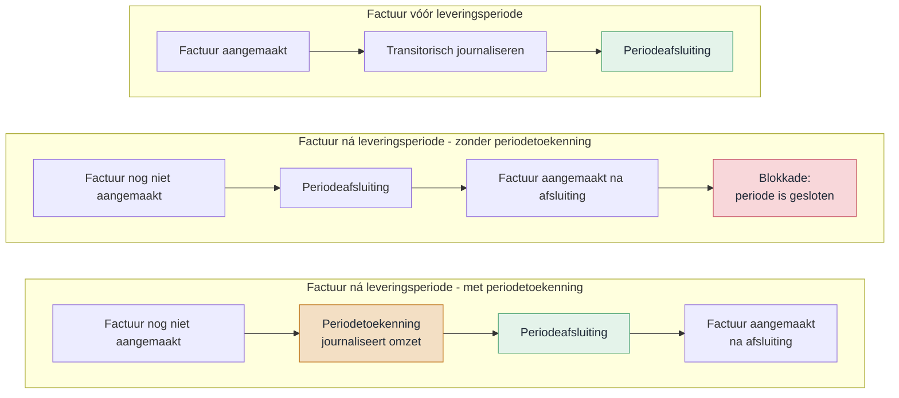

#### Huidige situatie

Vandaag kent een abonnement alleen de optie Vooraf factureren — de factuur ontstaat vóór de leveringsperiode:

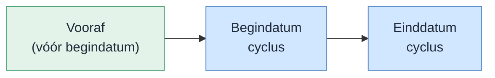

| Factuurmoment | Factuurdatum | Journalisering |
| --- | --- | --- |
| Vooraf | Vóór begindatum cyclus | Transitorisch journaliseren |

Klanten als Facilicom willen echter achteraf factureren. Die mogelijkheid ontbreekt nu.

#### Nieuwe situatie: vijf factuurmomenten op een tijdlijn

Een abonnement heeft een cyclus — de leveringsperiode. Het factuurmoment bepaalt wanneer de factuur ontstaat ten opzichte van die cyclus. Hieronder de vijf waarden op een tijdlijn, met als voorbeeld cyclus april 2026 en Aantal dagen = 10:

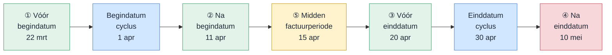

| Nr | Factuurmoment | Berekening | Factuurdatum | Journalisering |
| --- | --- | --- | --- | --- |
| ① | Aantal dagen vóór begindatumcyclus | 1 apr − 10 dagen | 22 mrt | Transitorisch journaliseren of periodetoekenning |
| ② | Aantal dagen ná begindatumcyclus | 1 apr + 10 dagen | 11 apr | Transitorisch journaliseren of periodetoekenning |
| ③ | Aantal dagen vóór einddatumcyclus | 30 apr − 10 dagen | 20 apr | Transitorisch journaliseren of periodetoekenning |
| ④ | Aantal dagen ná einddatumcyclus | 30 apr + 10 dagen | 10 mei | Transitorisch journaliseren of periodetoekenning |
| ⑤ | Midden van de factuurperiode | (1 apr + 30 apr) / 2 | 15 apr | Transitorisch journaliseren of periodetoekenning |

Periodetoekenning is beschikbaar bij elk factuurmoment. In de wizard bepaal je per periode welke abonnementsregels meedoen.

> **Samenloop met transitorisch journaliseren.** Bestaat er een periodetoekenningsregel voor een abonnementsregel in een periode? Dan slaat transitorisch journaliseren die regel over — periodetoekenning wint. Een verwijderde toekenningsregel (status Verwijderd) telt niet mee: het tijdvak gedraagt zich alsof er geen toekenningsregel is. Transitorisch journaliseren werkt dan gewoon zoals voorheen.

Dit probleem pakken we langs twee lijnen aan:

- **RPT00702** zorgt dat journalisering bij een geblokkeerde periode doorschuift naar de eerstvolgende vrije periode.
- **RPT00692** (dit ontwerp) voegt een tabblad toe waarmee je vóór de afsluiting omzet per abonnement kunt toekennen aan de juiste periode.

### 1.2 Vooronderzoek

- Klantgesprekken met Facilicom over hun periodeafsluitingsproces
- Analyse van de bestaande abonnementen- en facturatieflow in Profit
- Inventarisatie van de boekingslogica rond Te factureren abonnementen omzet en Omzet

### 1.3 Resultaat

Op het bestaande Periodeafsluitingsplan komt een nieuw tabblad **Periodetoekenningsregels abonnementen** met twee acties:

1. **Genereer periodetoekenningsregels** — opent een wizard (1 stap) waarin je via multi-select kiest welke abonnementsregels periodetoekenning krijgen. De geselecteerde regels worden direct aangemaakt én gejournaliseerd — er is geen aparte journaliseerstap.
2. **Verwijder toekenningsregels** — verwijdert geselecteerde toekenningsregels en draait de bijbehorende journaalposten automatisch terug. Het systeem valideert of de periode niet geblokkeerd is.

De wizard toont alleen abonnementsregels die over de gekozen periode lopen, waarvoor nog niet is gefactureerd en waarvoor nog geen toekenningsregel bestaat. Geparkeerde abonnementen doen ook mee — met het laatst bekende bedrag. De wizard bestaat uit 1 stap: bovenin staan boekjaar en periode, daaronder de toekenbare regels.

Bij de facturatieverwerking bepaalt het bestaan van een toekenningsregel de grootboekrekening: mét toekenningsregel boekt het systeem op de tussenrekening, zonder op de omzetrekening.

#### Verleuken

- Kleurcodering van statussen in het grid (groen = gejournaliseerd, grijs = te journaliseren)

### 1.4 Afbakening

**Tabblad en acties**

- Nieuw tabblad Periodetoekenningsregels abonnementen op het Periodeafsluitingsplan — centraal ingangspunt voor beide acties
- Genereer-actie: regels aanmaken én direct journaliseren in één stap (geen aparte Journaliseer-actie)
- Verwijderactie: geselecteerde toekenningsregels verwijderen met automatisch terugdraaien van de journaalpost; validatie op geblokkeerde periode
- Wizard met 1 stap en multi-select voor selectie van toekenbare regels per periode
- Geparkeerde abonnementen doen mee in de wizard met het laatst bekende bedrag

**Automatische verwerking**

- Automatisch terugdraaien bij beëindigen abonnementsregel (event-driven correctie)
- Automatisch terugdraaien bij verwijderen abonnementsregel (voorkomt ongedekt saldo)
- Verschilboeking bij bedragwijziging — alleen het delta-bedrag verwerken
- Creditfactuurafhandeling via standaard flow — negatief bedrag corrigeert automatisch

**Datamodel en instellingen**

- Nieuwe tabel Toekenningsregels voor opslag van toekenningen en tegenboekingen
- Nieuw veld Factuurmoment op het abonnement (vijf waarden, standaard: Aantal dagen voor begindatumcyclus)
- Facturatielogica: bestaan van een toekenningsrecord bepaalt tussenrekening vs. omzetrekening
- KPI's gefactureerd, toegerekend en openstaand saldo op de abonnementsregel
- Nieuw tabblad Periodetoekenningsregels op Eigenschappen abonnement — weergave met toekenningsregels per abonnement
- Nieuw tabblad Transitorische journaalposten op Eigenschappen abonnement — weergave met journaalposten uit periodetoekenning per abonnement

### 1.5 Randvoorwaarden

- R1: Het Periodeafsluitingsplan bestaat en is operationeel
- R2: De journalisatieprocedure en het integratiescherm zijn ongewijzigd beschikbaar
- R3: De Abonnementsfuncties-module is beschikbaar
- R4: De gebruiker heeft rechten op het Periodeafsluitingsplan
- R5: De beëindigingsstatus van een abonnementsregel is opvraagbaar
- R6: De verwijdervalidatie van de abonnementsregel is uitbreidbaar
- R7: Bij verwijdering van een abonnementsregel blijven factuurregels behouden (geen cascade-delete). De koppeling wordt genulled — dat borgt de audit trail

### 1.6 Begrippen

| Term | Betekenis |
| --- | --- |
| Factuurmoment | Instelling op het abonnement die bepaalt wanneer de factuur wordt aangemaakt ten opzichte van de cyclus. Vijf waarden: Aantal dagen voor begindatumcyclus, Aantal dagen na begindatumcyclus, Aantal dagen voor einddatumcyclus, Aantal dagen na einddatumcyclus, Midden van de factuurperiode |
| Periodetoekenning | Omzet van abonnementen toerekenen aan de juiste perioden vóór de periodeafsluiting |
| Toekenningsregel | Record dat een abonnementsregel koppelt aan een boekjaar en periode. Wordt direct gejournaliseerd bij genereren. |
| Journaalpost omzettoekenning | Boeking: Te factureren abonnementen omzet → Omzet |
| Tegenboeking toekenning | Boeking: Omzet → Te factureren abonnementen omzet |
| Omzet | Grootboekrekening waarop de omzet definitief wordt geboekt |
| Te factureren abonnementen omzet | Balansrekening waarop omzet tijdelijk staat totdat toekenning plaatsvindt. Wordt ingesteld op Facturering/voorraad (tabblad Abonnementen, veldgroep Periodetoekenning). |
| Netto-saldo | Som van alle toekenningsregels per abonnementsregel (gejournaliseerd + tegengeboekt) |
| Geparkeerd abonnement | Abonnement dat tijdelijk niet gefactureerd wordt, bijvoorbeeld omdat een indexering nog niet vaststaat. Omzet over deze perioden kan via periodetoekenning worden toegerekend met het laatst bekende bedrag. |

### 1.7 Bijlagen

| Bijlage | Titel |
| --- | --- |
| [Bijlage A](#bijlage-a--samenvatting-voor-klant) | Samenvatting voor klant |
| [Bijlage B](#bijlage-b--huidige-werking) | Huidige werking |
| [Bijlage C](#bijlage-c--testscenarios) | Testscenario's |
| [Bijlage D](#bijlage-d--open-punten-en-beslissingen) | Open punten en beslissingen |
| [Bijlage E](#bijlage-e--documentatie) | Documentatie |
| [Bijlage F](#bijlage-f--work-items-developer) | Work items developer |

---

## 2. User stories

### 2.0 Overzicht

| Nr | User story | Toelichting |
| --- | --- | --- |
| US01 | Periodetoekenningsregels genereren | Nieuwe regels aanmaken en direct journaliseren via het Periodeafsluitingsplan. Wizard met 1 stap. Dit geldt ook voor creditfacturen: negatieve bedragen lopen mee zonder extra actie. |
| US02 | Toekenningen verwijderen | Toekenningsregels verwijderen met automatisch terugdraaien van journaalposten. Validatie op geblokkeerde periode. |
| US03 | Delta-bedrag bij wijziging abonnement | Alleen het verschilbedrag als extra toekenning verwerken |
| US04 | Automatisch terugdraaien bij beëindigen | Toekomstige toekenningen terugdraaien bij einddatum |
| US05 | Verwijderen abonnementsregel met automatisch terugdraaien | Systeem draait openstaand saldo terug zonder gebruikersactie |
| US06 | Saldoverklaring Te factureren abonnementen omzet | Openstaand saldo per abonnementsregel inzien en verklaren via gefactureerd, toegerekend en teruggedraaid |
| US07 | Instelling factuurmoment op abonnement | Nieuw veld Factuurmoment op abonnement met vier waarden |
| US08 | KPI's periodetoekenning op abonnementsregel | Gefactureerd en openstaand saldo per abonnementsregel tonen |
| US09 | Periodetoekenningsregels en transitorische journaalposten op Eigenschappen abonnement | Twee tabbladen onder Facturen: toekenningsregels en bijbehorende journaalposten per abonnement |

---

### 2.1 US01 – Periodetoekenningsregels genereren

**Als** financieel medewerker **wil ik** periodetoekenningsregels genereren via het Periodeafsluitingsplan, **zodat** omzet correct aan perioden wordt toegerekend en direct gejournaliseerd.

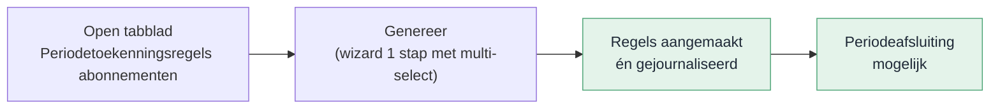

#### Functionele uitwerking

**Tabblad**

Op het Periodeafsluitingsplan komt een nieuw tabblad **Periodetoekenningsregels abonnementen**, altijd zichtbaar. Boekjaar en periode neemt het tabblad over van het hoofdscherm; het grid start leeg.

**Genereer**

Met de actie **Genereer periodetoekenningsregels** open je een wizard met 1 stap. Bovenin staan boekjaar en periode (alleen-lezen). Daaronder toont het systeem alle toekenbare abonnementsregels als multi-select. Je selecteert welke regels periodetoekenning krijgen en klikt op Voltooien. De geselecteerde regels worden aangemaakt én direct gejournaliseerd — er is geen aparte journaliseerstap. De actie draait als batchverwerking in de wachtrij.

Een abonnementsregel komt in aanmerking als:

- de regel loopt over de gekozen periode
- er is nog niet gefactureerd voor die regel in die periode
- er bestaat nog geen toekenningsregel voor dat bedrag in die periode

Geparkeerde abonnementen doen ook mee, met het laatst bekende bedrag. De periode mag nog niet afgesloten zijn.

Per abonnementsregel mag uit meerdere periodetoekenningsregels bestaan.

Genereren is herhaalbaar: een tweede keer uitvoeren voor dezelfde periode maakt geen dubbele regels. Bestaande regels worden herberekend op basis van de actuele abonnementsregel. Is het bedrag tussentijds gewijzigd? Dan past het systeem de toekenningsregel aan.

**Journalisering**

De journaalposten (Te factureren abonnementen omzet → Omzet) worden direct geboekt bij het genereren. Na voltooien is de status Gejournaliseerd.

Is de periode al gesloten? Dan boekt het systeem de journaalpost in de eerstvolgende vrije periode. De toekenningsregel houdt de oorspronkelijke periode. De omzetrekening volgt de artikelgroep van de abonnementsregel.

**Verwijderen**

Met de actie **Verwijder toekenningsregels** verwijder je geselecteerde regels via multi-select. Bij het verwijderen valideert het systeem of de periode geblokkeerd is. Is de periode geblokkeerd, dan verschijnt de foutmelding: "Periode geblokkeerd. Dit is niet toegestaan." De bijbehorende journaalpost wordt automatisch teruggedraaid via een tegenboeking.

**Berekening en verdeling**

Het bedrag per toekenningsregel volgt dezelfde verdelingslogica als transitorisch journaliseren. De verdelingsmethode op het abonnement bepaalt de verdeling over perioden. Afrondingsverschillen komen in de laatste periode; is die gesloten, dan schuift de compensatie door naar de eerstvolgende vrije periode.

**Creditfacturen**

Creditfacturen lopen gewoon mee. Een creditfactuurregel heeft een negatief bedrag, dus Genereer maakt een toekenningsregel met dat negatieve bedrag. De journalisering corrigeert automatisch het saldo op Te factureren abonnementen omzet — geen aparte actie nodig.

**Foutafhandeling**

Genereer werkt alles-of-niets. Gaat er iets mis halverwege? Dan draait het systeem alle wijzigingen terug. Er blijven geen halve resultaten achter.

#### Acceptatiecriteria

**Tabblad** — Het tabblad is altijd zichtbaar. Boekjaar en periode komen van het hoofdscherm.

**Genereer**

1. Na Genereer staan de geselecteerde abonnementsregels in het grid met status Gejournaliseerd en zijn de journaalposten geboekt.
2. Een tweede Genereer voor dezelfde periode maakt geen dubbele regels.
3. Genereer is alleen beschikbaar als de periode nog open is.
4. Geparkeerde abonnementen verschijnen met het laatst bekende bedrag.
5. Bij een herhaalde Genereer worden nieuwe toekenningsregels aangemaakt.
6. Bij een gesloten periode boekt het systeem in de eerstvolgende vrije periode.

**Verwijderen**

1. Alleen regels met status Gejournaliseerd kunnen worden verwijderd.
2. Bij een geblokkeerde periode verschijnt de foutmelding: "Periode geblokkeerd. Dit is niet toegestaan."
3. Na verwijderen heeft de regel status Verwijderd en is de bijbehorende journaalpost teruggedraaid via een tegenboeking.
4. Een verwijderde toekenningsregel telt niet mee: het tijdvak gedraagt zich alsof er geen toekenningsregel is.

**Creditfacturen** — Een creditfactuurregel leidt tot een toekenningsregel met negatief bedrag. Na genereren is het saldo op Te factureren abonnementen omzet gecorrigeerd.

**Foutafhandeling** — Bij een fout worden boeking en statuswijziging teruggedraaid (alles-of-niets).

#### Scherm en gedrag

Het tabblad Periodetoekenningsregels abonnementen zit op het Periodeafsluitingsplan, boven Dossier. Het toont een weergave met twee acties.

**Mockup:** `pages/rpt00692-abonnement-cyclus/detail.ts`

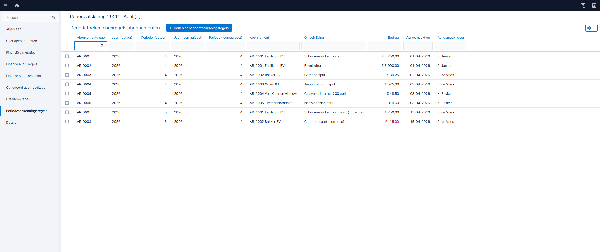

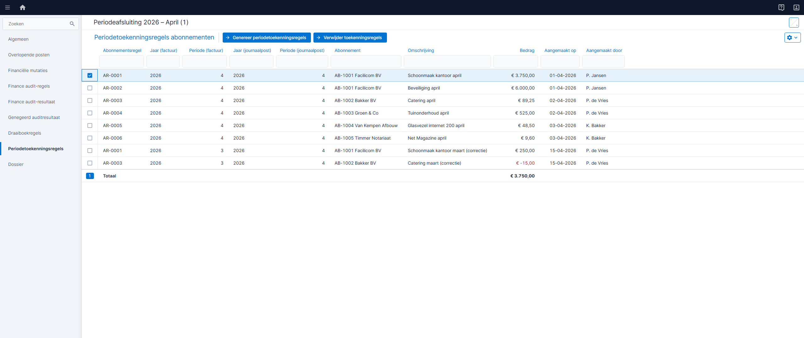

| Veld | Gedrag |
| --- | --- |
| Jaar | Overgenomen van hoofdscherm, alleen-lezen |
| Periode | Overgenomen van hoofdscherm, alleen-lezen |
| Grid | Rijen aanvinkbaar. Tegenboekingsregels zijn grijs en niet aanvinkbaar |
| Genereer | Alleen actief als de periode nog niet is afgesloten |
| Verwijder | Alleen actief als minimaal één regel met status Gejournaliseerd is geselecteerd |

#### Meldingstekst

| Situatie | Melding |
| --- | --- |
| Geen toekenbare regels | Geen toekenbare factuurregels gevonden voor deze periode. |
| Periode geblokkeerd bij verwijderen | Periode geblokkeerd. Dit is niet toegestaan. |
| Factuur gegenereerd bij verwijderen | Er is al een factuur gegenereerd voor deze abonnementsregel in deze periode. Verwijderen is niet toegestaan. |

#### Tooltiptekst

| Onderdeel | Tekst |
| --- | --- |
| Genereer | Maak regels aan en journaliseer ze direct voor deze periode. |
| Verwijder | Verwijder geselecteerde regels en draai de journaalpost terug. |
| Status Gejournaliseerd | Geboekt en verwerkt in omzettoekenning. |

#### Autorisatie

Geen apart recht vereist — toegang volgt het bestaande recht op het Periodeafsluitingsplan.

#### Podium-specificatie

**Schermtype:** Tabblad op Periodeafsluiting (embedded ListPage)

**Veldtabel ListPage**

| Kolom-id | Kolomkop | Podium-type | Sorteerbaar | Filter | Breedte | Mock-waarde |
| --- | --- | --- | --- | --- | --- | --- |
| abonnementsregel | Abonnementsregel | text | ja | ja | 150 | 10234 |
| abonnement | Abonnement | text | ja | ja | 150 | ABO-0042 Facilicom Schoonmaak |
| omschrijving | Omschrijving | text | ja | nee | 250 | Maandelijkse schoonmaakdienst |
| bedrag | Bedrag | currencyAmount | ja | nee | 120 | 1.250,00 |
| aangemaakt | Aangemaakt op | date | ja | nee | 130 | 15-03-2026 |
| aanmakerNaam | Aangemaakt door | text | ja | nee | 130 | P. de Vries |

**ListPage-eigenschappen**

| Eigenschap | Waarde |
| --- | --- |
| Quick filter | ja |
| Exportknop | nee |
| Rijselectie | meervoud |
| Inline bewerken | nee |
| Bulkacties | Verwijder toekenningsregels |

**Acties-blok**

| Actie-id | Label | Type | Positie | Zichtbaar als | Bevestigingsdialoog |
| --- | --- | --- | --- | --- | --- |
| genereer | Genereer periodetoekenningsregels | toolbar | links | altijd (geen selectie vereist) | nee |
| verwijder | Verwijder toekenningsregels | toolbar (multiselect) | links | alleen bij rijselectie (minimaal 1 rij) | ja: "Weet je zeker dat je de geselecteerde toekenningen wilt verwijderen? De bijbehorende journaalposten worden teruggedraaid." |

**Meldingen-blok**

| Type | Veldlabel / scope | Conditie | Tekst |
| --- | --- | --- | --- |
| informatiebanner | scherm | geen toekenbare regels na Genereer | Geen toekenbare factuurregels gevonden voor deze periode. |
| foutmelding | scherm | periode geblokkeerd bij verwijderen | Periode geblokkeerd. Dit is niet toegestaan. |
| foutmelding | scherm | factuur gegenereerd bij verwijderen | Er is al een factuur gegenereerd voor deze abonnementsregel in deze periode. Verwijderen is niet toegestaan. |

**Mockup:** `pages/rpt00692-abonnement-cyclus/detail.ts` (tabblad Periodetoekenningsregels abonnementen)

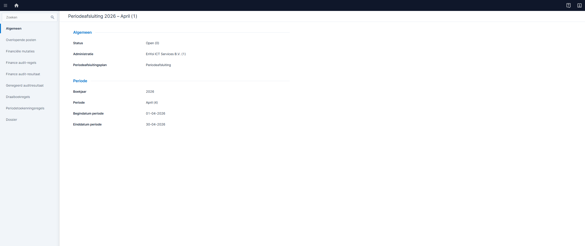

#### Podium-specificatie — Wizard: Genereer periodetoekenningsregels

**Schermtype:** WizardPage (1 stap)

**Stap 1 — Selectie toekenbare regels (multi-select)**

Bovenin staan boekjaar en periode (alleen-lezen). Daaronder de toekenbare abonnementsregels.

| Veld | Podium-type | Readonly | Positie |
| --- | --- | --- | --- |
| Boekjaar | number | ja | boven grid |
| Periode | text | ja | boven grid |

| Kolom-id | Kolomkop | Podium-type | Sorteerbaar | Mock-waarde |
| --- | --- | --- | --- | --- |
| abonnementsregel | Abonnementsregel | text | ja | AR-0010 |
| abonnement | Abonnement | text | ja | AB-1001 Facilicom BV |
| omschrijving | Omschrijving | text | ja | Schoonmaak kantoor april |
| bedrag | Bedrag | currencyAmount | ja | 3.750,00 |
| factuurmoment | Factuurmoment | text | ja | Aantal dagen na einddatumcyclus |
| status | Geparkeerd | yesNo | ja | Nee |

**Mockup:** `pages/rpt00692-genereer-wizard/detail.ts`

**Wizardflow:**

1. Je klikt Genereer op het tabblad. De wizard opent.
2. Je ziet direct de toekenbare regels. Bovenin staan boekjaar en periode (alleen-lezen). Begindatum en einddatum periode worden niet getoond.
3. Je selecteert via multi-select welke regels periodetoekenning krijgen.
4. Je klikt Voltooien. Het systeem plaatst een batchtaak in de wachtrij.
5. De wizard sluit. Het grid ververst zodra de taak klaar is — tijdens verwerking zie je een voortgangsindicatie.
6. De geselecteerde regels worden direct aangemaakt én gejournaliseerd. Er is geen tussenstatus Te journaliseren.

---

### 2.2 US02 – Toekenningen verwijderen

**Als** financieel medewerker **wil ik** toekenningsregels kunnen verwijderen bij foutieve toekenning of beëindiging, **zodat** omzet niet ten onrechte op Omzet blijft staan.

#### Functionele uitwerking

Met **Verwijder toekenningsregels** verwijder je gejournaliseerde toekenningen via multi-select. Het systeem zet per geselecteerde regel de status op Verwijderd en boekt de tegenjournaalpost: Omzet → Te factureren abonnementen omzet. Het record blijft bewaard voor audit trail.

Een verwijderde toekenningsregel telt niet mee voor de samenloop met transitorisch journaliseren. Het tijdvak gedraagt zich alsof er geen toekenningsregel is.

Bij het verwijderen valideert het systeem of de periode geblokkeerd is. Is de periode geblokkeerd, dan verschijnt de foutmelding: "Periode geblokkeerd. Dit is niet toegestaan." De actie wordt niet uitgevoerd.

Daarnaast valideert het systeem of er al een factuur is gegenereerd voor deze abonnementsregel in deze periode en dit tijdvak. Is dat het geval, dan verschijnt de foutmelding: "Er is al een factuur gegenereerd voor deze abonnementsregel in deze periode. Verwijderen is niet toegestaan." De toekenningsregel kan dan niet worden verwijderd.

Alleen regels met status Gejournaliseerd kunnen worden verwijderd. De actie draait als batchverwerking.

#### Acceptatiecriteria

1. Verwijderen zet de status op Verwijderd en boekt een tegenjournaalpost. Het record wordt niet fysiek verwijderd.
2. Een verwijderde toekenningsregel telt niet mee: het tijdvak gedraagt zich alsof er geen toekenningsregel is.
3. Tegenjournaalposten zijn geboekt via de journalisatieprocedure.
4. Na verwijderen toont Te factureren abonnementen omzet het teruggedraaide bedrag als openstaand saldo.
5. Bij een geblokkeerde periode verschijnt de foutmelding: "Periode geblokkeerd. Dit is niet toegestaan."
6. Bij een gegenereerde factuur voor deze abonnementsregel in deze periode verschijnt de foutmelding: "Er is al een factuur gegenereerd voor deze abonnementsregel in deze periode. Verwijderen is niet toegestaan."

#### Meldingstekst

| Situatie | Melding |
| --- | --- |
| Geen regels geselecteerd | Selecteer minimaal één gejournaliseerde toekenningsregel. |
| Periode geblokkeerd | Periode geblokkeerd. Dit is niet toegestaan. |
| Factuur gegenereerd | Er is al een factuur gegenereerd voor deze abonnementsregel in deze periode. Verwijderen is niet toegestaan. |

#### Tooltiptekst

| Onderdeel | Tekst |
| --- | --- |
| Verwijder toekenningsregels | Verwijder geselecteerde regels en draai de journaalpost terug. |

#### Autorisatie

Geen apart recht vereist — toegang volgt het Periodeafsluitingsplan.

#### Scherm en gedrag

Verwijderen is beschikbaar op het tabblad Periodetoekenningsregels (US01) en op het standalone menu-item Alle periodetoekenningsregels.

#### Menu-items

Er komt een nieuw submenu **Periodetoekenning** onder Abonnementen &rarr; Facturering. Binnen dit submenu komen twee menu-items: de weergave met alle toekenningsregels en de saldoverklaring.

**Submenu**

| Eigenschap | Waarde |
| --- | --- |
| Menupad | Abonnementen &rarr; Facturering &rarr; Periodetoekenning |
| Positie | Tussen Facturen en Journaliseren |
| Sneltoets | P (1e letter; niet in gebruik binnen Facturering — bestaande items: Facturen (F), Journaliseren (J)) |
| Conditie | Altijd zichtbaar |

**Menu-item 1: Alle periodetoekenningsregels**

| Eigenschap | Waarde |
| --- | --- |
| Menupad | Abonnementen &rarr; Facturering &rarr; Periodetoekenning &rarr; Alle periodetoekenningsregels |
| Sneltoets | A (1e letter; niet in gebruik binnen submenu Periodetoekenning) |
| Conditie | Zichtbaar als submenu zichtbaar is |
| Autorisatie | Bestaand recht op Periodeafsluitingsplan. Geen apart autorisatierecht. Geen rolconversie nodig. |
| Filter | Geen (alle regels) |
| Acties | Verwijder toekenningsregels |

**Menu-item 2: Saldoverklaring Te factureren abonnementen omzet**

| Eigenschap | Waarde |
| --- | --- |
| Menupad | Abonnementen &rarr; Facturering &rarr; Periodetoekenning &rarr; Saldoverklaring Te factureren abonnementen omzet |
| Sneltoets | S (1e letter; niet in gebruik binnen submenu Periodetoekenning — bestaand: Alle (A)) |
| Conditie | Zichtbaar als submenu zichtbaar is |
| Autorisatie | Bestaand recht op Periodeafsluitingsplan. Geen apart autorisatierecht. Geen rolconversie nodig. |

**Mockup:** `pages/rpt00692-toekenningsregels/index.ts`

#### Podium-specificatie

**Schermtype:** ListPage (menu-item Alle periodetoekenningsregels onder submenu Periodetoekenning)

**Veldtabel ListPage**

| Kolom-id | Kolomkop | Podium-type | Sorteerbaar | Filter | Breedte | Status | Mock-waarde |
| --- | --- | --- | --- | --- | --- | --- | --- |
| abonnementsregel | Abonnementsregel | text | ja | ja | 150 | nieuw | AR-0001 |
| abonnement | Abonnement | text | ja | ja | 150 | nieuw | AB-1001 Facilicom BV |
| omschrijving | Omschrijving | text | ja | nee | 250 | nieuw | Schoonmaak kantoor Q1 |
| bedrag | Bedrag | currencyAmount | ja | nee | 120 | nieuw | 3.750,00 |
| aangemaakt | Aangemaakt op | date | ja | nee | 130 | nieuw | 01-04-2026 |
| aanmakerNaam | Aangemaakt door | text | ja | nee | 130 | nieuw | P. Jansen |

**ListPage-eigenschappen**

| Eigenschap | Waarde |
| --- | --- |
| Quick filter | ja |
| Exportknop | nee |
| Rijselectie | meervoud |
| Inline bewerken | nee |
| Bulkacties | Verwijder toekenningsregels |

**Acties-blok**

| Actie-id | Label | Type | Positie | Zichtbaar als | Bevestigingsdialoog |
| --- | --- | --- | --- | --- | --- |
| verwijder | Verwijder toekenningsregels | toolbar (multiselect) | links | alleen bij rijselectie (minimaal 1 rij) | ja: "Weet je zeker dat je de geselecteerde toekenningen wilt verwijderen? De bijbehorende journaalposten worden teruggedraaid." |

> **Opmerking:** De actie Genereer is niet beschikbaar op dit scherm. Genereren kan alleen vanuit het Periodeafsluitingsplan (US01).

**Mockup:** `pages/rpt00692-toekenningsregels/index.ts`

---

### 2.3 US03 – Delta-bedrag bij wijziging abonnement

**Als** financieel medewerker **wil ik** bij verhoging van een abonnementsregel na toekenning alleen het delta-bedrag automatisch als extra toekenning verwerken, **zodat** eerder gejournaliseerde bedragen intact blijven en de netto-toekenning klopt.

#### Functionele uitwerking

> **Onderscheid met herberekening:** wijzigt het bedrag terwijl de regel nog niet gejournaliseerd is (verwerking loopt nog)? Dan past een herhaalde Genereer het bedrag direct aan. US03 geldt alleen als er al een Gejournaliseerde regel bestaat.

Bij de volgende Genereer vergelijkt het systeem per abonnementsregel het verwachte bedrag met het netto-saldo van alle toekenningsregels. Is er een verschil, dan maakt het altijd een **nieuwe** delta-toekenningsregel aan en journaliseert die direct — de bestaande gejournaliseerde regel wordt nooit gewijzigd. Positief bij verhoging, negatief bij verlaging.

**Voorbeeld**: oorspronkelijke toekenning 250,00 (Gejournaliseerd). Het abonnementsbedrag stijgt naar 300,00. Genereer maakt een nieuwe delta-regel van +50,00 aan en journaliseert die direct. De netto-toekenning klopt meteen: 300,00.

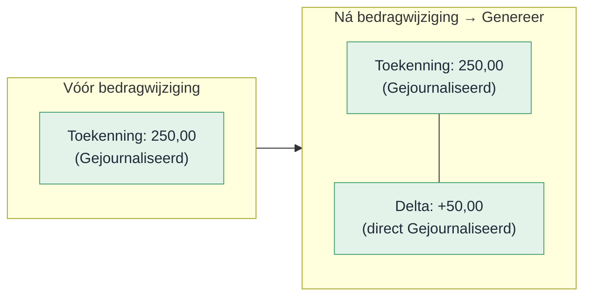

#### Acceptatiecriteria

1. Genereer detecteert het verschil bij een bedragwijziging na eerdere toekenning.
2. Er ontstaat een nieuwe delta-toekenningsregel met het verschilbedrag, direct gejournaliseerd.
3. De netto-toekenning is direct gelijk aan het actuele factuurbedrag — geen extra Journaliseer-actie nodig.
4. Eerder gejournaliseerde regels blijven ongewijzigd.

#### Autorisatie

Geen apart recht vereist — toegang volgt het Periodeafsluitingsplan.

---

### 2.4 US04 – Automatisch terugdraaien bij beëindigen

**Als** financieel medewerker **wil ik** bij beëindigen per datum toekomstige gejournaliseerde toekenningsregels automatisch laten terugdraaien, **zodat** omzet na de einddatum niet ten onrechte op Omzet blijft staan.

#### Functionele uitwerking

Zodra je een einddatum instelt op een abonnementsregel, detecteert het systeem automatisch gejournaliseerde toekenningsregels voor toekomstige perioden. Per gevonden record maakt het een tegenboeking aan — zonder dat je iets hoeft te doen. De tegenboekingen krijgen redencode Beëindiging.

Is de toekomstige periode al gesloten? Dan boekt het systeem de tegenjournaalpost in de eerstvolgende vrije periode. Dit mechanisme is altijd actief.

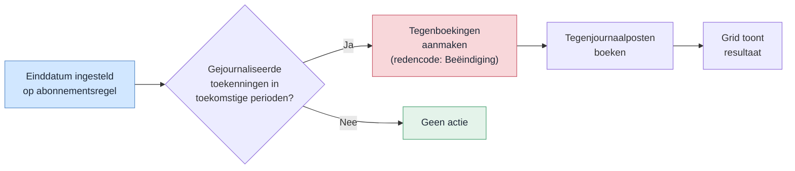

#### Voorbeeld A – Creditering vanaf 1 januari (hele periode)

Abonnementsregel: 100 per maand. Toekenning januari is Gejournaliseerd. Het abonnement wordt gecrediteerd vanaf 1 januari.

**Stap 1 — US04 draait januari terug (toekomstige periode):**

Het systeem verwijdert de toekenningsregel voor januari en boekt een tegenjournaalpost.

| Actie | Bedrag | Journaalpost |
| --- | --- | --- |
| Origineel januari verwijderd | 100 | Debet Omzet / Credit Te factureren omzet |

Netto-saldo toekenningsregels januari: **0** (geen toekenningsregel meer)

**Stap 2 — Profit maakt creditfactuurregel -100:**

De creditfactuurregel van -100 corrigeert het saldo op Te factureren abonnementen omzet via de standaard facturatieflow. Het netto-saldo van de toekenningsregels is al 0. De Genereer-actie slaat deze factuurregel over omdat het netto-saldo al overeenkomt met het actuele factuurbedrag (0).

**Eindsaldo januari:**

| Rekening | Saldo |
| --- | --- |
| Te factureren abonnementen omzet | 0 |
| Omzet | 0 |

> **Let op:** zonder deze uitsluiting bij Genereer zou een toekenningsregel van -100 worden aangemaakt. Het netto-saldo wordt dan -100. Dat is een dubbele correctie.

---

#### Voorbeeld B – Creditering vanaf 15 januari (halve periode)

Abonnementsregel: 100 per maand. Toekenning januari is Gejournaliseerd. Het abonnement wordt beëindigd per 15 januari.

**Stap 1 — US04 controleert toekomstige perioden:**

Januari is de einddatumperiode, geen toekomstige periode. US04 draait januari niet terug. Februari en verder worden wél teruggedraaid (als daar gejournaliseerde toekenningsregels bestaan).

| Toekenningsregel | Bedrag | Status | Journaalpost |
| --- | --- | --- | --- |
| Origineel januari | 100 | Gejournaliseerd | (ongewijzigd) |

**Stap 2 — Profit maakt creditfactuurregel -50 (halve maand):**

Bij de volgende Genereer vergelijkt het systeem het actuele factuurbedrag (100 - 50 = 50) met het netto-saldo van de toekenningsregels (100). Delta = -50.

| Toekenningsregel | Bedrag | Status | Journaalpost |
| --- | --- | --- | --- |
| Origineel januari | 100 | Gejournaliseerd | (ongewijzigd) |
| Delta januari | -50 | Te journaliseren | — |

Na Journaliseer:

| Toekenningsregel | Bedrag | Status | Journaalpost |
| --- | --- | --- | --- |
| Origineel januari | 100 | Gejournaliseerd | Debet Te factureren omzet / Credit Omzet |
| Delta januari | -50 | Gejournaliseerd | Debet Omzet / Credit Te factureren omzet |

**Eindsaldo januari:**

| Rekening | Saldo |
| --- | --- |
| Te factureren abonnementen omzet | -50 (gecorrigeerd door creditfactuur via standaard flow) |
| Omzet | 50 (netto-toekenning: 100 - 50) |

De netto-toekenning van 50 komt overeen met de geleverde halve maand.

---

#### Acceptatiecriteria

1. Toekomstige gejournaliseerde toekenningsregels worden automatisch verwijderd bij beëindigen.
2. Tegenjournaalposten ontstaan zonder gebruikersactie, in dezelfde transactie.
3. Bij een gesloten toekomstige periode boekt het systeem in de eerstvolgende vrije periode.
4. Creditering hele periode (einddatum vóór of op eerste dag): Genereer maakt géén extra regel als er geen toekenningsregel meer bestaat.
5. Creditering halve periode: Genereer maakt een delta-regel voor het verschilbedrag.

#### Meldingstekst

| Situatie | Melding |
| --- | --- |
| Geen open periode voor tegenboeking | Automatische tegenboeking is niet mogelijk. Er is geen open periode beschikbaar. Draai de toekenning handmatig terug via het tabblad. |

#### Autorisatie

Systeemactie — geen apart recht vereist.

---

### 2.5 US05 – Verwijderen abonnementsregel met automatisch terugdraaien

**Als** financieel medewerker **wil ik** een abonnementsregel kunnen verwijderen zonder handmatige tussenstappen, waarbij het systeem openstaande toekenningsregels automatisch terugdraait, **zodat** er geen ongedekt saldo ontstaat op Te factureren abonnementen omzet.

#### Functionele uitwerking

Bij verwijdering controleert het systeem of er toekenningsregels bestaan. Zo ja: het verwijdert de toekenningsregels en boekt de tegenjournaalposten. Is er geen open periode beschikbaar voor de tegenjournaalpost, dan blokkeert de verwijdering.

Factuurregels blijven behouden (geen cascade-delete) — de koppeling wordt genulled.

**Volgorde:**

1. Controleer of het netto-saldo ongelijk is aan nul
2. Draai gejournaliseerde toekenningsregels terug en boek tegenjournaalposten
3. Verwijder de abonnementsregel — factuurregels en toekenningsregels blijven behouden

#### Acceptatiecriteria

1. Het systeem verwijdert toekenningsregels automatisch en boekt tegenjournaalposten.
2. Factuurregels en journaalposten blijven behouden.
3. Verwijdering zonder toekenningsregels is direct toegestaan.
4. Verwijdering is geblokkeerd als er geen open periode beschikbaar is voor de tegenjournaalpost.

#### Autorisatie

Systeemactie — geen apart recht vereist.

---

### 2.6 US06 – Saldoverklaring Te factureren abonnementen omzet

**Als** controller **wil ik** per abonnementsregel inzien hoeveel er is gefactureerd, toegerekend en teruggedraaid, **zodat** ik het openstaand saldo op Te factureren abonnementen omzet kan verklaren.

#### Functionele uitwerking

Een openstaand saldo op Te factureren abonnementen omzet is het signaal dat periodetoekenning nog niet is uitgevoerd of dat er tegenboekingen lopen. De controller controleert dit via het bestaande standenoverzicht. Na volledige journalisatie is het saldo nul.

Voor een gedetailleerde verklaring komt er een nieuw menuonderdeel **Saldoverklaring Te factureren abonnementen omzet**. Dat toont per abonnementsregel hoeveel er is gefactureerd, toegerekend, teruggedraaid, en wat het openstaande saldo is.

#### Acceptatiecriteria

1. Na volledige journalisatie is het saldo nul.
2. Een openstaand saldo signaleert ontbrekende toekenning of terugdraaien.
3. De controller kan het tabblad inzien zonder actierechten.
4. De saldoverklaring toont per abonnementsregel: gefactureerd, toegerekend, teruggedraaid en openstaand saldo.
5. De som van alle openstaande saldi sluit aan op het grootboeksaldo van Te factureren abonnementen omzet.

#### Scherm en gedrag

De saldoverklaring valt als menu-item onder het submenu Periodetoekenning. Het toont een alleen-lezen overzicht per abonnementsregel.

**Mockup:** `pages/rpt00692-saldoverklaring/index.ts`

#### Menu-item

Zie menu-item 2 (Saldoverklaring Te factureren abonnementen omzet) in US02.

#### Podium-specificatie

**Schermtype:** ListPage (menuonderdeel Saldoverklaring — submenu Periodetoekenning)

**Veldtabel ListPage**

| Kolom-id | Kolomkop | Podium-type | Sorteerbaar | Filter | Breedte | Mock-waarde |
| --- | --- | --- | --- | --- | --- | --- |
| administratie | Administratie | text | ja | ja | 150 | 1 |
| abonnementsregel | Abonnementsregel | text | ja | ja | 150 | AR-0001 |
| abonnement | Abonnement | text | ja | ja | 200 | AB-1001 Facilicom BV |
| datumVan | Datum van | date | ja | nee | 130 | 01-03-2026 |
| datumTot | Datum tot | date | ja | nee | 130 | 31-03-2026 |
| gefactureerd | Gefactureerd | currencyAmount | ja | nee | 130 | 3.750,00 |
| toegerekend | Toegerekend | currencyAmount | ja | nee | 130 | 3.750,00 |
| teruggedraaid | Teruggedraaid | currencyAmount | ja | nee | 130 | 0,00 |
| openstaand | Openstaand saldo | currencyAmount | ja | nee | 150 | 0,00 |

**ListPage-eigenschappen**

| Eigenschap | Waarde |
| --- | --- |
| Quick filter | ja |
| Exportknop | nee |
| Rijselectie | geen |
| Inline bewerken | nee |
| Bulkacties | geen |

**Mockup:** `pages/rpt00692-saldoverklaring/index.ts`

---

### 2.8 US08 – KPI's periodetoekenning op abonnementsregel

**Als** controller **wil ik** per abonnementsregel zien hoeveel er is gefactureerd, toegerekend en wat het openstaand saldo is, **zodat** ik direct vanuit het abonnement kan beoordelen of de periodetoekenning compleet is.

#### Functionele uitwerking

Op de abonnementsregel komen drie berekende velden (alleen-lezen), zichtbaar zodra er toekenningsregels bestaan:

- **Gefactureerd**: som van alle gekoppelde factuurregels
- **Toegerekend**: som van alle toekenningsregels met status Gejournaliseerd
- **Openstaand saldo**: Gefactureerd − Toegerekend — na volledige journalisatie is dit nul

De velden zijn beschikbaar als kolom in de weergave Abonnementsregels, op de stamkaart en in gegevensverzamelingen voor dashboards.

#### Acceptatiecriteria

1. De drie functievelden zijn zichtbaar op de abonnementsregel zodra toekenningsregels bestaan.
2. Na volledige journalisatie is Openstaand saldo nul.
3. De bedragen sluiten aan op de Saldoverklaring (US06).
4. De velden zijn niet bewerkbaar.

#### KPI's

| Part ID | Titel | Subtitel | Type | Configuratie | Webform | Bron | Registratie |
| --- | --- | --- | --- | --- | --- | --- | --- |
| K004 | Dagen tot facturering | - | Value | valueType: Number, suffix: "dagen" | Abonnement (FbSub) | AbSulCyclus (berekend) | Tabelbeheer |

**K004 – Dagen tot facturering**

- **WebPart-type**: InSite KPI (`eKpi` / 64)
- **Webform**: Abonnement
- **Type**: Value (`SetKpiValue`)
- **valueType**: `Number`
- **suffix**: `"dagen"`
- **sizeType**: `Normal`
- **preciseValue**: `False`
- **Bron**: berekend op basis van de lopende cyclus van het abonnement en het factuurmoment.
  - **Aantal dagen voor begindatumcyclus**: begindatum cyclus − Aantal dagen − vandaag.
  - **Aantal dagen na begindatumcyclus**: begindatum cyclus + Aantal dagen − vandaag.
  - **Aantal dagen voor einddatumcyclus**: einddatum cyclus − Aantal dagen − vandaag.
  - **Aantal dagen na einddatumcyclus**: einddatum cyclus + Aantal dagen − vandaag.
  - **Midden van de factuurperiode**: (begindatum cyclus + einddatum cyclus) / 2 − vandaag.
  - Als het resultaat negatief is, wordt 0 getoond (facturering is al mogelijk).
- **Voorbeeldwaarden**: een abonnement met factuurmoment Aantal dagen na einddatumcyclus, einddatum cyclus 30-04-2026 en Aantal dagen = 15 toont op 13-04-2026 de waarde **32** (17 + 15 dagen).
- **valueIsPositive**: nee. De waarde is informatief, geen kleurcodering.
- **Zichtbaarheid**: alleen zichtbaar als het abonnement een actieve cyclus heeft.
- **Scherm**: beschikbaar als InSite-webpart op de stamkaart Abonnement en als kolom in de weergave Abonnementen.
- **Registratie**: tabelbeheer — tabblad van type KPI (64) op het abonnementsform (FbSub). Kies "In cockpits gebruiken" en type "KPI (64)".
- **Conversie**: niet nodig. De KPI is standaard zichtbaar op het abonnementsform.

#### Autorisatie

Geen apart recht vereist — zichtbaar voor iedereen met toegang tot de abonnementsregel.

---

### 2.9 US09 – Periodetoekenningsregels en transitorische journaalposten op Eigenschappen abonnement

**Als** financieel medewerker **wil ik** op het Eigenschappen abonnement de periodetoekenningsregels en de bijbehorende transitorische journaalposten van dat abonnement zien, **zodat** ik direct vanuit het abonnement kan controleren wat is toegerekend en geboekt.

#### Functionele uitwerking

Op het Eigenschappen abonnement komen twee nieuwe tabbladen, beide onder het bestaande tabblad **Facturen**:

1. **Periodetoekenningsregels** — toont alle toekenningsregels die horen bij de abonnementsregels van dit abonnement.
2. **Transitorische journaalposten** — toont de journaalposten die zijn ontstaan door periodetoekenning voor dit abonnement.

Beide tabbladen zijn alleen zichtbaar als er toekenningsregels bestaan voor dit abonnement.

De weergaven zijn alleen-lezen. Acties als Genereer en Verwijder zijn niet beschikbaar op dit scherm — die lopen via het Periodeafsluitingsplan (US01/US02).

#### Acceptatiecriteria

**Tabblad Periodetoekenningsregels**

1. Het tabblad staat onder Facturen in de tabbladlijst.
2. Het tabblad is alleen zichtbaar als er toekenningsregels bestaan.
3. De weergave toont alle toekenningsregels van dit abonnement.
4. De weergave is alleen-lezen — geen acties.
5. Bij doorklikken op een regel opent de detailweergave van de toekenningsregel.

**Tabblad Transitorische journaalposten**

1. Het tabblad staat onder Periodetoekenningsregels in de tabbladlijst.
2. Het tabblad is alleen zichtbaar als er toekenningsregels bestaan.
3. De weergave toont alle journaalposten uit periodetoekenning van dit abonnement.
4. De weergave is alleen-lezen — geen acties.
5. Bij doorklikken op een regel opent de journaalpost.

#### Scherm en gedrag

**Tabblad Periodetoekenningsregels**

Het tabblad zit op het Eigenschappen abonnement, onder Facturen.

| Veld | Gedrag |
| --- | --- |
| Grid | Alleen-lezen. Geen rijselectie. |
| Filter | Automatisch gefilterd op het huidige abonnement |
| Sortering | Boekjaar aflopend, daarna periode aflopend |

**Tabblad Transitorische journaalposten**

Het tabblad zit op het Eigenschappen abonnement, onder Periodetoekenningsregels.

| Veld | Gedrag |
| --- | --- |
| Grid | Alleen-lezen. Geen rijselectie. |
| Filter | Automatisch gefilterd op journaalposten uit periodetoekenning van dit abonnement |
| Sortering | Boekdatum aflopend |

#### Autorisatie

Geen apart recht vereist — zichtbaar voor iedereen met toegang tot het abonnement.

#### Podium-specificatie — Tabblad Periodetoekenningsregels

**Schermtype:** Tabblad op Eigenschappen abonnement (embedded ListPage)

**Veldtabel ListPage**

| Kolom-id | Kolomkop | Podium-type | Sorteerbaar | Filter | Breedte | Mock-waarde |
| --- | --- | --- | --- | --- | --- | --- |
| abonnementsregel | Abonnementsregel | text | ja | ja | 150 | 7007 |
| item | Item | text | ja | ja | 250 | EnYoi Glasvezel internet 400 |
| boekjaar | Boekjaar | number | ja | ja | 100 | 2026 |
| periode | Periode | number | ja | ja | 80 | 4 |
| bedrag | Bedrag | currencyAmount | ja | nee | 120 | 58,00 |
| status | Status | text | ja | ja | 120 | Gejournaliseerd |
| aangemaakt | Aangemaakt op | date | ja | nee | 130 | 15-03-2026 |
| aanmakerNaam | Aangemaakt door | text | ja | nee | 130 | P. de Vries |

**ListPage-eigenschappen**

| Eigenschap | Waarde |
| --- | --- |
| Quick filter | ja |
| Exportknop | nee |
| Rijselectie | geen |
| Inline bewerken | nee |
| Bulkacties | geen |

#### Podium-specificatie — Tabblad Transitorische journaalposten

**Schermtype:** Tabblad op Eigenschappen abonnement (embedded ListPage)

**Veldtabel ListPage**

| Kolom-id | Kolomkop | Podium-type | Sorteerbaar | Filter | Breedte | Mock-waarde |
| --- | --- | --- | --- | --- | --- | --- |
| boekstuknummer | Boekstuknummer | text | ja | ja | 130 | 20260401-001 |
| boekdatum | Boekdatum | date | ja | nee | 120 | 01-04-2026 |
| boekjaar | Boekjaar | number | ja | ja | 100 | 2026 |
| periode | Periode | number | ja | ja | 80 | 4 |
| grootboekrekening | Grootboekrekening | text | ja | ja | 180 | 1350 Te factureren abo omzet |
| omschrijving | Omschrijving | text | ja | nee | 250 | Periodetoekenning apr 2026 |
| debet | Debet | currencyAmount | ja | nee | 120 | 58,00 |
| credit | Credit | currencyAmount | ja | nee | 120 | |

**ListPage-eigenschappen**

| Eigenschap | Waarde |
| --- | --- |
| Quick filter | ja |
| Exportknop | nee |
| Rijselectie | geen |
| Inline bewerken | nee |
| Bulkacties | geen |

---

### 2.10 US07 – Instelling factuurmoment op abonnement

**Als** financieel medewerker **wil ik** per abonnement het factuurmoment instellen, **zodat** het systeem weet wanneer de factuur wordt aangemaakt ten opzichte van de cyclus.

#### Functionele uitwerking

**Factuurmoment op abonnement**

Op het abonnement komt een nieuw veld **Factuurmoment** met vijf waarden:

- Aantal dagen voor begindatumcyclus
- Aantal dagen na begindatumcyclus
- Aantal dagen voor einddatumcyclus
- Aantal dagen na einddatumcyclus
- Midden van de factuurperiode

Standaard staat het op Aantal dagen voor begindatumcyclus — dat is het huidige gedrag. Bestaande abonnementen krijgen die waarde automatisch via conversie, zodat klanten niets merken zolang ze het factuurmoment niet wijzigen.

Het veld **Aantal dagen** (het huidige "Aantal dagen vooraf", hernoemd) is altijd zichtbaar, behalve bij Midden van de factuurperiode.

**Facturatielogica**

Bij de facturatieverwerking is één ding bepalend: bestaat er een toekenningsregel voor de abonnementsregel in die periode?

- **Ja** → omzet naar de tussenrekening (Te factureren abonnementen omzet)
- **Nee** (inclusief alleen verwijderde regels) → omzet direct naar de omzetrekening

De artikelgroep en het factuurmoment spelen hierbij geen rol.

**Samenloop met transitorisch journaliseren**

Bestaat er een toekenningsregel voor een abonnementsregel in een periode? Dan slaat transitorisch journaliseren die regel over — periodetoekenning wint. Een verwijderde toekenningsregel (status Verwijderd) telt niet mee. Zonder toekenningsregel werkt transitorisch journaliseren gewoon.

**Centrale instelling**

De grootboekrekening **Te factureren abonnementen omzet** stel je centraal in op Facturering/voorraad (tabblad Abonnementen, veldgroep Periodetoekenning). Verplicht zodra er toekenningsregels bestaan.

#### Acceptatiecriteria

**Factuurmoment**

1. Standaard: Aantal dagen voor begindatumcyclus. Bestaande abonnementen krijgen die waarde via conversie.
2. Aantal dagen is zichtbaar, behalve bij Midden van de factuurperiode.
3. Bij Aantal dagen na begindatumcyclus mag Aantal dagen niet groter zijn dan de cyclusdagen.
4. Bij Aantal dagen voor einddatumcyclus mag Aantal dagen niet groter zijn dan de cyclusdagen.
5. Bij Midden van de factuurperiode berekent het systeem de factuurdatum als het midden van de cyclus.

**Facturatielogica**

1. Met toekenningsregel → omzet op tussenrekening.
2. Zonder toekenningsregel → omzet op omzetrekening.

**Samenloop**

1. Transitorisch journaliseren slaat abonnementsregels over waarvoor een toekenningsregel bestaat. Verwijderde regels tellen niet mee.

**Validatie grootboekrekening**

1. De grootboekrekening Te factureren abonnementen omzet op Facturering/voorraad accepteert alleen rekeningen van het type Activa of Passiva (B13).

#### Tooltiptekst

| Veld | Tekst |
| --- | --- |
| Factuurmoment | Bepaalt wanneer de factuur wordt aangemaakt ten opzichte van de cyclus. |
| Aantal dagen | Aantal dagen verschuiving ten opzichte van de gekozen referentiedatum. |
Overige velden op dit scherm zijn niet gewijzigd en hebben geen tooltip nodig.

#### Podium-specificatie — Facturering/voorraad

**Schermtype:** DetailPage (Facturering/voorraad — tabblad Abonnementen, veldgroep Periodetoekenning)

**Nieuw veld (tabblad Abonnementen, veldgroep Periodetoekenning)**

| Veldlabel | Podium-type | Verplicht | Standaardwaarde | Tooltip | Conditie | Status |
| --- | --- | --- | --- | --- | --- | --- |
| Te factureren abonnementen omzet | text (zoekvenster grootboekrekening) | ja | leeg | Grootboekrekening waarop omzet tijdelijk staat totdat toekenning plaatsvindt | — | nieuw |

---

## 3. Datamodel

### 3.1 Nieuwe tabel: Toekenningsregels

| Kolom | Type | Verplicht | Omschrijving |
| --- | --- | --- | --- |
| Id | Geheel getal (oplopend) | Ja | Primaire sleutel |
| Abonnementsregel | Geheel getal | Ja | Verwijzing naar abonnementsregel. Altijd gevuld bij Genereer. |
| Factuurregel | Geheel getal | Nee | Verwijzing naar factuurregel. Wordt automatisch gevuld bij de facturatieverwerking. Blijft leeg als de factuur nooit wordt aangemaakt (bijv. beëindiging vóór facturatie). |
| Boekjaar | Geheel getal | Ja | Boekjaar van toekenning |
| Periode | Geheel getal | Ja | Periode van toekenning |
| Bedrag | Bedrag (2 decimalen) | Ja | Toegerekend bedrag |
| Aangemaakt op | Datum/tijd | Ja | Tijdstip aanmaak |
| Aangemaakt door | Tekst | Ja | Gebruiker |
**Constraints:**

- Unieke constraint op (Abonnementsregel, Boekjaar, Periode). Per combinatie mag maximaal één record bestaan (exclusief delta-regels na bedragwijziging). Meerdere records mogen naast elkaar bestaan als het delta-regels zijn (origineel + delta's).
- Foreign key Abonnementsregel &rarr; Abonnementsregel.
- Foreign key Factuurregel &rarr; Factuurregel (nullable).

**Koppeling factuurregel:**

- Bij Genereer is alleen de abonnementsregel gevuld. De factuurregel is nog leeg.
- Bij de facturatieverwerking zoekt het systeem toekenningsregels voor dezelfde abonnementsregel en koppelt de factuurregel.
- Als de factuur nooit wordt aangemaakt (bijv. beëindiging vóór facturatie), blijft de factuurregel leeg. Dit is acceptabel.

**Invarianten:**

- De som van alle bedragen per abonnementsregel bepaalt de netto-toekenning. Na verwijderen is dit nul.

**Traceability:** US01, US02, US03, US04, US05.

### 3.2 Uitbreiding bestaande tabel: Artikelgroep

Geen wijzigingen. De instelling Periodetoekenning toepassen is geschrapt. Periodetoekenning wordt per periode beheerd via de wizard op het Periodeafsluitingsplan.

**Traceability:** US07.

### 3.3 Uitbreiding bestaande tabel: Instellingen Facturering/voorraad

| Instelling | Type | Default | Omschrijving |
| --- | --- | --- | --- |
| Te factureren abonnementen omzet | Grootboekrekening (FK) | Leeg | Te factureren abonnementen omzet — balansrekening waarop omzet tijdelijk staat. Centraal ingesteld voor alle artikelgroepen. |

**Traceability:** US07.

### 3.4 Uitbreiding bestaande tabel: Abonnement

| Instelling | Type | Default | Omschrijving |
| --- | --- | --- | --- |
| Factuurmoment | Keuzelijst (Aantal dagen voor begindatumcyclus, Aantal dagen na begindatumcyclus, Aantal dagen voor einddatumcyclus, Aantal dagen na einddatumcyclus, Midden van de factuurperiode) | Aantal dagen voor begindatumcyclus | Factuurmoment — bepaalt wanneer de factuur wordt aangemaakt ten opzichte van de cyclus. Bestaande abonnementen krijgen automatisch de waarde Aantal dagen voor begindatumcyclus. |

**Conversie:** alle bestaande abonnementen krijgen de waarde Aantal dagen voor begindatumcyclus. Het bestaande veld Aantal dagen vooraf wordt hernoemd naar Aantal dagen. Het veld Dagen achteraf vervalt.

**Traceability:** US07.

### 3.5 Bestaande tabellen (geen wijziging)

- Factuurregels abonnement
- Abonnementsregels
- Periodeafsluitingsproces — periodeafsluiting

### 3.6 Relatiediagram

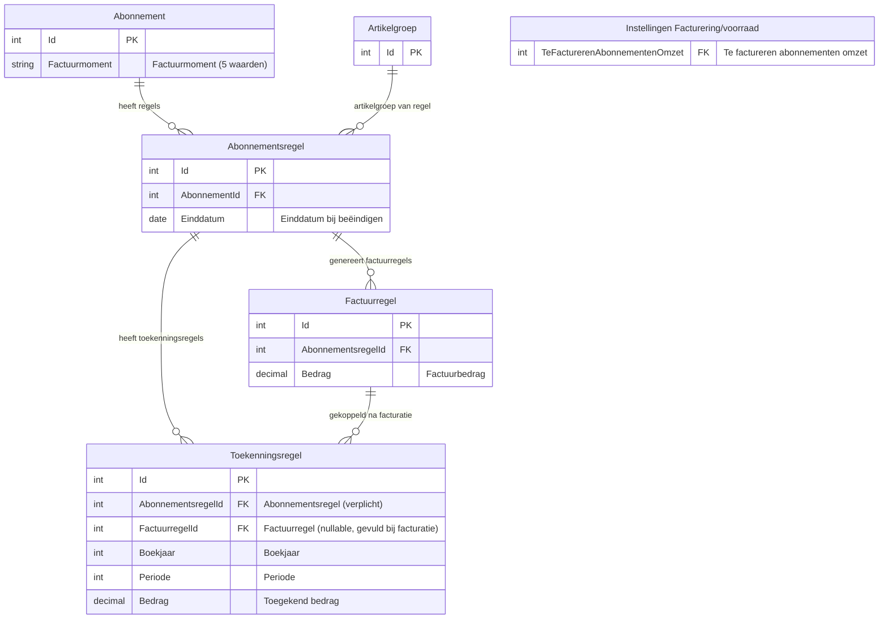

### 3.7 Boekingsstromen

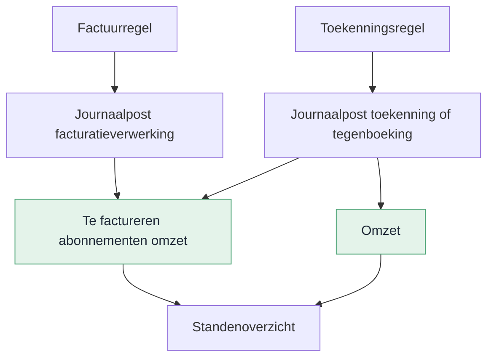

**Toekenning** (Journaliseer-actie):

| Debet | Credit | Toelichting |
| --- | --- | --- |
| Te factureren abonnementen omzet | Omzet | Positief bedrag bij toekenning |

**Tegenboeking** (Journaliseren ongedaan maken):

| Debet | Credit | Toelichting |
| --- | --- | --- |
| Omzet | Te factureren abonnementen omzet | Spiegelt de oorspronkelijke boeking |

De grootboekrekening **Te factureren abonnementen omzet** is een centrale instelling op Facturering/voorraad (tabblad Abonnementen, veldgroep Periodetoekenning). De omzetrekening volgt de artikelgroep van de abonnementsregel (B14). De journalisatie verloopt via het bestaande integratieschema abonnementen, uitgebreid met een nieuw regeltype voor periodetoekenning (B16). Journaalposten van periodetoekenning zijn uitgesloten van verdichting (B15).

**Facturatielogica:** bij de facturatieverwerking bepaalt het bestaan van een toekenningsrecord welke grootboekrekening wordt gebruikt. Bestaat er een toekenningsregel voor de abonnementsregel in de betreffende periode, dan wordt de omzet geboekt op de tussenrekening (Te factureren abonnementen omzet). Bestaat er geen toekenningsregel, dan gaat de omzet direct naar de omzetrekening.

---

## 4. Gegevensverzameling

### 4.1 Gegevensverzameling: Periodetoekenningsregels

| Eigenschap | Waarde |
| --- | --- |
| Basistabel | Toekenningsregels |
| Naam | Periodetoekenningsregels |
| Standaardfilter | Geen |
| Filterautorisatie | Nee |
| Sortering | Boekjaar (aflopend), Periode (aflopend), Aangemaakt op (aflopend) |
| Gebruik | Dashboards, analyses en rapportages over periodetoekenning |

**Velden**

| Veld | Bron | Type | Toelichting |
| --- | --- | --- | --- |
| Toekenningsregel | Toekenningsregels | Geheel getal | Primaire sleutel |
| Abonnementsregel | Abonnementsregel | Geheel getal | Verwijzing naar abonnementsregel |
| Abonnement | Abonnement (via abonnementsregel) | Tekst | Omschrijving abonnement |
| Factuurregel | Factuurregel | Geheel getal | Verwijzing naar factuurregel (kan leeg zijn) |
| Artikelgroep | Artikelgroep (via abonnementsregel) | Tekst | Artikelgroep van de abonnementsregel |
| Administratie | Administratie (via abonnement) | Tekst | Administratie van het abonnement |
| Boekjaar | Toekenningsregels | Geheel getal | Boekjaar van toekenning |
| Periode | Toekenningsregels | Geheel getal | Periode van toekenning |
| Bedrag | Toekenningsregels | Bedrag | Toegerekend bedrag |
| Aangemaakt op | Toekenningsregels | Datum/tijd | Tijdstip aanmaak |
| Aangemaakt door | Toekenningsregels | Tekst | Gebruiker |
| Gefactureerd (KPI) | Berekend via factuurregels | Bedrag | Som factuurregels per abonnementsregel |
| Toegerekend (KPI) | Berekend via toekenningsregels | Bedrag | Som toekenningsregels per abonnementsregel |
| Openstaand saldo (KPI) | Berekend | Bedrag | Gefactureerd − Toegerekend |

**Traceability:** US06, US08.

---

## Bijlage A – Samenvatting voor klant

Periodeafsluiting loopt soms vast omdat er nog ongejournaliseerde abonnementsomzet openstaat. Met deze wijziging kun je die omzet vooraf toekennen aan de juiste periode — ook als de factuur er nog niet is.

Op het Periodeafsluitingsplan komt een extra tabblad waarmee je in twee stappen werkt: regels genereren (inclusief journaliseren) en eventueel verwijderen.

**Wat levert dit op?**

- Je hoeft niet meer handmatig te corrigeren bij periodeafsluiting
- Je hebt een duidelijke audit trail van wat er is toegerekend en teruggedraaid
- Creditfacturen, beëindigingen en bedragwijzigingen worden automatisch afgehandeld
- Bij verwijdering van een abonnementsregel draait het systeem openstaande toekenningen automatisch terug

**Wat verandert er in de praktijk?**

Je werkt op een bekend scherm met bestaande rechten. Via een wizard (1 stap) selecteer je per periode welke abonnementen meedoen. Na voltooien zijn de regels direct gejournaliseerd. Geparkeerde abonnementen doen mee met het laatst bekende bedrag. De facturatie kiest automatisch de juiste grootboekrekening op basis van de toekenningsregel.

**Kortom:** voorspelbaardere periodeafsluiting, minder herstelwerk.

---

## Bijlage B – Huidige werking

### IST: huidige situatie

Sluit je een periode af terwijl er nog ongejournaliseerde abonnementsomzet loopt, dan blokkeert het systeem. Er is geen manier om vooraf te bepalen welke omzet nog toebedeeld moet worden.

### SOLL: gewenste situatie

De financieel medewerker verwerkt de toekenning vóór periodeafsluiting via het tabblad Periodetoekenningsregels:

| Stap | Actor | Actie | Systeemactie |
| --- | --- | --- | --- |
| 1 | Systeem | Facturatieverwerking draait | Factuurregel aangemaakt, omzet op Te factureren abonnementen omzet. Factuurregel wordt gekoppeld aan bestaande toekenningsregels. |
| 2 | Medewerker | Opent tabblad Periodetoekenningsregels | Boekjaar en periode overgenomen; grid is leeg |
| 3 | Medewerker | Start Genereer | Toekenningsregels aangemaakt en direct gejournaliseerd |
| 4 | Controller | Bewaakt saldo Te factureren abonnementen omzet | Openstaand saldo = signaal dat toekenning ontbreekt |
| 5 | Medewerker | Verwijder toekenningsregels (indien nodig) | Tegenboeking en tegenjournaalposten geboekt |

### Levenscyclus toekenningsregel

De levenscyclus is beschreven in de SOLL-tabel hierboven. Samengevat:

| Status | Overgang | Trigger |
| --- | --- | --- |
| Gejournaliseerd | Genereer | Genereer-actie op Periodeafsluitingsplan (direct gejournaliseerd) |
| Verwijderd | Verwijderen | Handmatig, beëindiging of verwijdering. Record blijft bewaard. Het tijdvak gedraagt zich alsof er geen toekenningsregel is. |

---

## Bijlage C – Testscenario's

### Functionele testscenario's

| Nr | Scenario | Verwacht resultaat | User story |
| --- | --- | --- | --- |
| T01 | Genereer voor abonnement via wizard (1 stap) met multi-select | Geselecteerde regels aangemaakt en direct gejournaliseerd | US01 |
| T02 | Genereer met directe journalisering | Status Gejournaliseerd, journaalposten geboekt, Te factureren omzet = 0 | US01 |
| T03 | Tweede Genereer voor dezelfde periode | Geen nieuwe regels, melding getoond | US01 |
| T04 | Geen abonnementen met openstaande facturatie in periode | Lege lijst in wizard, geen toekenbare regels | US01 |
| T05 | Vervallen — geen aparte Journaliseer-actie meer | — | — |
| T06 | Fout tijdens Genereer | Rollback: geen statuswijziging, geen boekingen | US01 |
| T07 | Verwijderen gejournaliseerde regels | Record verwijderd, tegenjournaalpost geboekt | US02 |
| T08 | Vervallen — geen status Tegengeboekt meer | — | — |
| T09 | Creditfactuur met negatief bedrag | Toekenningsregel met negatief bedrag, saldo gecorrigeerd | US01 |
| T10 | Bedragcorrectie na toekenning | Delta-toekenningsregel aangemaakt, netto-toekenning klopt | US03 |
| T11 | Beëindigen abonnementsregel met einddatum | Toekomstige toekenningen automatisch verwijderd | US04 |
| T12 | Beëindigen met afgesloten toekomstige periode | Melding: automatische tegenboeking niet mogelijk | US04 |
| T12a | Verwijderen toekenningsregel bij geblokkeerde periode | Foutmelding: Periode geblokkeerd. Dit is niet toegestaan. | US02, B38 |
| T13 | Verwijderen abonnementsregel met gejournaliseerde toekenningen | Automatisch verwijderd, verwijdering afgerond | US05 |
| T14 | Verwijderen abonnementsregel zonder toekenningen | Direct verwijderd | US05 |
| T15 | Vervallen — geen audit trail via tegenboekingsrecords meer | — | — |
| T16 | Geparkeerd abonnement in wizard | Verschijnt met laatst bekende bedrag, selecteerbaar via multi-select | US01, B34 |
| T17 | Genereer met facturatielogica: toekenningsregel bestaat | Omzet bij facturatie naar tussenrekening | US07, B33 |
| T27 | Genereer met alle vier factuurmomenten | Per factuurmoment correct factuurdatum berekend | US07 |
| T28 | Nieuw abonnement zonder wijziging factuurmoment | Factuurmoment staat op Aantal dagen voor begindatumcyclus (default) | US07 |
| T29 | Bestaand abonnement na conversie | Factuurmoment is Aantal dagen voor begindatumcyclus; gedrag ongewijzigd | US07 |
| T35 | Aantal dagen na begindatumcyclus met waarde groter dan cyclusdagen | Foutmelding: waarde mag niet groter zijn dan cyclus | US07 |
| T36 | Aantal dagen voor einddatumcyclus met waarde groter dan cyclusdagen | Foutmelding: waarde mag niet groter zijn dan cyclus | US07 |
| T18 | Jaaroverschrijding (Q4 + Q1) | Aparte toekenningsregels per boekjaar/periode | US01 |
| T19 | Terugdraaien één periode bij jaaroverschrijding | Alleen die periode teruggedraaid, andere ongewijzigd | US02 |
| T20 | Saldo Te factureren omzet na volledige journalisatie | Saldo = 0 | US06 |
| T21 | Openstaand saldo als signaal | Saldo groter dan 0 zichtbaar in standenoverzicht | US06 |
| T22 | Transitorisch journaliseren met bestaande toekenningsregel | Transitorisch slaat de regel over (B9) | US01, US07 |
| T23 | Transitorisch journaliseren zonder toekenningsregel | Werkt zoals voorheen | US01, US07 |
| T24 | Vervallen | — | — |
| T25 | Vervallen | — | — |
| T26 | Facturatie zonder toekenningsregel | Omzet direct naar omzetrekening (B33) | US07 |
| T32 | KPI's op abonnementsregel na volledige journalisatie | Openstaand saldo = 0; Toegerekend = Gefactureerd | US08 |
| T33 | KPI's op abonnementsregel na gedeeltelijke journalisatie | Openstaand saldo &gt; 0 | US08 |
| T34 | KPI's niet zichtbaar als geen toekenningsregels bestaan | Velden zijn verborgen | US08 |

### Standenoverzicht-scenario's

| Nr | Scenario | Verwacht |
| --- | --- | --- |
| S01 | Maandfactuur volledig toegerekend | 1 toekenningsregel; saldo Te factureren omzet = 0 |
| S02 | Kwartaalfactuur over 3 perioden | 3 toekenningsregels; som = factuurbedrag |
| S03 | Afrondingsverschil | Compensatieregel in laatste periode |
| S04 | Toekenning niet uitgevoerd | Geen toekenningsregels; openstaand saldo = signaal |
| S05 | Beëindigd na volledige toekenning | Toekenningsregel verwijderd; netto = 0 |
| S06 | Creditfactuur na toekenning | Origineel +250 en credit -250; netto = 0 |
| S07 | Bedragcorrectie +50 na toekenning | Origineel +250 en delta +50; totaal = 300 = nieuw bedrag |

---

## Bijlage D – Open punten en beslissingen

### Open punten

| Nr | Punt | Status |
| --- | --- | --- |
| O1 | Definitieve formuliernaam tabblad in MDD | Open |

### Beslissingen

| Nr | Besluit |
| --- | --- |
| B1 | Tabblad Periodetoekenningsregels is altijd zichtbaar op het Periodeafsluitingsplan |
| B2 | Bij verwijderen krijgt de toekenningsregel status Verwijderd. Het record wordt niet fysiek verwijderd (audit trail). Een verwijderde regel telt niet mee voor samenloop en facturatielogica — het tijdvak gedraagt zich alsof er geen toekenningsregel is. |
| B3 | Genereer alleen vóór periodeafsluiting toegestaan. Genereer is alleen beschikbaar vanuit het Periodeafsluitingsplan, niet op de standalone weergave. Journalisering vindt altijd direct plaats bij genereren. |
| B4 | Vervallen — geen tegenboekingsrecords meer. Records worden daadwerkelijk verwijderd. |
| B5 | Automatisch terugdraaien bij beëindigen is altijd actief. Er is geen instelling om dit uit te schakelen. |
| B6 | Geen cascade-delete bij verwijdering abonnementsregel; koppeling genulled |
| B7 | Vervallen — geen aparte rechtenobjecten. Toegang volgt het bestaande recht op het Periodeafsluitingsplan. |
| B8 | Periodetoekenning hergebruikt de bestaande verdelingslogica van transitorisch journaliseren. Geen nieuwe verdelingsmethoden. |
| B9 | Samenloop periodetoekenning en transitorisch journaliseren: als er een toekenningsregel bestaat voor een abonnementsregel in een periode, slaat transitorisch journaliseren die regel over. Periodetoekenning wint. Bestaat er geen toekenningsregel (of alleen status Verwijderd), dan werkt transitorisch journaliseren zoals voorheen. |
| B10 | Dubbele koppeling: toekenningsregels worden gekoppeld aan de abonnementsregel (verplicht) én aan de factuurregel (nullable). Bij Genereer is alleen de abonnementsregel gevuld. De factuurregel wordt automatisch gevuld bij de facturatieverwerking. |
| B11 | Als de factuur nooit wordt aangemaakt (bijv. beëindiging vóór facturatie), blijft de factuurregel leeg. Dit is acceptabel. |
| B12 | Doorschuiflogica: als de periode al gesloten is bij Journaliseer of bij automatisch terugdraaien, wordt de journaalpost geboekt in de eerstvolgende vrije periode. Dit geldt altijd (handmatig en automatisch). |
| B13 | Validatie grootboekrekening Te factureren abonnementen omzet: alleen type Activa of Passiva toegestaan. |
| B14 | Omzetrekening volgt de artikelgroep van de abonnementsregel, niet een vaste instelling. |
| B15 | Journaalposten van periodetoekenning zijn uitgesloten van verdichting. |
| B16 | Bestaand integratieschema abonnementen wordt uitgebreid met een nieuw regeltype voor periodetoekenning. Geen nieuw integratieschema. |
| B17 | Vervallen — artikelgroep-instelling geschrapt. Periodetoekenning wordt per periode beheerd via de wizard op het Periodeafsluitingsplan. |
| B18 | Vervallen — geen artikelgroep-instelling meer. |
| B19 | Verwijdering van een abonnementsregel is geblokkeerd als er gejournaliseerde toekenningsregels zijn en er geen open periode beschikbaar is voor de tegenboeking. |
| B20 | Vervallen — journalisering vindt altijd direct plaats bij genereren. Het vinkje Direct journaliseren is geschrapt. |
| B21 | Bij een herhaalde Genereer worden bestaande regels herberekend op basis van de actuele abonnementsregel. |
| B22 | Volgorde in het maandafsluitingsproces: (1) Facturatieverwerking, (2) Periodetoekenning genereren (inclusief journaliseren), (3) Periode afsluiten. |
| B23 | RPT00692 en RPT00702 werken onafhankelijk. 692 boekt omzet, 702 verschuift de balansboeking. Geen samenlooprisico. |
| B24 | Periodetoekenning vereist het Periodeafsluitingsplan. Zonder Periodeafsluitingsplan is periodetoekenning niet beschikbaar. |
| B25 | Vervallen — startperiode op artikelgroep geschrapt. |
| B26 | Vervallen — beginsaldo tussenrekening was gekoppeld aan startperiode. |
| B27 | Factuurmoment is een nieuw veld op het abonnement met vijf waarden: Aantal dagen voor begindatumcyclus, Aantal dagen na begindatumcyclus, Aantal dagen voor einddatumcyclus, Aantal dagen na einddatumcyclus, Midden van de factuurperiode. Standaard: Aantal dagen voor begindatumcyclus. Bestaande abonnementen krijgen deze waarde via conversie. Het veld is altijd zichtbaar op het abonnement. |
| B28 | Het bestaande veld Aantal dagen vooraf wordt hernoemd naar Aantal dagen. Dit veld is altijd zichtbaar in de boekingslay-out. |
| B29 | Het veld DaysAfter (Aantal dagen achteraf) vervalt. De richting en referentiedatum zitten nu in het factuurmoment. |
| B30 | Vervallen — geen artikelgroep-instelling meer. |
| B31 | Bij factuurmoment Aantal dagen na begindatumcyclus mag het veld Aantal dagen niet groter zijn dan het aantal dagen van de cyclus. Dit voorkomt dat het factuurmoment na de einddatum van de cyclus valt. |
| B32 | Bij factuurmoment Aantal dagen voor einddatumcyclus mag het veld Aantal dagen niet groter zijn dan het aantal dagen van de cyclus. Dit voorkomt dat het factuurmoment voor de begindatum van de cyclus valt. |
| B33 | Facturatielogica: bij de facturatieverwerking bepaalt het bestaan van een toekenningsrecord welke grootboekrekening wordt gebruikt. Bestaat er een toekenningsregel: omzet naar tussenrekening. Geen toekenningsregel: omzet naar omzetrekening. |
| B34 | Geparkeerde abonnementen verschijnen in de Genereer-wizard. Het bedrag is het laatst bekende bedrag van de abonnementsregel. |
| B35 | De Genereer-wizard bestaat uit 1 stap. Bovenin staan boekjaar en periode (alleen-lezen, geen begin-/einddatum). Daaronder toont het systeem de toekenbare abonnementsregels. De gebruiker selecteert via multi-select welke regels periodetoekenning krijgen. |
| B36 | Bij factuurmoment Midden van de factuurperiode berekent het systeem de factuurdatum als het midden van de cyclus: (begindatum cyclus + einddatum cyclus) / 2. Het veld Aantal dagen is verborgen en niet van toepassing. |
| B37 | Bij een delta-bedrag (US03) wordt altijd een nieuwe toekenningsregel aangemaakt én direct gejournaliseerd. Bestaande gejournaliseerde regels worden nooit gewijzigd — zo blijft de audit trail intact en is het netto-saldo altijd te herleiden. |
| B38 | Verwijderen van toekenningsregels vervangt de oude actie Journaliseren ongedaan maken. Bij verwijderen valideert het systeem of de periode geblokkeerd is. Is de periode geblokkeerd, dan verschijnt de foutmelding: "Periode geblokkeerd. Dit is niet toegestaan." Het record wordt verwijderd en de bijbehorende journaalpost wordt teruggedraaid via een tegenjournaalpost. |
| B39 | De menu-items Te journaliseren periodetoekenningsregels en Gejournaliseerde periodetoekenningsregels zijn vervallen. Alleen het menu-item Alle periodetoekenningsregels blijft bestaan. |
| B40 | Status Te journaliseren vervalt. Toekenningsregels gaan bij genereren direct naar status Gejournaliseerd. Status Tegengeboekt vervalt: verwijderen verwijdert het record daadwerkelijk. Er is nog één status: Gejournaliseerd. |
| B41 | Verwijderen van een toekenningsregel is niet toegestaan als er voor deze periode en dit tijdvak een factuur is gegenereerd voor de bijbehorende abonnementsregel. Dit borgt de boekhoudkundige consistentie: de factuurboeking is al naar de tussenrekening gerouteerd op basis van de toekenningsregel (B33). |

### Definition of Done

| Onderdeel | Status | Toelichting |
| --- | --- | --- |
| Datamodel en conversie | Afgedekt | Nieuwe tabel Toekenningsregels beschreven in §3.1. Nieuw veld Factuurmoment op Abonnement in §3.4. Conversie: bestaande abonnementen krijgen waarde Aantal dagen voor begindatumcyclus. Artikelgroep-uitbreiding geschrapt. |
| Weergaven | Afgedekt | Embedded ListPage (US01) en standalone ListPage (US02) beschreven met kolommen, filters en acties. Genereer-wizard met 1 stap en multi-select. Directe journalisering. |
| Autorisatie | Afgedekt | Geen apart autorisatierecht vereist. Toegang volgt bestaand recht op Periodeafsluitingsplan. Menu-item en tabbladtoegang beschreven per user story. |
| Rapportages en gegevensverzamelingen | Afgedekt | Gegevensverzameling Periodetoekenningsregels beschreven in §4.1. Bevat alle velden uit de toekenningsregeltabel plus KPI-velden (Gefactureerd, Toegerekend, Openstaand saldo). |
| Signalen | N.v.t. | Geen automatisch signaal. US06 beschrijft een saldocontrole via het standenoverzicht, geen Profit-signaal. |
| Connectors en integraties | N.v.t. | Geen nieuwe GetConnectors, UpdateConnectors of koppelingen. |
| User interface | Afgedekt | Tabblad, standalone weergave, wizard (1 stap) met multi-select en instellingenscherm beschreven met Podium-specificaties en mockups. |
| Menu-items | Afgedekt | Nieuw submenu Periodetoekenning onder Abonnementen &rarr; Facturering met twee menu-items: Alle periodetoekenningsregels en Saldoverklaring (US02/US06). |
| Regels en validaties | Afgedekt | Unieke constraint, statusvalidaties en foutmeldingen beschreven per user story. |
| Testscenario's en acceptatiecriteria | Afgedekt | 22 functionele testscenario's en 7 standenoverzicht-scenario's in Bijlage C. |
| Documentatie | Afgedekt | Helpteksten, tooltips en stappenplan in Bijlage E. |

---

## Bijlage E – Documentatie

### Helptekst tabblad

Gebruik dit tabblad om abonnementsomzet toe te kennen aan de juiste financiële periode.

- Start met **Genereer periodetoekenningsregels** om regels op te bouwen en direct te journaliseren.
- Gebruik **Verwijder toekenningsregels** om gejournaliseerde toekenningen terug te draaien.

### Helptekst per actie

| Actie | Helptekst |
| --- | --- |
| Genereer periodetoekenningsregels | Maakt toekenningsregels aan en journaliseert ze direct voor het geselecteerde boekjaar en de geselecteerde periode. |
| Verwijder toekenningsregels | Verwijdert geselecteerde toekenningsregels en draait de bijbehorende journaalposten terug. |

### Statuswaarden

| Status | Uitleg |
| --- | --- |
| Gejournaliseerd | De toekenningsregel is aangemaakt en geboekt. Telt mee in de omzettoekenning. |

### Stappenplan voor gebruiker

| Stap | Actie | Verwacht resultaat |
| --- | --- | --- |
| 1 | Open Periodeafsluitingsplan en ga naar tabblad Periodetoekenningsregels | Je ziet jaar en periode en een leeg of gevuld grid |
| 2 | Klik Genereer periodetoekenningsregels | Wizard opent met 1 stap: boekjaar en periode bovenin, toekenbare regels daaronder |
| 3 | Selecteer regels en klik Voltooien | Regels aangemaakt en direct gejournaliseerd |
| 4 | Controleer resultaat in grid en standenoverzicht | Saldo neemt af of is nul |
| 5 | Bij fout: selecteer regels en klik Verwijder toekenningsregels | Record verwijderd, journaalpost teruggedraaid |

### Veelgestelde vragen

**Wat als ik een periode oversla bij de periodetoekenning?**

Je kunt Genereer en Journaliseer voor een latere periode uitvoeren zonder dat eerdere perioden zijn verwerkt. De bedragen kloppen, want elke periode krijgt een eigen deel op basis van de verdelingsmethode.

Let op: je kunt een periode pas afsluiten als alle voorgaande perioden zijn afgesloten. Sla je bijvoorbeeld februari over en verwerk je alleen januari en maart, dan kun je maart niet afsluiten totdat februari ook is afgesloten.

**Voorbeeld**

| Stap | Actie | Resultaat |
| --- | --- | --- |
| 1 | Januari: Genereer &rarr; Journaliseer &rarr; Afsluiten | Verwerkt |
| 2 | Februari: overgeslagen | Periode blijft open |
| 3 | Maart: Genereer &rarr; Journaliseer | Regels aangemaakt en geboekt |
| 4 | Maart: Afsluiten | Geblokkeerd — februari is nog open |
| 5 | Februari: alsnog Genereer &rarr; Journaliseer &rarr; Afsluiten | Verwerkt |
| 6 | Maart: Afsluiten | Nu wel mogelijk |

**Tip:** voer periodetoekenning altijd uit in de volgorde van de perioden. Zo voorkom je dat je later terugkomt om een overgeslagen periode alsnog te verwerken.

### Beginsaldo tussenrekening

Als er al niet-gefactureerde omzet loopt op het moment dat je periodetoekenning gaat gebruiken, boek je zelf het beginsaldo op Te factureren abonnementen omzet. Doe dit via een memoriaalpost. Het systeem doet dit niet automatisch.

---

## Bijlage F – Work items developer

Deze bijlage bevat alle taken die de developer moet uitvoeren. De taken zijn gegroepeerd per onderdeel. Voer ze uit in de aangegeven volgorde.

### F1 – Datamodel

| Nr | Taak | Referentie | Toelichting |
| --- | --- | --- | --- |
| D01 | Maak nieuwe tabel Toekenningsregels | §3.1 | Kolommen: Id, Abonnementsregel, Factuurregel, Boekjaar, Periode, Bedrag, Status, Originele toekenningsregel, Redencode, Aangemaakt op, Aangemaakt door |
| D02 | Voeg unieke constraint toe op (Abonnementsregel, Boekjaar, Periode) voor status Gejournaliseerd | §3.1 | Per combinatie mag maximaal één Gejournaliseerd-record bestaan (exclusief delta-regels). |
| D03 | Voeg foreign keys toe op Toekenningsregels | §3.1 | FK naar Abonnementsregel (verplicht), Factuurregel (nullable), Toekenningsregel (self-referencing, nullable) |
| D04 | Vervallen — artikelgroep-instelling geschrapt | — | — |
| D05 | Vervallen — artikelgroep-instelling geschrapt | — | — |
| D06 | Voeg veld Te factureren abonnementen omzet toe op Facturering/voorraad | §3.3 | FK naar grootboekrekening, nullable |
| D07 | Voeg veld Factuurmoment toe op Abonnement | §3.4 | Keuzelijst: Aantal dagen voor begindatumcyclus, Aantal dagen na begindatumcyclus, Aantal dagen voor einddatumcyclus, Aantal dagen na einddatumcyclus, Midden van de factuurperiode. Standaard: Aantal dagen voor begindatumcyclus |
| D08 | Hernoemd bestaand veld Aantal dagen vooraf naar Aantal dagen | §3.4 | Veld Dagen achteraf vervalt |
| D09 | Schrijf conversiescript: alle bestaande abonnementen krijgen Factuurmoment = Aantal dagen voor begindatumcyclus | §3.4, B27 | Bestaand gedrag blijft ongewijzigd |

### F2 – Instellingen en validaties (US07)

| Nr | Taak | Referentie | Toelichting |
| --- | --- | --- | --- |
| D10 | Toon veld Factuurmoment op het abonnement | US07 | Altijd zichtbaar. Vier waarden |
| D11 | Toon veld Aantal dagen op het abonnement | US07, B28 | Altijd zichtbaar |
| D12 | Verwijder veld Dagen achteraf | US07, B29 | Vervalt; richting zit nu in Factuurmoment |
| D13 | Vervallen — artikelgroep-instelling geschrapt | — | — |
| D14 | Vervallen — artikelgroep-instelling geschrapt | — | — |
| D15 | Vervallen — startperiode geschrapt | — | — |
| D16 | Vervallen — startperiode geschrapt | — | — |
| D17 | Vervallen — artikelgroep-instelling geschrapt | — | — |
| D18 | Vervallen — artikelgroep-instelling geschrapt | — | — |
| D19 | Toon veld Te factureren abonnementen omzet op Facturering/voorraad | US07 | Tabblad Abonnementen, veldgroep Periodetoekenning |
| D20 | Valideer: grootboekrekening alleen type Activa of Passiva | B13 | Foutmelding bij ander type |
| D43 | Valideer: Aantal dagen ≤ cyclusdagen bij factuurmoment Aantal dagen na begindatumcyclus | B31, T35 | Foutmelding bij opslaan |
| D44 | Valideer: Aantal dagen ≤ cyclusdagen bij factuurmoment Aantal dagen voor einddatumcyclus | B32, T36 | Foutmelding bij opslaan |

### F3 – Genereer-logica (US01)

| Nr | Taak | Referentie | Toelichting |
| --- | --- | --- | --- |
| D21 | Bouw Genereer-actie als batchverwerking met wizard (1 stap) | US01, B35 | Wizard toont boekjaar en periode bovenin (geen begin-/einddatum). Daaronder toekenbare abonnementsregels. Inclusief geparkeerde abonnementen (B34). Gebruiker selecteert via multi-select. Regels worden direct gejournaliseerd. |
| D22 | Vervallen — startperiode geschrapt | — | — |
| D23 | Maak toekenningsregels met status Gejournaliseerd en boek journaalposten | US01 | Per abonnementsregel maximaal één actief record per boekjaar/periode. Directe journalisering. |
| D24 | Herbereken bestaande regels bij herhaalde Genereer | B21 | Bedrag bijwerken op basis van actuele abonnementsregel |
| D25 | Gebruik bestaande verdelingslogica van transitorisch journaliseren | B8 | Geen nieuwe verdelingsmethoden |
| D26 | Compenseer afrondingsverschillen in de laatste periode | US01 | Als de laatste periode gesloten is: doorschuiven naar eerstvolgende vrije periode (B12) |
| D27 | Verwerk negatieve bedragen voor creditfacturen | US01 | Geen aparte actie; laat negatief bedrag meelopen |
| D28 | Alles-of-niets: rollback bij fout | US01 | Geen halve resultaten |

### F4 – Vervallen (journalisering is onderdeel van Genereer)

De taken D29–D34 zijn vervallen. Journalisering vindt direct plaats bij het genereren (zie F3).

### F5 – Verwijder-logica (US02)

| Nr | Taak | Referentie | Toelichting |
| --- | --- | --- | --- |
| D35 | Bouw Verwijder-actie als batchverwerking met multi-select | US02, B38 | Verwerk alleen regels met status Gejournaliseerd |
| D36 | Verwijder het toekenningsrecord en boek een tegenjournaalpost | US02 | Zelfde boekjaar/periode als het origineel |
| D37 | Boek tegenjournaalpost: Omzet (debet) &rarr; Te factureren abonnementen omzet (credit) | §3.7 | Spiegelt de oorspronkelijke boeking |
| D38 | Vervallen — geen status Tegengeboekt meer | — | — |
| D38a | Valideer of de periode geblokkeerd is bij verwijderen | US02, B38 | Foutmelding: Periode geblokkeerd. Dit is niet toegestaan. |
| D39 | Doorschuiflogica bij gesloten periode | B12 | Tegenjournaalpost boeken in eerstvolgende vrije periode |

### F6 – Delta-bedrag bij wijziging (US03)

| Nr | Taak | Referentie | Toelichting |
| --- | --- | --- | --- |
| D40 | Detecteer verschil bij Genereer als er al gejournaliseerde regels bestaan | US03 | Vergelijk verwacht bedrag met netto-saldo toekenningsregels |
| D41 | Maak delta-toekenningsregel met verschilbedrag | US03 | Positief bij verhoging, negatief bij verlaging |

### F7 – Automatisch terugdraaien (US04, US05)

| Nr | Taak | Referentie | Toelichting |
| --- | --- | --- | --- |
| D42 | Bouw event-trigger bij beëindigen abonnementsregel | US04 | Detecteer toekenningsregels voor toekomstige perioden |
| D43 | Verwijder toekomstige toekenningen automatisch en boek tegenjournaalposten | US04 | In dezelfde transactie als beëindiging |
| D44 | Bouw event-trigger bij verwijderen abonnementsregel | US05 | Controleer of er toekenningsregels bestaan |
| D45 | Verwijder toekenningsregels automatisch en boek tegenjournaalposten | US05 | Null de koppeling naar de abonnementsregel (R7); factuurregels blijven behouden |
| D46 | Blokkeer verwijdering als er geen open periode beschikbaar is voor tegenjournaalpost | B19 | Foutmelding tonen |

### F8 – Koppeling factuurregel (B10)

| Nr | Taak | Referentie | Toelichting |
| --- | --- | --- | --- |
| D47 | Koppel factuurregel aan toekenningsregels bij facturatieverwerking | B10 | Zoek toekenningsregels voor dezelfde abonnementsregel en vul de factuurregel |

### F9 – Integratieschema (B16)

| Nr | Taak | Referentie | Toelichting |
| --- | --- | --- | --- |
| D48 | Breid integratieschema abonnementen uit met regeltype periodetoekenning | B16 | Geen nieuw integratieschema |
| D49 | Sluit journaalposten van periodetoekenning uit van verdichting | B15 | — |

### F10 – Schermen

| Nr | Taak | Referentie | Toelichting |
| --- | --- | --- | --- |
| D50 | Bouw tabblad Periodetoekenningsregels op Periodeafsluitingsplan | US01 | Embedded ListPage met kolommen en twee acties: Genereer en Verwijder (zie Podium-specificatie US01) |
| D51 | Tabblad is altijd zichtbaar | US01 | Geen conditie op artikelgroep-instelling |
| D52 | Bouw Genereer-wizard (1 stap) met multi-select | US01, B35 | Boekjaar en periode bovenin (geen begin-/einddatum). Daaronder multi-select lijst met toekenbare regels. Inclusief kolom Factuurmoment en Geparkeerd. Directe journalisering. |
| D53 | Vervallen — geen aparte Journaliseer-wizard meer | — | — |
| D54 | Vervallen — geen aparte Terugdraaien-wizard meer | — | — |
| D55 | Bouw standalone ListPage Alle periodetoekenningsregels | US02 | Eén menu-item: Alle periodetoekenningsregels met actie Verwijderen. |
| D56 | Bouw ListPage Saldoverklaring Te factureren abonnementen omzet | US06 | Alleen-lezen lijst met kolommen per abonnementsregel (zie Podium-specificatie US06) |

### F11 – Menu-items

| Nr | Taak | Referentie | Toelichting |
| --- | --- | --- | --- |
| D57 | Voeg submenu Periodetoekenning toe | US02 | Abonnementen &rarr; Facturering &rarr; Periodetoekenning. Altijd zichtbaar. Sneltoets P. |
| D57a | Voeg menu-item Alle periodetoekenningsregels toe | US02 | Onder submenu Periodetoekenning. Sneltoets A. Geen filter. Actie: Verwijder toekenningsregels. |
| D57b | Vervallen — menu-item Te journaliseren geschrapt | — | — |
| D57c | Vervallen — menu-item Gejournaliseerde geschrapt | — | — |
| D58 | Voeg menu-item Saldoverklaring toe | US06 | Onder submenu Periodetoekenning. Sneltoets S. Alleen-lezen overzicht. |

### F12 – KPI en functievelden (US08)

| Nr | Taak | Referentie | Toelichting |
| --- | --- | --- | --- |
| D59 | Voeg functieveld Gefactureerd toe op abonnementsregel | US08 | Som factuurregels per abonnementsregel. Alleen-lezen. |
| D60 | Voeg functieveld Toegerekend toe op abonnementsregel | US08 | Som gejournaliseerde toekenningsregels. Alleen-lezen. |
| D61 | Voeg functieveld Openstaand saldo toe op abonnementsregel | US08 | Gefactureerd − Toegerekend. Alleen-lezen. |
| D62 | Maak functievelden conditioneel zichtbaar | US08 | Alleen als er toekenningsregels bestaan voor de abonnementsregel |
| D63 | Registreer KPI K004 Dagen tot facturering via tabelbeheer | US08 | Value-KPI, type Number, suffix "dagen". Berekening: einddatum cyclus ± dagen vooraf/achteraf − vandaag. Minimum 0. |

### F13 – Gegevensverzameling

| Nr | Taak | Referentie | Toelichting |
| --- | --- | --- | --- |
| D64 | Maak gegevensverzameling Periodetoekenningsregels | §4.1 | Basistabel Toekenningsregels. Alle velden uit §4.1 inclusief KPI-velden. |

### F14 – Meldingen en tooltips

| Nr | Taak | Referentie | Toelichting |
| --- | --- | --- | --- |
| D65 | Voeg alle meldingsteksten toe | US01, US02 | Zie meldingstabellen per user story |
| D66 | Voeg alle tooltipteksten toe | US01, US02, US07 | Zie tooltiptabellen per user story |

### Volgorde van uitvoering

Voer de taken uit in deze volgorde:

1. **Datamodel en conversie** (D01–D09)
2. **Instellingen en validaties** (D10–D20)
3. **Genereer-logica inclusief journalisering** (D21–D28)
4. **Vervallen** (D29–D34, journalisering is onderdeel van Genereer)
5. **Verwijder-logica** (D35–D39)
6. **Delta-bedrag** (D40–D41)
7. **Automatisch terugdraaien** (D42–D46)
8. **Koppeling factuurregel** (D47)
9. **Integratieschema** (D48–D49)
10. **Schermen** (D50–D56)
11. **Menu-items** (D57–D58)
12. **KPI en functievelden** (D62–D63)
13. **Gegevensverzameling** (D64)
14. **Meldingen en tooltips** (D65–D66)
