# Ontwerp: Periodetoekenning omzet abonnement

|   |   |
| --- | --- |
| **Project** | RPT00692 |
| **Versie** | 0028 |
| **Datum** | 21-04-2026 |
| **Status** | Concept |
| **Module** | Financial Basic – Abonnementen |
| **Gepland voor** | P08/09 |
| **Klant** | Facilicom |
| **Auteur** | Eric Zaal |

---

## Versiehistorie

| Versie | Datum | Auteur | Wijziging |
| --- | --- | --- | --- |
| 0028 | 21-04-2026 | Eric Zaal | Activering Periodetoekenning toepassen toegevoegd op Facturering/voorraad (tabblad Abonnementen, veldgroep Periodetoekenning). Vinkje is alleen zichtbaar als de module Abonnementen actief is. Staat het vinkje uit, dan is de volledige periodetoekenningsfunctionaliteit verborgen: tabblad op Periodeafsluitingsplan, menu-items, KPI's en tabbladen op Eigenschappen abonnement. US08, §3.2, B1, B44, T37–T39, D55 en Definition of Done bijgewerkt. |
| 0027 | 21-04-2026 | Eric Zaal | US06 herschreven: rapport verklaart het volledige saldo op de tussenrekening, inclusief handmatige boekingen. User story, Podium-specificatie, §4.2 en testscenario's T20/T21 bijgewerkt. |
| 0026 | 21-04-2026 | Eric Zaal | US06 herschreven als rapport (WizardPage, 2 stappen: periode kiezen en saldoverklaring tonen). Podium-specificatie gewijzigd van ListPage naar WizardPage. Export toegevoegd. Gegevensverzameling §4.2 Saldoverklaring Te factureren abonnementen omzet toegevoegd als databron. Work item D40 en D54 bijgewerkt. Definition of Done bijgewerkt. Traceability §4.1 gecorrigeerd. |
| 0025 | 20-04-2026 | Eric Zaal | Acties Genereer en Verwijder zijn apart autoriseerbaar via twee rechtenobjecten (Periodetoekenning genereren, Periodetoekenning verwijderen). B43 toegevoegd, B7 vervangen. Autorisatiesecties US01 en US02 bijgewerkt. Acties-blokken uitgebreid met kolom Autoriseerbaar. Definition of Done bijgewerkt. |
| 0025 | 20-04-2026 | Eric Zaal | US04 trigger gewijzigd: automatisch terugdraaien bij beëindigen draait nu bij de facturatieverwerking (het factuurmoment), niet meer event-driven bij het instellen van de einddatum. B5, T11, levenscyclus en afbakening bijgewerkt. |
| 0024 | 20-04-2026 | Eric Zaal | Screenshots van de Podium-mockups toegevoegd aan US01 (tabblad Periodetoekenningsregels, Genereer-wizard), US07 (Facturering/voorraad tabblad Abonnementen, Boekingslay-out abonnement met Factuurmoment), US08 (KPI K004 Dagen tot facturering op Eigenschappen abonnement) en US09 (tabblad Periodetoekenningsregels op Eigenschappen abonnement). Verouderde lijst-screenshots in US01 vervangen door de tabbladweergave op Periodeafsluiting. |
| 0023 | 18-04-2026 | Eric Zaal | US09 toegevoegd: tabblad Periodetoekenningsregels op Eigenschappen abonnement. Weergave met toekenningsregels per abonnement, onder tabblad Facturen. |
| 0022 | 18-04-2026 | Eric Zaal | Verwijderde toekenningsregels krijgen status Verwijderd in plaats van fysieke verwijdering. Record blijft bewaard voor audit trail. Samenloop B9, facturatielogica en levenscyclus aangepast: een verwijderde regel telt niet mee — het tijdvak gedraagt zich alsof er geen toekenningsregel is. |
| 0021 | 18-04-2026 | Eric Zaal | Brainstorm Facilicom 18-04 verwerkt: Genereer-wizard vereenvoudigd naar 1 stap (boekjaar en periode bovenin, geen begin-/einddatum). Journalisering vindt altijd direct plaats bij genereren — optie Direct journaliseren en aparte Journaliseer-actie vervallen. Verwijderactie met multiselect vervangt Journaliseren ongedaan maken; validatie op geblokkeerde periode. Menu-items Te journaliseren en Gejournaliseerde periodetoekenningsregels vervallen; alleen Alle periodetoekenningsregels blijft. Status Te journaliseren vervalt. |
| 0020 | 17-04-2026 | Eric Zaal | Brainstorm Facilicom 17-04 verwerkt: periodetoekenning niet meer beperkt tot factuurmoment ④, artikelgroep-instelling geschrapt, wizard met multi-select, facturatielogica vereenvoudigd (bestaan FbFalAss-record bepaalt grootboekrekening), samenloopregeling transitorisch herschreven (toekenningsregel wint), geparkeerde abonnementen meegenomen met laatst bekende bedrag. |
| 0019 | 14-04-2026 | Eric Zaal | Factuurmoment gewijzigd naar vier waarden. Midden vervalt. Periodetoekenning geldt alleen bij Aantal dagen na einddatumcyclus; bij de overige drie factuurmomenten is transitorisch journaliseren van toepassing. Bedrijfsregels B31 en B32 toegevoegd: Aantal dagen mag bij Aantal dagen na begindatumcyclus en Aantal dagen voor einddatumcyclus niet groter zijn dan de cyclusdagen. Testscenario's T35–T36 en taken D43–D44 toegevoegd. |
| 0018 | 13-04-2026 | Eric Zaal | Bijlage F toegevoegd: work items developer met 66 taken gegroepeerd per onderdeel en uitvoeringsvolgorde. |
| 0017 | 13-04-2026 | Eric Zaal | KPI K004 Dagen tot facturering toegevoegd aan US08. Value-KPI op abonnementsform met berekende countdown in dagen. |
| 0016 | 13-04-2026 | Eric Zaal | Gegevensverzameling Periodetoekenningsregels toegevoegd (§4.1) met alle toekenningsvelden en KPI-velden. Definition of Done bijgewerkt. |
| 0015 | 13-04-2026 | Eric Zaal | US08 toegevoegd: KPI's periodetoekenning op abonnementsregel (gefactureerd, toegerekend, openstaand saldo). Afbakening, overzicht en testscenario's T32–T34 bijgewerkt. |
| 0014 | 13-04-2026 | Eric Zaal | Gedrag bij uitzetten Periodetoekenning toepassen: te journaliseren regels worden automatisch verwijderd na bevestiging (B30). Acceptatiecriteria US07, testscenario's T30–T31 toegevoegd. |
| 0013 | 13-04-2026 | Eric Zaal | Velden Aantal dagen vooraf (bestaand, conditioneel) en Aantal dagen achteraf (nieuw) beschreven. Zichtbaarheid in boekingslay-out afhankelijk van Facturatiemethode. Datamodel §3.4, acceptatiecriteria, tooltips, B28 en B29 toegevoegd. |
| 0012 | 13-04-2026 | Eric Zaal | Facturatiemethode als nieuw veld op abonnement beschreven (vooraf/achteraf/midden). Afbakening, US07, datamodel §3.4, conversie, testscenario's T27–T29 en B27 toegevoegd. |
| 0011 | 13-04-2026 | Eric Zaal | Facturatiemethode "midden" toegevoegd als derde optie naast vooraf en achteraf. Inleiding, begrippen, flowdiagram en ER-diagram bijgewerkt. Periodetoekenning geldt alleen voor achteraf-abonnementen. |
| 0010 | 13-04-2026 | Eric Zaal | Grootboekrekening Te factureren abonnementen omzet verplaatst van artikelgroep naar instellingen Facturering/voorraad (centraal). Datamodel §3.2 en §3.3, relatiediagram, US07 en boekingsstromen bijgewerkt. |
| 0009 | 11-04-2026 | Eric Zaal | Ontwerpreview verwerkt: unique constraint §3.1 beperkt tot Te journaliseren. Tab-zichtbaarheid US01 verduidelijkt. Grensregel toekomstige periode US04 met scenariotabel. Autorisatiemotivering US04/US05. B5 vereenvoudigd (altijd actief). Terminologie: weesgegeven → ongedekt saldo. Herberekening verplaatst van Journaliseer naar Genereer (US03/B21). Wizard-flow US01 beschreven. Journaliseer-actie verwijderd uit standalone weergave US02. US06 uitgebreid met saldoverklaring (Podium-specificatie, menu-item, kolom Administratie). |
| 0008 | 11-04-2026 | Eric Zaal | Vereenvoudiging: US07 (audit trail) samengevoegd met US02. Wizard-specs Journaliseer/Terugdraaien gecombineerd. Sequence diagram Bijlage B vervangen door levenscyclustabel. Randvoorwaarden opgeschoond (R5-oud, R9 verwijderd). Contradictie B7 vs R9 opgelost. |
| 0007 | 11-04-2026 | Eric Zaal | Periodetoekenning-instellingen verplaatst van instellingen abonnementen naar artikelgroep (B17). Instelling kan nu per artikelgroep worden in- of uitgeschakeld. Datamodel §3.2, relatiediagram, US07, B17 en B18 bijgewerkt. |
| 0006 | 11-04-2026 | Eric Zaal | Overgangsregeling live-gang: startperiode toegevoegd op instellingen abonnementen (B25). Vóór startperiode blijft transitorisch journaliseren actief; geen conversie of beginstandregels nodig. B9 verduidelijkt, datamodel §3.2 uitgebreid, testscenario's T22–T25 toegevoegd. |
| 0005 | 11-04-2026 | Eric Zaal | Brainstormresultaten verwerkt: dubbele koppeling FbSulId+FbFalId, doorschuiflogica gesloten periode, twee rechtenobjecten, vijf redencodes, validatie grootboekrekening, herberekening bij Journaliseer, Direct journaliseren vinkje, instelbaar automatisch terugdraaien, blokkeren verwijdering bij gesloten periodes, uitsluiting verdichting, integratieschema uitbreiding. |
| 0004 | 10-04-2026 | Eric Zaal | Herstructurering naar v2: user story-centraal format, functionele termen, nieuwe hoofdstukindeling. Vorige versie gearchiveerd als v1.12. |
| 0003 | 09-04-2026 | Eric Zaal | Methode bepalen peildatum op abonnement (V/A/M), instelling Periodetoekenning toepassen, selectiecriterium Genereer beperkt tot achteraf-abonnementen |
| 0002 | 01-03-2026 | Eric Zaal | Eerste volledige versie |
| 0001 | 01-03-2026 | Eric Zaal | Initieel concept |

---

## 1. Inleiding

### 1.1 Aanleiding

Profit ondersteunt transitorisch journaliseren voor abonnementen. Zolang de factuur vóór de periodeafsluiting bestaat, werkt dat prima. Maar als het factuurmoment ná de afsluiting valt — bijvoorbeeld omdat een klant achteraf factureert — is er geen factuurregel om te journaliseren. De periode kan dan niet worden afgesloten: het systeem blokkeert.

Periodetoekenning lost dit op. Je journaliseert de verwachte omzet vóór de periodeafsluiting, ook als de factuur er nog niet is. Via een wizard selecteer je per periode welke abonnementsregels meedoen. Dat werkt bij elk factuurmoment en ook bij geparkeerde abonnementen.

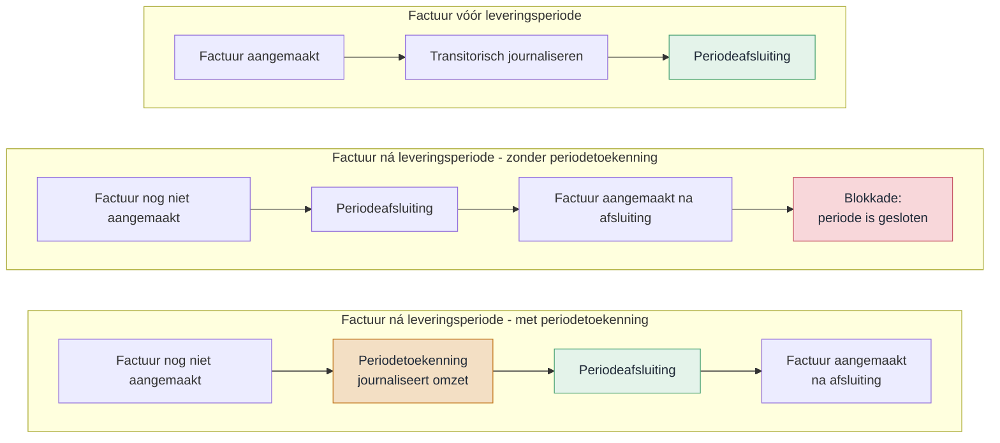

#### Huidige situatie

Vandaag kent een abonnement alleen de optie Vooraf factureren — de factuur ontstaat vóór de leveringsperiode:

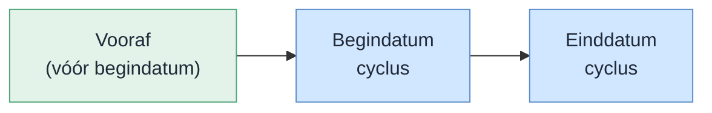

| Factuurmoment | Factuurdatum | Journalisering |
| --- | --- | --- |
| Vooraf | Vóór begindatum cyclus | Transitorisch journaliseren |

Klanten als Facilicom willen echter achteraf factureren. Die mogelijkheid ontbreekt nu.

#### Nieuwe situatie: vijf factuurmomenten op een tijdlijn

Een abonnement heeft een cyclus — de leveringsperiode. Het factuurmoment bepaalt wanneer de factuur ontstaat ten opzichte van die cyclus. Hieronder de vijf waarden op een tijdlijn, met als voorbeeld cyclus april 2026 en Aantal dagen = 10:

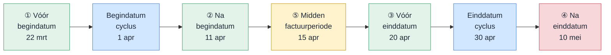

| Nr | Factuurmoment | Berekening | Factuurdatum | Journalisering |
| --- | --- | --- | --- | --- |
| ① | Aantal dagen vóór begindatumcyclus | 1 apr − 10 dagen | 22 mrt | Transitorisch journaliseren of periodetoekenning |
| ② | Aantal dagen ná begindatumcyclus | 1 apr + 10 dagen | 11 apr | Transitorisch journaliseren of periodetoekenning |
| ③ | Aantal dagen vóór einddatumcyclus | 30 apr − 10 dagen | 20 apr | Transitorisch journaliseren of periodetoekenning |
| ④ | Aantal dagen ná einddatumcyclus | 30 apr + 10 dagen | 10 mei | Transitorisch journaliseren of periodetoekenning |
| ⑤ | Midden van de factuurperiode | (1 apr + 30 apr) / 2 | 15 apr | Transitorisch journaliseren of periodetoekenning |

Periodetoekenning is beschikbaar bij elk factuurmoment. In de wizard bepaal je per periode welke abonnementsregels meedoen.

> **Samenloop met transitorisch journaliseren.** Bestaat er een periodetoekenningsregel voor een abonnementsregel in een periode? Dan slaat transitorisch journaliseren die regel over — periodetoekenning wint. Een verwijderde toekenningsregel (status Verwijderd) telt niet mee: het tijdvak gedraagt zich alsof er geen toekenningsregel is. Transitorisch journaliseren werkt dan gewoon zoals voorheen.

Dit probleem pakken we langs twee lijnen aan:
- **RPT00702** zorgt dat journalisering bij een geblokkeerde periode doorschuift naar de eerstvolgende vrije periode.
- **RPT00692** (dit ontwerp) voegt een tabblad toe waarmee je vóór de afsluiting omzet per abonnement kunt toekennen aan de juiste periode.

### 1.2 Vooronderzoek

- Klantgesprekken met Facilicom over hun periodeafsluitingsproces
- Analyse van de bestaande abonnementen- en facturatieflow in Profit
- Inventarisatie van de boekingslogica rond Te factureren abonnementen omzet en Omzet

### 1.3 Resultaat

Op het bestaande Periodeafsluitingsplan komt een nieuw tabblad **Periodetoekenningsregels abonnementen** (zichtbaar als Periodetoekenning toepassen aan staat, B44) met twee acties:
1. **Genereer periodetoekenningsregels** — opent een wizard (1 stap) waarin je via multi-select kiest welke abonnementsregels periodetoekenning krijgen. De geselecteerde regels worden direct aangemaakt én gejournaliseerd — er is geen aparte journaliseerstap.
2. **Verwijder toekenningsregels** — verwijdert geselecteerde toekenningsregels en draait de bijbehorende journaalposten automatisch terug. Het systeem valideert of de periode niet geblokkeerd is.

De wizard toont alleen abonnementsregels die over de gekozen periode lopen, waarvoor nog niet is gefactureerd en waarvoor nog geen toekenningsregel bestaat. Geparkeerde abonnementen doen ook mee — met het laatst bekende bedrag. De wizard bestaat uit 1 stap: bovenin staan boekjaar en periode, daaronder de toekenbare regels.

Bij de facturatieverwerking bepaalt het bestaan van een toekenningsregel de grootboekrekening: mét toekenningsregel boekt het systeem op de tussenrekening, zonder op de omzetrekening.

#### 1.4 Afbakening

**Tabblad en acties**

- Nieuw tabblad Periodetoekenningsregels abonnementen op het Periodeafsluitingsplan — centraal ingangspunt voor beide acties
- Genereer-actie: regels aanmaken én direct journaliseren in één stap
- Verwijderactie: geselecteerde toekenningsregels verwijderen met automatisch terugdraaien van de journaalpost; validatie op geblokkeerde periode
- Wizard met 1 stap en multi-select voor selectie van toekenbare regels per periode
- Geparkeerde abonnementen doen mee in de wizard met het laatst bekende bedrag

**Automatische verwerking**

- Automatisch terugdraaien bij beëindigen abonnementsregel (bij de facturatieverwerking)
- Automatisch terugdraaien bij verwijderen abonnementsregel (voorkomt ongedekt saldo)
- Verschilboeking bij bedragwijziging — alleen het delta-bedrag verwerken
- Creditfactuurafhandeling via standaard flow — negatief bedrag corrigeert automatisch

**Datamodel en instellingen**

- Activering via vinkje Periodetoekenning toepassen op Facturering/voorraad (tabblad Abonnementen) — alleen zichtbaar als module Abonnementen actief is. Staat het vinkje uit, dan is de volledige functionaliteit verborgen.
- Nieuwe tabel Toekenningsregels voor opslag van toekenningen en tegenboekingen
- Nieuw veld Factuurmoment op het abonnement (vijf waarden, standaard: Aantal dagen voor begindatumcyclus)
- Facturatielogica: bestaan van een toekenningsrecord bepaalt tussenrekening vs. omzetrekening
- Nieuw tabblad Periodetoekenningsregels op Eigenschappen abonnement — weergave met toekenningsregels per abonnement

### 1.5 Begrippen

| Term | Betekenis |
| --- | --- |
| Factuurmoment | Instelling op het abonnement die bepaalt wanneer de factuur wordt aangemaakt ten opzichte van de cyclus. Vijf waarden: Aantal dagen voor begindatumcyclus, Aantal dagen na begindatumcyclus, Aantal dagen voor einddatumcyclus, Aantal dagen na einddatumcyclus, Midden van de factuurperiode |
| Periodetoekenning | Omzet van abonnementen toerekenen aan de juiste perioden vóór de periodeafsluiting |
| Periodetoekenning toepassen | Vinkje op Facturering/voorraad (tabblad Abonnementen) dat de volledige periodetoekenningsfunctionaliteit activeert. Alleen zichtbaar als de module Abonnementen actief is. |
| Toekenningsregel | Record dat een abonnementsregel koppelt aan een boekjaar en periode. Wordt direct gejournaliseerd bij genereren. |
| Journaalpost omzettoekenning | Boeking: Te factureren abonnementen omzet → Omzet |
| Tegenboeking toekenning | Boeking: Omzet → Te factureren abonnementen omzet |
| Omzet | Grootboekrekening waarop de omzet definitief wordt geboekt |
| Te factureren abonnementen omzet | Balansrekening waarop omzet tijdelijk staat totdat toekenning plaatsvindt. Wordt ingesteld op Facturering/voorraad (tabblad Abonnementen, veldgroep Periodetoekenning). |
| Netto-saldo | Som van alle toekenningsregels per abonnementsregel (gejournaliseerd + tegengeboekt) |
| Geparkeerd abonnement | Abonnement dat tijdelijk niet gefactureerd wordt, bijvoorbeeld omdat een indexering nog niet vaststaat. Omzet over deze perioden kan via periodetoekenning worden toegerekend met het laatst bekende bedrag. |

### 1.6 Bijlagen

| Bijlage | Titel |
| --- | --- |
| [Bijlage A](#bijlage-a--samenvatting-voor-klant) | Samenvatting voor klant |
| [Bijlage B](#bijlage-b--huidige-werking) | Huidige werking |
| [Bijlage C](#bijlage-c--testscenarios) | Testscenario's |
| [Bijlage D](#bijlage-d--open-punten-en-beslissingen) | Open punten en beslissingen |
| [Bijlage E](#bijlage-e--documentatie) | Documentatie |
| [Bijlage F](#bijlage-f--work-items-developer) | Work items developer |

---

## 2. User stories

### 2.0 Overzicht

| Nr | User story | Toelichting |
| --- | --- | --- |
| US01 | Periodetoekenningsregels genereren | Nieuwe regels aanmaken en direct journaliseren via het Periodeafsluitingsplan. Wizard met 1 stap. Dit geldt ook voor creditfacturen: negatieve bedragen lopen mee zonder extra actie. |
| US02 | Toekenningen verwijderen | Toekenningsregels verwijderen met automatisch terugdraaien van journaalposten. Validatie op geblokkeerde periode. |
| US03 | Delta-bedrag bij wijziging abonnement | Alleen het verschilbedrag als extra toekenning verwerken |
| US04 | Automatisch terugdraaien bij beëindigen | Toekomstige toekenningen terugdraaien bij factuurmoment als einddatum is ingesteld |
| US05 | Verwijderen abonnementsregel met automatisch terugdraaien | Systeem draait openstaand saldo terug zonder gebruikersactie |
| US06 | Rapport: Saldoverklaring Te factureren abonnementen omzet | Nieuw rapport (wizard, 2 stappen). Verklaart het volledige saldo op de tussenrekening: facturatie, periodetoekenning, tegenboekingen en handmatige boekingen. Gegevensverzameling §4.2. |
| US07 | Instelling factuurmoment op abonnement | Nieuw veld Factuurmoment op abonnement met vijf waarden |
| US08 | Activering periodetoekenning en instelling grootboekrekening | Activering via vinkje Periodetoekenning toepassen op Facturering/voorraad. Centrale instelling grootboekrekening, facturatielogica en samenloop transitorisch journaliseren |
| US09 | Periodetoekenningsregels op Eigenschappen abonnement | Weergave met toekenningsregels per abonnement op een nieuw tabblad onder Facturen |

---

### 2.1 US01 – Periodetoekenningsregels genereren

**Als** financieel medewerker **wil ik** periodetoekenningsregels genereren via het Periodeafsluitingsplan, **zodat** omzet correct aan perioden wordt toegerekend en direct gejournaliseerd.

#### Mockups

*Tabblad Periodetoekenningsregels abonnementen op Periodeafsluiting — mockup: *`pages/rpt00692-abonnement-cyclus/detail.ts`

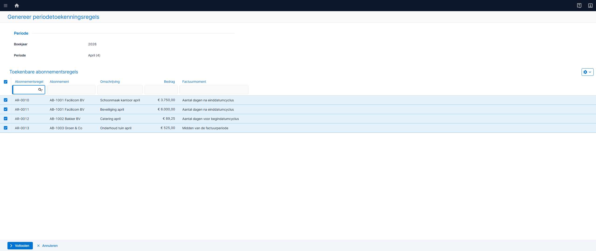

*Genereer-wizard (1 stap, multi-select) — mockup: *`pages/rpt00692-genereer-wizard/detail.ts`

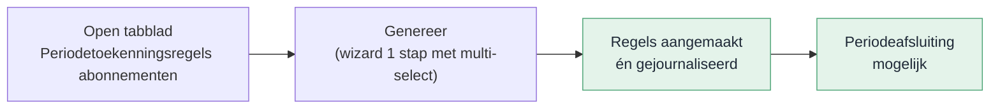

#### Functionele uitwerking

**Tabblad**

Op het Periodeafsluitingsplan komt een nieuw tabblad **Periodetoekenningsregels abonnementen**. Dit tabblad is alleen zichtbaar als Periodetoekenning toepassen aan staat op Facturering/voorraad (B44). Boekjaar en periode neemt het tabblad over van het hoofdscherm; het grid start leeg.

**Genereer**

Met de actie **Genereer periodetoekenningsregels** open je een wizard met 1 stap. Bovenin staan boekjaar en periode (alleen-lezen). Daaronder toont het systeem alle toekenbare abonnementsregels als multi-select. Je selecteert welke regels periodetoekenning krijgen en klikt op Voltooien. De geselecteerde regels worden aangemaakt én direct gejournaliseerd . De actie draait als batchverwerking in de wachtrij.

Een abonnementsregel komt in aanmerking als:
- de regel loopt over de gekozen periode of een eerdere periode
- er is nog niet gefactureerd voor die regel in die periode
- er bestaat nog geen toekenningsregel voor dat bedrag in die periode

Een abonnementsregel mag uit meerdere periodetoekenningsregels bestaan.

Genereren is herhaalbaar: een tweede keer uitvoeren voor dezelfde periode maakt geen dubbele regels. Bestaande regels worden herberekend op basis van de actuele abonnementsregel. Is het bedrag tussentijds gewijzigd? Dan past het systeem de toekenningsregel aan.

**Correcties ná het afsluiten van een periode**

Soms wijzigt een abonnementsregel na het sluiten van een periode. Het systeem past een gesloten periode niet aan. Genereer maakt dan een correctieregel in de huidige open periode.

Voor de correctieregel geldt:

- Het boekjaar en de periode blijven die van de gesloten periode.
- De journaalpost komt in de huidige open periode.
- De wizard toont de correctie in de multi-select. Je ziet het label van de oorspronkelijke periode. Zo weet je wat je boekt.

Je kunt Genereer niet starten op een gesloten periode. Correcties lopen altijd via de eerste open periode.

**Journalisering**

De journaalposten (Te factureren abonnementen omzet → Omzet) worden direct geboekt bij het genereren. Na voltooien is de status Gejournaliseerd. De omzetrekening volgt de artikelgroep van de abonnementsregel.

Voor correctieregels over een reeds gesloten periode geldt: de toekenningsregel houdt boekjaar en periode van de oorspronkelijke periode (het factuurtijdvak), en de journaalpost wordt geboekt in de huidige open periode waarin Genereer draait.

**Verwijderen**

Met de actie **Verwijder toekenningsregels** verwijder je geselecteerde regels via multi-select. Bij het verwijderen valideert het systeem of de periode geblokkeerd is. Is de periode geblokkeerd, dan verschijnt de foutmelding: "Periode geblokkeerd. Dit is niet toegestaan." De bijbehorende journaalpost wordt automatisch teruggedraaid via een tegenboeking.

Ook valideert het systeem of er al een factuur voor de abonnementsregel in deze periode bestaat. Is dat zo, dan kan de toekenningsregel niet worden verwijderd. Zie US02 voor alle validaties en meldingen.

**Berekening en verdeling**

Het bedrag per toekenningsregel volgt dezelfde verdelingslogica als transitorisch journaliseren. De verdelingsmethode op het abonnement bepaalt de verdeling over perioden. Afrondingsverschillen komen in de laatste periode; is die gesloten, dan schuift de compensatie door naar de eerstvolgende vrije periode.

**Creditfacturen**

Creditfacturen lopen gewoon mee. Een creditfactuurregel heeft een negatief bedrag, dus Genereer maakt een toekenningsregel met dat negatieve bedrag. De journalisering corrigeert automatisch het saldo op Te factureren abonnementen omzet — geen aparte actie nodig.

**Foutafhandeling**

Genereer werkt alles-of-niets. Gaat er iets mis halverwege? Dan draait het systeem alle wijzigingen terug. Er blijven geen halve resultaten achter.

#### Acceptatiecriteria

**Tabblad** — Het tabblad is altijd zichtbaar. Boekjaar en periode komen van het hoofdscherm.

**Genereer**

1. Na Genereer staan de geselecteerde abonnementsregels in het grid met status Gejournaliseerd en zijn de journaalposten geboekt.
2. Een tweede Genereer voor dezelfde periode maakt geen dubbele regels.
3. Genereer is alleen beschikbaar als de periode nog open is; op een gesloten periode is de actie verborgen.
4. Geparkeerde abonnementen verschijnen met het laatst bekende bedrag.
5. Bij een herhaalde Genereer worden nieuwe toekenningsregels aangemaakt.
6. Wijzigingen op een abonnementsregel over een reeds gesloten periode leiden bij de volgende Genereer (in een open periode) tot een aparte correctie-toekenningsregel met de oorspronkelijke periode als factuurtijdvak; de journaalpost wordt geboekt in de huidige open periode.

**Verwijderen**

1. Alleen regels met status Gejournaliseerd kunnen worden verwijderd.
2. Bij een geblokkeerde periode verschijnt de foutmelding: "Periode geblokkeerd. Dit is niet toegestaan."
3. Na verwijderen heeft de regel status Verwijderd en is de bijbehorende journaalpost teruggedraaid via een tegenboeking.
4. Een verwijderde toekenningsregel telt niet mee: het tijdvak gedraagt zich alsof er geen toekenningsregel is.

**Creditfacturen** — Een creditfactuurregel leidt tot een toekenningsregel met negatief bedrag. Na genereren is het saldo op Te factureren abonnementen omzet gecorrigeerd.

**Foutafhandeling** — Bij een fout worden boeking en statuswijziging teruggedraaid (alles-of-niets).

#### Scherm en gedrag
Het tabblad Periodetoekenningsregels abonnementen zit op het Periodeafsluitingsplan, boven Dossier. Het toont een weergave met twee acties.
Het grid toont alle toekenningsregels waarvan de journaalpost is geboekt in de huidige (tabblad-)periode, óf waarvan het factuurtijdvak in de huidige periode valt. Zo zie je zowel de regels die in deze periode zijn gejournaliseerd als de regels die over deze periode gaan (inclusief retroactieve correcties uit voorgaande perioden die hier zijn gejournaliseerd, en regels over deze periode die in een latere open periode zijn gejournaliseerd).

| Veld | Gedrag |
| --- | --- |
| Jaar | Overgenomen van hoofdscherm, alleen-lezen |
| Periode | Overgenomen van hoofdscherm, alleen-lezen |
| Jaar (factuur) | Alleen-lezen, afgeleid van de toekenningsregel. Periode van het factuurtijdvak waarover de toekenningsregel gaat. |
| Periode (factuur) | Alleen-lezen, afgeleid van de toekenningsregel. |
| Jaar (journaalpost) | Alleen-lezen, afgeleid van de toekenningsregel. Periode waarin de journaalpost is geboekt. |
| Periode (journaalpost) | Alleen-lezen, afgeleid van de toekenningsregel. |
| Grid | Rijen aanvinkbaar. Tegenboekingsregels zijn grijs en niet aanvinkbaar |
| Genereer | Alleen actief als de periode nog niet is afgesloten |
| Verwijder | Alleen actief als minimaal één regel met status Gejournaliseerd is geselecteerd |

#### Meldingstekst

| Situatie | Melding |
| --- | --- |
| Geen toekenbare regels | Geen toekenbare factuurregels gevonden voor deze periode. |
| Periode geblokkeerd bij verwijderen | Periode geblokkeerd. Dit is niet toegestaan. |
| Factuur gegenereerd bij verwijderen | Er is al een factuur gegenereerd voor deze abonnementsregel in deze periode. Verwijderen is niet toegestaan. |

#### Autorisatie

Toegang tot het tabblad volgt het bestaande recht op het Periodeafsluitingsplan. De acties Genereer en Verwijder zijn apart autoriseerbaar:

| Actie | Rechtenobject | Standaard |
| --- | --- | --- |
| Genereer periodetoekenningsregels | Periodetoekenning genereren | Aan |
| Verwijder toekenningsregels | Periodetoekenning verwijderen | Aan |

Heeft een gebruiker geen recht op een actie? Dan is de actieknop niet zichtbaar.

#### Podium-specificatie

**Schermtype:** Tabblad op Periodeafsluiting (embedded ListPage)

**Veldtabel ListPage**

| Kolom-id | Kolomkop | Podium-type | Sorteerbaar | Filter | Breedte | Mock-waarde |
| --- | --- | --- | --- | --- | --- | --- |
| abonnementsregel | Abonnementsregel | text | ja | ja | 150 | AR-0001 |
| jaarFactuur | Jaar (factuur) | text | ja | ja | 80 | 2026 |
| periodeFactuur | Periode (factuur) | number | ja | ja | 100 | 3 |
| jaarJournaal | Jaar (journaalpost) | text | ja | ja | 80 | 2026 |
| periodeJournaal | Periode (journaalpost) | number | ja | ja | 100 | 4 |
| abonnement | Abonnement | text | ja | ja | 150 | AB-1001 Facilicom BV |
| omschrijving | Omschrijving | text | ja | nee | 250 | Schoonmaak kantoor maart (correctie) |
| bedrag | Bedrag | currencyAmount | ja | nee | 120 | 1.250,00 |
| aangemaakt | Aangemaakt op | date | ja | nee | 130 | 15-04-2026 |
| aanmakerNaam | Aangemaakt door | text | ja | nee | 130 | P. de Vries |

**ListPage-eigenschappen**

| Eigenschap | Waarde |
| --- | --- |
| Quick filter | ja |
| Exportknop | nee |
| Rijselectie | meervoud |
| Inline bewerken | nee |
| Bulkacties | Verwijder toekenningsregels |

**Acties-blok**

| Actie-id | Label | Type | Positie | Zichtbaar als | Bevestigingsdialoog | Autoriseerbaar |
| --- | --- | --- | --- | --- | --- | --- |
| genereer | Genereer periodetoekenningsregels | toolbar | links | altijd (geen selectie vereist) | nee | ja (Periodetoekenning genereren) |
| verwijder | Verwijder toekenningsregels | toolbar (multiselect) | links | alleen bij rijselectie (minimaal 1 rij) | ja: "Weet je zeker dat je de geselecteerde toekenningen wilt verwijderen? De bijbehorende journaalposten worden teruggedraaid." | ja (Periodetoekenning verwijderen) |

**Meldingen-blok**

| Type | Veldlabel / scope | Conditie | Tekst |
| --- | --- | --- | --- |
| informatiebanner | scherm | geen toekenbare regels na Genereer | Geen toekenbare factuurregels gevonden voor deze periode. |
| foutmelding | scherm | periode geblokkeerd bij verwijderen | Periode geblokkeerd. Dit is niet toegestaan. |
| foutmelding | scherm | factuur gegenereerd bij verwijderen | Er is al een factuur gegenereerd voor deze abonnementsregel in deze periode. Verwijderen is niet toegestaan. |

#### Podium-specificatie — Wizard: Genereer periodetoekenningsregels

**Schermtype:** WizardPage (1 stap)

**Stap 1 — Selectie toekenbare regels (multi-select)**

Bovenin staan boekjaar en periode (alleen-lezen). Daaronder de toekenbare abonnementsregels.

| Veld | Podium-type | Readonly | Positie |
| --- | --- | --- | --- |
| Boekjaar | number | ja | boven grid |
| Periode | text | ja | boven grid |

| Kolom-id | Kolomkop | Podium-type | Sorteerbaar | Mock-waarde |
| --- | --- | --- | --- | --- |
| abonnementsregel | Abonnementsregel | text | ja | AR-0010 |
| abonnement | Abonnement | text | ja | AB-1001 Facilicom BV |
| omschrijving | Omschrijving | text | ja | Schoonmaak kantoor april |
| bedrag | Bedrag | currencyAmount | ja | 3.750,00 |
| factuurmoment | Factuurmoment | text | ja | Aantal dagen na einddatumcyclus |
| status | Geparkeerd | yesNo | ja | Nee |

**Wizardflow:**
1. Je klikt Genereer op het tabblad. De wizard opent.
2. Je ziet direct de toekenbare regels. Bovenin staan boekjaar en periode (alleen-lezen). Begindatum en einddatum periode worden niet getoond.
3. Je selecteert via multi-select welke regels periodetoekenning krijgen.
4. Je klikt Voltooien. Het systeem plaatst een batchtaak in de wachtrij.
5. De wizard sluit. Het grid ververst zodra de taak klaar is — tijdens verwerking zie je een voortgangsindicatie.
6. De geselecteerde regels worden direct aangemaakt én gejournaliseerd. Er is geen tussenstatus Te journaliseren.

---

### 2.2 US02 – Toekenningen verwijderen

**Als** financieel medewerker **wil ik** toekenningsregels kunnen verwijderen bij foutieve toekenning of beëindiging, **zodat** omzet niet ten onrechte op Omzet blijft staan.

#### Mockups

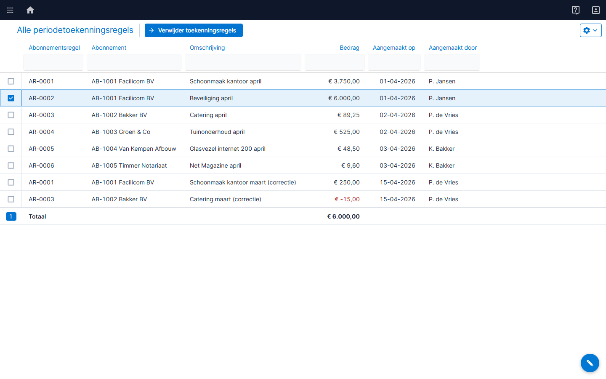

*Menu-item Alle periodetoekenningsregels (standalone weergave) — mockup: *`pages/rpt00692-toekenningsregels/index.ts`

#### Functionele uitwerking

Met **Verwijder toekenningsregels** verwijder je gejournaliseerde toekenningen via multi-select. Het systeem zet per geselecteerde regel de status op Verwijderd en boekt de tegenjournaalpost: Omzet → Te factureren abonnementen omzet. Het record blijft bewaard voor audit trail.

Een verwijderde toekenningsregel telt niet mee voor de samenloop met transitorisch journaliseren. Het tijdvak gedraagt zich alsof er geen toekenningsregel is.

Bij het verwijderen valideert het systeem of de periode geblokkeerd is. Is de periode geblokkeerd, dan verschijnt de foutmelding: "Periode geblokkeerd. Dit is niet toegestaan." De actie wordt niet uitgevoerd.

Daarnaast valideert het systeem of er al een factuur is gegenereerd voor deze abonnementsregel in deze periode en dit tijdvak. Is dat het geval, dan verschijnt de foutmelding: "Er is al een factuur gegenereerd voor deze abonnementsregel in deze periode. Verwijderen is niet toegestaan." De toekenningsregel kan dan niet worden verwijderd.

Alleen regels met status Gejournaliseerd kunnen worden verwijderd. De actie draait als batchverwerking.

#### Acceptatiecriteria

1. Verwijderen zet de status op Verwijderd en boekt een tegenjournaalpost. Het record wordt niet fysiek verwijderd.
2. Een verwijderde toekenningsregel telt niet mee: het tijdvak gedraagt zich alsof er geen toekenningsregel is.
3. Tegenjournaalposten zijn geboekt via de journalisatieprocedure.
4. Na verwijderen toont Te factureren abonnementen omzet het teruggedraaide bedrag als openstaand saldo.
5. Bij een geblokkeerde periode verschijnt de foutmelding: "Periode geblokkeerd. Dit is niet toegestaan."
6. Bij een gegenereerde factuur voor deze abonnementsregel in deze periode verschijnt de foutmelding: "Er is al een factuur gegenereerd voor deze abonnementsregel in deze periode. Verwijderen is niet toegestaan."

#### Meldingstekst

| Situatie | Melding |
| --- | --- |
| Geen regels geselecteerd | Selecteer minimaal één gejournaliseerde toekenningsregel. |
| Periode geblokkeerd | Periode geblokkeerd. Dit is niet toegestaan. |
| Factuur gegenereerd | Er is al een factuur gegenereerd voor deze abonnementsregel in deze periode. Verwijderen is niet toegestaan. |

#### Tooltiptekst

| Onderdeel | Tekst |
| --- | --- |
| Verwijder toekenningsregels | Verwijder geselecteerde regels en draai de journaalpost terug. |

#### Autorisatie

De actie Verwijder is apart autoriseerbaar via het rechtenobject Periodetoekenning verwijderen (zie US01). Heeft een gebruiker geen recht? Dan is de actieknop niet zichtbaar.

#### Scherm en gedrag

Verwijderen is beschikbaar op het tabblad Periodetoekenningsregels (US01) en op het standalone menu-item Alle periodetoekenningsregels.

#### Menu-items

Er komt een nieuw submenu **Periodetoekenning** onder Abonnementen &rarr; Facturering. Binnen dit submenu komen twee menu-items: de weergave met alle toekenningsregels en de saldoverklaring.

**Submenu**

| Eigenschap | Waarde |
| --- | --- |
| Menupad | Abonnementen &rarr; Facturering &rarr; Periodetoekenning |
| Positie | Tussen Facturen en Journaliseren |
| Sneltoets | P (1e letter; niet in gebruik binnen Facturering — bestaande items: Facturen (F), Journaliseren (J)) |
| Conditie | Altijd zichtbaar |

**Menu-item 1: Alle periodetoekenningsregels**

| Eigenschap | Waarde |
| --- | --- |
| Menupad | Abonnementen &rarr; Facturering &rarr; Periodetoekenning &rarr; Alle periodetoekenningsregels |
| Sneltoets | A (1e letter; niet in gebruik binnen submenu Periodetoekenning) |
| Conditie | Zichtbaar als submenu zichtbaar is |
| Autorisatie | Bestaand recht op Periodeafsluitingsplan. Actie Verwijder apart autoriseerbaar (Periodetoekenning verwijderen). |
| Filter | Geen (alle regels) |
| Acties | Verwijder toekenningsregels |

**Menu-item 2: Saldoverklaring Te factureren abonnementen omzet**

| Eigenschap | Waarde |
| --- | --- |
| Menupad | Abonnementen &rarr; Facturering &rarr; Periodetoekenning &rarr; Saldoverklaring Te factureren abonnementen omzet |
| Sneltoets | S (1e letter; niet in gebruik binnen submenu Periodetoekenning — bestaand: Alle (A)) |
| Conditie | Zichtbaar als submenu zichtbaar is |
| Autorisatie | Bestaand recht op Periodeafsluitingsplan. Geen apart autorisatierecht. Geen rolconversie nodig. |

> **Opmerking:** De saldoverklaring heeft geen autoriseerbare acties. Toegang volgt het recht op Periodeafsluitingsplan.

#### Podium-specificatie

**Schermtype:** ListPage (menu-item Alle periodetoekenningsregels onder submenu Periodetoekenning)

**Veldtabel ListPage**

| Kolom-id | Kolomkop | Podium-type | Sorteerbaar | Filter | Breedte | Status | Mock-waarde |
| --- | --- | --- | --- | --- | --- | --- | --- |
| abonnementsregel | Abonnementsregel | text | ja | ja | 150 | nieuw | AR-0001 |
| abonnement | Abonnement | text | ja | ja | 150 | nieuw | AB-1001 Facilicom BV |
| omschrijving | Omschrijving | text | ja | nee | 250 | nieuw | Schoonmaak kantoor Q1 |
| bedrag | Bedrag | currencyAmount | ja | nee | 120 | nieuw | 3.750,00 |
| aangemaakt | Aangemaakt op | date | ja | nee | 130 | nieuw | 01-04-2026 |
| aanmakerNaam | Aangemaakt door | text | ja | nee | 130 | nieuw | P. Jansen |

**ListPage-eigenschappen**

| Eigenschap | Waarde |
| --- | --- |
| Quick filter | ja |
| Exportknop | nee |
| Rijselectie | meervoud |
| Inline bewerken | nee |
| Bulkacties | Verwijder toekenningsregels |

**Acties-blok**

| Actie-id | Label | Type | Positie | Zichtbaar als | Bevestigingsdialoog | Autoriseerbaar |
| --- | --- | --- | --- | --- | --- | --- |
| verwijder | Verwijder toekenningsregels | toolbar (multiselect) | links | alleen bij rijselectie (minimaal 1 rij) | ja: "Weet je zeker dat je de geselecteerde toekenningen wilt verwijderen? De bijbehorende journaalposten worden teruggedraaid." | ja (Periodetoekenning verwijderen) |

> **Opmerking:** De actie Genereer is niet beschikbaar op dit scherm. Genereren kan alleen vanuit het Periodeafsluitingsplan (US01).

---

### 2.3 US03 – Delta-bedrag bij wijziging abonnement

**Als** financieel medewerker **wil ik** bij verhoging van een abonnementsregel na toekenning alleen het delta-bedrag automatisch als extra toekenning verwerken, **zodat** eerder gejournaliseerde bedragen intact blijven en de netto-toekenning klopt.

#### Functionele uitwerking

> **Onderscheid met herberekening:** wijzigt het bedrag terwijl de regel nog niet gejournaliseerd is (verwerking loopt nog)? Dan past een herhaalde Genereer het bedrag direct aan. US03 geldt alleen als er al een Gejournaliseerde regel bestaat.

Bij de volgende Genereer vergelijkt het systeem per abonnementsregel het verwachte bedrag met het netto-saldo van alle toekenningsregels. Is er een verschil, dan maakt het altijd een **nieuwe** delta-toekenningsregel aan en journaliseert die direct — de bestaande gejournaliseerde regel wordt nooit gewijzigd. Positief bij verhoging, negatief bij verlaging.

**Voorbeeld**: oorspronkelijke toekenning 250,00 (Gejournaliseerd). Het abonnementsbedrag stijgt naar 300,00. Genereer maakt een nieuwe delta-regel van +50,00 aan en journaliseert die direct. De netto-toekenning klopt meteen: 300,00.

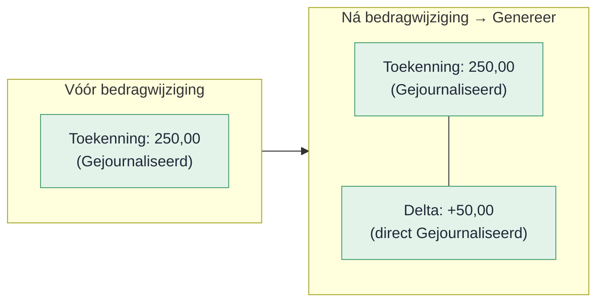

#### Acceptatiecriteria

1. Genereer detecteert het verschil bij een bedragwijziging na eerdere toekenning.
2. Er ontstaat een nieuwe delta-toekenningsregel met het verschilbedrag, direct gejournaliseerd.
3. De netto-toekenning is direct gelijk aan het actuele factuurbedrag — geen extra Journaliseer-actie nodig.
4. Eerder gejournaliseerde regels blijven ongewijzigd.

#### Autorisatie

Geen apart recht vereist — toegang volgt het Periodeafsluitingsplan.

---

### 2.4 US04 – Automatisch terugdraaien bij beëindigen

**Als** financieel medewerker **wil ik** dat bij de facturatieverwerking toekomstige gejournaliseerde toekenningsregels automatisch worden teruggedraaid als de abonnementsregel is beëindigd, **zodat** omzet na de einddatum niet ten onrechte op Omzet blijft staan.

#### Functionele uitwerking

Bij de facturatieverwerking (het factuurmoment) controleert het systeem of een abonnementsregel een einddatum heeft. Zo ja, dan detecteert het gejournaliseerde toekenningsregels voor toekomstige perioden (ná de beëindigingsdatum). Per gevonden record maakt het een tegenboeking aan — zonder dat je iets hoeft te doen.

Is de toekomstige periode al gesloten? Dan boekt het systeem de tegenjournaalpost in de eerstvolgende vrije periode. Dit mechanisme is altijd actief.

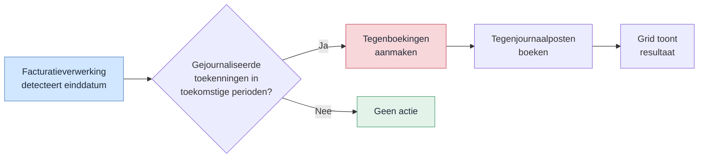

#### Voorbeeld A – Creditering vanaf 1 januari (hele periode)

Abonnementsregel: 100 per maand. Toekenning januari is Gejournaliseerd. Het abonnement wordt gecrediteerd vanaf 1 januari.

**Stap 1 — US04 draait januari terug (toekomstige periode):**
Het systeem verwijdert de toekenningsregel voor januari en boekt een tegenjournaalpost.

| Actie | Bedrag | Journaalpost |
| --- | --- | --- |
| Origineel januari verwijderd | 100 | Debet Omzet / Credit Te factureren omzet |

Netto-saldo toekenningsregels januari: **0** (geen toekenningsregel meer)

**Stap 2 — Profit maakt creditfactuurregel -100:**
De creditfactuurregel van -100 corrigeert het saldo op Te factureren abonnementen omzet via de standaard facturatieflow. Het netto-saldo van de toekenningsregels is al 0. De Genereer-actie slaat deze factuurregel over omdat het netto-saldo al overeenkomt met het actuele factuurbedrag (0).

**Eindsaldo januari:**

| Rekening | Saldo |
| --- | --- |
| Te factureren abonnementen omzet | 0 |
| Omzet | 0 |

> **Let op:** zonder deze uitsluiting bij Genereer zou een toekenningsregel van -100 worden aangemaakt. Het netto-saldo wordt dan -100. Dat is een dubbele correctie.

---

#### Voorbeeld B – Creditering vanaf 15 januari (halve periode)

Abonnementsregel: 100 per maand. Toekenning januari is Gejournaliseerd. Het abonnement wordt beëindigd per 15 januari.

**Stap 1 — US04 controleert toekomstige perioden:**
Januari is de einddatumperiode, geen toekomstige periode. US04 draait januari niet terug. Februari en verder worden wél teruggedraaid (als daar gejournaliseerde toekenningsregels bestaan).

| Toekenningsregel | Bedrag | Status | Journaalpost |
| --- | --- | --- | --- |
| Origineel januari | 100 | Gejournaliseerd | (ongewijzigd) |

**Stap 2 — Profit maakt creditfactuurregel -50 (halve maand):**
Bij de volgende Genereer vergelijkt het systeem het actuele factuurbedrag (100 - 50 = 50) met het netto-saldo van de toekenningsregels (100). Delta = -50.

| Toekenningsregel | Bedrag | Status | Journaalpost |
| --- | --- | --- | --- |
| Origineel januari | 100 | Gejournaliseerd | (ongewijzigd) |
| Delta januari | -50 | Te journaliseren | — |

Na Journaliseer:

| Toekenningsregel | Bedrag | Status | Journaalpost |
| --- | --- | --- | --- |
| Origineel januari | 100 | Gejournaliseerd | Debet Te factureren omzet / Credit Omzet |
| Delta januari | -50 | Gejournaliseerd | Debet Omzet / Credit Te factureren omzet |

**Eindsaldo januari:**

| Rekening | Saldo |
| --- | --- |
| Te factureren abonnementen omzet | -50 (gecorrigeerd door creditfactuur via standaard flow) |
| Omzet | 50 (netto-toekenning: 100 - 50) |

De netto-toekenning van 50 komt overeen met de geleverde halve maand.

---

#### Acceptatiecriteria

1. Toekomstige gejournaliseerde toekenningsregels worden automatisch verwijderd bij de facturatieverwerking als de abonnementsregel is beëindigd.
2. Tegenjournaalposten ontstaan zonder gebruikersactie, als onderdeel van de facturatieverwerking.
3. Bij een gesloten toekomstige periode boekt het systeem in de eerstvolgende vrije periode.
4. Creditering hele periode (einddatum vóór of op eerste dag): Genereer maakt géén extra regel als er geen toekenningsregel meer bestaat.
5. Creditering halve periode: Genereer maakt een delta-regel voor het verschilbedrag.

#### Meldingstekst

| Situatie | Melding |
| --- | --- |
| Geen open periode voor tegenboeking | Automatische tegenboeking is niet mogelijk. Er is geen open periode beschikbaar. Draai de toekenning handmatig terug via het tabblad. |

#### Autorisatie

Systeemactie — geen apart recht vereist.

---

### 2.5 US05 – Verwijderen abonnementsregel met automatisch terugdraaien

**Als** financieel medewerker **wil ik** een abonnementsregel kunnen verwijderen zonder handmatige tussenstappen, waarbij het systeem openstaande toekenningsregels automatisch terugdraait, **zodat** er geen ongedekt saldo ontstaat op Te factureren abonnementen omzet.

#### Functionele uitwerking

Bij verwijdering controleert het systeem of er toekenningsregels bestaan. Zo ja: het verwijdert de toekenningsregels en boekt de tegenjournaalposten. Is er geen open periode beschikbaar voor de tegenjournaalpost, dan blokkeert de verwijdering.

Factuurregels blijven behouden (geen cascade-delete) — de koppeling wordt genulled.

**Volgorde:**
1. Controleer of het netto-saldo ongelijk is aan nul
2. Draai gejournaliseerde toekenningsregels terug en boek tegenjournaalposten
3. Verwijder de abonnementsregel — factuurregels en toekenningsregels blijven behouden

#### Acceptatiecriteria

1. Het systeem verwijdert toekenningsregels automatisch en boekt tegenjournaalposten.
2. Factuurregels en journaalposten blijven behouden.
3. Verwijdering zonder toekenningsregels is direct toegestaan.
4. Verwijdering is geblokkeerd als er geen open periode beschikbaar is voor de tegenjournaalpost.

#### Autorisatie

Systeemactie — geen apart recht vereist.

---

### 2.6 US06 – Rapport: Saldoverklaring Te factureren abonnementen omzet

**Als** controller **wil ik** het saldo op de tussenrekening Te factureren abonnementen omzet kunnen verklaren, **zodat** ik weet hoe het saldo is opgebouwd uit facturatie, periodetoekenning, tegenboekingen en handmatige boekingen.

#### Mockups

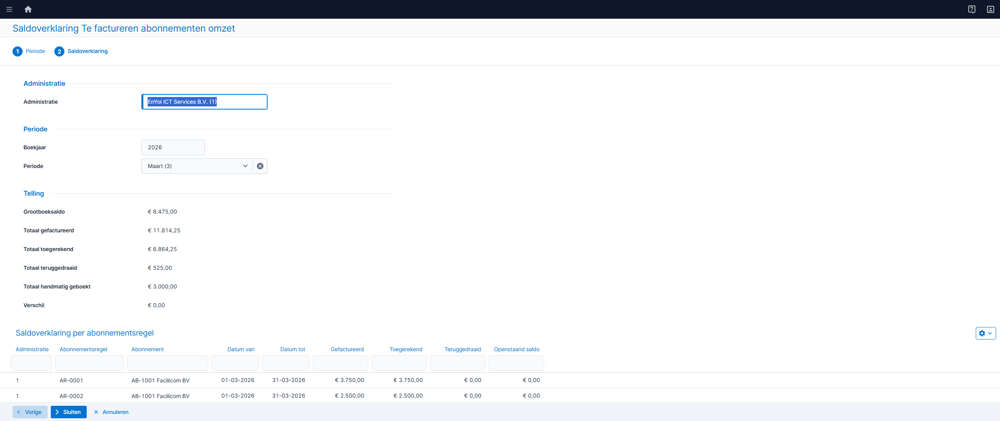

*Rapport Saldoverklaring Te factureren abonnementen omzet — mockup: *`pages/rpt00692-saldoverklaring/detail.ts`

#### Functionele uitwerking

De tussenrekening Te factureren abonnementen omzet heeft altijd een saldo. Dat saldo ontstaat doordat:

- **Facturatie** bedragen op de tussenrekening boekt (debet).
- **Periodetoekenning** bedragen van de tussenrekening afboekt naar Omzet (credit).
- **Tegenboekingen** bedragen terugboeken bij verwijdering of beëindiging (debet).
- **Handmatige boekingen** via memoriaalposten het saldo corrigeren (debet of credit).

Het saldo is dus niet per definitie nul. Dit rapport verklaart het volledige saldo.

Dit is een nieuw rapport: **Saldoverklaring Te factureren abonnementen omzet**. Het opent als wizard met twee stappen:

1. **Stap 1 — Periode kiezen**: je selecteert boekjaar en periode.
2. **Stap 2 — Saldoverklaring**: het rapport toont bovenin een telling met het grootboeksaldo, de som van alle deelcomponenten en het verschil. Daaronder een lijst per abonnementsregel met gefactureerd, toegerekend, teruggedraaid en openstaand saldo. Onderaan staat een aparte rij voor handmatige boekingen.

De gegevens komen uit de gegevensverzameling Saldoverklaring Te factureren abonnementen omzet (§4.2).

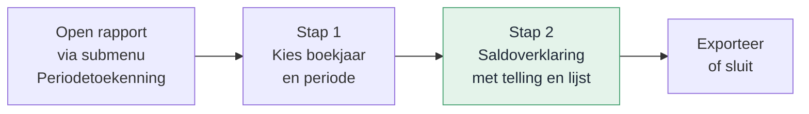

**Opbouw saldo**

Het saldo op de tussenrekening is als volgt opgebouwd:

| Component | Richting | Toelichting |
| --- | --- | --- |
| Gefactureerd | Debet (+) | Facturatieverwerking boekt omzet op de tussenrekening |
| Toegerekend | Credit (−) | Periodetoekenning boekt omzet van de tussenrekening naar Omzet |
| Teruggedraaid | Debet (+) | Verwijdering of beëindiging boekt terug van Omzet naar de tussenrekening |
| Handmatig geboekt | Debet/Credit | Memoriaalposten of overige boekingen op de tussenrekening |

**Formule:** Saldo = Gefactureerd − Toegerekend + Teruggedraaid + Handmatig geboekt

**Handmatige boekingen**

Het rapport haalt alle journaalposten op de tussenrekening op die niet afkomstig zijn van de facturatieverwerking of de periodetoekenning. Die boekingen zijn niet te koppelen aan een abonnementsregel. Het rapport toont ze als apart totaal in de telling en als aparte rij onderaan de lijst (omschrijving: "Handmatige boekingen").

#### Acceptatiecriteria

1. Het rapport verklaart het volledige saldo op de tussenrekening.
2. De som van alle componenten (gefactureerd − toegerekend + teruggedraaid + handmatig) is gelijk aan het grootboeksaldo.
3. Het rapport toont per abonnementsregel: gefactureerd, toegerekend, teruggedraaid en openstaand saldo.
4. Handmatige boekingen op de tussenrekening verschijnen als apart totaal in de telling en als aparte rij in de lijst.
5. Stap 1 toont boekjaar en periode als verplichte velden. Stap 2 toont pas na invullen van stap 1.
6. De telling bovenin stap 2 toont: grootboeksaldo, totaal gefactureerd, totaal toegerekend, totaal teruggedraaid, totaal handmatig geboekt en het verschil.

#### Scherm en gedrag

Het rapport valt als menu-item onder het submenu Periodetoekenning. Het opent als wizard met twee stappen.

| Veld | Gedrag |
| --- | --- |
| Administratie | Verplicht, standaard de huidige administratie |
| Boekjaar | Verplicht, standaard het huidige boekjaar |
| Periode | Verplicht, standaard de huidige periode |
| Grootboeksaldo | Alleen-lezen, opgehaald uit het grootboek voor de tussenrekening t/m de gekozen periode |
| Totaal gefactureerd | Alleen-lezen, som van kolom Gefactureerd in de lijst |
| Totaal toegerekend | Alleen-lezen, som van kolom Toegerekend in de lijst |
| Totaal teruggedraaid | Alleen-lezen, som van kolom Teruggedraaid in de lijst |
| Totaal handmatig geboekt | Alleen-lezen, som van journaalposten op de tussenrekening die niet uit facturatie of periodetoekenning komen |
| Verschil | Alleen-lezen, berekend: Grootboeksaldo − (Gefactureerd − Toegerekend + Teruggedraaid + Handmatig). Moet nul zijn. |
| Lijst | Alleen-lezen, gesorteerd op administratie en abonnementsregel |

#### Menu-item

Zie menu-item 2 (Saldoverklaring Te factureren abonnementen omzet) in US02.

#### Podium-specificatie

**Schermtype:** WizardPage (rapport Saldoverklaring — submenu Periodetoekenning)

**Stap 1 — Periode kiezen**

| Veld | Podium-type | Verplicht | Standaardwaarde |
| --- | --- | --- | --- |
| Administratie | text (zoekvenster administratie) | ja | Huidige administratie |
| Boekjaar | number | ja | Huidig boekjaar |
| Periode | enumeration | ja | Huidige periode |

**Stap 2 — Saldoverklaring**

**Veldgroep Periode** (alleen-lezen, overgenomen uit stap 1)

| Veld | Podium-type | Readonly |
| --- | --- | --- |
| Administratie | text | ja |
| Boekjaar | number | ja |
| Periode | enumeration | ja |

**Veldgroep Telling**

| Veld | Podium-type | Readonly | Toelichting |
| --- | --- | --- | --- |
| Grootboeksaldo | currencyAmount | ja | Saldo op de tussenrekening t/m de gekozen periode |
| Totaal gefactureerd | currencyAmount | ja | Som van kolom Gefactureerd |
| Totaal toegerekend | currencyAmount | ja | Som van kolom Toegerekend |
| Totaal teruggedraaid | currencyAmount | ja | Som van kolom Teruggedraaid |
| Totaal handmatig geboekt | currencyAmount | ja | Som van overige journaalposten op de tussenrekening |
| Verschil | currencyAmount | ja | Grootboeksaldo − (Gefactureerd − Toegerekend + Teruggedraaid + Handmatig). Moet nul zijn. |

**Lijst: Saldoverklaring per abonnementsregel**

| Kolom-id | Kolomkop | Podium-type | Sorteerbaar | Breedte | Mock-waarde |
| --- | --- | --- | --- | --- | --- |
| administratie | Administratie | text | ja | 150 | 1 |
| abonnementsregel | Abonnementsregel | text | ja | 150 | AR-0001 |
| abonnement | Abonnement | text | ja | 200 | AB-1001 Facilicom BV |
| datumVan | Datum van | date | ja | 130 | 01-03-2026 |
| datumTot | Datum tot | date | ja | 130 | 31-03-2026 |
| gefactureerd | Gefactureerd | currencyAmount | ja | 130 | 3.750,00 |
| toegerekend | Toegerekend | currencyAmount | ja | 130 | 3.750,00 |
| teruggedraaid | Teruggedraaid | currencyAmount | ja | 130 | 0,00 |
| openstaand | Openstaand saldo | currencyAmount | ja | 150 | 0,00 |

De laatste rij in de lijst is een samenvattingsregel voor handmatige boekingen. Die rij heeft geen abonnementsregel of abonnement. De kolom Abonnementsregel toont "Handmatige boekingen" en de kolom Openstaand saldo toont het nettobedrag van de handmatige boekingen.

**Wizard-eigenschappen**

| Eigenschap | Waarde |
| --- | --- |
| Voltooien-knop | Sluiten |
| Acties | geen |
| Rijselectie | geen |
| Exportknop | ja |

---

### 2.7 US07 – Instelling factuurmoment op abonnement

**Als** financieel medewerker **wil ik** per abonnement het factuurmoment instellen, **zodat** het systeem weet wanneer de factuur wordt aangemaakt ten opzichte van de cyclus.

#### Mockups

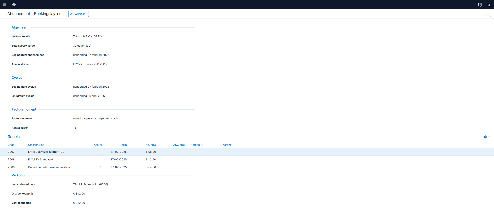

*Boekingslay-out abonnement, veldgroep Factuurmoment — mockup: *`pages/rpt00692-boekingslayout-abonnement/detail.ts`

#### Functionele uitwerking

Op het abonnement komt een nieuw veld **Factuurmoment** met vijf waarden:
- Aantal dagen voor begindatumcyclus
- Aantal dagen na begindatumcyclus
- Aantal dagen voor einddatumcyclus
- Aantal dagen na einddatumcyclus
- Midden van de factuurperiode

Standaard staat het op Aantal dagen voor begindatumcyclus — dat is het huidige gedrag. Bestaande abonnementen krijgen die waarde automatisch via conversie, zodat klanten niets merken zolang ze het factuurmoment niet wijzigen.

Het veld **Aantal dagen** (het huidige "Aantal dagen vooraf", hernoemd) is altijd zichtbaar, behalve bij Midden van de factuurperiode.

#### Acceptatiecriteria

1. Standaard: Aantal dagen voor begindatumcyclus. Bestaande abonnementen krijgen die waarde via conversie.
2. Aantal dagen is zichtbaar, behalve bij Midden van de factuurperiode.
3. Bij Aantal dagen na begindatumcyclus mag Aantal dagen niet groter zijn dan de cyclusdagen.
4. Bij Aantal dagen voor einddatumcyclus mag Aantal dagen niet groter zijn dan de cyclusdagen.
5. Bij Midden van de factuurperiode berekent het systeem de factuurdatum als het midden van de cyclus.

#### Tooltiptekst

| Veld | Tekst |
| --- | --- |
| Factuurmoment | Bepaalt wanneer de factuur wordt aangemaakt ten opzichte van de cyclus. |
| Aantal dagen | Aantal dagen verschuiving ten opzichte van de gekozen referentiedatum. |

#### Autorisatie

Geen apart recht vereist — toegang volgt het abonnement.

---

### 2.8 US08 – Instelling periodetoekenning en grootboekrekening Te factureren abonnementen omzet

**Als** financieel medewerker **wil ik** periodetoekenning centraal activeren en de grootboekrekening Te factureren abonnementen omzet instellen, **zodat** het systeem weet of periodetoekenning actief is en op welke tussenrekening omzet wordt geboekt.

#### Mockups

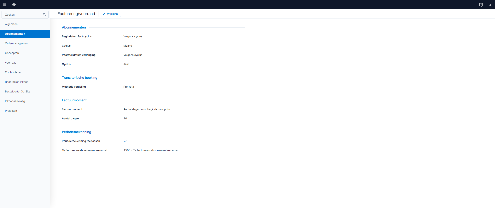

*Facturering/voorraad — tabblad Abonnementen, veldgroep Periodetoekenning — mockup: *`pages/rpt00692-facturering-voorraad/detail.ts`

#### Functionele uitwerking

**Activering**

De veldgroep Periodetoekenning op Facturering/voorraad (tabblad Abonnementen) is alleen zichtbaar als de module Abonnementen actief is. In de veldgroep staat het vinkje **Periodetoekenning toepassen**. Dit vinkje staat standaard uit.

Als het vinkje uit staat, is de volledige periodetoekenningsfunctionaliteit verborgen:
- Tabblad Periodetoekenningsregels abonnementen op het Periodeafsluitingsplan
- Submenu Periodetoekenning onder Abonnementen → Facturering (inclusief menu-items)
- Tabbladen Periodetoekenningsregels en Transitorische journaalposten op Eigenschappen abonnement
- Het veld Te factureren abonnementen omzet

Zet je het vinkje aan, dan wordt de volledige functionaliteit zichtbaar.

Het vinkje kan niet worden uitgezet als er toekenningsregels bestaan met status Gejournaliseerd (B45). Verwijder eerst alle gejournaliseerde toekenningsregels voordat je periodetoekenning uitschakelt.

**Centrale instelling**

De grootboekrekening **Te factureren abonnementen omzet** is alleen zichtbaar als Periodetoekenning toepassen aan staat. Het veld is verplicht zodra het vinkje aan staat.

**Facturatielogica**

Bij de facturatieverwerking is één ding bepalend: bestaat er een toekenningsregel voor de abonnementsregel in die periode?

- **Ja** → omzet naar de tussenrekening (Te factureren abonnementen omzet)
- **Nee** (inclusief alleen verwijderde regels) → omzet direct naar de omzetrekening

De artikelgroep en het factuurmoment spelen hierbij geen rol.

**Samenloop met transitorisch journaliseren**

Bestaat er een toekenningsregel voor een abonnementsregel in een periode? Dan slaat transitorisch journaliseren die regel over — periodetoekenning wint. Een verwijderde toekenningsregel (status Verwijderd) telt niet mee. Zonder toekenningsregel werkt transitorisch journaliseren gewoon.

#### Acceptatiecriteria

**Activering**

1. De veldgroep Periodetoekenning is alleen zichtbaar als de module Abonnementen actief is.
2. Het vinkje Periodetoekenning toepassen staat standaard uit.
3. Als het vinkje uit staat, is de volledige periodetoekenningsfunctionaliteit verborgen, inclusief het veld Te factureren abonnementen omzet (B44).
4. Als het vinkje aan staat, is de volledige functionaliteit zichtbaar en de grootboekrekening verplicht.
5. Het vinkje kan niet worden uitgezet als er toekenningsregels bestaan met status Gejournaliseerd. Foutmelding: "Er bestaan gejournaliseerde toekenningsregels. Verwijder deze eerst." (B45).

**Grootboekrekening**

1. De grootboekrekening Te factureren abonnementen omzet op Facturering/voorraad accepteert alleen rekeningen van het type Activa of Passiva (B13).

**Facturatielogica**

1. Met toekenningsregel → omzet op tussenrekening.
2. Zonder toekenningsregel → omzet op omzetrekening.

**Samenloop**

1. Transitorisch journaliseren slaat abonnementsregels over waarvoor een toekenningsregel bestaat. Verwijderde regels tellen niet mee.

#### Tooltiptekst

| Veld | Tekst |
| --- | --- |
| Periodetoekenning toepassen | Rekent verwachte abonnementsomzet toe aan een periode vóór de periodeafsluiting, ook als de factuur er nog niet is. |
| Te factureren abonnementen omzet | Grootboekrekening waarop omzet tijdelijk staat totdat toekenning plaatsvindt. |

#### Autorisatie

Geen apart recht vereist — toegang volgt Facturering/voorraad.

#### Podium-specificatie — Facturering/voorraad

**Schermtype:** DetailPage (Facturering/voorraad — tabblad Abonnementen, veldgroep Periodetoekenning)

**Veldgroepconditie:** de veldgroep Periodetoekenning is alleen zichtbaar als de module Abonnementen actief is.

**Nieuwe velden (tabblad Abonnementen, veldgroep Periodetoekenning)**

| Veldlabel | Podium-type | Verplicht | Standaardwaarde | Tooltip | Conditie | Status |
| --- | --- | --- | --- | --- | --- | --- |
| Periodetoekenning toepassen | boolean | nee | uit | Rekent verwachte abonnementsomzet toe aan een periode vóór de periodeafsluiting, ook als de factuur er nog niet is. | veldgroep zichtbaar als module Abonnementen actief | nieuw |
| Te factureren abonnementen omzet | text (zoekvenster grootboekrekening) | ja (als Periodetoekenning toepassen aan) | leeg | Grootboekrekening waarop omzet tijdelijk staat totdat toekenning plaatsvindt | zichtbaar als Periodetoekenning toepassen aan | nieuw |

---

### 2.9 US09 – Periodetoekenningsregels en transitorische journaalposten op Eigenschappen abonnement

**Als** financieel medewerker **wil ik** op het Eigenschappen abonnement de periodetoekenningsregels en de bijbehorende transitorische journaalposten van dat abonnement zien, **zodat** ik direct vanuit het abonnement kan controleren wat is toegerekend en geboekt.

#### Mockups

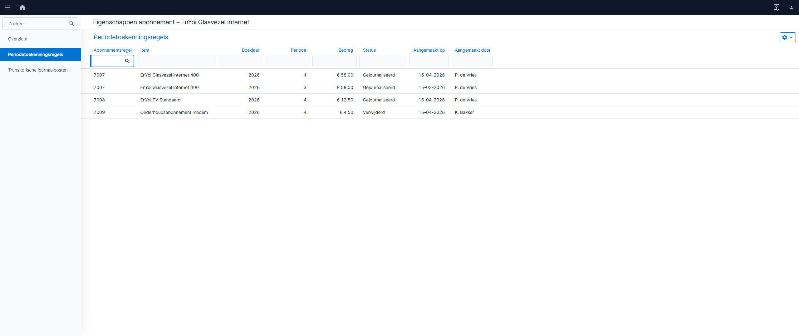

*Eigenschappen abonnement — tabblad Periodetoekenningsregels — mockup: *`pages/rpt00692-abonnement-eigenschappen/detail.ts`

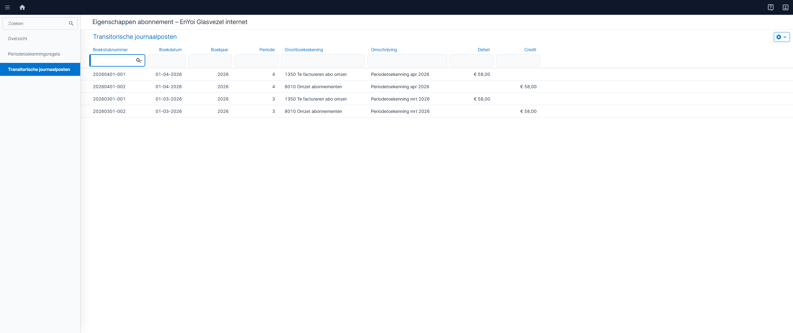

*Eigenschappen abonnement — tabblad Transitorische journaalposten — mockup: *`pages/rpt00692-abonnement-eigenschappen/detail.ts`

#### Functionele uitwerking

Op het Eigenschappen abonnement komen twee nieuwe tabbladen, beide onder het bestaande tabblad **Facturen**:
1. **Periodetoekenningsregels** — toont alle toekenningsregels die horen bij de abonnementsregels van dit abonnement.
2. **Transitorische journaalposten** — toont de journaalposten die zijn ontstaan door periodetoekenning voor dit abonnement.

Beide tabbladen zijn alleen zichtbaar als er toekenningsregels bestaan voor dit abonnement.

De weergaven zijn alleen-lezen. Acties als Genereer en Verwijder zijn niet beschikbaar op dit scherm — die lopen via het Periodeafsluitingsplan (US01/US02).

#### Acceptatiecriteria

**Tabblad Periodetoekenningsregels**

1. Het tabblad staat onder Facturen in de tabbladlijst.
2. Het tabblad is alleen zichtbaar als er toekenningsregels bestaan.
3. De weergave toont alle toekenningsregels van dit abonnement.
4. De weergave is alleen-lezen — geen acties.
5. Bij doorklikken op een regel opent de detailweergave van de toekenningsregel.

**Tabblad Transitorische journaalposten**

1. Het tabblad staat onder Periodetoekenningsregels in de tabbladlijst.
2. Het tabblad is alleen zichtbaar als er toekenningsregels bestaan.
3. De weergave toont alle journaalposten uit periodetoekenning van dit abonnement.
4. De weergave is alleen-lezen — geen acties.
5. Bij doorklikken op een regel opent de journaalpost.

#### Scherm en gedrag

**Tabblad Periodetoekenningsregels**

Het tabblad zit op het Eigenschappen abonnement, onder Facturen.

| Veld | Gedrag |
| --- | --- |
| Grid | Alleen-lezen. Geen rijselectie. |
| Filter | Automatisch gefilterd op het huidige abonnement |
| Sortering | Boekjaar aflopend, daarna periode aflopend |

#### Tooltiptekst

Het tabblad zit op het Eigenschappen abonnement, onder Periodetoekenningsregels.

| Veld | Gedrag |
| --- | --- |
| Tabblad | Toekenningsregels van dit abonnement voor transitorische journaalposten. |

#### Autorisatie

Geen apart recht vereist — zichtbaar voor iedereen met toegang tot het abonnement.

#### Podium-specificatie

**Schermtype:** Tabblad op Eigenschappen abonnement (embedded ListPage)

**Veldtabel ListPage**

| Kolom-id | Kolomkop | Podium-type | Sorteerbaar | Filter | Breedte | Mock-waarde |
| --- | --- | --- | --- | --- | --- | --- |
| abonnementsregel | Abonnementsregel | text | ja | ja | 150 | 7007 |
| item | Item | text | ja | ja | 250 | EnYoi Glasvezel internet 400 |
| boekjaar | Boekjaar | number | ja | ja | 100 | 2026 |
| periode | Periode | number | ja | ja | 80 | 4 |
| bedrag | Bedrag | currencyAmount | ja | nee | 120 | 58,00 |
| status | Status | text | ja | ja | 120 | Gejournaliseerd |
| aangemaakt | Aangemaakt op | date | ja | nee | 130 | 15-03-2026 |
| aanmakerNaam | Aangemaakt door | text | ja | nee | 130 | P. de Vries |

**ListPage-eigenschappen**

| Eigenschap | Waarde |
| --- | --- |
| Quick filter | ja |
| Exportknop | nee |
| Rijselectie | geen |
| Inline bewerken | nee |
| Bulkacties | geen |

---

## 3. Datamodel

### 3.1 Nieuwe tabel: Toekenningsregels

| Kolom | Type | Verplicht | Omschrijving |
| --- | --- | --- | --- |
| Id | Geheel getal (oplopend) | Ja | Primaire sleutel |
| Abonnementsregel | Geheel getal | Ja | Verwijzing naar abonnementsregel. Altijd gevuld bij Genereer. |
| Factuurregel | Geheel getal | Nee | Verwijzing naar factuurregel. Wordt automatisch gevuld bij de facturatieverwerking. Blijft leeg als de factuur nooit wordt aangemaakt (bijv. beëindiging vóór facturatie). |
| Boekjaar | Geheel getal | Ja | Boekjaar van toekenning |
| Periode | Geheel getal | Ja | Periode van toekenning |
| Bedrag | Bedrag (2 decimalen) | Ja | Toegerekend bedrag |
| Status | Keuzelijst (Gejournaliseerd, Verwijderd) | Ja | Status van de toekenningsregel. Standaard: Gejournaliseerd. Wordt Verwijderd na de actie Verwijder toekenningsregels. |
| Aangemaakt op | Datum/tijd | Ja | Tijdstip aanmaak |
| Aangemaakt door | Tekst | Ja | Gebruiker |
**Constraints:**
- Foreign key Abonnementsregel &rarr; Abonnementsregel.
- Foreign key Factuurregel &rarr; Factuurregel (nullable).

> Uniciteit per (Abonnementsregel, Boekjaar, Periode) wordt functioneel gehandhaafd door de Genereer-logica (US01, US03): bestaat er al een Gejournaliseerd-regel, dan maakt Genereer een delta-regel in plaats van een duplicate. Er is geen database-constraint nodig.

**Koppeling factuurregel:**
- Bij Genereer is alleen de abonnementsregel gevuld. De factuurregel is nog leeg.
- Bij de facturatieverwerking zoekt het systeem toekenningsregels voor dezelfde abonnementsregel en koppelt de factuurregel.
- Als de factuur nooit wordt aangemaakt (bijv. beëindiging vóór facturatie), blijft de factuurregel leeg. Dit is acceptabel.

**Bedrijfsregels:**
- De som van alle bedragen per abonnementsregel bepaalt de netto-toekenning. Na verwijderen is dit nul.

**Traceability:** US01, US02, US03, US04, US05.

### 3.2 Uitbreiding bestaande tabel: Instellingen Facturering/voorraad

| Instelling | Type | Default | Omschrijving |
| --- | --- | --- | --- |
| Periodetoekenning toepassen | Boolean | Nee | Rekent verwachte abonnementsomzet toe aan een periode vóór de periodeafsluiting, ook als de factuur er nog niet is. Als dit vinkje uit staat, is de volledige periodetoekenningsfunctionaliteit verborgen. |
| Te factureren abonnementen omzet | Grootboekrekening (FK) | Leeg | Te factureren abonnementen omzet — balansrekening waarop omzet tijdelijk staat. Centraal ingesteld voor alle artikelgroepen. Verplicht zodra Periodetoekenning toepassen aan staat. |

**Traceability:** US08.

### 3.3 Uitbreiding bestaande tabel: Abonnement

| Instelling | Type | Default | Omschrijving |
| --- | --- | --- | --- |
| Factuurmoment | Keuzelijst (Aantal dagen voor begindatumcyclus, Aantal dagen na begindatumcyclus, Aantal dagen voor einddatumcyclus, Aantal dagen na einddatumcyclus, Midden van de factuurperiode) | Aantal dagen voor begindatumcyclus | Factuurmoment — bepaalt wanneer de factuur wordt aangemaakt ten opzichte van de cyclus. Bestaande abonnementen krijgen automatisch de waarde Aantal dagen voor begindatumcyclus. |

**Conversie:** alle bestaande abonnementen krijgen de waarde Aantal dagen voor begindatumcyclus. Het bestaande veld Aantal dagen vooraf wordt hernoemd naar Aantal dagen. Het veld Dagen achteraf vervalt.

**Traceability:** US07, US08.

### 3.4 Bestaande tabellen (geen wijziging)

- Factuurregels abonnement
- Abonnementsregels
- Periodeafsluitingsproces — periodeafsluiting

### 3.5 Relatiediagram

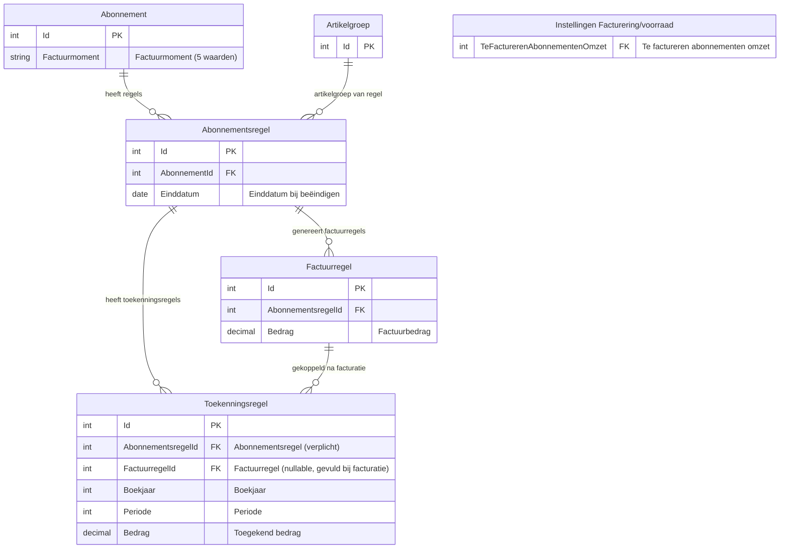

### 3.6 Boekingsstromen

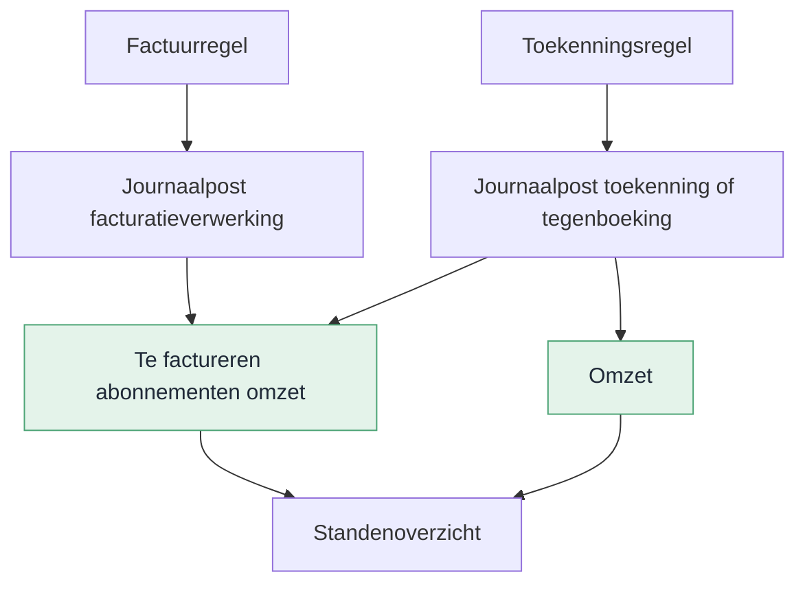

**Toekenning** (Journaliseer-actie):

| Debet | Credit | Toelichting |
| --- | --- | --- |
| Te factureren abonnementen omzet | Omzet | Positief bedrag bij toekenning |

**Tegenboeking** (Journaliseren ongedaan maken):

| Debet | Credit | Toelichting |
| --- | --- | --- |
| Omzet | Te factureren abonnementen omzet | Spiegelt de oorspronkelijke boeking |

De grootboekrekening **Te factureren abonnementen omzet** is een centrale instelling op Facturering/voorraad (tabblad Abonnementen, veldgroep Periodetoekenning). De omzetrekening volgt de artikelgroep van de abonnementsregel (B14). De journalisatie verloopt via het bestaande integratieschema abonnementen, uitgebreid met een nieuw regeltype voor periodetoekenning (B16). Journaalposten van periodetoekenning zijn uitgesloten van verdichting (B15).

**Facturatielogica:** bij de facturatieverwerking bepaalt het bestaan van een toekenningsrecord welke grootboekrekening wordt gebruikt. Bestaat er een toekenningsregel voor de abonnementsregel in de betreffende periode, dan wordt de omzet geboekt op de tussenrekening (Te factureren abonnementen omzet). Bestaat er geen toekenningsregel, dan gaat de omzet direct naar de omzetrekening.

---

## 4. Gegevensverzameling

### 4.1 Gegevensverzameling: Periodetoekenningsregels

| Eigenschap | Waarde |
| --- | --- |
| Basistabel | Toekenningsregels |
| Naam | Periodetoekenningsregels |
| Standaardfilter | Geen |
| Filterautorisatie | Nee |
| Sortering | Boekjaar (aflopend), Periode (aflopend), Aangemaakt op (aflopend) |
| Gebruik | Dashboards, analyses en rapportages over periodetoekenning |

**Velden**

| Veld | Bron | Type | Toelichting |
| --- | --- | --- | --- |
| Toekenningsregel | Toekenningsregels | Geheel getal | Primaire sleutel |
| Abonnementsregel | Abonnementsregel | Geheel getal | Verwijzing naar abonnementsregel |
| Abonnement | Abonnement (via abonnementsregel) | Tekst | Omschrijving abonnement |
| Factuurregel | Factuurregel | Geheel getal | Verwijzing naar factuurregel (kan leeg zijn) |
| Artikelgroep | Artikelgroep (via abonnementsregel) | Tekst | Artikelgroep van de abonnementsregel |
| Administratie | Administratie (via abonnement) | Tekst | Administratie van het abonnement |
| Boekjaar | Toekenningsregels | Geheel getal | Boekjaar van toekenning |
| Periode | Toekenningsregels | Geheel getal | Periode van toekenning |
| Jaar (journaalpost) | Journaalpost (via toekenningsregel) | Geheel getal | Boekjaar waarin de journaalpost is geboekt |
| Periode (journaalpost) | Journaalpost (via toekenningsregel) | Geheel getal | Periode waarin de journaalpost is geboekt |
| Bedrag | Toekenningsregels | Bedrag | Toegerekend bedrag |
| Aangemaakt op | Toekenningsregels | Datum/tijd | Tijdstip aanmaak |
| Aangemaakt door | Toekenningsregels | Tekst | Gebruiker |

**Traceability:** US01, US02, US09.

### 4.2 Gegevensverzameling: Saldoverklaring Te factureren abonnementen omzet

| Eigenschap | Waarde |
| --- | --- |
| Basistabel | Abonnementsregels (geaggregeerd met Toekenningsregels, Factuurregels en Journaalposten) |
| Naam | Saldoverklaring Te factureren abonnementen omzet |
| Standaardfilter | Huidige administratie |
| Filterautorisatie | Ja, op Administratie |
| Sortering | Administratie (oplopend), Abonnementsregel (oplopend) |
| Gebruik | Rapport Saldoverklaring Te factureren abonnementen omzet (US06), eigen analyses voor controllers |

**Velden**

| Veld | Bron | Type | Toelichting |
| --- | --- | --- | --- |
| Administratie | Administratie (via abonnement) | Tekst | Administratie van het abonnement |
| Abonnementsregel | Abonnementsregels | Geheel getal | Primaire sleutel abonnementsregel |
| Abonnement | Abonnement (via abonnementsregel) | Tekst | Omschrijving abonnement |
| Item | Artikelgroep (via abonnementsregel) | Tekst | Artikelomschrijving van de abonnementsregel |
| Datum van | Abonnementsregels | Datum | Begindatum van de abonnementsregel |
| Datum tot | Abonnementsregels | Datum | Einddatum van de abonnementsregel (kan leeg zijn) |
| Gefactureerd | Factuurregels (som per abonnementsregel) | Bedrag | Totaalbedrag aan factuurregels die op Te factureren abonnementen omzet zijn geboekt |
| Toegerekend | Toekenningsregels (som per abonnementsregel, status Gejournaliseerd) | Bedrag | Totaalbedrag aan gejournaliseerde toekenningsregels |
| Teruggedraaid | Toekenningsregels (som per abonnementsregel, status Verwijderd) | Bedrag | Totaalbedrag aan verwijderde (teruggedraaide) toekenningsregels |
| Openstaand saldo | Berekend: Gefactureerd − Toegerekend + Teruggedraaid | Bedrag | Resterend saldo per abonnementsregel op de tussenrekening |
| Factuurmoment | Abonnement (via abonnementsregel) | Tekst | Factuurmoment van het abonnement |
| Geparkeerd | Abonnementsregels | Ja/Nee | Of de abonnementsregel geparkeerd is |
| Handmatig geboekt | Journaalposten op tussenrekening (niet uit facturatie of periodetoekenning) | Bedrag | Nettobedrag van handmatige boekingen op de tussenrekening. Niet te koppelen aan een abonnementsregel; verschijnt als aparte rij in het rapport. |
| Grootboeksaldo | Grootboek (saldo tussenrekening t/m gekozen periode) | Bedrag | Saldo op de tussenrekening Te factureren abonnementen omzet |

> **Aansluiting grootboek:** de som van alle openstaande saldi + het totaal handmatig geboekt sluit aan op het grootboeksaldo van de rekening Te factureren abonnementen omzet. Controllers gebruiken dit rapport om dat saldo te verklaren.

**Traceability:** US06.

---

## Bijlage A – Samenvatting voor klant

Periodeafsluiting loopt soms vast omdat er nog ongejournaliseerde abonnementsomzet openstaat. Met deze wijziging kun je die omzet vooraf toekennen aan de juiste periode — ook als de factuur er nog niet is.

Op het Periodeafsluitingsplan komt een extra tabblad waarmee je in twee stappen werkt: regels genereren (inclusief journaliseren) en eventueel verwijderen.

**Wat levert dit op?**

- Je hoeft niet meer handmatig te corrigeren bij periodeafsluiting
- Je hebt een duidelijke audit trail van wat er is toegerekend en teruggedraaid
- Creditfacturen, beëindigingen en bedragwijzigingen worden automatisch afgehandeld
- Bij verwijdering van een abonnementsregel draait het systeem openstaande toekenningen automatisch terug

**Wat verandert er in de praktijk?**

Je werkt op een bekend scherm met bestaande rechten. Via een wizard (1 stap) selecteer je per periode welke abonnementen meedoen. Na voltooien zijn de regels direct gejournaliseerd. Geparkeerde abonnementen doen mee met het laatst bekende bedrag. De facturatie kiest automatisch de juiste grootboekrekening op basis van de toekenningsregel.

**Kortom:** voorspelbaardere periodeafsluiting, minder herstelwerk.

---

## Bijlage B – Huidige werking

### IST: huidige situatie

Sluit je een periode af terwijl er nog ongejournaliseerde abonnementsomzet loopt, dan blokkeert het systeem. Er is geen manier om vooraf te bepalen welke omzet nog toebedeeld moet worden.

### SOLL: gewenste situatie

De financieel medewerker verwerkt de toekenning vóór periodeafsluiting via het tabblad Periodetoekenningsregels:

| Stap | Actor | Actie | Systeemactie |
| --- | --- | --- | --- |
| 1 | Systeem | Facturatieverwerking draait | Factuurregel aangemaakt, omzet op Te factureren abonnementen omzet. Factuurregel wordt gekoppeld aan bestaande toekenningsregels. |
| 2 | Medewerker | Opent tabblad Periodetoekenningsregels | Boekjaar en periode overgenomen; grid is leeg |
| 3 | Medewerker | Start Genereer | Toekenningsregels aangemaakt en direct gejournaliseerd |
| 4 | Controller | Bewaakt saldo Te factureren abonnementen omzet | Openstaand saldo = signaal dat toekenning ontbreekt |
| 5 | Medewerker | Verwijder toekenningsregels (indien nodig) | Tegenboeking en tegenjournaalposten geboekt |

### Levenscyclus toekenningsregel

De levenscyclus is beschreven in de SOLL-tabel hierboven. Samengevat:

| Status | Overgang | Trigger |
| --- | --- | --- |
| Gejournaliseerd | Genereer | Genereer-actie op Periodeafsluitingsplan (direct gejournaliseerd) |
| Verwijderd | Verwijderen | Handmatig, facturatieverwerking (bij beëindiging) of verwijdering. Record blijft bewaard. Het tijdvak gedraagt zich alsof er geen toekenningsregel is. |

---

## Bijlage C – Testscenario's

### Functionele testscenario's

| Nr | Scenario | Verwacht resultaat | User story |
| --- | --- | --- | --- |
| T01 | Genereer voor abonnement via wizard (1 stap) met multi-select | Geselecteerde regels aangemaakt en direct gejournaliseerd | US01 |
| T02 | Genereer met directe journalisering | Status Gejournaliseerd, journaalposten geboekt, Te factureren omzet = 0 | US01 |
| T03 | Tweede Genereer voor dezelfde periode | Geen nieuwe regels, melding getoond | US01 |
| T04 | Geen abonnementen met openstaande facturatie in periode | Lege lijst in wizard, geen toekenbare regels | US01 |
| T05 | Vervallen — geen aparte Journaliseer-actie meer | — | — |
| T06 | Fout tijdens Genereer | Rollback: geen statuswijziging, geen boekingen | US01 |
| T07 | Verwijderen gejournaliseerde regels | Record op status Verwijderd, tegenjournaalpost geboekt | US02 |
| T08 | Vervallen — geen status Tegengeboekt meer | — | — |
| T09 | Creditfactuur met negatief bedrag | Toekenningsregel met negatief bedrag, saldo gecorrigeerd | US01 |
| T10 | Bedragcorrectie na toekenning | Delta-toekenningsregel aangemaakt, netto-toekenning klopt | US03 |
| T11 | Facturatieverwerking na beëindigen abonnementsregel | Toekomstige toekenningen automatisch verwijderd bij factuurmoment | US04 |
| T12 | Beëindigen met afgesloten toekomstige periode | Melding: automatische tegenboeking niet mogelijk | US04 |
| T12a | Verwijderen toekenningsregel bij geblokkeerde periode | Foutmelding: Periode geblokkeerd. Dit is niet toegestaan. | US02, B38 |
| T13 | Verwijderen abonnementsregel met gejournaliseerde toekenningen | Automatisch verwijderd, verwijdering afgerond | US05 |
| T14 | Verwijderen abonnementsregel zonder toekenningen | Direct verwijderd | US05 |
| T15 | Vervallen — geen audit trail via tegenboekingsrecords meer | — | — |
| T16 | Geparkeerd abonnement in wizard | Verschijnt met laatst bekende bedrag, selecteerbaar via multi-select | US01, B34 |
| T17 | Genereer met facturatielogica: toekenningsregel bestaat | Omzet bij facturatie naar tussenrekening | US08, B33 |
| T27 | Genereer met alle vier factuurmomenten | Per factuurmoment correct factuurdatum berekend | US07 |
| T28 | Nieuw abonnement zonder wijziging factuurmoment | Factuurmoment staat op Aantal dagen voor begindatumcyclus (default) | US07 |
| T29 | Bestaand abonnement na conversie | Factuurmoment is Aantal dagen voor begindatumcyclus; gedrag ongewijzigd | US07 |
| T35 | Aantal dagen na begindatumcyclus met waarde groter dan cyclusdagen | Foutmelding: waarde mag niet groter zijn dan cyclus | US07 |
| T36 | Aantal dagen voor einddatumcyclus met waarde groter dan cyclusdagen | Foutmelding: waarde mag niet groter zijn dan cyclus | US07 |
| T18 | Jaaroverschrijding (Q4 + Q1) | Aparte toekenningsregels per boekjaar/periode | US01 |
| T19 | Terugdraaien één periode bij jaaroverschrijding | Alleen die periode teruggedraaid, andere ongewijzigd | US02 |
| T20 | Saldoverklaring: alle componenten opgeteld | Som (gefactureerd − toegerekend + teruggedraaid + handmatig) = grootboeksaldo | US06 |
| T21 | Saldoverklaring: handmatige boeking op tussenrekening | Handmatige memoriaalpost verschijnt als aparte rij en apart totaal in de telling | US06 |
| T22 | Transitorisch journaliseren met bestaande toekenningsregel | Transitorisch slaat de regel over (B9) | US01, US08 |
| T23 | Transitorisch journaliseren zonder toekenningsregel | Werkt zoals voorheen | US01, US08 |
| T24 | Vervallen | — | — |
| T25 | Vervallen | — | — |
| T26 | Facturatie zonder toekenningsregel | Omzet direct naar omzetrekening (B33) | US08 |
| T37 | Periodetoekenning toepassen uit: tabblad, menu-items en KPI's verborgen | Niets van periodetoekenning zichtbaar | US08, B44 |
| T38 | Periodetoekenning toepassen aan: alles zichtbaar | Tabblad, menu-items en KPI's zichtbaar | US08, B44 |
| T39 | Veldgroep Periodetoekenning bij inactieve module Abonnementen | Veldgroep niet zichtbaar op Facturering/voorraad | US08, B44 |
| T40 | Periodetoekenning toepassen uitzetten met gejournaliseerde toekenningsregels | Foutmelding: Er bestaan gejournaliseerde toekenningsregels. Verwijder deze eerst. | US08, B45 |
| T41 | Periodetoekenning toepassen uitzetten zonder gejournaliseerde toekenningsregels | Vinkje gaat uit, functionaliteit verborgen | US08, B44, B45 |
| T32 | Vervallen | — | — |
| T33 | Vervallen | — | — |
| T34 | Vervallen | — | — |

### Standenoverzicht-scenario's

| Nr | Scenario | Verwacht |
| --- | --- | --- |
| S01 | Maandfactuur volledig toegerekend | 1 toekenningsregel; saldo Te factureren omzet = 0 |
| S02 | Kwartaalfactuur over 3 perioden | 3 toekenningsregels; som = factuurbedrag |
| S03 | Afrondingsverschil | Compensatieregel in laatste periode |
| S04 | Toekenning niet uitgevoerd | Geen toekenningsregels; openstaand saldo = signaal |
| S05 | Beëindigd na volledige toekenning | Toekenningsregel verwijderd; netto = 0 |
| S06 | Creditfactuur na toekenning | Origineel +250 en credit -250; netto = 0 |
| S07 | Bedragcorrectie +50 na toekenning | Origineel +250 en delta +50; totaal = 300 = nieuw bedrag |

---

## Bijlage D – Open punten en beslissingen

### Open punten

Geen open punten.

### Beslissingen

| Nr | Besluit |
| --- | --- |
| B1 | Tabblad Periodetoekenningsregels is zichtbaar op het Periodeafsluitingsplan als Periodetoekenning toepassen aan staat (B44). |
| B2 | Bij verwijderen krijgt de toekenningsregel status Verwijderd. Het record wordt niet fysiek verwijderd (audit trail). Een verwijderde regel telt niet mee voor samenloop en facturatielogica — het tijdvak gedraagt zich alsof er geen toekenningsregel is. |
| B3 | Genereer alleen vóór periodeafsluiting toegestaan. Genereer is alleen beschikbaar vanuit het Periodeafsluitingsplan, niet op de standalone weergave. Journalisering vindt altijd direct plaats bij genereren. |
| B5 | Automatisch terugdraaien bij beëindigen is altijd actief en draait bij de facturatieverwerking (het factuurmoment). Er is geen instelling om dit uit te schakelen. |
| B6 | Geen cascade-delete bij verwijdering abonnementsregel; koppeling genulled |
| B8 | Periodetoekenning hergebruikt de bestaande verdelingslogica van transitorisch journaliseren. Geen nieuwe verdelingsmethoden. |
| B9 | Samenloop periodetoekenning en transitorisch journaliseren: als er een toekenningsregel bestaat voor een abonnementsregel in een periode, slaat transitorisch journaliseren die regel over. Periodetoekenning wint. Bestaat er geen toekenningsregel (of alleen status Verwijderd), dan werkt transitorisch journaliseren zoals voorheen. |
| B10 | Dubbele koppeling: toekenningsregels worden gekoppeld aan de abonnementsregel (verplicht) én aan de factuurregel (nullable). Bij Genereer is alleen de abonnementsregel gevuld. De factuurregel wordt automatisch gevuld bij de facturatieverwerking. |
| B11 | Als de factuur nooit wordt aangemaakt (bijv. beëindiging vóór facturatie), blijft de factuurregel leeg. Dit is acceptabel. |
| B12 | Doorschuiflogica: als de periode al gesloten is bij Journaliseer of bij automatisch terugdraaien, wordt de journaalpost geboekt in de eerstvolgende vrije periode. Dit geldt altijd (handmatig en automatisch). |
| B13 | Validatie grootboekrekening Te factureren abonnementen omzet: alleen type Activa of Passiva toegestaan. |
| B14 | Omzetrekening volgt de artikelgroep van de abonnementsregel, niet een vaste instelling. |
| B15 | Journaalposten van periodetoekenning zijn uitgesloten van verdichting. |
| B16 | Bestaand integratieschema abonnementen wordt uitgebreid met een nieuw regeltype voor periodetoekenning. Geen nieuw integratieschema. |
| B19 | Verwijdering van een abonnementsregel is geblokkeerd als er gejournaliseerde toekenningsregels zijn en er geen open periode beschikbaar is voor de tegenboeking. |
| B21 | Bij een herhaalde Genereer worden bestaande regels herberekend op basis van de actuele abonnementsregel. |
| B22 | Volgorde in het maandafsluitingsproces: (1) Facturatieverwerking, (2) Periodetoekenning genereren (inclusief journaliseren), (3) Periode afsluiten. |
| B23 | RPT00692 en RPT00702 werken onafhankelijk. 692 boekt omzet, 702 verschuift de balansboeking. Geen samenlooprisico. |
| B24 | Periodetoekenning vereist het Periodeafsluitingsplan. Zonder Periodeafsluitingsplan is periodetoekenning niet beschikbaar. |
| B27 | Factuurmoment is een nieuw veld op het abonnement met vijf waarden: Aantal dagen voor begindatumcyclus, Aantal dagen na begindatumcyclus, Aantal dagen voor einddatumcyclus, Aantal dagen na einddatumcyclus, Midden van de factuurperiode. Standaard: Aantal dagen voor begindatumcyclus. Bestaande abonnementen krijgen deze waarde via conversie. Het veld is altijd zichtbaar op het abonnement. |
| B28 | Het bestaande veld Aantal dagen vooraf wordt hernoemd naar Aantal dagen. Dit veld is altijd zichtbaar in de boekingslay-out. |
| B29 | Het veld DaysAfter (Aantal dagen achteraf) vervalt. De richting en referentiedatum zitten nu in het factuurmoment. |
| B31 | Bij factuurmoment Aantal dagen na begindatumcyclus mag het veld Aantal dagen niet groter zijn dan het aantal dagen van de cyclus. Dit voorkomt dat het factuurmoment na de einddatum van de cyclus valt. |
| B32 | Bij factuurmoment Aantal dagen voor einddatumcyclus mag het veld Aantal dagen niet groter zijn dan het aantal dagen van de cyclus. Dit voorkomt dat het factuurmoment voor de begindatum van de cyclus valt. |
| B33 | Facturatielogica: bij de facturatieverwerking bepaalt het bestaan van een toekenningsrecord welke grootboekrekening wordt gebruikt. Bestaat er een toekenningsregel: omzet naar tussenrekening. Geen toekenningsregel: omzet naar omzetrekening. |
| B34 | Geparkeerde abonnementen verschijnen in de Genereer-wizard. Het bedrag is het laatst bekende bedrag van de abonnementsregel. |
| B35 | De Genereer-wizard bestaat uit 1 stap. Bovenin staan boekjaar en periode (alleen-lezen, geen begin-/einddatum). Daaronder toont het systeem de toekenbare abonnementsregels. De gebruiker selecteert via multi-select welke regels periodetoekenning krijgen. |
| B36 | Bij factuurmoment Midden van de factuurperiode berekent het systeem de factuurdatum als het midden van de cyclus: (begindatum cyclus + einddatum cyclus) / 2. Het veld Aantal dagen is verborgen en niet van toepassing. |
| B37 | Bij een delta-bedrag (US03) wordt altijd een nieuwe toekenningsregel aangemaakt én direct gejournaliseerd. Bestaande gejournaliseerde regels worden nooit gewijzigd — zo blijft de audit trail intact en is het netto-saldo altijd te herleiden. |
| B38 | Verwijderen van toekenningsregels vervangt de oude actie Journaliseren ongedaan maken. Bij verwijderen valideert het systeem of de periode geblokkeerd is. Is de periode geblokkeerd, dan verschijnt de foutmelding: "Periode geblokkeerd. Dit is niet toegestaan." Het record wordt verwijderd en de bijbehorende journaalpost wordt teruggedraaid via een tegenjournaalpost. |
| B39 | De menu-items Te journaliseren periodetoekenningsregels en Gejournaliseerde periodetoekenningsregels zijn vervallen. Alleen het menu-item Alle periodetoekenningsregels blijft bestaan. |
| B40 | Status Te journaliseren vervalt. Toekenningsregels gaan bij genereren direct naar status Gejournaliseerd. Verwijderen zet de status op Verwijderd; het record blijft bewaard voor audit trail. Statussen: Gejournaliseerd, Verwijderd. |
| B41 | Verwijderen van een toekenningsregel is niet toegestaan als er voor deze periode en dit tijdvak een factuur is gegenereerd voor de bijbehorende abonnementsregel. Dit borgt de boekhoudkundige consistentie: de factuurboeking is al naar de tussenrekening gerouteerd op basis van de toekenningsregel (B33). |
| B42 | Genereren en verwijderen (inclusief de bijbehorende journaalposten en tegenjournaalposten) lopen altijd als batchverwerking via de wachtrij. De wizard of de actie plaatst een taak in de wachtrij en sluit direct. Het grid ververst zodra de taak klaar is; tijdens verwerking toont het systeem een voortgangsindicatie. Er is geen synchrone uitvoering. |
| B43 | De acties Genereer en Verwijder zijn apart autoriseerbaar via twee rechtenobjecten: Periodetoekenning genereren en Periodetoekenning verwijderen. Beide staan standaard aan. Heeft een gebruiker geen recht op een actie, dan is de actieknop niet zichtbaar. Toegang tot het tabblad en de weergave volgt het bestaande recht op Periodeafsluitingsplan. |
| B44 | Periodetoekenning toepassen is een vinkje op Facturering/voorraad (tabblad Abonnementen, veldgroep Periodetoekenning). De veldgroep is alleen zichtbaar als de module Abonnementen actief is. Het vinkje staat standaard uit. Als het vinkje uit staat, is de volledige periodetoekenningsfunctionaliteit verborgen: tabblad Periodetoekenningsregels op het Periodeafsluitingsplan, submenu en menu-items Periodetoekenning, tabbladen Periodetoekenningsregels en Transitorische journaalposten op Eigenschappen abonnement, KPI's periodetoekenning en het veld Te factureren abonnementen omzet. |
| B45 | Het vinkje Periodetoekenning toepassen kan niet worden uitgezet als er toekenningsregels bestaan met status Gejournaliseerd. Foutmelding: "Er bestaan gejournaliseerde toekenningsregels. Verwijder deze eerst." |

### Vervallen beslissingen

| Nr | Reden |
| --- | --- |
| B4 | Dekking staat in B2 (status Verwijderd, audit trail) |
| B7 | Vervangen door B43 (aparte rechtenobjecten voor Genereer en Verwijder) |
| B17 | Artikelgroep-instelling geschrapt |
| B18 | Artikelgroep-instelling geschrapt |
| B20 | Geen vinkje Direct journaliseren; journalisering is onderdeel van Genereer |
| B25 | Startperiode op artikelgroep geschrapt |
| B26 | Beginsaldo was gekoppeld aan vervallen startperiode |
| B30 | Artikelgroep-instelling geschrapt |

### Definition of Done

| Onderdeel | Status | Toelichting |
| --- | --- | --- |
| Datamodel en conversie | Afgedekt | Nieuwe tabel Toekenningsregels beschreven in §3.1. Nieuw veld Factuurmoment op Abonnement in §3.3. Conversie: bestaande abonnementen krijgen waarde Aantal dagen voor begindatumcyclus. Artikelgroep-uitbreiding geschrapt. |
| Weergaven | Afgedekt | Embedded ListPage (US01) en standalone ListPage (US02) beschreven met kolommen, filters en acties. Genereer-wizard met 1 stap en multi-select. Directe journalisering. |
| Autorisatie | Afgedekt | Twee rechtenobjecten: Periodetoekenning genereren en Periodetoekenning verwijderen (B43). Beide standaard aan. Tabbladtoegang volgt bestaand recht op Periodeafsluitingsplan. |
| Rapportages en gegevensverzamelingen | Afgedekt | Gegevensverzameling Periodetoekenningsregels beschreven in §4.1. Gegevensverzameling Saldoverklaring Te factureren abonnementen omzet beschreven in §4.2, met geaggregeerde velden per abonnementsregel. Rapport US06 gebruikt §4.2 als databron. |
| Signalen | N.v.t. | Geen automatisch signaal. US06 beschrijft een saldocontrole via het standenoverzicht, geen Profit-signaal. |
| Connectors en integraties | N.v.t. | Geen nieuwe GetConnectors, UpdateConnectors of koppelingen. |
| User interface | Afgedekt | Tabblad, standalone weergave, wizard (1 stap) met multi-select en instellingenscherm beschreven met Podium-specificaties en mockups. |
| Menu-items | Afgedekt | Nieuw submenu Periodetoekenning onder Abonnementen &rarr; Facturering met twee menu-items: Alle periodetoekenningsregels en Saldoverklaring (US02/US06). |
| Regels en validaties | Afgedekt | Unieke constraint, statusvalidaties en foutmeldingen beschreven per user story. |
| Testscenario's en acceptatiecriteria | Afgedekt | 22 functionele testscenario's en 7 standenoverzicht-scenario's in Bijlage C. |
| Documentatie | Afgedekt | Helpteksten, tooltips en stappenplan in Bijlage E. |

---

## Bijlage E – Documentatie

### Helptekst tabblad

Gebruik dit tabblad om abonnementsomzet toe te kennen aan de juiste financiële periode.

- Start met **Genereer periodetoekenningsregels** om regels op te bouwen en direct te journaliseren.
- Gebruik **Verwijder toekenningsregels** om gejournaliseerde toekenningen terug te draaien.

### Helptekst per actie

| Actie | Helptekst |
| --- | --- |
| Genereer periodetoekenningsregels | Maakt toekenningsregels aan en journaliseert ze direct voor het geselecteerde boekjaar en de geselecteerde periode. |
| Verwijder toekenningsregels | Verwijdert geselecteerde toekenningsregels en draait de bijbehorende journaalposten terug. |

### Statuswaarden

| Status | Uitleg |
| --- | --- |
| Gejournaliseerd | De toekenningsregel is aangemaakt en geboekt. Telt mee in de omzettoekenning. |
| Verwijderd | De toekenningsregel is verwijderd via de actie Verwijder toekenningsregels. Het record blijft bewaard voor audit trail, maar telt niet meer mee in de omzettoekenning. |

### Stappenplan voor gebruiker

| Stap | Actie | Verwacht resultaat |
| --- | --- | --- |
| 1 | Open Periodeafsluitingsplan en ga naar tabblad Periodetoekenningsregels | Je ziet jaar en periode en een leeg of gevuld grid |
| 2 | Klik Genereer periodetoekenningsregels | Wizard opent met 1 stap: boekjaar en periode bovenin, toekenbare regels daaronder |
| 3 | Selecteer regels en klik Voltooien | Regels aangemaakt en direct gejournaliseerd |
| 4 | Controleer resultaat in grid en standenoverzicht | Saldo neemt af of is nul |
| 5 | Bij fout: selecteer regels en klik Verwijder toekenningsregels | Status wordt Verwijderd, journaalpost teruggedraaid |

### Veelgestelde vragen

**Wat als ik een periode oversla bij de periodetoekenning?**

Je kunt Genereer voor een latere periode uitvoeren zonder dat eerdere perioden zijn verwerkt. De bedragen kloppen, want elke periode krijgt een eigen deel op basis van de verdelingsmethode.

Let op: je kunt een periode pas afsluiten als alle voorgaande perioden zijn afgesloten. Sla je bijvoorbeeld februari over en verwerk je alleen januari en maart, dan kun je maart niet afsluiten totdat februari ook is afgesloten.

**Voorbeeld**

| Stap | Actie | Resultaat |
| --- | --- | --- |
| 1 | Januari: Genereer &rarr; Afsluiten | Verwerkt |
| 2 | Februari: overgeslagen | Periode blijft open |
| 3 | Maart: Genereer | Regels aangemaakt en direct gejournaliseerd |
| 4 | Maart: Afsluiten | Geblokkeerd — februari is nog open |
| 5 | Februari: alsnog Genereer &rarr; Afsluiten | Verwerkt |
| 6 | Maart: Afsluiten | Nu wel mogelijk |

**Tip:** voer periodetoekenning altijd uit in de volgorde van de perioden. Zo voorkom je dat je later terugkomt om een overgeslagen periode alsnog te verwerken.

### Beginsaldo tussenrekening

Als er al niet-gefactureerde omzet loopt op het moment dat je periodetoekenning gaat gebruiken, boek je zelf het beginsaldo op Te factureren abonnementen omzet. Doe dit via een memoriaalpost. Het systeem doet dit niet automatisch.

---

## Bijlage F – Work items developer

Deze bijlage bevat alle taken die de developer moet uitvoeren. De taken zijn gegroepeerd per onderdeel. Voer ze uit in de aangegeven volgorde.

### F1 – Datamodel en conversie

| Nr | Taak | Referentie | Toelichting |
| --- | --- | --- | --- |
| D01 | Maak nieuwe tabel Toekenningsregels | §3.1 | Kolommen: Id, Abonnementsregel, Factuurregel, Boekjaar, Periode, Bedrag, Status (Gejournaliseerd, Verwijderd), Aangemaakt op, Aangemaakt door |
| D02 | Voeg foreign keys toe op Toekenningsregels | §3.1 | FK naar Abonnementsregel (verplicht), Factuurregel (nullable) |
| D03 | Voeg veld Te factureren abonnementen omzet toe op Facturering/voorraad | §3.2 | FK naar grootboekrekening, nullable |
| D04 | Voeg veld Factuurmoment toe op Abonnement | §3.3 | Keuzelijst: Aantal dagen voor begindatumcyclus, Aantal dagen na begindatumcyclus, Aantal dagen voor einddatumcyclus, Aantal dagen na einddatumcyclus, Midden van de factuurperiode. Standaard: Aantal dagen voor begindatumcyclus |
| D05 | Hernoem bestaand veld Aantal dagen vooraf naar Aantal dagen | §3.3 | Veld Dagen achteraf vervalt |
| D06 | Schrijf conversiescript: bestaande abonnementen krijgen Factuurmoment = Aantal dagen voor begindatumcyclus | §3.3, B27 | Bestaand gedrag blijft ongewijzigd |

### F2 – Instellingen en validaties (US07, US08)

| Nr | Taak | Referentie | Toelichting |
| --- | --- | --- | --- |
| D07 | Toon veld Factuurmoment op het abonnement | US07 | Altijd zichtbaar. Vijf waarden |
| D08 | Toon veld Aantal dagen op het abonnement | US07, B28 | Zichtbaar behalve bij Midden van de factuurperiode |
| D09 | Verwijder veld Dagen achteraf | US07, B29 | Vervalt; richting zit nu in Factuurmoment |
| D10 | Toon veld Te factureren abonnementen omzet op Facturering/voorraad | US08 | Tabblad Abonnementen, veldgroep Periodetoekenning. Zichtbaar als Periodetoekenning toepassen aan staat. |
| D55 | Bouw activering Periodetoekenning toepassen op Facturering/voorraad | US08, B44, B45 | Vinkje op tabblad Abonnementen, veldgroep Periodetoekenning. Veldgroep alleen zichtbaar als module Abonnementen actief is. Standaard uit. Als uit: verberg tabblad op Periodeafsluitingsplan, submenu en menu-items, tabbladen op Eigenschappen abonnement, KPI's en het veld Te factureren abonnementen omzet. Validatie: vinkje kan niet uit als er gejournaliseerde toekenningsregels bestaan (B45). |
| D11 | Valideer: grootboekrekening alleen type Activa of Passiva | B13 | Foutmelding bij ander type |
| D12 | Valideer: Aantal dagen ≤ cyclusdagen bij factuurmoment Aantal dagen na begindatumcyclus | B31, T35 | Foutmelding bij opslaan |
| D13 | Valideer: Aantal dagen ≤ cyclusdagen bij factuurmoment Aantal dagen voor einddatumcyclus | B32, T36 | Foutmelding bij opslaan |

### F3 – Genereer-logica (US01)

| Nr | Taak | Referentie | Toelichting |
| --- | --- | --- | --- |
| D14 | Bouw Genereer-actie als batchverwerking met wizard (1 stap) | US01, B35, B42 | Wizard toont boekjaar en periode bovenin. Daaronder toekenbare abonnementsregels (inclusief geparkeerde abonnementen, B34). Multi-select. Regels worden direct gejournaliseerd. Draait via de wachtrij. |
| D15 | Maak toekenningsregels met status Gejournaliseerd en boek journaalposten | US01 | Per abonnementsregel maximaal één actieve originele regel per boekjaar/periode (delta's uitgezonderd). Directe journalisering. |
| D16 | Herbereken bestaande regels bij herhaalde Genereer | B21 | Bedrag bijwerken op basis van actuele abonnementsregel |
| D17 | Gebruik bestaande verdelingslogica van transitorisch journaliseren | B8 | Geen nieuwe verdelingsmethoden |
| D18 | Compenseer afrondingsverschillen in de laatste periode | US01 | Als de laatste periode gesloten is: doorschuiven naar eerstvolgende vrije periode (B12) |
| D19 | Verwerk negatieve bedragen voor creditfacturen | US01 | Geen aparte actie; laat negatief bedrag meelopen |
| D20 | Alles-of-niets: rollback bij fout | US01 | Geen halve resultaten |

### F4 – Verwijder-logica (US02)

| Nr | Taak | Referentie | Toelichting |
| --- | --- | --- | --- |
| D21 | Bouw Verwijder-actie als batchverwerking met multi-select | US02, B38, B42 | Verwerk alleen regels met status Gejournaliseerd. Draait via de wachtrij. |
| D22 | Zet status op Verwijderd en boek een tegenjournaalpost | US02, B2 | Record blijft bewaard voor audit trail. Zelfde boekjaar/periode als het origineel. |
| D23 | Boek tegenjournaalpost: Omzet (debet) &rarr; Te factureren abonnementen omzet (credit) | §3.6 | Spiegelt de oorspronkelijke boeking |
| D24 | Valideer of de periode geblokkeerd is bij verwijderen | US02, B38 | Foutmelding: Periode geblokkeerd. Dit is niet toegestaan. |
| D25 | Valideer of er al een factuur is gegenereerd voor de abonnementsregel in deze periode | US02, B41 | Foutmelding: Er is al een factuur gegenereerd voor deze abonnementsregel in deze periode. Verwijderen is niet toegestaan. |
| D26 | Doorschuiflogica bij gesloten periode | B12 | Tegenjournaalpost boeken in eerstvolgende vrije periode |

### F5 – Delta-bedrag bij wijziging (US03)

| Nr | Taak | Referentie | Toelichting |
| --- | --- | --- | --- |
| D27 | Detecteer verschil bij Genereer als er al gejournaliseerde regels bestaan | US03 | Vergelijk verwacht bedrag met netto-saldo toekenningsregels |
| D28 | Maak delta-toekenningsregel met verschilbedrag en journaliseer direct | US03, B37 | Positief bij verhoging, negatief bij verlaging. Bestaande regels blijven ongewijzigd. |

### F6 – Automatisch terugdraaien (US04, US05)

| Nr | Taak | Referentie | Toelichting |
| --- | --- | --- | --- |
| D29 | Bouw event-trigger bij beëindigen abonnementsregel | US04 | Detecteer toekenningsregels voor toekomstige perioden |
| D30 | Verwijder toekomstige toekenningen automatisch en boek tegenjournaalposten | US04 | In dezelfde transactie als beëindiging |
| D31 | Bouw event-trigger bij verwijderen abonnementsregel | US05 | Controleer of er toekenningsregels bestaan |
| D32 | Verwijder toekenningsregels automatisch en boek tegenjournaalposten | US05 | Verwijzing naar abonnementsregel wordt leeggezet; factuurregels en toekenningsregels blijven behouden |
| D33 | Blokkeer verwijdering als er geen open periode beschikbaar is voor tegenjournaalpost | B19 | Foutmelding tonen |

### F7 – Koppeling factuurregel (B10)

| Nr | Taak | Referentie | Toelichting |
| --- | --- | --- | --- |
| D34 | Koppel factuurregel aan toekenningsregels bij facturatieverwerking | B10 | Zoek toekenningsregels voor dezelfde abonnementsregel en vul de factuurregel |

### F8 – Integratieschema (B16)

| Nr | Taak | Referentie | Toelichting |
| --- | --- | --- | --- |
| D35 | Breid integratieschema abonnementen uit met regeltype periodetoekenning | B16 | Geen nieuw integratieschema |
| D36 | Sluit journaalposten van periodetoekenning uit van verdichting | B15 | — |

### F9 – Schermen

| Nr | Taak | Referentie | Toelichting |
| --- | --- | --- | --- |
| D37 | Bouw tabblad Periodetoekenningsregels op Periodeafsluitingsplan | US01 | Embedded ListPage met kolommen en twee acties: Genereer en Verwijder (zie Podium-specificatie US01) |
| D38 | Bouw Genereer-wizard (1 stap) met multi-select | US01, B35 | Boekjaar en periode bovenin. Daaronder multi-select lijst met toekenbare regels inclusief kolom Factuurmoment en Geparkeerd. Directe journalisering. |
| D39 | Bouw standalone ListPage Alle periodetoekenningsregels | US02 | Eén menu-item met actie Verwijderen. |
| D40 | Bouw rapport (WizardPage) Saldoverklaring Te factureren abonnementen omzet | US06 | Wizard met 2 stappen: periode kiezen, saldoverklaring tonen. Databron: gegevensverzameling §4.2. Export beschikbaar. (Zie Podium-specificatie US06.) |
| D41 | Bouw tabblad Periodetoekenningsregels op Eigenschappen abonnement | US10 | Embedded ListPage onder tabblad Facturen. Alleen-lezen. Zichtbaar zodra er toekenningsregels bestaan. |
| D42 | Bouw tabblad Transitorische journaalposten op Eigenschappen abonnement | US10 | Embedded ListPage onder tabblad Periodetoekenningsregels. Alleen-lezen. Zichtbaar zodra er toekenningsregels bestaan. |

### F10 – Menu-items

| Nr | Taak | Referentie | Toelichting |
| --- | --- | --- | --- |
| D43 | Voeg submenu Periodetoekenning toe | US02, B44 | Abonnementen &rarr; Facturering &rarr; Periodetoekenning. Zichtbaar als Periodetoekenning toepassen aan staat. Sneltoets P. |
| D44 | Voeg menu-item Alle periodetoekenningsregels toe | US02 | Onder submenu Periodetoekenning. Sneltoets A. Actie: Verwijder toekenningsregels. |
| D45 | Voeg menu-item Saldoverklaring toe | US06 | Onder submenu Periodetoekenning. Sneltoets S. Alleen-lezen overzicht. |

### F11 – Gegevensverzameling

| Nr | Taak | Referentie | Toelichting |
| --- | --- | --- | --- |
| D51 | Maak gegevensverzameling Periodetoekenningsregels | §4.1 | Basistabel Toekenningsregels. Alle velden uit §4.1. |
| D54 | Maak gegevensverzameling Saldoverklaring Te factureren abonnementen omzet | §4.2 | Basistabel Abonnementsregels geaggregeerd met Toekenningsregels en Factuurregels. Alle velden uit §4.2. |

### F12 – Meldingen en tooltips

| Nr | Taak | Referentie | Toelichting |
| --- | --- | --- | --- |
| D52 | Voeg alle meldingsteksten toe | US01, US02 | Zie meldingstabellen per user story |
| D53 | Voeg alle tooltipteksten toe | US01, US02, US07, US08 | Zie tooltiptabellen per user story |

### Volgorde van uitvoering

Voer de taken uit in deze volgorde:
1. **Datamodel en conversie** (D01–D06)
2. **Instellingen en validaties** (D07–D13)
3. **Genereer-logica inclusief journalisering** (D14–D20)
4. **Verwijder-logica** (D21–D26)
5. **Delta-bedrag** (D27–D28)
6. **Automatisch terugdraaien** (D29–D33)
7. **Koppeling factuurregel** (D34)
8. **Integratieschema** (D35–D36)
9. **Schermen** (D37–D42)
10. **Menu-items** (D43–D45)
11. **KPI en functievelden** (D46–D50)
12. **Gegevensverzameling** (D51)
13. **Meldingen en tooltips** (D52–D53)
