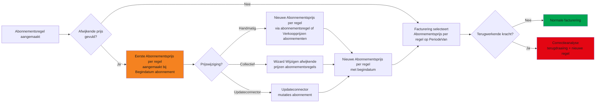
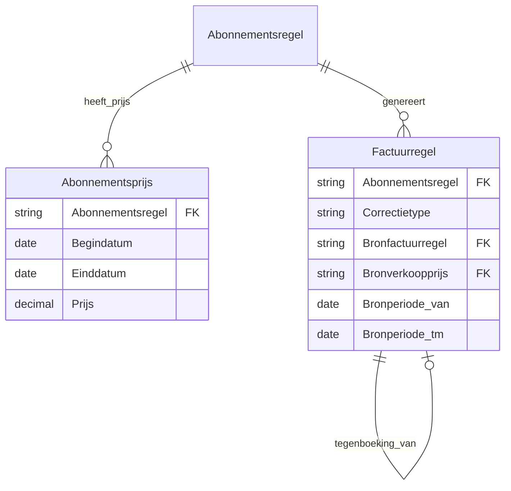

# Ontwerp: [Toezegging Facilicom] Datumafhankelijke abonnementsprijzen met indexering en correcties

| | |
|---|---|
| **Project** | RPT00701 |
| **Versie** | 1.6 |
| **Datum** | 09-04-2026 |
| **Status** | Concept |
| **Module** | Financial Basic – Abonnementen |
| **Gepland voor** | Profit 8/9 |
| **Auteur** | Eric Zaal |

---

## Versiehistorie

| Versie | Datum | Auteur | Wijziging |
|---|---|---|---|
| 1.6 | 09-04-2026 | Eric Zaal | US03 aangescherpt: eerste Abonnementsprijs per regel alleen aanmaken als afwijkende prijs gevuld is. Levenscyclus, acceptatiecriteria, testscenario T13a en dekkingscheck bijgewerkt. |
| 1.5 | 09-04-2026 | Eric Zaal | US14 toegevoegd: Updateconnector mutaties abonnement uitgebreid met optioneel veld Ingangsdatum afwijkende prijs. Componenten, validaties, tests en dekkingscheck bijgewerkt. |
| 1.4 | 09-04-2026 | Eric Zaal | Actie op abonnementsregel hernoemd naar Verkoopprijs. Collectief wijzigen Abonnementsprijzen vervangen door uitbreiding bestaande wizard Wijzigen afwijkende prijzen abonnementsregels met veld Ingangsdatum (conditioneel). US05, componenten, levenscyclus, SOLL-proces, autorisatie, content, help en besluiten aangepast. |
| 1.3 | 07-04-2026 | Eric Zaal | Nieuwe tabel Abonnementsprijs (was: ingang op Verkoopprijzen). Eigen tabel, scherm en collectief wijzigen. Datamodel, US01, menu-item, autorisatie, content, migratie, help en overige referenties aangepast. |
| 1.2 | 07-04-2026 | Eric Zaal | Abonnementsprijzen als nieuwe ingang op Verkoopprijzen (was: aparte tabel). Geen nieuwe tabel; datamodel, US01, menu-item, collectief wijzigen en overige referenties aangepast. |
| 1.1 | 07-04-2026 | Eric Zaal | Abonnementsprijzen als aparte tabel/scherm met menu-item (was: type op Verkoopprijzen). US01 herschreven, Podium-specificatie toegevoegd, US05/datamodel/validaties/autorisatie/content/migratie/help aangepast. Technische policycodes verwijderd uit autorisatie. Dekkingscheck kolomkop gecorrigeerd. |
| 1.0 | 01-04-2026 | Eric Zaal | Review volledig verwerkt: terminologie gestandaardiseerd, mockups toegevoegd, meldingsteksten bij user stories, acceptatiecriteria genummerd, content-checklist en n.v.t.-motivaties toegevoegd, V15 (laatste prijsregel niet verwijderen) |
| 0.9 | 06-03-2026 | Eric Zaal | Hoofdstuk 12 herwerkt volgens help-documentatie skill: doel, voorwaarden, stappenplan, resultaat en veelvoorkomende meldingen |
| 0.8 | 06-03-2026 | Eric Zaal | Review vraag 5 verwerkt: O5 gesloten; bestaande prijsafwijking gedefinieerd als gevuld veld `PrijsAfwijking` op abonnementsregel |
| 0.7 | 06-03-2026 | Eric Zaal | Review vraag 4 verwerkt: O4 gesloten; btw-code op terugdraaiingsregel wordt overgenomen van de bronregel |
| 0.6 | 06-03-2026 | Eric Zaal | Review vraag 3 verwerkt: O3 gesloten; bestaande functionaliteit Collectief wijzigen Verkoopprijzen uitgebreid met Type Abonnementsregel inclusief batch/Profit Server |
| 0.5 | 06-03-2026 | Eric Zaal | Review vraag 2 verwerkt: O2 gesloten; Prijshistorie wordt uitgewerkt als apart tabblad |
| 0.4 | 06-03-2026 | Eric Zaal | Review vraag 1 verwerkt: O1 gesloten en veldnamen Factuurregel definitief vastgelegd |
| 0.3 | 06-03-2026 | Eric Zaal | Review uitgevoerd; helpdocumentatiehoofdstuk toegevoegd en klantsamenvatting gecontroleerd/aangescherpt |
| 0.2 | 04-03-2026 | Eric Zaal | Reviewverwerking: klantsamenvatting toegevoegd, user stories genummerd (US01-US13) en traceability (proces/regels/tests) uitgewerkt |
| 0.1 | 04-03-2026 | Eric Zaal | Initieel concept op basis van Word-ontwerp RPT00701 |

---

## 1. Inleiding

### 1.1 Aanleiding

Abonnementsprijzen wijzigen periodiek (indexering) en soms met terugwerkende kracht. De huidige inrichting maakt het lastig om:

- prijswijzigingen vooruit vast te leggen met een begindatum per abonnementsregel;
- historisch inzicht te behouden;
- correcties voor reeds gefactureerde perioden begrijpelijk te presenteren;
- proforma te laten aansluiten op dezelfde prijslogica als definitieve facturatie;
- te voorkomen dat correcties dubbel ontstaan bij herhaald draaien of gelijktijdig gebruik.

Dit ontwerp voegt een nieuwe tabel **Abonnementsprijs** toe. Zo leg je datumafhankelijke prijzen per abonnementsregel vast in een eigen tabel met eigen scherm.

### 1.2 Vooronderzoek

Het ontwerp voegt een nieuwe tabel Abonnementsprijs toe voor datumafhankelijke prijzen per abonnementsregel. Gesprekken met Facilicom bevestigen:

- Jaarlijkse indexering op basis van een percentage is de meest voorkomende mutatie.
- Indexeringsdata worden soms pas ná de begindatum definitief vastgesteld, wat correcties met terugwerkende kracht noodzakelijk maakt.
- Gebruikers verwachten dat de prijsinvoer op de abonnementsregel zelf blijft werken zoals ze gewend zijn.

### 1.3 Resultaat

De volgende onderdelen worden opgeleverd:

1. **Datumafhankelijke prijs per abonnementsregel** via nieuwe tabel Abonnementsprijs.
2. **Indexering vooruit vastleggen** via handmatige invoer of de bestaande wizard Wijzigen afwijkende prijzen abonnementsregels (uitgebreid met begindatum).
3. **Terugwerkende kracht verwerken** via terugdraaiing (credit) + nieuwe regel (debet) per periode in de definitieve factuurwizard.
4. **Definitieve factuurwizard uitgebreid** met indexcorrecties inclusief startdatum indexering.
5. **Proforma wizard uitgebreid** met dezelfde correctielogica als simulatie (geen opslag).
6. **Detailweergave** "Te corrigeren factuurregels" met kolom Correctiebedrag in stap 3 van de wizard.
7. **Borging** dat indexcorrecties maximaal 1 jaar terugwerken. Als de prijs is gewijzigd, kan de correctie vaker per abonnementsregel-periode worden uitgevoerd.
8. **Uitbreiding wizard Wijzigen afwijkende prijzen abonnementsregels** met veld Begindatum.
9. **Uitbreiding Updateconnector mutaties abonnement** met optioneel veld Begindatum afwijkende prijs.

#### Gekoppelde POA's

<!-- Voeg hier een opsomming toe van gekoppelde POA's indien van toepassing -->

#### AI-functionaliteit

AI kan het indexeringspercentage voorstellen op basis van gepubliceerde CBS-indexcijfers of op basis van historische indexeringspatronen binnen de eigen gegevensverzameling. Daarnaast kan AI afwijkende prijsontwikkelingen per klant signaleren.

### 1.4 Samenvatting voor klant

Met deze wijziging leg je prijswijzigingen per abonnementsregel met begindatum vast en verwerk je terugwerkende correcties gecontroleerd in de wizard. Profit factureert automatisch met de juiste prijs per periode en prijshistorie blijft inzichtelijk.

- Minder handmatig correctiewerk bij prijswijzigingen met terugwerkende kracht.
- Meer controle door éénmaligheidsborging en duidelijke herleidbaarheid per correctie.
- Betere voorspelbaarheid doordat proforma en definitieve facturatie dezelfde prijslogica gebruiken.
- Snellere verwerking van jaarlijkse indexeringen via de wizard Wijzigen afwijkende prijzen abonnementsregels.

### 1.5 Afbakening

- Nieuw menu-item Verkoopprijzen abonnementen met weergave en boekingslay-out
- Prijsinvoer op abonnementsregel (opslag als Abonnementsprijs per regel)
- Uitbreiding wizard Wijzigen afwijkende prijzen abonnementsregels met begindatum
- Uitbreiding Updateconnector mutaties abonnement met optioneel veld Begindatum afwijkende prijs
- Definitieve factuurwizard uitgebreid met indexcorrecties
- Proforma wizard uitgebreid met indexcorrecties (simulatie)
- Correctieset: terugdraaiing + nieuwe regel per periode
- Éénmaligheidsborging per abonnementsregel-periode
- Conversie bestaande prijsafwijkingen naar Abonnementsprijzen per regel

### 1.6 Randvoorwaarden

| Nr | Randvoorwaarde |
|---|---|
| R1 | Performance bij bulkfactureren blijft acceptabel. |
| R2 | Proforma is simulatie: geen opslag, geen journalisering, geen gebruiksvlaggen. |
| R3 | Correcties zijn begrijpelijk voor ontvangers (twee regels per periode). |
| R4 | Correctiesets kunnen niet dubbel ontstaan (unieke sleutel in database). |
| R5 | Indexcorrecties gaan maximaal 1 jaar terug ten opzichte van de peildatum. |
| R6 | Als geen Abonnementsprijs per regel gevonden voor een te factureren periode, dan is de artikelprijs van toepassing (bestaand gedrag). |

### 1.7 Begrippen

| Term | Betekenis |
|---|---|
| Abonnementsregel | Contractregel die periodiek factureert |
| Abonnementsprijs per regel | Record in de tabel Abonnementsprijs, gekoppeld aan één abonnementsregel. Vervangt het bestaande veld Prijsafwijking op de abonnementsregel |
| PeriodeVan / PeriodeTm | Gefactureerde periodegrenzen van een factuurregel |
| Correctieset | Terugdraaiing + nieuwe regel voor één periode |
| Correctiebedrag | Netto verschil (nieuwe bedrag − oude bedrag) |
| MinDatum | Peildatum minus 1 jaar; vroegste grens voor indexcorrecties |
| EffectieveStartdatum | `max(Startdatum indexering, MinDatum)` |
| Startdatum indexering | Door de gebruiker opgegeven begindatum voor correctieanalyse |
| Terugdraaiingsregel | Creditregel op basis van de oorspronkelijke factuurregel (negatief bedrag) |

---

## 2. Globale beschrijving

### 2.1 Levenscyclus Abonnementsprijs per regel



### 2.2 Prijsselectie bij factureren

Voor elke te factureren periode geldt:

```
Zoek Abonnementsprijs per regel waarbij: Begindatum ≤ PeriodeVan
Neem de regel met de meest recente begindatum.
Als geen Abonnementsprijs per regel gevonden → val terug op de artikelprijs (bestaand gedrag).
```

### 2.3 Overzicht getroffen componenten

| Component | Type | Wijziging |
|---|---|---|
| Tabel Abonnementsprijs | Nieuw | Datumafhankelijke verkoopprijs per abonnementsregel; velden: Abonnementsregel, Begindatum, Einddatum, Prijs |
| Menu-item Verkoopprijzen abonnementen | Nieuw | Nieuw menu-item onder Abonnementen; opent weergave Verkoopprijzen abonnementen |
| Weergave Verkoopprijzen abonnementen | Nieuw | Toont alle Abonnementsprijzen per regel met kolommen Abo.nr., Naam, Abonnementsregel, Begindatum, Einddatum, Prijs |
| Boekingslay-out Onderhouden verkoopprijzen abonnementen | Nieuw | Bulk-onderhoud van Abonnementsprijzen per regel; startbaar vanuit weergave Verkoopprijzen abonnementen met multiselect |
| Tabel Factuurregel | Bestaand | Velden: Correctietype, Abonnementsregel, Bronfactuurregel, Bronverkoopprijs, Bronperiode van, Bronperiode t/m |
| Wizard Abonnementen factureren | Bestaand | Stap 1: indexcorrectievelden; stap 3: datasets Indexcorrecties en Te corrigeren factuurregels |
| Wizard Proforma facturen | Bestaand | Stap 1: indexcorrectievelden; laatste stap: dezelfde datasets als simulatie |
| Wizard Wijzigen afwijkende prijzen abonnementsregels | Bestaand | Uitgebreid met veld Begindatum (conditioneel); maakt Abonnementsprijzen per regel aan |
| Abonnementsregelscherm | Bestaand | Prijsinvoer slaat op als Abonnementsprijs per regel; actie Verkoopprijs navigeert naar nieuw scherm |
| Updateconnector mutaties abonnement | Bestaand | Uitgebreid met optioneel veld Begindatum afwijkende prijs; bij gevulde begindatum wordt een Abonnementsprijs per regel aangemaakt |
| Conversieproces | Nieuw | Bestaande prijsafwijkingen omzetten naar Abonnementsprijzen per regel |

---

## 3. User stories

| Nr | User story |
|---|---|
| US01 | Verkoopprijzen abonnementen: nieuw menu-item met weergave en boekingslay-out |
| US02 | Prijs vastleggen vanuit abonnementsregel met behoud van gebruikerservaring |
| US03 | Eerste Abonnementsprijs per regel start op begindatum abonnement (alleen bij gevulde afwijkende prijs) |
| US04 | Factureren kiest Abonnementsprijs per regel op PeriodeVan |
| US05 | Indexering vooruit vastleggen (handmatig en via wizard Wijzigen afwijkende prijzen) |
| US06 | Indexcorrecties verwerken als terugdraaiing + nieuwe regel per periode |
| US07 | Proforma wizard gebruikt dezelfde prijsselectie |
| US08 | Proforma wizard kan indexcorrecties meenemen |
| US09 | Correctie per abonnementsregel-periode maar één keer |
| US10 | Startdatum indexering meegeven bij definitief en proforma |
| US11 | Maximaal 1 jaar terug corrigeren |
| US12 | Detailweergave "Te corrigeren factuurregels" met Correctiebedrag |
| US13 | Conversie bestaande prijsafwijkingen naar Abonnementsprijzen per regel |
| US14 | Updateconnector mutaties abonnement uitgebreid met begindatum afwijkende prijs |

### 3.1 US01 – Verkoopprijzen abonnementen: nieuw menu-item met weergave en boekingslay-out

**Als** financieel beheerder **wil ik** een nieuw menu-item Verkoopprijzen abonnementen met een weergave en boekingslay-out, **zodat** ik datumafhankelijke prijzen per abonnementsregel kan bekijken en beheren.

**Toelichting:** Er komt een nieuw menu-item Verkoopprijzen abonnementen onder Abonnementen. Het menu-item opent een weergave met alle Abonnementsprijzen per regel. Vanuit de weergave start je de boekingslay-out Onderhouden verkoopprijzen abonnementen. Nieuwe Abonnementsprijzen per regel toevoegen kan niet vanuit de weergave; dit gebeurt via de abonnementsregel (US02), de wizard (US05) of de updateconnector (US14). Verwijderen is wel mogelijk vanuit de weergave.

**Functionele uitwerking:**

- Er is een nieuw menu-item Verkoopprijzen abonnementen dat een weergave opent.
- De weergave toont alle Abonnementsprijzen per regel met kolommen: Abo.nr., Naam, Abonnementsregel, Begindatum, Einddatum, Prijs.
- De weergave ondersteunt multiselect. De selectie wordt doorgegeven aan de boekingslay-out.
- Vanuit de weergave start je de boekingslay-out Onderhouden verkoopprijzen abonnementen om geselecteerde prijsregels te bekijken en te wijzigen.
- De weergave heeft geen actie Nieuw. Nieuwe Abonnementsprijzen per regel worden aangemaakt via de abonnementsregel (US02), de wizard Wijzigen afwijkende prijzen abonnementsregels (US05) of de updateconnector mutaties abonnement (US14).
- De weergave heeft een actie Verwijderen waarmee geselecteerde Abonnementsprijzen per regel worden verwijderd.
- Per record zijn de velden: Abonnementsregel (verplicht, lookup), Begindatum (verplicht) en Prijs (verplicht).
- Per abonnementsregel kunnen meerdere Abonnementsprijzen per regel bestaan, elk met een eigen begindatum. Zo bouw je een prijshistorie op.
- Bij factureren bepaalt de begindatum welke prijs van toepassing is op een periode (zie US04).
- Een bestaande Abonnementsprijs per regel mag altijd worden gewijzigd (prijs en Begindatum). Bij wijziging van een reeds gebruikte prijs pikt de correctieanalyse (US06) het verschil op bij de eerstvolgende factuurrun met indexcorrecties.

**Acceptatiecriteria:**

1. Menu-item Verkoopprijzen abonnementen is beschikbaar onder Abonnementen.
2. Het menu-item opent een weergave met alle Abonnementsprijzen per regel.
3. De weergave ondersteunt multiselect; de selectie wordt doorgegeven aan de boekingslay-out.
4. Vanuit de weergave is de boekingslay-out Onderhouden verkoopprijzen abonnementen te starten.
5. De weergave heeft geen actie Nieuw.
6. De weergave heeft een actie Verwijderen.
7. Het veld Abonnementsregel is zichtbaar en verplicht.
8. Opslaan is alleen mogelijk als zowel Begindatum als Prijs gevuld zijn.
9. Twee Abonnementsprijzen per regel met dezelfde begindatum voor dezelfde abonnementsregel worden geblokkeerd met een melding.
10. Abonnementsprijzen per regel zijn terug te vinden via de weergave Verkoopprijzen abonnementen.
11. De laatste Abonnementsprijs per regel van een abonnementsregel kan niet worden verwijderd.
12. Een bestaande Abonnementsprijs per regel is wijzigbaar via de boekingslay-out; het prijsverschil wordt verwerkt via indexcorrecties.
13. Bij het aanmaken of wijzigen van een Abonnementsprijs per regel krijgt de vorige prijsregel (chronologisch) automatisch een einddatum (dag vóór de begindatum van de nieuwe regel). De meest recente prijsregel heeft geen einddatum.

#### Meldingsteksten

| Situatie | Melding |
|---|---|
| Dubbele begindatum | Er bestaat al een Abonnementsprijs per regel met deze begindatum voor de geselecteerde abonnementsregel. |
| Laatste prijsregel verwijderen | De laatste Abonnementsprijs per regel kan niet worden verwijderd. Er moet altijd minimaal één prijsregel per abonnementsregel bestaan. |

#### Weergave Verkoopprijzen abonnementen

**Gegevensverzameling:** Verkoopprijzen abonnementen

**Filter:** Geen standaardfilter.

**Filterautorisatie:** Niet van toepassing.

**Kolommen:**

| Kolomlabel | Sortering | Filter |
|---|---|---|
| Abo.nr. | 1 | ja |
| Naam | | ja |
| Abonnementsregel | 2 | ja |
| Begindatum | 3 | ja |
| Einddatum | | ja |
| Prijs | | nee |

**Standaardsortering:** Abo.nr. (oplopend), Abonnementsregel (oplopend), Begindatum (oplopend).

**Multiselect:** Ja. De selectie wordt doorgegeven aan de boekingslay-out.

**Acties:**

| Actie | Beschrijving | Primaire actie? | Autorisatie | Regelgebonden? | Uitzonderingen |
|---|---|---|---|---|---|
| Onderhouden verkoopprijzen abonnementen | Opent de boekingslay-out Onderhouden verkoopprijzen abonnementen met de geselecteerde Abonnementsprijzen per regel | Ja | Wel autoriseerbaar; autorisatiepad = Abonnementen onderhouden | Ja, meerdere of enkele regels | — |
| Verwijderen | Verwijdert de geselecteerde Abonnementsprijzen per regel | Ja | Wel autoriseerbaar; autorisatiepad = Abonnementen onderhouden | Ja, meerdere of enkele regels | Laatste Abonnementsprijs per regel van een abonnementsregel → blokkeren met melding: "De laatste Abonnementsprijs per regel kan niet worden verwijderd. Er moet altijd minimaal één prijsregel per abonnementsregel bestaan." |

> De weergave heeft geen actie Nieuw. Nieuwe Abonnementsprijzen per regel worden aangemaakt via de abonnementsregel (US02), de wizard (US05) of de updateconnector (US14).

##### Meldingen

| Type | Veldlabel / scope | Conditie | Tekst |
|---|---|---|---|
| validatie | weergave | Laatste prijsregel verwijderen | De laatste Abonnementsprijs per regel kan niet worden verwijderd. Er moet altijd minimaal één prijsregel per abonnementsregel bestaan. |

**Mockup weergave Verkoopprijzen abonnementen:**

```
  Acties: [Onderhouden verkoopprijzen abonnementen]  [Verwijderen]

┌────┬────────────┬──────────────────┬──────────────────┬──────────────┬──────────────┬──────────────┐
│ ☐  │ Abo.nr.    │ Naam             │ Abonnementsregel │ Begindatum │ Einddatum    │ Prijs        │
├────┼────────────┼──────────────────┼──────────────────┼──────────────┼──────────────┼──────────────┤
│ ☑  │ AB-1001    │ Facilicom BV     │ Schoonmaak       │ 01-01-2025   │ 31-12-2025   │      125,00  │
│ ☑  │ AB-1001    │ Facilicom BV     │ Schoonmaak       │ 01-01-2026   │              │      132,50  │
│ ☐  │ AB-1001    │ Facilicom BV     │ Beveiliging      │ 01-01-2025   │ 31-12-2025   │      200,00  │
│ ☐  │ AB-1001    │ Facilicom BV     │ Beveiliging      │ 01-01-2026   │              │      212,00  │
│ ☐  │ AB-1002    │ Bakker BV        │ Catering         │ 01-01-2026   │              │       89,25  │
└────┴────────────┴──────────────────┴──────────────────┴──────────────┴──────────────┴──────────────┘
```

#### Boekingslay-out Onderhouden verkoopprijzen abonnementen

De boekingslay-out wordt gestart vanuit de weergave Verkoopprijzen abonnementen. De geselecteerde Abonnementsprijzen per regel worden als regels geladen.

**Regelvelden:**

| Veld | Type | Verplicht | Readonly | Toelichting |
|---|---|---|---|---|
| Abonnementsregel | lookup | ja | ja | Koppeling naar de abonnementsregel waarvoor de prijs geldt |
| Begindatum | datum | ja | nee | Datum waarop de prijs ingaat |
| Einddatum | datum | nee | ja | Dag vóór de begindatum van de volgende prijsregel; leeg bij de meest recente prijs |
| Prijs | bedrag | ja | nee | Verkoopprijs exclusief btw |

**Multiselect regels:** Nee.

**Sorteeropties:** Eenmalige sortering (niet opgeslagen in profiel) op Abonnementsregel + Begindatum.

##### Meldingen

| Type | Veldlabel / scope | Conditie | Tekst |
|---|---|---|---|
| validatie | Abonnementsregel + Begindatum | Dubbele begindatum voor dezelfde abonnementsregel | Er bestaat al een Abonnementsprijs per regel met deze begindatum voor de geselecteerde abonnementsregel. |

**Mockup boekingslay-out Onderhouden verkoopprijzen abonnementen:**

```
┌───────────────────────────────────────────────────────────────────────────────────────┐
│  Onderhouden verkoopprijzen abonnementen                                           │
├──────────────────────┬──────────────┬──────────────┬──────────────┬──────────────────┤
│ Abonnementsregel     │ Begindatum │ Einddatum    │ Prijs        │                  │
├──────────────────────┼──────────────┼──────────────┼──────────────┼──────────────────┤
│ AB-1001 / Schoonmaak │ 01-01-2025   │ 31-12-2025   │      125,00  │                  │
│ AB-1001 / Schoonmaak │ 01-01-2026   │              │      132,50  │ ← wijzigbaar     │
└──────────────────────┴──────────────┴──────────────┴──────────────┴──────────────────┘
```

---

### 3.2 US02 – Prijs vastleggen vanuit abonnementsregel met behoud van gebruikerservaring

**Als** gebruiker **wil ik** een prijs op de abonnementsregel kunnen invullen zoals ik gewend ben, **zodat** mijn werkwijze niet verandert.

**Toelichting:** Gebruikers willen niet verplicht via de weergave Verkoopprijzen abonnementen werken. De prijsinvoer op de regel blijft, maar opslag gebeurt als Abonnementsprijs per regel.

**Functionele uitwerking:**

- Op de abonnementsregel blijft het veld Afwijkende prijs beschikbaar. Dit veld toont de huidige geldige Abonnementsprijs per regel.
- Bij wijziging van het veld Afwijkende prijs bepaalt Profit wat er gebeurt op basis van bestaande Abonnementsprijzen per regel met begindatum ≥ vandaag:

| Situatie | Gedrag |
|---|---|
| Geen Abonnementsprijs per regel met begindatum ≥ vandaag | Nieuwe Abonnementsprijs per regel aanmaken met begindatum = vandaag |
| Precies één Abonnementsprijs per regel met begindatum ≥ vandaag | Prijs op dat bestaande record aanpassen |
| Meerdere Abonnementsprijzen per regel met begindatum ≥ vandaag | Wizard starten zodat de gebruiker kiest welke prijsregel wordt aangepast |

- Bij leegmaken van het veld Afwijkende prijs bepaalt Profit wat er gebeurt op basis van het totale aantal Abonnementsprijzen per regel voor de abonnementsregel:

| Situatie | Gedrag |
|---|---|
| 0 of 1 Abonnementsprijs per regel | Bij opslaan wordt de Abonnementsprijs per regel verwijderd (indien aanwezig). Facturering gebruikt de artikelprijs |
| Meerdere Abonnementsprijzen per regel | Leegmaken is niet toegestaan. Melding dat de gebruiker prijzen kan aanpassen via de actie Verkoopprijs op de abonnementsregel |

**Acceptatiecriteria:**

1. Gebruiker hoeft niet naar Verkoopprijzen abonnementen om een prijs vast te leggen.
2. Na opslaan is een Abonnementsprijs per regel aangemaakt of aangepast.
3. Bij 0 toekomstige prijzen: Begindatum = vandaag, zonder extra dialoog.
4. Bij 1 toekomstige prijs: prijs direct overschreven, zonder extra dialoog.
5. Bij meerdere toekomstige prijzen: wizard toont de kandidaten en de gebruiker kiest.
6. Historie blijft bestaan bij latere wijzigingen.
7. Er is een actie "Verkoopprijs" op de abonnementsregel die navigeert naar de weergave Verkoopprijzen abonnementen, gefilterd op de geselecteerde abonnementsregel.
8. Bij leegmaken van Afwijkende prijs met 0 of 1 prijsregel: de Abonnementsprijs per regel wordt verwijderd bij opslaan.
9. Bij leegmaken van Afwijkende prijs met meerdere prijsregels: opslaan wordt geblokkeerd met een melding.

#### Meldingsteksten

| Situatie | Melding |
|---|---|
| Leegmaken afwijkende prijs bij meerdere prijsregels | De afwijkende prijs kan niet worden leeggemaakt omdat er meerdere prijsregels bestaan. Gebruik de actie Verkoopprijs om prijzen aan te passen. |

**Scherm en gedrag:**

Vanuit de abonnementsregel is een actie "Verkoopprijs" beschikbaar. Deze actie opent de weergave Verkoopprijzen abonnementen, gefilterd op de geselecteerde abonnementsregel. De gebruiker ziet daar alle Abonnementsprijzen per regel en kan ze bekijken of wijzigen via de boekingslay-out.

---

### 3.3 US03 – Eerste Abonnementsprijs per regel start op begindatum abonnement

**Als** gebruiker **wil ik** dat bij het eerste vastleggen van een prijs voor een abonnementsregel de begindatum automatisch de begindatum van het abonnement is, **zodat** de prijs vanaf contractstart klopt.

**Toelichting:** Dit voorkomt dat er per ongeluk een prijs "vanaf vandaag" ontstaat terwijl het contract al eerder startte. De automatische aanmaak geldt alleen als het veld Afwijkende prijs gevuld is.

**Functionele uitwerking:**

- Als er nog geen Abonnementsprijs per regel bestaat voor de abonnementsregel én het veld Afwijkende prijs is gevuld: Begindatum = begindatum abonnement (uit kop of regelcontext).
- Als het veld Afwijkende prijs leeg is, wordt geen Abonnementsprijs per regel aangemaakt.
- Deze datum wordt niet als extra invoerveld gevraagd (geen UX-impact).

**Acceptatiecriteria:**

1. Eerste Abonnementsprijs per regel krijgt standaard Begindatum = begindatum abonnement, mits Afwijkende prijs gevuld is.
2. Als Afwijkende prijs leeg is, wordt geen Abonnementsprijs per regel aangemaakt.
3. Als begindatum abonnement wordt aangepast vóór facturatie, blijft prijsselectie consistent (prijs is datumafhankelijk; beheerder kan zo nodig prijsregels aanpassen via prijshistorie).

---

### 3.4 US04 – Factureren kiest Abonnementsprijs per regel op PeriodeVan

**Als** financieel medewerker **wil ik** dat bij factureren automatisch de juiste Abonnementsprijs per regel wordt gekozen op basis van PeriodeVan, **zodat** facturen altijd met de juiste datumafhankelijke prijs worden opgebouwd.

**Toelichting:** Dit is de kern: datumwerking van de prijs.

**Functionele uitwerking:**

- Voor elke te factureren periode: selecteer Abonnementsprijs per regel met begindatum ≤ PeriodeVan; neem de regel met de meest recente begindatum.
- Als er geen Abonnementsprijs per regel gevonden wordt: val terug op de artikelprijs (bestaand gedrag). De Abonnementsprijs per regel vervangt het veld Afwijkende prijs; als die niet bestaat factureer je met de artikelprijs.

**Acceptatiecriteria:**

1. Bij meerdere Abonnementsprijzen per regel wordt de juiste prijs toegepast per periode.
2. Bij ontbreken van een Abonnementsprijs per regel voor een te factureren periode wordt de artikelprijs gebruikt.

---

### 3.5 US05 – Indexering vooruit vastleggen (handmatig en collectief)

**Als** financieel medewerker **wil ik** indexeringen met een toekomstige Begindatum kunnen vastleggen voor meerdere abonnementsregels tegelijk, **zodat** prijzen automatisch wijzigen op de afgesproken datum.

**Toelichting:** Dit is het "plannen" van indexering. De bestaande wizard Wijzigen afwijkende prijzen abonnementsregels op de weergave Prijswijzigingen abonnementsregels wordt uitgebreid met een veld Begindatum. De wizard maakt Abonnementsprijzen per regel aan in plaats van de afwijkende prijs direct te overschrijven.

**Functionele uitwerking:**

- De bestaande wizard Wijzigen afwijkende prijzen abonnementsregels op de weergave Prijswijzigingen abonnementsregels krijgt een nieuw vinkje "Met begindatum".
- Als het vinkje aan staat verschijnt het veld Begindatum (verplicht).
- De wizard behoudt de bestaande velden: Percentage, Vast bedrag, Overnemen van artikel, Peildatum, Ook overnemen als afwijkende prijs leeg is, Afronding.
- Als het vinkje "Met begindatum" aan staat: de wizard maakt per geselecteerde abonnementsregel een nieuwe Abonnementsprijs per regel aan met de opgegeven begindatum en de berekende prijs.
- Als het vinkje uit staat: de wizard werkt zoals voorheen (bestaand gedrag).

**Acceptatiecriteria:**

1. Wizard Wijzigen afwijkende prijzen abonnementsregels is beschikbaar op de weergave Prijswijzigingen abonnementsregels.
2. Vinkje "Met begindatum" is beschikbaar in de wizard.
3. Als het vinkje aan staat is Begindatum zichtbaar en verplicht.
4. Als het vinkje uit staat is Begindatum verborgen en is het gedrag ongewijzigd.
5. Resultaat is zichtbaar in prijshistorie per abonnementsregel.
6. Bestaande Abonnementsprijs per regel met dezelfde begindatum kan niet dubbel ontstaan (wordt geblokkeerd of gemeld).
7. De vorige Abonnementsprijs per regel krijgt automatisch een einddatum (dag vóór de opgegeven begindatum).

#### Podium-specificatie

**Schermtype:** DetailPage (uitbreiding bestaande wizard)

| Tabblad | Sectie-id | Veldgroeptitel | Veldlabel | Podium-type | Verplicht | Readonly | Cond. verplicht | Actief als | Groep actief als | Tooltip | Placeholder | Standaardwaarde | Keuzelijst-bron | Status | Mock-waarde |
|---|---|---|---|---|---|---|---|---|---|---|---|---|---|---|---|
| - | algemeen | Algemeen | Met begindatum | yesNo | nee | nee | - | - | - | Maak een Abonnementsprijs per regel aan met een begindatum in plaats van de afwijkende prijs direct te wijzigen | - | Nee | - | nieuw | Ja |
| - | algemeen | Algemeen | Begindatum | date | nee | nee | Met begindatum = Ja | Met begindatum = Ja | - | Datum waarop de nieuwe prijs ingaat | - | - | - | nieuw | 01-01-2026 |

##### Meldingen

| Type | Veldlabel / scope | Conditie | Tekst |
|---|---|---|---|
| validatie | Begindatum | Dubbele begindatum voor een abonnementsregel in de selectie | Er bestaat al een Abonnementsprijs per regel met deze begindatum voor abonnementsregel {abonnementsregel}. |

**Mockup Wijzigen afwijkende prijzen abonnementsregels (uitgebreid):**

```
┌─────────────────────────────────────────────────────────────────────┐
│  Wijzigen afwijkende prijzen abonnementsregels                    │
├─────────────────────────────────────────────────────────────────────┤
│  Algemeen                                                         │
│  Percentage             [                      ]                  │
│  Vast bedrag            [                      ]                  │
│  Overnemen van artikel  [ ]                                       │
│  Peildatum              [                      ]                  │
│  Ook overnemen als afwijkende prijs leeg is  [ ]                  │
│                                                                   │
│  [✓] Met begindatum                                             │
│  Begindatum           [01-01-2026            ]                  │
│                                                                   │
│  Afronding                                                        │
│  ○ Geen                                                           │
│  ○ 5 cent                                                         │
│  ○ 10 cent                                                        │
│  ○ 50 cent                                                        │
│  ○ hele euro                                                      │
│  ○ Vijf euro                                                      │
└─────────────────────────────────────────────────────────────────────┘
```

---

### 3.6 US06 – Indexcorrecties verwerken als terugdraaiing + nieuwe regel per periode

**Als** financieel medewerker **wil ik** prijswijzigingen met terugwerkende kracht kunnen verwerken via een terugdraaiingsregel en een nieuwe regel per periode, **zodat** de ontvanger begrijpt wat er wordt gecorrigeerd.

**Toelichting:** Een "verschilregel" is vaak onduidelijk. Twee regels (credit + debet) maakt het verklaarbaar.

**Functionele uitwerking:**

- In de definitieve factuurwizard: optie "Indexcorrecties meenemen".
- Voor elke te corrigeren periode:
  - terugdraaiingsregel (credit) op basis van de oorspronkelijke factuurregel (zelfde context/kenmerken);
  - nieuwe regel (debet) met de nieuwe prijs (zelfde context/kenmerken).
- Omschrijvingen bevatten periode en label (terugdraaiing / nieuwe prijs).

**Acceptatiecriteria:**

1. Correcties verschijnen op de nieuwe factuur als twee regels per periode.
2. Terugdraaiingsregel is negatief en volgt dezelfde btw/grootboek/dimensiecontext als de oorspronkelijke regel.
3. Nieuwe regel heeft de nieuwe prijs en dezelfde context als de oorspronkelijke regel.
4. Periode is zichtbaar in omschrijving.
5. Correctieregels hebben traceerbaarheid (bronfactuurregel en bronperiode).

**Mockup factuurregels met correctieset:**

```
┌──────────────────────────────────────────────────────────────────────────────────┐
│  Factuur F-2026-0412 – Facilicom BV                                            │
├──────────────────────────────────────────────────────────────────────────────────┤
│  Omschrijving                                 Aantal   Prijs     Bedrag        │
│  ─────────────────────────────────────────────────────────────────────────────── │
│  Schoonmaak april 2026                           1     132,50     132,50       │
│                                                                                │
│  Indexcorrectie terugdraaiing 01-2026            1    -125,00    -125,00       │
│  Indexcorrectie nieuwe prijs  01-2026            1     132,50     132,50       │
│  Indexcorrectie terugdraaiing 02-2026            1    -125,00    -125,00       │
│  Indexcorrectie nieuwe prijs  02-2026            1     132,50     132,50       │
│  Indexcorrectie terugdraaiing 03-2026            1    -125,00    -125,00       │
│  Indexcorrectie nieuwe prijs  03-2026            1     132,50     132,50       │
│  ─────────────────────────────────────────────────────────────────────────────── │
│  Totaal                                                           155,00       │
└──────────────────────────────────────────────────────────────────────────────────┘
```

---

### 3.7 US07 – Proforma wizard gebruikt dezelfde prijsselectie

**Als** financieel medewerker **wil ik** dat de proforma wizard dezelfde prijsselectie gebruikt als definitieve facturatie, **zodat** proforma bedragen overeenkomen met definitief.

**Toelichting:** Proforma moet een betrouwbare simulatie zijn.

**Functionele uitwerking:**

- Proforma wizard gebruikt dezelfde prijsselectie op PeriodeVan.
- Proforma maakt geen definitieve factuurrecords en journaliseert niet.

**Acceptatiecriteria:**

1. Proforma toont dezelfde bedragen als definitief zou opleveren (bij gelijke input).
2. Proforma heeft geen database-effect op facturen/journalisering.
3. Proforma heeft geen effect op Abonnementsprijzen.

---

### 3.8 US08 – Proforma wizard kan indexcorrecties meenemen

**Als** financieel medewerker **wil ik** in de proforma wizard indexcorrecties kunnen meenemen, **zodat** ik het effect van terugwerkende prijswijzigingen kan beoordelen vóór definitieve verwerking.

**Functionele uitwerking:**

- Proforma wizard krijgt optie "Indexcorrecties meenemen".
- Proforma toont correctiesets op dezelfde manier (terugdraaiing + nieuwe regel), maar alleen als simulatie.

**Acceptatiecriteria:**

1. Proforma toont correctieregels als twee regels per periode.
2. Geen opslag/journalisering.
3. Periode en labels zijn zichtbaar.
4. Reeds verwerkte perioden worden niet als "nieuw" gepresenteerd.

---

### 3.9 US09 – Correctie per abonnementsregel-periode maar één keer

**Als** financieel medewerker **wil ik** dat een indexcorrectie voor een abonnementsregel en periode niet opnieuw verwerkt kan worden, **zodat** ik geen dubbele correctieregels krijg bij herhaalde runs of gelijktijdig gebruik.

**Functionele uitwerking:**

- Tijdens analyse krijgt elke kandidaat een status: Nieuw / Al verwerkt / Onvolledig.
- "Al verwerkt" is niet selecteerbaar.
- Database borgt éénmaligheid met een unieke sleutel op de "nieuwe prijs"-correctieregel.

**Acceptatiecriteria:**

1. Een reeds gecorrigeerde periode verschijnt als "Al verwerkt" en kan niet opnieuw worden aangevinkt.
2. Bij gelijktijdige runs kan slechts één correctieset worden opgeslagen.
3. Als een tweede run toch probeert op te slaan, wordt dit overgeslagen met logging/melding.
4. Correctieregels worden niet opnieuw als bron voor analyse gebruikt.

---

### 3.10 US10 – Startdatum indexering meegeven bij definitief en proforma

**Als** financieel medewerker **wil ik** bij het draaien van de factuurwizard en de proforma wizard een startdatum indexering kunnen meegeven, **zodat** ik kan bepalen vanaf welke periode correcties worden meegenomen.

**Functionele uitwerking:**

- Stap 1 van beide wizards krijgt veld "Startdatum indexering".
- Alleen zichtbaar als "Indexcorrecties meenemen" aan staat.
- Zodra "Indexcorrecties meenemen" aan staat is Startdatum indexering verplicht.
- Analysefilter: neem alleen perioden met PeriodeVan ≥ startdatum (binnen de 1-jaar grens).

**Acceptatiecriteria:**

1. Startdatum indexering is beschikbaar bij indexcorrecties.
2. Startdatum indexering is verplicht zodra indexcorrecties zijn ingeschakeld.
3. De datasets tonen alleen correcties binnen de ingestelde startdatum.
4. Wijziging startdatum triggert herberekening van overzichten.

#### Meldingsteksten

| Situatie | Melding |
|---|---|
| Startdatum te vroeg | Startdatum indexering mag niet vóór {MinDatum} liggen (peildatum − 1 jaar). |

#### Podium-specificatie

**Schermtype:** DetailPage (uitbreiding bestaande wizardstap 1)

| Tabblad | Sectie-id | Veldgroeptitel | Veldlabel | Podium-type | Verplicht | Readonly | Cond. verplicht | Actief als | Groep actief als | Tooltip | Placeholder | Standaardwaarde | Keuzelijst-bron | Status | Mock-waarde |
|---|---|---|---|---|---|---|---|---|---|---|---|---|---|---|---|
| - | indexcorrecties | Indexcorrecties | Indexcorrecties meenemen | yesNo | nee | nee | - | - | - | Neem correcties met terugwerkende kracht op in de analyse | - | Nee | - | nieuw | Ja |
| - | indexcorrecties | Indexcorrecties | Startdatum indexering | date | nee | nee | Indexcorrecties meenemen = Ja | Indexcorrecties meenemen = Ja | - | Bepaal vanaf welke datum perioden worden beoordeeld | - | - | - | nieuw | 01-01-2026 |

##### Meldingen

| Type | Veldlabel / scope | Conditie | Tekst |
|---|---|---|---|
| validatie | Startdatum indexering | Startdatum &lt; Peildatum − 1 jaar | Startdatum indexering mag niet vóór {MinDatum} liggen (peildatum − 1 jaar). |

---

### 3.11 US11 – Maximaal 1 jaar terug corrigeren

**Als** product owner **wil ik** dat indexcorrecties maximaal 1 jaar terug kunnen worden uitgevoerd, **zodat** correcties beheersbaar blijven en niet leiden tot grote historische correctiestromen.

**Functionele uitwerking:**

- MinDatum = Peildatum − 1 jaar.
- Startdatum indexering mag niet vóór MinDatum.
- EffectieveStartdatum = `max(Startdatum indexering, MinDatum)`.
- Analyse hanteert altijd EffectieveStartdatum.

**Acceptatiecriteria:**

1. Startdatum eerder dan MinDatum geeft foutmelding en blokkeert vervolg.
2. Zonder geldige startdatum kan de wizard niet verder wanneer indexcorrecties zijn ingeschakeld.
3. Proforma en definitief volgen dezelfde regel.

#### Meldingsteksten

| Situatie | Melding |
|---|---|
| Startdatum te vroeg | Startdatum indexering mag niet vóór {MinDatum} liggen (peildatum − 1 jaar). |

---

### 3.12 US12 – Detailweergave "Te corrigeren factuurregels" met Correctiebedrag

**Als** financieel medewerker **wil ik** in de laatste stap van de wizard een detailweergave zien met de te corrigeren factuurregels en een kolom Correctiebedrag, **zodat** ik vóór verwerking inzicht heb in welke bronregels worden geraakt en wat het netto effect per regel is.

**Functionele uitwerking:**

- Als "Indexcorrecties meenemen" aan staat én een geldige Startdatum indexering is ingevoerd: in stap 3 verschijnt extra dataset "Te corrigeren factuurregels".
- Deze dataset toont op bronfactuurregel-niveau: bronfactuur, periode, oude prijs/bedrag, nieuwe prijs/bedrag, correctiebedrag, status.

**Acceptatiecriteria:**

1. Dataset verschijnt alleen onder de genoemde conditie.
2. Correctiebedrag = nieuwe bedrag − oude bedrag.
3. Status "Al verwerkt" is niet selecteerbaar.
4. Selectie (Meenemen) is consistent met de samenvattingsdataset (Indexcorrecties).

#### Podium-specificatie

**Schermtype:** ListPage

| Kolom-id | Kolomkop | Podium-type | Sorteerbaar | Filter | Breedte | Status | Mock-waarde |
|---|---|---|---|---|---|---|---|
| bronfactuur | Bronfactuur | text | ja | ja | 100 | nieuw | F-0389 |
| abonr | Abo.nr. | text | ja | ja | 100 | nieuw | AB-1001 |
| abonregel | Abonnementsregel | text | ja | ja | 120 | nieuw | Schoonmaak |
| periodevn | Periode van | date | ja | ja | 90 | nieuw | 01-2026 |
| periodetm | Periode t/m | date | ja | ja | 90 | nieuw | 01-2026 |
| oudeprijs | Oude prijs | currencyAmount | nee | nee | 100 | nieuw | 125,00 |
| oudbedrag | Oud bedrag | currencyAmount | nee | nee | 100 | nieuw | 125,00 |
| nieuweprijs | Nieuwe prijs | currencyAmount | nee | nee | 100 | nieuw | 132,50 |
| corrbedrag | Correctiebedrag | currencyAmount | nee | nee | 110 | nieuw | 7,50 |
| status | Status | text | ja | ja | 100 | nieuw | Nieuw |
| meenemen | Meenemen | yesNo | nee | nee | 80 | nieuw | Ja |

**Mockup dataset Te corrigeren factuurregels (stap 3):**

```
┌───────────┬────────────┬────────────┬───────────┬───────────┬────────────┬────────────┬──────────────┬──────────────┐
│ Bronfact. │ Abo.nr.    │ Abonnem.r. │ Per. van  │ Per. t/m  │ Oude prijs │ Oud bedrag │ Nieuwe prijs │ Corr.bedrag  │
├───────────┼────────────┼────────────┼───────────┼───────────┼────────────┼────────────┼──────────────┼──────────────┤
│ F-0389    │ AB-1001    │ Schoonm.   │ 01-2026   │ 01-2026   │     125,00 │     125,00 │       132,50 │         7,50 │
│ F-0390    │ AB-1001    │ Schoonm.   │ 02-2026   │ 02-2026   │     125,00 │     125,00 │       132,50 │         7,50 │
│ F-0391    │ AB-1001    │ Schoonm.   │ 03-2026   │ 03-2026   │     125,00 │     125,00 │       132,50 │         7,50 │
│ F-0389    │ AB-1002    │ Catering   │ 01-2026   │ 01-2026   │      85,00 │      85,00 │        89,25 │         4,25 │
└───────────┴────────────┴────────────┴───────────┴───────────┴────────────┴────────────┴──────────────┴──────────────┘
  Status: Nieuw         [✓] Meenemen
  Status: Nieuw         [✓] Meenemen
  Status: Nieuw         [✓] Meenemen
  Status: Al verwerkt   [ ] (niet selecteerbaar)
```

---

### 3.13 US13 – Conversie bestaande prijsafwijkingen naar Abonnementsprijzen per regel

**Als** systeem **wil ik** dat bestaande prijsafwijkingen automatisch worden omgezet naar Abonnementsprijzen per regel, **zodat** klanten na upgrade direct werken met de nieuwe prijsstructuur zonder handmatige aanpassing.

**Functionele uitwerking:**

- Conversie zoekt abonnementsregels met bestaande "afwijkende prijs"-bron (veld Prijsafwijking gevuld).
- Als nog geen Abonnementsprijs per regel bestaat: maak Abonnementsprijs per regel aan met begindatum = begindatum abonnement en prijs = waarde uit Prijsafwijking.
- Na conversie vervalt het veld Prijsafwijking op de abonnementsregel. De Abonnementsprijs per regel is de enige bron voor de prijs.

**Acceptatiecriteria:**

1. Per abonnementsregel met gevuld veld Prijsafwijking wordt een Abonnementsprijs per regel aangemaakt met begindatum = Begindatum abonnement.
2. Als er al een Abonnementsprijs per regel bestaat voor de abonnementsregel, wordt de conversie overgeslagen.
3. Na conversie wordt het veld Prijsafwijking niet meer gebruikt; de Abonnementsprijs per regel is leidend.

---

### 3.14 US14 – Updateconnector mutaties abonnement uitgebreid met begindatum afwijkende prijs

**Als** contractbeheerder **wil ik** bij het aanleveren van abonnementsmutaties via de updateconnector een begindatum voor de afwijkende prijs kunnen meegeven, **zodat** ik via de connector direct Abonnementsprijzen per regel kan aanmaken met de juiste Begindatum.

**Toelichting:** De bestaande Updateconnector mutaties abonnement wordt uitgebreid. Het veld Begindatum afwijkende prijs is optioneel. Als het veld gevuld is maakt de updateconnector een Abonnementsprijs per regel aan. Als het veld leeg is werkt de updateconnector zoals voorheen.

**Functionele uitwerking:**

- De updateconnector krijgt een nieuw optioneel veld Begindatum afwijkende prijs.
- Bij een gevulde begindatum:
  - Het systeem maakt een Abonnementsprijs per regel aan met de opgegeven begindatum en de afwijkende prijs uit de aanlevering.
  - Als er al een Abonnementsprijs per regel bestaat met dezelfde begindatum voor de abonnementsregel, wordt de prijs overschreven.
- Bij een lege begindatum:
  - De updateconnector werkt zoals voorheen (bestaand gedrag).

**Acceptatiecriteria:**

1. Het veld Begindatum afwijkende prijs is beschikbaar in de updateconnector.
2. Het veld is optioneel.
3. Bij gevulde begindatum wordt een Abonnementsprijs per regel aangemaakt met die Begindatum en de opgegeven prijs.
4. Bij een bestaande Abonnementsprijs per regel met dezelfde begindatum wordt de prijs overschreven.
5. Bij lege begindatum is het gedrag ongewijzigd.
6. Begindatum &lt; begindatum abonnement wordt geblokkeerd met een melding.
7. De vorige Abonnementsprijs per regel krijgt automatisch een einddatum (dag vóór de opgegeven begindatum).

#### Meldingsteksten

| Situatie | Melding |
|---|---|
| Begindatum &lt; begindatum abonnement | Begindatum afwijkende prijs mag niet vóór de begindatum van het abonnement liggen. |

---

## 4. Procesbeschrijving

### 4.1 IST: huidige situatie

Prijswijzigingen worden direct op de abonnementsregel doorgevoerd. Er is geen prijshistorie; het is niet herleidbaar welke prijs gold op een specifieke factuurdatum. Terugwerkende correcties worden handmatig verwerkt.

| Stap | Actor | Actie | Resultaat |
|---|---|---|---|
| 1 | Contractbeheerder | Ontvangt bevestiging nieuwe prijs per begindatum | Prijs bekend, niet in Profit |
| 2 | Contractbeheerder | Wijzigt prijs op abonnementsregel direct | Vorige prijs overschreven; geen historisch spoor |
| 3 | Systeem | Factureringsverwerking gebruikt nieuwe prijs | Correct voor nieuwe perioden |
| 4 | Contractbeheerder | Berekent handmatig verschil voor al gefactureerde perioden | Foutgevoelig; buiten Profit |

### 4.2 SOLL: gewenste situatie

| Stap | Actor | Actie | Validatie | Systeemactie | US |
|---|---|---|---|---|---|
| 0 | Systeem | Voert conversie bestaande prijsafwijkingen uit bij release | Alleen als nog geen Abonnementsprijs per regel bestaat | Abonnementsprijs per regel aangemaakt | US13 |
| 1 | Contractbeheerder | Ontvangt bevestiging nieuwe prijs per begindatum | — | — | US05 |
| 2 | Contractbeheerder | Legt nieuwe Abonnementsprijs per regel vast via abonnementsregel, Verkoopprijzen abonnementen, wizard Wijzigen afwijkende prijzen abonnementsregels of updateconnector mutaties | Dubbele begindatum → blokkeren; Begindatum &lt; begindatum abonnement → blokkeren | Nieuwe Abonnementsprijs per regel aangemaakt | US01, US02, US03, US05, US14 |
| 3 | Systeem | Selecteert Abonnementsprijs per regel op `PeriodeVan` bij factureren | Abonnementsprijs per regel aanwezig voor periode | Factuurregel wordt opgebouwd met meest recente geldige Abonnementsprijs per regel | US04 |
| 4 | Financieel medewerker | Start factuurwizard met vink Indexcorrecties meenemen + Startdatum indexering | Startdatum ≥ MinDatum (peildatum – 1 jaar) | Correctieanalyse berekent EffectieveStartdatum = max(Startdatum, MinDatum) | US10, US11 |
| 5 | Systeem | Toont dataset Indexcorrecties in stap 3 | Status Nieuw / Al verwerkt / Onvolledig | Preview per periode met Correctiebedrag | US09, US12 |
| 6 | Financieel medewerker | Selecteert Nieuw-regels en voltooit wizard | Alleen status Nieuw selecteerbaar | Correctiesets aangemaakt: terugdraaiing (type 1) + nieuwe regel (type 2) | US06, US09 |
| 7 | Systeem | Borgt éénmaligheid | Per abonnementsregel maximaal één correctieregel Nieuwe prijs per bronperiode | Bij conflict: overslaan + log | US09 |
| 8 | Financieel medewerker | Start proforma wizard met dezelfde instellingen (incl. indexcorrecties) | Zelfde validaties als definitief; geen opslag toegestaan | Simulatie gebruikt dezelfde prijs- en correctielogica als definitief | US07, US08, US10, US11 |

---

## 5. Datamodel

### 5.1 Nieuwe tabel: Abonnementsprijs

Nieuwe tabel voor datumafhankelijke verkoopprijzen per abonnementsregel.

| Veld | Verplicht | Omschrijving |
|---|---|---|
| Abonnementsregel | ja | Koppeling naar de abonnementsregel waarvoor de prijs geldt |
| Begindatum | ja | Datum waarop de prijs ingaat |
| Einddatum | nee | Dag vóór de begindatum van de volgende prijsregel; leeg bij de meest recente prijs (readonly, berekend) |
| Prijs | ja | Verkoopprijs exclusief btw |

**Uniciteit:** Per abonnementsregel mag er maar één Abonnementsprijs per regel per begindatum bestaan.

### 5.2 Uitbreiding tabel: Factuurregel (bestaand)

| Veld | Verplicht | Omschrijving |
|---|---|---|
| Correctietype | ja (standaard: geen) | Geen / Terugdraaiing / Nieuwe prijs |
| Abonnementsregel | nee (gevuld bij correctieregels) | Koppeling naar de abonnementsregel waarop de correctie betrekking heeft |
| Bronfactuurregel | nee | Verwijzing naar de originele factuurregel die wordt gecorrigeerd |
| Bronverkoopprijs | nee (gevuld bij type Nieuwe prijs) | Verwijzing naar de Abonnementsprijs per regel waarmee de nieuwe prijs is bepaald |
| Bronperiode van | nee | Begindatum van de gecorrigeerde factuurperiode |
| Bronperiode t/m | nee | Einddatum van de gecorrigeerde factuurperiode |

**Uniciteit (éénmaligheidsborging):** Per abonnementsregel kan er maximaal één correctieregel van type Nieuwe prijs bestaan per combinatie van Bronperiode van en Bronperiode t/m.

### 5.3 ERD (conceptueel)



---

## 6. Validaties en bedrijfsregels

### 6.1 Abonnementsprijzen

| Regel | Omschrijving | US |
|---|---|---|
| V1 | Abonnementsregel is verplicht | US01 |
| V2 | Begindatum &lt; begindatum abonnement → blokkeren | US03 |
| V3 | Dubbele begindatum voor dezelfde abonnementsregel → blokkeren | US01, US05 |
| V4 | Abonnementsprijs per regel die gebruikt is bij definitieve facturatie → verwijderen blokkeren | US04 |
| V15 | Laatste Abonnementsprijs per regel van een abonnementsregel → verwijderen blokkeren | US01 |
| V17 | Wijzigen van prijs of Begindatum op een Abonnementsprijs per regel is altijd toegestaan. Het prijsverschil wordt opgepikt door de correctieanalyse (US06) | US01 |
| V12 | Opslaan van prijs op abonnementsregel: bij 0 toekomstige prijzen → nieuwe Abonnementsprijs per regel (Begindatum = vandaag); bij 1 toekomstige prijs → prijs direct aanpassen; bij meerdere toekomstige prijzen → wizard starten. Bestaande historie blijft behouden | US02 |
| V21 | Leegmaken afwijkende prijs op abonnementsregel: bij 0 of 1 Abonnementsprijs per regel → verwijderen bij opslaan; bij meerdere Abonnementsprijzen per regel → blokkeren met melding (verwijzen naar actie Verkoopprijs) | US02 |
| V20 | Bij aanmaken, wijzigen of verwijderen van een Abonnementsprijs per regel herberekent het systeem automatisch de einddatums van alle Abonnementsprijzen per regel voor dezelfde abonnementsregel. De einddatum = dag vóór de begindatum van de chronologisch volgende prijsregel. De meest recente prijsregel heeft geen einddatum (leeg) | US01, US05, US14 |

### 6.2 Factureren

| Regel | Omschrijving | US |
|---|---|---|
| V5 | Geen Abonnementsprijs per regel gevonden op PeriodeVan → val terug op de artikelprijs (bestaand gedrag) | US04 |

### 6.3 Indexcorrecties

| Regel | Omschrijving | US |
|---|---|---|
| V6 | Correcties alleen aanmaken bij daadwerkelijk prijsverschil | US06 |
| V6a | Bij terugdraaiingsregel wordt btw-code overgenomen van de bronfactuurregel; er vindt geen herberekening plaats | US06 |
| V7 | Startdatum indexering is alleen zichtbaar als "Indexcorrecties meenemen" is aangevinkt en is dan verplicht | US10 |
| V8 | Startdatum indexering mag niet vóór `Peildatum – 1 jaar` liggen → foutmelding + blokkeren | US11 |
| V9 | EffectieveStartdatum = `max(Startdatum indexering, Peildatum – 1 jaar)` | US10, US11 |
| V10 | Periode met status "Al verwerkt" is niet selecteerbaar | US09, US12 |
| V11 | Éénmaligheid geborgd: per abonnementsregel kan maximaal één correctieregel van type Nieuwe prijs bestaan per bronperiode | US09 |
| V16 | Status Onvolledig wordt toegekend als de bronfactuurregel of de geldige Abonnementsprijs per regel niet kan worden bepaald (ontbrekende koppeling of verwijderde brongegevens) | US09, US12 |

### 6.4 Proforma en conversie

| Regel | Omschrijving | US |
|---|---|---|
| V13 | Proforma gebruikt dezelfde prijsselectie en indexcorrectielogica als definitief, maar zonder opslag en journalisering | US07, US08 |
| V14 | Conversie maakt alleen Abonnementsprijzen per regel aan als er nog geen Abonnementsprijs per regel voor de abonnementsregel bestaat | US13 |
| V18 | Updateconnector mutaties: bij gevulde begindatum afwijkende prijs wordt een Abonnementsprijs per regel aangemaakt; bij lege begindatum is het gedrag ongewijzigd | US14 |
| V19 | Updateconnector mutaties: Begindatum afwijkende prijs &lt; begindatum abonnement → blokkeren | US14 |

---

## 7. Wizards

### 7.1 Wizard A – Abonnementen factureren (definitief)

#### Stap 1 – Instellingen

| Veld | Type | Verplicht | Default | Status |
|---|---|---|---|---|
| Administratie | keuze | ja | laatst gebruikt | bestaand |
| Peildatum | datum | ja | vandaag | bestaand |
| Factuurdatum | datum | ja | = peildatum | bestaand |
| Indexcorrecties meenemen | checkbox | nee | uit | nieuw |
| Startdatum indexering | datum | conditioneel (ja bij indexcorrecties) | leeg | nieuw; alleen zichtbaar bij vink |
| Meenemen te crediteren regels | checkbox | nee | bestaand | bestaand |
| Automatisch verstrekken | checkbox | nee | bestaand | bestaand |

**Schermsturing stap 1:**

- Openen: Startdatum indexering verborgen.
- "Indexcorrecties meenemen" aan → toon Startdatum; uit → verberg + leegmaken + datasets verbergen + analyse markeren als "herberekenen".
- Wijzigen Startdatum → validatie V8; markeer analyse "herberekenen".
- Wijzigen Peildatum → herbereken MinDatum; als Startdatum nu te vroeg → foutmelding + blokkeren; markeer analyse "herberekenen".

**Mockup stap 1:**

```
┌─────────────────────────────────────────────────┐
│  Abonnementen factureren – Stap 1               │
├─────────────────────────────────────────────────┤
│  Administratie          [Hoofdadministratie ▼]  │
│  Peildatum              [31-03-2026        ]    │
│  Factuurdatum           [31-03-2026        ]    │
│                                                 │
│  [✓] Indexcorrecties meenemen                   │
│  Startdatum indexering  [01-01-2026        ]    │
│                                                 │
│  [ ] Meenemen te crediteren regels              │
│  [ ] Automatisch verstrekken                    │
└─────────────────────────────────────────────────┘
```

#### Stap 2 – Abonnementenselectie

Bestaande multiselect-grid; geen nieuwe velden. Wijziging selectie markeer analyse "herberekenen" (alleen als indexcorrecties aan).

#### Stap 3 – Overzichten (dataset dropdown)

| Dataset | Zichtbaar wanneer |
|---|---|
| Abonnementen crediteren | altijd (bestaand) |
| Indexcorrecties | Indexcorrecties meenemen = aan |
| Te corrigeren factuurregels | Indexcorrecties meenemen = aan én Startdatum indexering geldig |

**Correctieanalyse bij openen dataset** (als "herberekenen"):

1. Bepaal `EffectieveStartdatum = max(Startdatum, Peildatum – 1 jaar)`.
2. Voer correctieanalyse uit op selectie stap 2.
3. Bepaal status per kandidaat: Nieuw / Al verwerkt / Onvolledig.
4. Vul weergave; "Meenemen" alleen actief bij status Nieuw.

**Mockup stap 3 – Dataset-dropdown:**

```
┌─────────────────────────────────────────────────────────────────────┐
│  Abonnementen factureren – Stap 3  Overzichten                    │
├─────────────────────────────────────────────────────────────────────┤
│  Dataset   [Indexcorrecties               ▼]                      │
│            ┌──────────────────────────────────┐                   │
│            │ Abonnementen factureren          │                   │
│            │ Abonnementen crediteren          │                   │
│            │ Indexcorrecties             ◄────│                   │
│            │ Te corrigeren factuurregels      │                   │
│            └──────────────────────────────────┘                   │
│                                                                   │
│  ┌─────────┬───────────┬──────────┬──────────┬──────────┬────────┐ │
│  │ Abo.nr. │ Verkoopr. │ Per. van │ Oude pr. │ Nwe pr.  │ Corr.  │ │
│  ├─────────┼───────────┼──────────┼──────────┼──────────┼────────┤ │
│  │ AB-1001 │ Facilicom │ 01-2026  │  125,00  │  132,50  │   7,50 │ │
│  │ AB-1001 │ Facilicom │ 02-2026  │  125,00  │  132,50  │   7,50 │ │
│  │ AB-1002 │ Bakker BV │ 01-2026  │   85,00  │   89,25  │   4,25 │ │
│  └─────────┴───────────┴──────────┴──────────┴──────────┴────────┘ │
│                                                                   │
│  Totaal correctiebedrag:  19,25                                   │
└─────────────────────────────────────────────────────────────────────┘
```

**Verwerken (voltooien wizard):**

- Reguliere factuurregels genereren op basis van Abonnementsprijzen per regel.
- Correctiesets aanmaken voor geselecteerde "Nieuw"-regels.
- Insert type 2 valt onder unieke borging; bij conflict: overslaan + log.

### 7.2 Wizard B – Proforma facturen

Doel: simulatie met dezelfde prijs- en correctielogica als Wizard A.

| Verschil t.o.v. definitief | Toelichting |
|---|---|
| Geen opslag in definitieve factuurtabellen | Proforma slaat niet definitief op |
| Geen journalisering | Geen financiële boekingen |
| Geen gebruiksvlaggen | Geen markering op Abonnementsprijzen |
| Reeds verwerkte perioden als "Nieuw" niet gepresenteerd | Status is consistent met definitief |

Stap 1 heeft dezelfde velden als Wizard A (inclusief `Proformadatum` i.p.v. `Factuurdatum`). Dezelfde schermsturing en validaties gelden.

---

## 8. Weergave – dataset Indexcorrecties

Systeemfilter: `PeriodeVan ≥ EffectieveStartdatum`

| Kolomlabel | Sortering | Filter | Bijzonderheden |
|---|---|---|---|
| Abo.nr. | 1 | ja | |
| Verkooprelatie | | ja | |
| Naam | | ja | |
| Abonnementsregel | 2 | ja | |
| Omschrijving | | ja | |
| Periode van | 3 | ja | |
| Periode t/m | | ja | |
| Oude prijs | | | op basis van bronfactuurregel |
| Nieuwe prijs | | | op basis van Abonnementsprijs per regel |
| Aantal | | | op basis van bronfactuurregel |
| Correctiebedrag | | | = nieuwe bedrag − oude bedrag |
| Status | 4 | ja | Nieuw / Al verwerkt / Onvolledig |
| Gecorrigeerd op factuur | | ja | alleen bij Al verwerkt |
| Factuurdatum correctie | | ja | alleen bij Al verwerkt |
| Meenemen | | | checkbox; alleen enabled bij Nieuw |

Verborgen kolommen (niet tonen): Abonnementsregel, Bronfactuurregel, Bronverkoopprijs.

**Mockup factuurweergave correctieset:**

```
Indexcorrectie terugdraaiing 01-2026   1   -125,00   -125,00
Indexcorrectie nieuwe prijs  01-2026   1    132,50    132,50
```

**Mockup dataset Indexcorrecties (stap 3):**

```
┌─────────┬────────────┬────────────┬───────────┬───────────┬────────┬──────────────┬──────────────┬────────────┐
│ Abo.nr. │ Verkoopr.  │ Naam       │ Omschr.   │ Per. van  │ Per.tm │ Oude prijs   │ Nieuwe prijs │ Corr.bedr. │
├─────────┼────────────┼────────────┼───────────┼───────────┼────────┼──────────────┼──────────────┼────────────┤
│ AB-1001 │ Facilicom  │ Facilicom  │ Schoonm.  │ 01-2026   │ 01-26  │      125,00  │      132,50  │       7,50 │
│ AB-1001 │ Facilicom  │ Facilicom  │ Schoonm.  │ 02-2026   │ 02-26  │      125,00  │      132,50  │       7,50 │
│ AB-1002 │ Bakker BV  │ Bakker BV  │ Catering  │ 01-2026   │ 01-26  │       85,00  │       89,25  │       4,25 │
└─────────┴────────────┴────────────┴───────────┴───────────┴────────┴──────────────┴──────────────┴────────────┘
  Status: Nieuw   [ ] Meenemen
  Status: Nieuw   [ ] Meenemen
  Status: Nieuw   [ ] Meenemen
```

---

## 9. Content

Overzicht van wijzigingen die het content team moet oppakken.

| # | Contentgebied | Verdict | Toelichting |
|---|---|---|---|
| 1 | Documenten, rapporten en analyses | Geen actie | — |
| 2 | Profielen en veldcontexten | Actie vereist | Nieuwe velden op wizardstap 1 (Indexcorrecties meenemen, Startdatum indexering), veld Begindatum in wizard Wijzigen afwijkende prijzen abonnementsregels, veld Begindatum afwijkende prijs in Updateconnector mutaties abonnement en actie Verkoopprijs op abonnementsregel moeten in profielen worden opgenomen (US02, US05, US10, US14). |
| 3 | Icoontjes | Geen actie | — |
| 4 | OutSite-pagina's | Geen actie | Geen OutSite-functionaliteit in dit ontwerp. |
| 5 | Autorisatiegroep (Profit) | Actie vereist | Controleer of de bestaande autorisatiegroepen de nieuwe functionaliteit afdekken. Zie tabel hieronder. |
| 6 | Veldinfo content (informatiebolletje) | Actie vereist | Informatiebolletje toevoegen voor: weergave Verkoopprijzen abonnementen, boekingslay-out Onderhouden verkoopprijzen abonnementen, Indexcorrecties meenemen, Startdatum indexering, statuswaarden Nieuw / Al verwerkt / Onvolledig (US01, US06, US10). |
| 7 | Pocket | Geen actie | — |
| 8 | Standaardpagina's InSite | Geen actie | — |
| 9 | Weergaven en boekingslay-outs | Actie vereist | Weergave Verkoopprijzen abonnementen en boekingslay-out Onderhouden verkoopprijzen abonnementen inrichten (US01). Nieuwe datasets Indexcorrecties en Te corrigeren factuurregels in wizardstap 3 moeten worden ingericht met kolommen, sortering en filters (US12). |
| 10 | Workflows en condities | Geen actie | — |
| 11 | Autorisatierollen | Geen actie | Geen InSite/OutSite-rollen in dit ontwerp. |
| 12 | Bericht- en documentsjablonen | Geen actie | — |
| 13 | Signalen | Geen actie | — |

**Totaal actiepunten:** 4

### 9.1 Autorisatie

Alle nieuwe functionaliteit valt binnen bestaande autorisatiepolicies. Er zijn geen nieuwe rechten nodig.

| Functionaliteit | Bestaande policy | Toelichting |
|---|---|---|
| Abonnementsprijzen per regel aanmaken, wijzigen, verwijderen | Abonnementen onderhouden | Abonnementsprijzen vallen onder de autorisatie van het abonnementenbeheer. |
| Wizard Wijzigen afwijkende prijzen abonnementsregels (met begindatum) | Prijsmutatie | Uitbreiding bestaande wizard met veld Begindatum; maakt Abonnementsprijzen per regel aan. Gebruikt dezelfde autorisatie als collectieve prijsmutaties. |
| Abonnementen factureren (definitief, inclusief indexcorrecties) | Abonnementen factureren | Indexcorrecties zijn een uitbreiding van de bestaande factuurwizard; geen apart recht. |
| Proforma abonnementen factureren (inclusief indexcorrecties) | Abonnementen factureren | Proforma gebruikt hetzelfde proces als definitief factureren. |
| Prijshistorie bekijken vanuit abonnementsregel | Abonnementen onderhouden | Actie Verkoopprijs op de abonnementsregel navigeert naar de weergave Verkoopprijzen abonnementen. |
| Boekingslay-out Onderhouden verkoopprijzen abonnementen | Abonnementen onderhouden | Opent vanuit de weergave Verkoopprijzen abonnementen; wijzigt bestaande Abonnementsprijzen per regel. |
| Updateconnector mutaties abonnement (met begindatum) | Abonnementen onderhouden | Uitbreiding bestaande updateconnector met optioneel veld Begindatum afwijkende prijs. Gebruikt dezelfde autorisatie als de updateconnector voor abonnementsmutaties. |

### 9.2 Niet van toepassing (Definition of Done)

| Onderdeel | Motivatie |
|---|---|
| Rapportages / gegevensverzamelingen | Geen nieuwe rapportages; bestaande facturatieoverzichten tonen correctieregels automatisch. |
| Signalen | Geen signalen voor prijswijzigingen of correcties in scope. |
| Connectors (Get/Update) | Geen nieuwe connectors; Abonnementsprijzen per regel zijn onderhoudbaar via een nieuwe UpdateConnector voor Abonnementsprijzen. |

---

## 10. Conversie bestaande prijsafwijkingen

Bij de release worden bestaande prijsafwijkingen op abonnementsregels omgezet naar Abonnementsprijzen per regel. Na conversie vervangt de Abonnementsprijs per regel het veld Prijsafwijking op de abonnementsregel.

**Conversieregel:** Per abonnementsregel waar het veld Prijsafwijking gevuld is én nog geen Abonnementsprijs per regel bestaat:

- Maak een Abonnementsprijs per regel aan met begindatum = Begindatum abonnement en Prijs = waarde uit Prijsafwijking.

**Na conversie:**

- Het veld Prijsafwijking op de abonnementsregel wordt niet meer gebruikt.
- De Abonnementsprijs per regel is de enige bron voor de prijs bij facturering.

**Eigenschappen:**

- Herhaalbaar zonder dubbelen (controle op bestaan Abonnementsprijs per regel).
- Na afloop: rapportage met aantallen aangemaakt en overgeslagen (met reden).

---

## 11. Migratie

### 11.1 Volgorde

1. Uitrollen nieuwe tabel Abonnementsprijs en uitbreiding kolommen op Factuurregel.
2. Uitrollen unieke constraints.
3. Conversieproces draaien (zie §10).
4. Validatie: alle abonnementsregels met prijsdata hebben minimaal één Abonnementsprijs per regel.

---

## 12. Testscenario's

| Nr | Scenario | Verwacht resultaat | US |
|---|---|---|---|
| T1 | Abonnementsprijs per regel aanmaken met toekomstige Begindatum | Nieuw record; vorige prijs blijft; vorige prijsregel krijgt einddatum (dag vóór nieuwe Begindatum); selectie prijshistorie toont beide | US01, US05 |
| T2 | Twee Abonnementsprijzen per regel met dezelfde begindatum voor één abonnementsregel | Foutmelding; opslaan geblokkeerd | US01, US05 |
| T3 | Factureren periode waarop Abonnementsprijs per regel geldig is | Factuurregels met de juiste prijs op PeriodeVan | US04 |
| T4 | Factureren periode zonder Abonnementsprijs per regel | Artikelprijs wordt gebruikt (fallback); geen blokkade | US04 |
| T5 | Indexcorrecties wizard – preview vóór definitief | Correctieregels getoond; nog geen opslag | US06, US10, US12 |
| T6 | Indexcorrecties wizard – definitief verwerken | Correctiesets aangemaakt (terugdraaiing + nieuwe regel) | US06 |
| T7 | Herhaald draaien voor dezelfde periode | Tweede run slaat over met log; geen dubbele correctieregels | US09 |
| T8 | Startdatum indexering vóór MinDatum invullen | Foutmelding; wizard geblokkeerd | US11 |
| T9 | Proforma met indexcorrecties | Correctieregels getoond als simulatie; geen opslag | US07, US08, US10 |
| T10 | Conversieproces draaien | Elke abonnementsregel met prijsafwijking heeft Abonnementsprijs per regel; herhaalbaar zonder dubbelen | US13 |
| T11 | Abonnementsprijs per regel verwijderen die is toegepast bij definitieve facturatie | Verwijderen geblokkeerd | US04 |
| T12 | Prijs wijzigen op abonnementsregel | Abonnementsprijs per regel wordt aangemaakt of vernieuwd; bestaande prijshistorie blijft behouden | US02 |
| T12a | Afwijkende prijs leegmaken bij 0 of 1 prijsregel | Abonnementsprijs per regel wordt verwijderd bij opslaan; facturering gebruikt artikelprijs | US02 |
| T12b | Afwijkende prijs leegmaken bij meerdere prijsregels | Opslaan geblokkeerd met melding; verwijzing naar actie Verkoopprijs | US02 |
| T13 | Eerste prijsinvoer op abonnementsregel met gevulde afwijkende prijs zonder bestaande Abonnementsprijs per regel | Begindatum van de aangemaakte Abonnementsprijs per regel = begindatum abonnement | US03 |
| T13a | Eerste prijsinvoer op abonnementsregel met lege afwijkende prijs | Geen Abonnementsprijs per regel aangemaakt; facturering gebruikt artikelprijs | US03 |
| T14 | Laatste Abonnementsprijs per regel van een abonnementsregel verwijderen | Verwijderen geblokkeerd; er moet altijd minimaal één prijsregel bestaan | US01 |
| T15 | Updateconnector mutaties met gevulde begindatum afwijkende prijs | Abonnementsprijs per regel aangemaakt met opgegeven begindatum en prijs; vorige prijsregel krijgt einddatum | US14 |
| T16 | Updateconnector mutaties met lege begindatum afwijkende prijs | Gedrag ongewijzigd; afwijkende prijs wordt direct op de abonnementsregel verwerkt | US14 |
| T17 | Updateconnector mutaties met begindatum afwijkende prijs vóór begindatum abonnement | Verwerking geblokkeerd met melding | US14 |

### 12.1 Dekkingscheck user stories

| US | Proces (4.2) | Regels (6.x) | Tests (12) |
|---|---|---|---|
| US01 | Stap 2 | V1, V3, V15, V20 | T1, T2, T14 |
| US02 | Stap 2 | V12, V21 | T12, T12a, T12b |
| US03 | Stap 2 | V2 | T13, T13a |
| US04 | Stap 3 | V4, V5 | T3, T4, T11 |
| US05 | Stap 1, Stap 2 | V3, V20 | T1, T2 |
| US06 | Stap 6 | V6 | T5, T6 |
| US07 | Stap 8 | V13 | T9 |
| US08 | Stap 8 | V13 | T9 |
| US09 | Stap 5, Stap 6, Stap 7 | V10, V11 | T7 |
| US10 | Stap 4, Stap 8 | V7, V9 | T5, T9 |
| US11 | Stap 4, Stap 8 | V8, V9 | T8 |
| US12 | Stap 5 | V10 | T5 |
| US13 | Stap 0 | V14 | T10 |
| US14 | Stap 2 | V18, V19, V20 | T15, T16, T17 |

---

## 13. Helpdocumentatie

### 13.1 Doel van de handeling

Gebruik deze handeling om datumafhankelijke abonnementsprijzen te bekijken en te wijzigen via de weergave en boekingslay-out Verkoopprijzen abonnementen, en indexcorrecties gecontroleerd te verwerken in de wizard.

### 13.2 Voorwaarden

- Open de wizard Abonnementen factureren of wizard Proforma facturen.
- Zorg dat de abonnementsregel een geldige Abonnementsprijs per regel heeft voor de te factureren periode.
- Zet `Indexcorrecties meenemen` alleen aan als je terugwerkende prijswijzigingen wilt verwerken.
- Vul `Startdatum indexering` in zodra indexcorrecties aan staan.
- Houd rekening met de grens van maximaal 1 jaar terug t.o.v. peildatum.

Helpteksten voor tabblad, acties, velden en statuswaarden:

| Onderdeel | Helptekst |
|---|---|
| Weergave Verkoopprijzen abonnementen | Gebruik deze weergave om datumafhankelijke prijzen per abonnementsregel te bekijken, te wijzigen via de boekingslay-out of te verwijderen. Nieuwe prijzen voeg je toe via de abonnementsregel, de wizard of de updateconnector. |
| Actie `Verkoopprijs` | Navigeer vanuit de abonnementsregel naar de weergave Verkoopprijzen abonnementen, gefilterd op de geselecteerde abonnementsregel. |
| Actie `Onderhouden verkoopprijzen abonnementen` | Open de boekingslay-out om geselecteerde Abonnementsprijzen per regel te bekijken en te wijzigen. |
| `Indexcorrecties meenemen` | Neem correcties met terugwerkende kracht op in de analyse en verwerking van de wizard. |
| `Startdatum indexering` | Bepaal vanaf welke datum perioden voor indexcorrectie worden beoordeeld. Deze datum is verplicht als indexcorrecties aan staan. |
| Status `Nieuw` | Nog niet gecorrigeerd en selecteerbaar voor verwerken. |
| Status `Al verwerkt` | Correctie bestaat al en is niet selecteerbaar. |
| Status `Onvolledig` | Gegevens ontbreken; herstel eerst de brongegevens. |

### 13.3 Stappenplan

1. Open de wizard en selecteer de gewenste administratie en peildatum.
2. Vink `Indexcorrecties meenemen` aan als je terugwerkende correcties wilt verwerken.
3. Vul `Startdatum indexering` in en controleer dat de datum binnen 1 jaar van peildatum ligt.
4. Klik door naar stap 3 en controleer de datasets `Indexcorrecties` en `Te corrigeren factuurregels`.
5. Selecteer alleen regels met status `Nieuw`.
6. Voltooi de wizard en controleer de aangemaakte correctiesets.

### 13.4 Resultaat

- De juiste Abonnementsprijs per regel wordt toegepast op basis van de periode.
- Indexcorrecties worden verwerkt als terugdraaiingsregel en nieuwe regel per periode.
- Reeds verwerkte perioden worden niet opnieuw verwerkt.
- In proforma krijg je dezelfde uitkomst als simulatie, zonder opslag of journalisering.

### 13.5 Veelvoorkomende meldingen

| Situatie | Melding | Actie |
|---|---|---|
| Geen Abonnementsprijs per regel voor periode | Artikelprijs wordt gebruikt | Er is geen Abonnementsprijs per regel. De artikelprijs is toegepast. Leg een Abonnementsprijs per regel vast als je een afwijkende prijs wilt gebruiken. |
| Startdatum te vroeg | Startdatum indexering mag niet vóór peildatum - 1 jaar liggen | Vul een latere startdatum in. |
| Periode al verwerkt | Status = `Al verwerkt` | Laat de regel uit selectie; deze is al gecorrigeerd. |
| Onvolledige brongegevens | Status = `Onvolledig` | Herstel ontbrekende brongegevens en herbereken de analyse. |

### 13.6 Acceptatiecriteria helpdocumentatie

| Nr | Criterium |
|---|---|
| H1 | Hoofdstuk 13 bevat doel, voorwaarden, stappenplan, resultaat en veelvoorkomende meldingen. |
| H2 | Helpteksten voor weergave Verkoopprijzen abonnementen, boekingslay-out Onderhouden verkoopprijzen abonnementen, actie `Verkoopprijs`, velden en statussen zijn opgenomen. |
| H3 | Stappen zijn direct uitvoerbaar in Profit zonder extra toelichting. |
| H4 | Terminologie is consistent met user stories, proces en validatieregels. |

---

## 14. Openstaande punten

| Nr | Punt | Eigenaar | Status |
|---|---|---|---|
| O1 | Definitieve naam van de velden op Factuurregel (Correctietype, Bronfactuurregel etc.) afstemmen met teamstandaard | Eric Zaal | Gesloten (B1) |
| O2 | Uitwerking actie "Prijshistorie" op het abonnementsregelscherm: apart tabblad of dialog? | Financial Basic | Gesloten (B2) |
| O3 | Vaststellen of wizard Wijzigen afwijkende prijzen abonnementsregels (met begindatum) ook via batch / Profit Server aangeboden wordt | Eric Zaal | Gesloten (B3) |
| O4 | Afhandeling btw bij terugdraaiingsregel: btw-code overnemen van bronregel of herberekenen? | Financial Basic / Facilicom | Gesloten (B4) |
| O5 | Conversieproces: definitie van "bestaande prijsafwijking" in het huidige datamodel bepalen | Financial Basic | Gesloten (B5) |

### 14.1 Besluiten

| Nr | Besluit |
|---|---|
| B1 | Veldnamen op Factuurregel zijn definitief: Correctietype, Bronfactuurregel, Bronverkoopprijs, Bronperiode van, Bronperiode t/m, Abonnementsregel. |
| B2 | Actie `Prijshistorie` wordt uitgewerkt als apart tabblad op het abonnementsregelscherm. |
| B3 | Wizard Wijzigen afwijkende prijzen abonnementsregels (met begindatum) is beschikbaar op de weergave Prijswijzigingen abonnementsregels en beschikbaar voor batch / Profit Server-verwerking. |
| B4 | Voor terugdraaiingsregels wordt btw-code overgenomen van de bronfactuurregel; btw wordt niet herberekend. |
| B5 | Definitie "bestaande prijsafwijking": veld Prijsafwijking op de abonnementsregel is gevuld. Na conversie vervalt dit veld; de Abonnementsprijs per regel is leidend. |
