# Ontwerp: [Toezegging Facilicom] Datumafhankelijke abonnementstarieven met indexering en correcties

| | |
|---|---|
| **Project** | RPT00701 |
| **Versie** | 0023 |
| **Datum** | 07-05-2026 |
| **Status** | Concept |
| **Module** | Financial Basic – Abonnementen |
| **Gepland voor** | Profit 8/9 |
| **Auteur** | Eric Zaal |

---

## Versiehistorie

| Versie | Datum | Auteur | Wijziging |
|---|---|---|---|
| 0023 | 07-05-2026 | Eric Zaal | Brainstorm Facilicom 07-05 verwerkt: besluit geen periodesplitsing bij tariefwissel (B10), besluit min+plus correctiemethode boven delta-regel (B11), alternatieve correctiepresentaties buiten scope, vooronderzoek aangevuld met externe aanlevering en interne collectieve wijziging. |
| 0022 | 06-05-2026 | Eric Zaal | Naamgeving aangescherpt: Abonnementstarief blijft technische en ontwerpterm. Menu-item, weergave en tabblad blijven Abonnementstarieven. Actie op abonnementsregel hernoemd naar Afwijkende prijzen. US06 aangepast op bestaande mockup: Abonnementen \ Collectief wijzigen \ Prijzen opent Prijswijzigingen abonnementsregels met optionele Peildatum toepassen en actie Afwijkende prijzen wijzigen. |
| 0021 | 06-05-2026 | Eric Zaal | Mockups opnieuw gemaakt via het startmenu. Podium-specificatie van Abonnementstarieven en Onderhouden abonnementstarieven bijgewerkt met actuele kolommen, filters en acties. Mockup Prijswijzigingen abonnementsregels hernoemd naar Collectief wijzigen abonnementstarieven. |
| 0020 | 06-05-2026 | Eric Zaal | Besluit geborgd: Abonnementstarief is een specifieke uitzondering op de abonnementsregel en staat los van algemene verkoopprijsafspraken per debiteur. US03 verwijderd. Actie Maak prijsafspraak vervangen door actie Abonnementstarief. Deze actie opent Abonnementstarieven voor de geselecteerde abonnementsregel. Tabblad Abonnementstarieven toegevoegd aan Eigenschappen prijzen/kortingen Artikel. Afbakening, componenten, validaties, content, autorisatie en besluiten bijgewerkt. |
| 0019 | 05-05-2026 | Eric Zaal | US11 samengevoegd in US07 en US08. Acceptatiecriteria, Podium-specificatie en startdatumsturing verplaatst naar US07. Validaties V7 en V9 verwijzen nu naar US07. Contentreferenties bijgewerkt. Secties hernummerd. |
| 0018 | 05-05-2026 | Eric Zaal | US13 toegevoegd: Import abonnementen en Import abonnementmutatie uitgebreid met optioneel veld Begindatum abonnementstarief. Componenten, afbakening, validaties, SOLL-proces, content en autorisatie bijgewerkt. |
| 0017 | 29-04-2026 | Eric Zaal | US03 toegevoegd: Verkoopprijs per abonnement en abonnementsregel. Weergave Verkoopprijs (item) uitgebreid met kolommen Abonnementnr, Regelnr en Begindatum. Wizard Nieuwe verkoopprijs uitgebreid met type Abonnement (2 verplichte velden). Componenten, afbakening, autorisatie en content bijgewerkt. |
| 0016 | 09-04-2026 | Eric Zaal | US04 aangescherpt: eerste Abonnementstarief alleen aanmaken als afwijkende prijs gevuld is. Levenscyclus, acceptatiecriteria, testscenario T13a en dekkingscheck bijgewerkt. |
| 0015 | 09-04-2026 | Eric Zaal | US12 toegevoegd: Updateconnector mutaties abonnement uitgebreid met optioneel veld Ingangsdatum afwijkende prijs. Componenten, validaties, tests en dekkingscheck bijgewerkt. |
| 0014 | 09-04-2026 | Eric Zaal | Actie op abonnementsregel hernoemd naar Tarieven. Collectief wijzigen Abonnementstarieven vervangen door uitbreiding bestaande wizard Wijzigen afwijkende prijzen abonnementsregels met veld Ingangsdatum (conditioneel). US06, componenten, levenscyclus, SOLL-proces, autorisatie, content, help en besluiten aangepast. |
| 0013 | 07-04-2026 | Eric Zaal | Nieuwe tabel Abonnementstarief (was: ingang op Verkoopprijzen). Eigen tabel, scherm en collectief wijzigen. Datamodel, US01, menu-item, autorisatie, content, migratie, help en overige referenties aangepast. |
| 0012 | 07-04-2026 | Eric Zaal | Abonnementstarieven als nieuwe ingang op Verkoopprijzen (was: aparte tabel). Geen nieuwe tabel; datamodel, US01, menu-item, collectief wijzigen en overige referenties aangepast. |
| 0011 | 07-04-2026 | Eric Zaal | Abonnementstarieven als aparte tabel/scherm met menu-item (was: type op Verkoopprijzen). US01 herschreven, Podium-specificatie toegevoegd, US06/datamodel/validaties/autorisatie/content/migratie/help aangepast. Technische policycodes verwijderd uit autorisatie. Dekkingscheck kolomkop gecorrigeerd. |
| 0010 | 01-04-2026 | Eric Zaal | Review volledig verwerkt: terminologie gestandaardiseerd, mockups toegevoegd, meldingsteksten bij user stories, acceptatiecriteria genummerd, content-checklist en n.v.t.-motivaties toegevoegd, V15 (laatste prijsregel niet verwijderen) |
| 0009 | 06-03-2026 | Eric Zaal | Hoofdstuk 12 herwerkt volgens help-documentatie skill: doel, voorwaarden, stappenplan, resultaat en veelvoorkomende meldingen |
| 0008 | 06-03-2026 | Eric Zaal | Review vraag 5 verwerkt: O5 gesloten; bestaande prijsafwijking gedefinieerd als gevuld veld `PrijsAfwijking` op abonnementsregel |
| 0007 | 06-03-2026 | Eric Zaal | Review vraag 4 verwerkt: O4 gesloten; btw-code op terugdraaiingsregel wordt overgenomen van de bronregel |
| 0006 | 06-03-2026 | Eric Zaal | Review vraag 3 verwerkt: O3 gesloten; bestaande functionaliteit Collectief wijzigen Verkoopprijzen uitgebreid met Type Abonnementsregel inclusief batch/Profit Server |
| 0005 | 06-03-2026 | Eric Zaal | Review vraag 2 verwerkt: O2 gesloten; Prijshistorie wordt uitgewerkt als apart tabblad |
| 0004 | 06-03-2026 | Eric Zaal | Review vraag 1 verwerkt: O1 gesloten en veldnamen Factuurregel definitief vastgelegd |
| 0003 | 06-03-2026 | Eric Zaal | Review uitgevoerd; helpdocumentatiehoofdstuk toegevoegd en klantsamenvatting gecontroleerd/aangescherpt |
| 0002 | 04-03-2026 | Eric Zaal | Reviewverwerking: klantsamenvatting toegevoegd, user stories genummerd (US01-US14) en traceability (proces/regels/tests) uitgewerkt |
| 0001 | 04-03-2026 | Eric Zaal | Initieel concept op basis van Word-ontwerp RPT00701 |

---

## 1. Inleiding

### 1.1 Aanleiding

Abonnementstarieven wijzigen periodiek (indexering) en soms met terugwerkende kracht. De huidige inrichting maakt het lastig om:

- prijswijzigingen vooruit vast te leggen met een begindatum per abonnementsregel;
- historisch inzicht te behouden;
- correcties voor reeds gefactureerde perioden begrijpelijk te presenteren;
- proforma te laten aansluiten op dezelfde prijslogica als definitieve facturatie;
- te voorkomen dat correcties dubbel ontstaan bij herhaald draaien of gelijktijdig gebruik.

Dit ontwerp voegt een nieuwe tabel **Abonnementstarief** toe. Zo leg je datumafhankelijke afwijkende prijzen per abonnementsregel vast in een eigen tabel met eigen scherm. In de gebruikersinterface blijft de herkenning met het bestaande veld **Afwijkende prijs** belangrijk.

### 1.2 Vooronderzoek

Het ontwerp voegt een nieuwe tabel Abonnementstarief toe voor datumafhankelijke afwijkende prijzen per abonnementsregel. Gesprekken met Facilicom bevestigen:

- Indexeringsdata worden soms pas ná de begindatum definitief vastgesteld, wat correcties met terugwerkende kracht noodzakelijk maakt.
- Gebruikers verwachten dat de prijsinvoer op de abonnementsregel zelf blijft werken zoals ze gewend zijn.
- Gebruikers kennen de prijs op de abonnementsregel als **Afwijkende prijs**. Daarom gebruikt de actie op de abonnementsregel deze bekende term.

Voor veel klanten geldt deze wens:
- Jaarlijkse indexering op basis van een percentage is de meest voorkomende mutatie.
- Klanten zoals Facilicom berekenen indexeringen vaak in een extern operationeel systeem en leveren ze via de updateconnector aan.
- Voor eenvoudige abonnementen (bijvoorbeeld alarmservice) blijft de interne collectieve wijzigfunctie nuttig naast externe aanlevering via de updateconnector.

### 1.3 Resultaat

De volgende onderdelen worden opgeleverd:

1. **Datumafhankelijke prijs per abonnementsregel** via nieuwe tabel Abonnementstarief.
2. **Indexering vooruit vastleggen** via handmatige invoer of de bestaande wizard Wijzigen afwijkende prijzen abonnementsregels (uitgebreid met begindatum).
3. **Terugwerkende kracht verwerken** via terugdraaiing (credit) + nieuwe regel (debet) per periode in de definitieve factuurwizard.
4. **Definitieve factuurwizard uitgebreid** met indexcorrecties inclusief startdatum indexering.
5. **Proforma wizard uitgebreid** met dezelfde correctielogica als simulatie (geen opslag).
6. **Detailweergave** "Te corrigeren factuurregels" met kolom Correctiebedrag in stap 3 van de wizard.
7. **Borging** dat correcties per abonnementsregel-periode niet dubbel ontstaan. Als de prijs is gewijzigd, kan de correctie vaker per abonnementsregel-periode worden uitgevoerd.
8. **Uitbreiding wizard Wijzigen afwijkende prijzen abonnementsregels** met veld Begindatum.
9. **Uitbreiding Updateconnector mutaties abonnement** met optioneel veld Begindatum afwijkende prijs.
10. **Uitbreiding Import abonnementen en Import abonnementmutatie** met optioneel veld Begindatum abonnementstarief.

#### Praatplaat

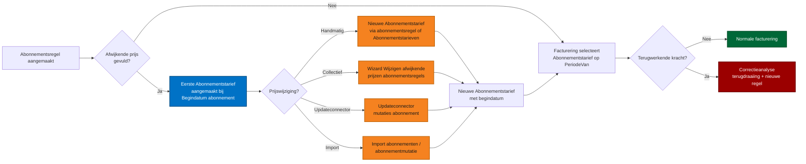
```mermaid
flowchart LR
    A[Abonnementsregel aangemaakt] --> A1{Afwijkende prijs\ngevuld?}
    A1 -- Ja --> B[Eerste Abonnementstarief\naangemaakt bij Begindatum abonnement]
    A1 -- Nee --> G
    B --> C{Prijswijziging?}
    C -- Handmatig --> D[Nieuwe Abonnementstarief\nvia abonnementsregel of Abonnementstarieven]
    C -- Collectief --> E[Wizard Wijzigen afwijkende\nprijzen abonnementsregels]
    C -- Updateconnector --> K[Updateconnector\nmutaties abonnement]
    C -- Import --> L[Import abonnementen /\nabonnementmutatie]
    D --> F[Nieuwe Abonnementstarief\nmet begindatum]
    E --> F
    K --> F
    L --> F
    F --> G[Facturering selecteert\nAbonnementstarief op PeriodeVan]
    G --> H{Terugwerkende kracht?}
    H -- Nee --> I[Normale facturering]
    H -- Ja --> J[Correctieanalyse\nterugdraaiing + nieuwe regel]
    style B fill:#0072C6,color:#fff,stroke:#004A80,stroke-width:2px
    style D fill:#F58220,color:#1a1a1a,stroke:#C0650A,stroke-width:2px
    style E fill:#F58220,color:#1a1a1a,stroke:#C0650A,stroke-width:2px
    style K fill:#F58220,color:#1a1a1a,stroke:#C0650A,stroke-width:2px
    style L fill:#F58220,color:#1a1a1a,stroke:#C0650A,stroke-width:2px
    style I fill:#006838,color:#ffffff,stroke:#004D26,stroke-width:2px
    style J fill:#9B0000,color:#ffffff,stroke:#6B0000,stroke-width:2px
```

### 1.4 Samenvatting voor klant

Met deze wijziging leg je prijswijzigingen per abonnementsregel met begindatum vast en verwerk je terugwerkende correcties gecontroleerd in de wizard. Profit factureert automatisch met de juiste prijs per periode en prijshistorie blijft inzichtelijk.

- Minder handmatig correctiewerk bij prijswijzigingen met terugwerkende kracht.
- Meer controle door éénmaligheidsborging en duidelijke herleidbaarheid per correctie.
- Betere voorspelbaarheid doordat proforma en definitieve facturatie dezelfde prijslogica gebruiken.
- Snellere verwerking van jaarlijkse indexeringen via de wizard Wijzigen afwijkende prijzen abonnementsregels.

### 1.5 Afbakening

- Nieuw menu-item Abonnementstarieven met weergave en boekingslay-out
- Prijsinvoer op abonnementsregel
- Uitbreiding wizard Wijzigen afwijkende prijzen abonnementsregels met begindatum
- Uitbreiding Updateconnector mutaties abonnement met optioneel veld Begindatum afwijkende prijs
- Definitieve factuurwizard uitgebreid met indexcorrecties
- Proforma wizard uitgebreid met indexcorrecties (simulatie)
- Correctieset: terugdraaiing + nieuwe regel per periode
- Éénmaligheidsborging per abonnementsregel-periode
- Conversie bestaande afwijkende prijzen naar Abonnementstarieven
- Actie Afwijkende prijzen vanuit de abonnementsregel
- Tabblad Abonnementstarieven in Eigenschappen prijzen/kortingen Artikel
- Uitbreiding Import abonnementen en Import abonnementmutatie met optioneel veld Begindatum abonnementstarief

Niet in scope:

- Automatische splitsing van een factuurperiode bij tariefwissel binnen die periode
- Alternatieve correctiepresentaties zoals alleen een delta-regel tonen of verwijzen naar de oude factuur op de correctieregel (uitbreidingsopties voor een latere versie)

### 1.6 Randvoorwaarden

| Nr | Randvoorwaarde |
|---|---|
| R1 | Performance bij bulkfactureren blijft acceptabel. |
| R2 | Proforma is simulatie: geen opslag, geen journalisering, geen gebruiksvlaggen. |
| R3 | Correcties zijn begrijpelijk voor ontvangers (twee regels per periode). |
| R4 | Correctiesets kunnen niet dubbel ontstaan (unieke sleutel in database). |
| R5 | Als geen Abonnementstarief gevonden voor een te factureren periode, dan is de artikelprijs van toepassing (bestaand gedrag). |

### 1.7 Begrippen

| Term | Betekenis |
|---|---|
| Abonnementsregel | Contractregel die periodiek factureert |
| Abonnementstarief | Record in de tabel Abonnementstarief, gekoppeld aan één abonnementsregel. Vervangt het bestaande veld Afwijkende prijs op de abonnementsregel |
| Afwijkende prijzen | Actie op de abonnementsregel waarmee je Abonnementstarieven voor die regel opent |
| PeriodeVan / PeriodeTm | Gefactureerde periodegrenzen van een factuurregel |
| Correctieset | Terugdraaiing + nieuwe regel voor één periode |
| Correctiebedrag | Netto verschil (nieuwe bedrag − oude bedrag) |
| Startdatum indexering | Door de gebruiker opgegeven begindatum voor correctieanalyse |
| Terugdraaiingsregel | Creditregel op basis van de oorspronkelijke factuurregel (negatief bedrag) |

---

## 2. Globale beschrijving

### 2.1 Prijsselectie bij factureren

Voor elke te factureren periode geldt:

```
Zoek Abonnementstarief waarbij: Begindatum ≤ PeriodeVan
Neem de regel met de meest recente begindatum.
Als geen Abonnementstarief gevonden → val terug op de artikelprijs (bestaand gedrag).
```

Profit splitst een factuurperiode niet automatisch als het tarief wijzigt binnen die periode. Er geldt één tarief per factuurperiode, bepaald op PeriodeVan.

### 2.2 Overzicht getroffen componenten

| Component | Type | Wijziging |
|---|---|---|
| Tabel Abonnementstarief | Nieuw | Datumafhankelijke verkoopprijs per abonnementsregel; velden: Abonnementsregel, Begindatum, Einddatum, Prijs |
| Menu-item Abonnementstarieven | Nieuw | Nieuw menu-item onder Abonnementen; opent weergave Abonnementstarieven |
| Weergave Abonnementstarieven | Nieuw | Toont alle Abonnementstarieven met kolommen Abo.nr., Naam, Abonnementsregel, Begindatum, Einddatum, Prijs |
| Boekingslay-out Onderhouden abonnementstarieven | Nieuw | Bulk-onderhoud van Abonnementstarieven; startbaar vanuit weergave Abonnementstarieven met multiselect |
| Eigenschappen prijzen/kortingen Artikel | Bestaand | Uitgebreid met tabblad Abonnementstarieven. Dit tabblad toont Abonnementstarieven voor het artikel en maakt geen Verkoopprijs aan |
| Tabel Factuurregel | Bestaand | Velden: Abonnementsregel, Bronfactuurregel, Bronverkoopprijs, Bronperiode van, Bronperiode t/m |
| Wizard Abonnementen factureren | Bestaand | Stap 1: indexcorrectievelden; stap 3: datasets Indexcorrecties en Te corrigeren factuurregels |
| Wizard Proforma facturen | Bestaand | Stap 1: indexcorrectievelden; laatste stap: dezelfde datasets als simulatie |
| Wizard Wijzigen afwijkende prijzen abonnementsregels | Bestaand | Uitgebreid met veld Begindatum (conditioneel); maakt Abonnementstarieven aan |
| Abonnementsregelscherm | Bestaand | Prijsinvoer slaat op als Abonnementstarief; actie Afwijkende prijzen opent de weergave Abonnementstarieven voor de geselecteerde regel |
| Updateconnector mutaties abonnement | Bestaand | Uitgebreid met optioneel veld Begindatum afwijkende prijs; bij gevulde begindatum wordt een Abonnementstarief aangemaakt |
| Import abonnementen | Bestaand | Uitgebreid met optioneel veld Begindatum abonnementstarief; bij gevulde begindatum wordt een Abonnementstarief aangemaakt |
| Import abonnementmutatie | Bestaand | Uitgebreid met optioneel veld Begindatum abonnementstarief; bij gevulde begindatum wordt een Abonnementstarief aangemaakt of de prijs overschreven |
| Conversieproces | Nieuw | Bestaande afwijkende prijzen omzetten naar Abonnementstarieven |

### 2.3 Beslispunt: Abonnementstarief staat los van Verkoopprijzen

Een Abonnementstarief is een specifieke uitzondering op één abonnementsregel. Het tarief geldt alleen voor die regel. Het is geen algemene prijsafspraak voor een debiteur, artikel, prijslijst of project.

Daarom geldt dit besluit:

- Abonnementstarief is de enige bron voor de afwijkende abonnementsregelprijs.
- Verkoopprijsafspraken per debiteur blijven bestaan, maar bepalen niet de specifieke prijs op de abonnementsregel.
- Er komt geen type Abonnement in de wizard Nieuwe verkoopprijs.
- De weergave Verkoopprijs (item) krijgt geen abonnementskolommen.
- De actie Afwijkende prijzen is alleen navigatie. De actie opent Abonnementstarieven voor de geselecteerde abonnementsregel. De actie maakt geen prijs aan en heeft geen effect op facturatie.

---

## 3. User stories

| Nr | User story |
|---|---|
| US01 | Abonnementstarieven: nieuw menu-item met weergave en boekingslay-out |
| US02 | Prijs vastleggen vanuit abonnementsregel met behoud van gebruikerservaring |
| US03 | Vervallen |
| US04 | Eerste Abonnementstarief start op begindatum abonnement (alleen bij gevulde afwijkende prijs) |
| US05 | Factureren kiest Abonnementstarief op PeriodeVan |
| US06 | Indexering vooruit vastleggen (handmatig en via wizard Wijzigen afwijkende prijzen) |
| US07 | Indexcorrecties verwerken als terugdraaiing + nieuwe regel per periode |
| US08 | Proforma wizard gebruikt dezelfde prijsselectie |
| US09 | Proforma wizard kan indexcorrecties meenemen |
| US10 | Correctie per abonnementsregel-periode maar één keer |
| US11 | Detailweergave "Te corrigeren factuurregels" met Correctiebedrag |
| US12 | Updateconnector mutaties abonnement uitgebreid met begindatum afwijkende prijs |
| US13 | Import abonnementen en Import abonnementmutatie uitgebreid met begindatum abonnementstarief |
| US14 | Conversie bestaande afwijkende prijzen naar Abonnementstarieven |

### 3.1 US01 – Abonnementstarieven: nieuw menu-item met weergave en boekingslay-out

**Als** financieel beheerder **wil ik** een nieuw menu-item Abonnementstarieven met een weergave en boekingslay-out, **zodat** ik datumafhankelijke prijzen per abonnementsregel kan bekijken en beheren.

**Toelichting:** Er komt een nieuw menu-item Abonnementstarieven onder Abonnementen. Het menu-item opent een weergave met alle Abonnementstarieven. Vanuit de weergave start je de boekingslay-out Onderhouden abonnementstarieven. Nieuwe Abonnementstarieven toevoegen kan niet vanuit de weergave; dit gebeurt via de abonnementsregel (US02), de wizard (US06), de updateconnector (US12) of de import (US13). Verwijderen is wel mogelijk vanuit de weergave.

#### Menu-item Abonnementstarieven

| Eigenschap | Waarde |
|---|---|
| Menupad | Abonnementen → Abonnementstarieven |
| Sneltoets | A (1e letter; niet in gebruik binnen de groep Abonnementen) |
| Conditie/activering | Module Abonnementen actief |
| Autorisatie | Abonnementen onderhouden (bestaand) |
| Conversie | Niet van toepassing; nieuw menu-item erft rechten van bestaande autorisatie Abonnementen onderhouden |

**Mockup startmenu RPT00701:**

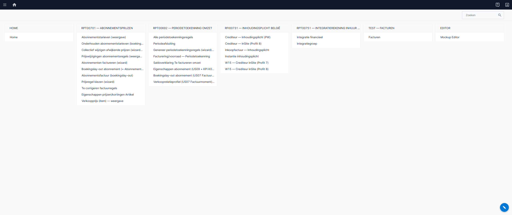

**Visueel overzicht:**

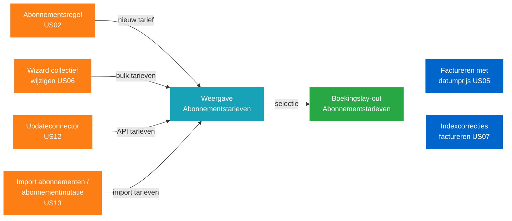
```mermaid
graph LR
    US02[Abonnementsregel<br/>US02]
    US06[Wizard collectief<br/>wijzigen US06]
    US12[Updateconnector<br/>US12]
    IMP[Import abonnementen /<br/>abonnementmutatie<br/>US13]

    WRG["Weergave<br/>Abonnementstarieven"]
    BKL["Boekingslay-out<br/>Abonnementstarieven"]

    US02 -->|nieuw tarief| WRG
    US06 -->|bulk tarieven| WRG
    US12 -->|API tarieven| WRG
    IMP -->|import tarieven| WRG

    WRG -->|selectie| BKL

    BKL ~~~ US05[Factureren met<br/>datumprijs US05]
    BKL ~~~ US07[Indexcorrecties<br/>factureren US07]

    style US02 fill:#fd7e14,color:#fff,stroke:none
    style US06 fill:#fd7e14,color:#fff,stroke:none
    style US12 fill:#fd7e14,color:#fff,stroke:none
    style IMP fill:#fd7e14,color:#fff,stroke:none
    style WRG fill:#17a2b8,color:#fff,stroke:none
    style BKL fill:#28a745,color:#fff,stroke:none
    style US05 fill:#0066cc,color:#fff,stroke:none
    style US07 fill:#0066cc,color:#fff,stroke:none
```

**Functionele uitwerking:**

- Er is een nieuw menu-item Abonnementstarieven dat een weergave opent.
- De weergave toont alle Abonnementstarieven met kolommen: Abo.nr., Regelnr., Naam, Abonnementsregel, Begindatum, Einddatum, Prijs en Huidige prijs.
- De weergave ondersteunt multiselect. De selectie wordt doorgegeven aan de boekingslay-out.
- Vanuit de weergave start je de boekingslay-out Onderhouden abonnementstarieven om geselecteerde prijsregels te bekijken en te wijzigen.
- De weergave heeft geen actie Nieuw. Nieuwe Abonnementstarieven worden aangemaakt via de abonnementsregel (US02), de wizard Wijzigen afwijkende prijzen abonnementsregels (US06), de updateconnector mutaties abonnement (US12) of de import (US13).
- De weergave heeft een actie Verwijderen waarmee geselecteerde Abonnementstarieven worden verwijderd.
- Per record zijn de velden: Abonnementsregel (verplicht, lookup), Begindatum (verplicht) en Prijs (verplicht).
- Per abonnementsregel kunnen meerdere Abonnementstarieven bestaan, elk met een eigen begindatum. Zo bouw je een prijshistorie op.
- Bij factureren bepaalt de begindatum welke prijs van toepassing is op een periode (zie US05).
- Een bestaande Abonnementstarief mag altijd worden gewijzigd (prijs en Begindatum). Bij wijziging van een reeds gebruikte prijs pikt de correctieanalyse (US07) het verschil op bij de eerstvolgende factuurrun met indexcorrecties.

**Acceptatiecriteria:**

1. Menu-item Abonnementstarieven is beschikbaar onder Abonnementen.
2. Het menu-item opent een weergave met alle Abonnementstarieven.
3. De weergave ondersteunt multiselect; de selectie wordt doorgegeven aan de boekingslay-out.
4. Vanuit de weergave is de boekingslay-out Onderhouden abonnementstarieven te starten.
5. De weergave heeft geen actie Nieuw.
6. De weergave heeft een actie Verwijderen.
7. Het veld Abonnementsregel is zichtbaar en verplicht.
8. Opslaan is alleen mogelijk als zowel Begindatum als Prijs gevuld zijn.
9. Twee Abonnementstarieven met dezelfde begindatum voor dezelfde abonnementsregel worden geblokkeerd met een melding.
10. Abonnementstarieven zijn terug te vinden via de weergave Abonnementstarieven.
11. Een bestaande Abonnementstarief is wijzigbaar via de boekingslay-out; het prijsverschil wordt verwerkt via indexcorrecties.
12. Bij het aanmaken of wijzigen van een Abonnementstarief krijgt de vorige prijsregel (chronologisch) automatisch een einddatum (dag vóór de begindatum van de nieuwe regel). De meest recente prijsregel heeft geen einddatum.
13. Eigenschappen prijzen/kortingen Artikel toont een tabblad Abonnementstarieven met de Abonnementstarieven voor het geopende artikel.

#### Meldingsteksten

| Situatie | Melding |
|---|---|
| Dubbele begindatum | Er bestaat al een Abonnementstarief met deze begindatum voor de geselecteerde abonnementsregel. |

#### Weergave Abonnementstarieven

**Gegevensverzameling:** Abonnementstarieven

**Filter:** Huidige prijs = Ja.

**Filterautorisatie:** Niet van toepassing.

**Kolommen:**

| Kolomlabel | Sortering | Filter |
|---|---|---|
| Abo.nr. | 1 | ja |
| Regelnr. | 2 | ja |
| Naam | | ja |
| Abonnementsregel | | ja |
| Begindatum | 3 | ja |
| Einddatum | | ja |
| Prijs | | nee |
| Huidige prijs | | ja |

**Standaardsortering:** Abo.nr. (oplopend), Regelnr. (oplopend), Begindatum (oplopend).

**Standaardfilter:** Huidige prijs = Ja.

**Multiselect:** Ja. De selectie wordt doorgegeven aan de boekingslay-out.

**Acties:**

| Actie | Beschrijving | Primaire actie? | Autorisatie | Regelgebonden? | Uitzonderingen |
|---|---|---|---|---|---|
| Onderhouden abonnementstarieven | Opent de boekingslay-out Onderhouden abonnementstarieven met de geselecteerde Abonnementstarieven | Ja | Wel autoriseerbaar; autorisatiepad = Abonnementen onderhouden | Ja, meerdere of enkele regels | — |
| Verwijderen | Verwijdert de geselecteerde Abonnementstarieven | Nee | Wel autoriseerbaar; autorisatiepad = Abonnementen onderhouden | Ja, meerdere of enkele regels | — |

> De weergave heeft geen actie Nieuw. Nieuwe Abonnementstarieven worden aangemaakt via de abonnementsregel (US02), de wizard (US06), de updateconnector (US12) of de import (US13).

##### Podium-specificatie

**Schermtype:** ListPage

| Kolom-id | Kolomkop | Podium-type | Sorteerbaar | Filter | Breedte | Status | Mock-waarde |
|---|---|---|---|---|---|---|---|
| abonr | Abo.nr. | text | ja | ja | 100 | nieuw | AB-1001 |
| regelnr | Regelnr. | number | ja | ja | 80 | nieuw | 1 |
| naam | Naam | text | ja | ja | 150 | nieuw | Total Job B.V. |
| abonregel | Abonnementsregel | text | ja | ja | 200 | nieuw | EnYoi Glasvezel internet 400 |
| begindatum | Begindatum | date | ja | ja | 110 | nieuw | 29-04-2026 |
| einddatum | Einddatum | date | ja | ja | 110 | nieuw | - |
| prijs | Prijs | currencyAmount | nee | nee | 100 | nieuw | 60,00 |
| huidigePrijs | Huidige prijs | yesNo | nee | ja | 110 | nieuw | Ja |

| Eigenschap | Waarde |
|---|---|
| Quick filter | ja |
| Exportknop | ja |
| Rijselectie | meervoud |
| Inline bewerken | nee |
| Bulkacties | Onderhouden abonnementstarieven, Verwijderen |
| Standaardfilter | Huidige prijs = Ja |

###### Acties

| Actie-id | Label | Type | Positie | Zichtbaar als | Bevestigingsdialoog |
|---|---|---|---|---|---|
| onderhouden | Onderhouden abonnementstarieven | toolbar | primair | altijd | nee |
| verwijderen | Verwijderen | toolbar | secundair | rijselectie ≥ 1 | ja - "Weet je zeker dat je de geselecteerde Abonnementstarieven wilt verwijderen?" |

###### Meldingen

| Type | Veldlabel / scope | Conditie | Tekst |
|---|---|---|---|


**Mockup weergave Abonnementstarieven:**

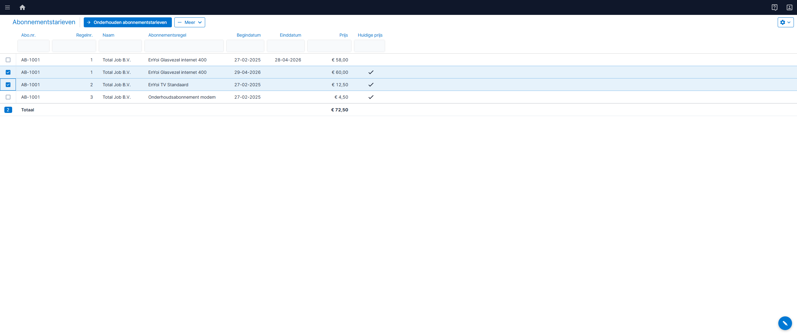

#### Boekingslay-out Onderhouden abonnementstarieven

De boekingslay-out wordt gestart vanuit de weergave Abonnementstarieven. De geselecteerde Abonnementstarieven worden als regels geladen.

**Regelvelden:**

| Veld | Type | Verplicht | Readonly | Toelichting |
|---|---|---|---|---|
| Abo.nr. | tekst | nee | ja | Abonnement waarvoor de regel geldt |
| Regelnr. | getal | nee | ja | Regelnummer binnen het abonnement |
| Naam | tekst | nee | ja | Naam van de verkooprelatie |
| Itemcode | tekst | nee | ja | Artikelcode van de abonnementsregel |
| Omschrijving | tekst | nee | ja | Omschrijving van de abonnementsregel |
| Prijs huidig | bedrag | nee | ja | Geldige prijs op dit moment |
| Begindatum huidig | datum | nee | ja | Begindatum van de huidige prijs |
| Einddatum huidig | datum | nee | nee | Einddatum van de huidige prijsregel |
| Begindatum nieuw | datum | ja | nee | Begindatum van het nieuwe Abonnementstarief |
| Einddatum nieuw | datum | nee | nee | Einddatum van het nieuwe Abonnementstarief |
| Prijs nieuw | bedrag | ja | nee | Nieuwe verkoopprijs exclusief btw |

**Multiselect regels:** Nee.

**Sorteeropties:** Eenmalige sortering (niet opgeslagen in profiel) op Abonnementsregel + Begindatum.

##### Podium-specificatie

**Schermtype:** BoekingsLayout

**Koptabel:** n.v.t.

**Regeltabel:**

| Sectie-id | Veldlabel | Podium-type | Verplicht | Readonly | Inline editing | Tooltip | Status | Mock-waarde |
|---|---|---|---|---|---|---|---|---|
| regels | Abo.nr. | text | nee | ja | nee | Abonnement waarvoor de regel geldt | nieuw | AB-1001 |
| regels | Regelnr. | number | nee | ja | nee | Regelnummer binnen het abonnement | nieuw | 1 |
| regels | Naam | text | nee | ja | nee | Naam van de verkooprelatie | nieuw | Facilicom BV |
| regels | Itemcode | text | nee | ja | nee | Artikelcode van de abonnementsregel | nieuw | SCH-01 |
| regels | Omschrijving | text | nee | ja | nee | Omschrijving van de abonnementsregel | nieuw | Schoonmaak kantoor |
| regels | Prijs huidig | currencyAmount | nee | ja | nee | Geldige prijs op dit moment | nieuw | 132,50 |
| regels | Begindatum huidig | date | nee | ja | nee | Begindatum van de huidige prijs | nieuw | 01-01-2026 |
| regels | Einddatum huidig | date | nee | nee | ja | Einddatum van de huidige prijsregel | nieuw | - |
| regels | Begindatum nieuw | date | ja | nee | ja | Begindatum van het nieuwe Abonnementstarief | nieuw | 01-05-2026 |
| regels | Einddatum nieuw | date | nee | nee | ja | Einddatum van het nieuwe Abonnementstarief | nieuw | - |
| regels | Prijs nieuw | currencyAmount | ja | nee | ja | Nieuwe verkoopprijs exclusief btw | nieuw | 140,00 |

**Staarttabel:** n.v.t.

###### Acties

| Actie-id | Label | Type | Positie | Zichtbaar als | Bevestigingsdialoog |
|---|---|---|---|---|---|
| nieuw | Nieuw | toolbar | primair | altijd | nee |
| tussenvoegen | Tussenvoegen | toolbar | primair | regel geselecteerd | nee |
| historie | 1. Historie | toolbar | primair | regel geselecteerd | nee |

###### Meldingen

| Type | Veldlabel / scope | Conditie | Tekst |
|---|---|---|---|
| validatie | Abonnementsregel + Begindatum | Dubbele begindatum voor dezelfde abonnementsregel | Er bestaat al een Abonnementstarief met deze begindatum voor de geselecteerde abonnementsregel. |

**Mockup boekingslay-out Onderhouden abonnementstarieven:**

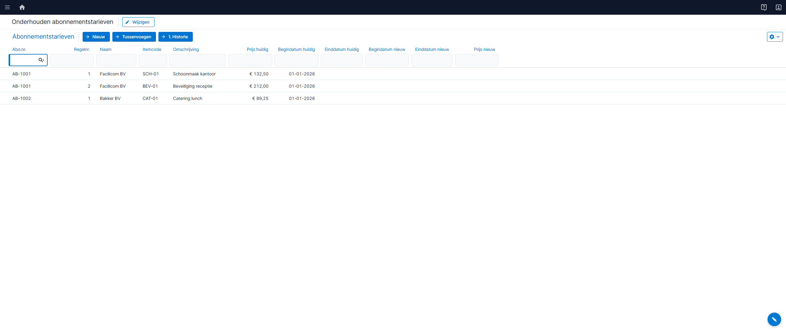

#### Gegevensverzameling Abonnementstarieven

**Basistabel:** Abonnementstarief

**Naam:** Abonnementstarieven

**Standaardfilter:** Geen.

**Filterautorisatie:** Niet van toepassing.

**Velden:**

| Veld | Bron | Toelichting |
|---|---|---|
| Abo.nr. | Abonnementsregel → Abonnement | Abonnementsnummer |
| Regelnr. | Abonnementsregel | Regelnummer binnen het abonnement |
| Naam | Abonnementsregel → Abonnement → Verkooprelatie | Naam van de verkooprelatie |
| Abonnementsregel | Abonnementsregel | Omschrijving van de abonnementsregel |
| Begindatum | Abonnementstarief | Datum waarop de prijs ingaat |
| Einddatum | Abonnementstarief | Dag vóór de begindatum van de volgende prijsregel; leeg bij de meest recente |
| Prijs | Abonnementstarief | Verkoopprijs exclusief btw |
| Huidige prijs | Abonnementstarief | Geeft aan of dit het tarief is dat nu geldt |

**Sortering:** Abo.nr. (oplopend), Regelnr. (oplopend), Begindatum (oplopend).

**Geschiktheid:**

| Geschikt voor | Aangevinkt |
|---|---|
| Rapport | Ja |
| GetConnector | Ja |
| Analyse | Ja |
| Weergave | Ja |

**Gebruik:**

- Weergave Abonnementstarieven (US01)
- Boekingslay-out Onderhouden abonnementstarieven (US01)
- Actie Afwijkende prijzen op abonnementsregel: opent de weergave gefilterd op de geselecteerde abonnementsregel (US02)
- Tabblad Abonnementstarieven in Eigenschappen prijzen/kortingen Artikel: toont Abonnementstarieven voor het geopende artikel (US01)

#### Tabblad Abonnementstarieven in Eigenschappen prijzen/kortingen Artikel

Het bestaande scherm Eigenschappen prijzen/kortingen Artikel krijgt een nieuw tabblad Abonnementstarieven. Dit tabblad staat naast de bestaande tabbladen voor verkoopprijs, verkoopkorting, inkoopprijs en andere prijssoorten.

Het tabblad toont alleen Abonnementstarieven waarin het geopende artikel voorkomt op de abonnementsregel. Het tabblad is bedoeld voor inzicht vanuit het artikel. Het maakt geen Verkoopprijs aan en voegt geen type Abonnement toe aan Verkoopprijzen.

**Kolommen:**

| Kolomlabel | Sortering | Filter | Toelichting |
|---|---|---|---|
| Huidige prijs |  | ja | Geeft aan of dit het actuele tarief is |
| Abo.nr. | 1 | ja | Abonnementsnummer |
| Naam |  | ja | Naam van de verkooprelatie |
| Regelnr. | 2 | ja | Regelnummer van de abonnementsregel |
| Abonnementsregel |  | ja | Omschrijving van de abonnementsregel |
| Begindatum | 3 | ja | Datum waarop het tarief ingaat |
| Einddatum |  | ja | Dag vóór de begindatum van de volgende prijsregel; leeg bij de meest recente prijs |
| Prijs |  | nee | Verkoopprijs exclusief btw |

**Gedrag:**

- Het tabblad gebruikt de gegevensverzameling Abonnementstarieven.
- Het tabblad filtert op het artikel van de geopende artikelsleutel.
- De gebruiker kan vanuit dit tabblad Abonnementstarieven bekijken.
- Onderhouden blijft lopen via de boekingslay-out Onderhouden abonnementstarieven.
- Er is geen actie Nieuw op dit tabblad.

##### Podium-specificatie

**Schermtype:** DetailPage (uitbreiding bestaand eigenschappenscherm)

| Tabblad | Sectie-id | Veldgroeptitel | Veldlabel | Podium-type | Verplicht | Readonly | Inline editing | Cond. verplicht | Actief als | Groep actief als | Tooltip | Placeholder | Standaardwaarde | Keuzelijst-bron | Status | Mock-waarde |
|---|---|---|---|---|---|---|---|---|---|---|---|---|---|---|---|---|
| Abonnementstarieven | abonnementstarieven | - | Huidige prijs | yesNo | nee | ja | - | - | - | - | Geeft aan of dit het actuele tarief is | - | - | - | nieuw | Ja |
| Abonnementstarieven | abonnementstarieven | - | Abo.nr. | text | nee | ja | - | - | - | - | Abonnementsnummer | - | - | - | nieuw | AB-1001 |
| Abonnementstarieven | abonnementstarieven | - | Naam | text | nee | ja | - | - | - | - | Naam van de verkooprelatie | - | - | - | nieuw | Total Job B.V. |
| Abonnementstarieven | abonnementstarieven | - | Regelnr. | number | nee | ja | - | - | - | - | Regelnummer van de abonnementsregel | - | - | - | nieuw | 1 |
| Abonnementstarieven | abonnementstarieven | - | Abonnementsregel | text | nee | ja | - | - | - | - | Omschrijving van de abonnementsregel | - | - | - | nieuw | EnYoi Glasvezel internet 400 |
| Abonnementstarieven | abonnementstarieven | - | Begindatum | date | nee | ja | - | - | - | - | Datum waarop het tarief ingaat | - | - | - | nieuw | 29-04-2026 |
| Abonnementstarieven | abonnementstarieven | - | Einddatum | date | nee | ja | - | - | - | - | Dag vóór de begindatum van de volgende prijsregel | - | - | - | nieuw | - |
| Abonnementstarieven | abonnementstarieven | - | Prijs | currencyAmount | nee | ja | - | - | - | - | Verkoopprijs exclusief btw | - | - | - | nieuw | 60,00 |

**Mockup Eigenschappen prijzen/kortingen Artikel met tabblad Abonnementstarieven:**

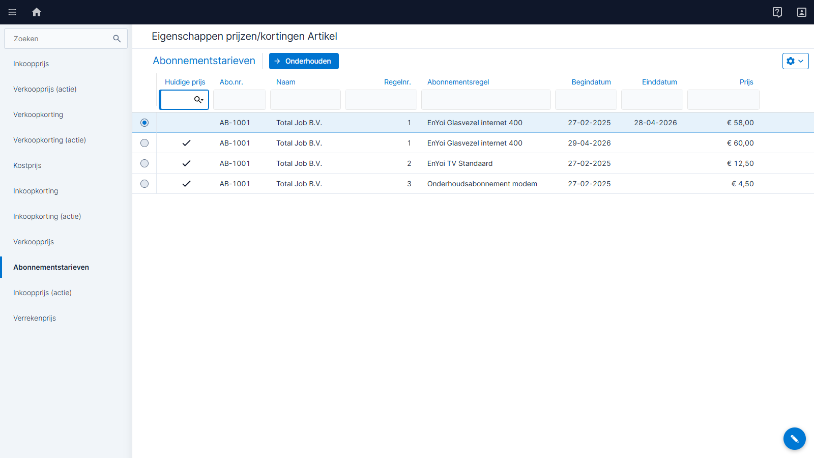

---

### 3.2 US02 – Prijs vastleggen vanuit abonnementsregel met behoud van gebruikerservaring

**Als** gebruiker **wil ik** een prijs op de abonnementsregel kunnen invullen zoals ik gewend ben, **zodat** mijn werkwijze niet verandert.

**Toelichting:** Gebruikers willen niet verplicht via de weergave Abonnementstarieven werken. De prijsinvoer op de regel blijft, maar opslag gebeurt als Abonnementstarief.

**Functionele uitwerking:**

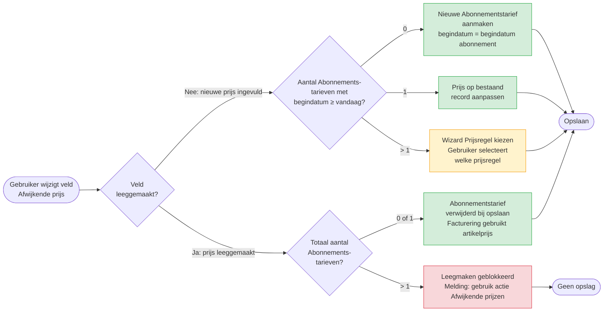
```mermaid
flowchart LR
    START([Gebruiker wijzigt veld\nAfwijkende prijs]) --> LEEG{Veld\nleeggemaakt?}

    LEEG -- Nee: nieuwe prijs ingevuld --> TEL_TOEKOMST{Aantal Abonnements-\ntarieven met\nbegindatum ≥ vandaag?}

    TEL_TOEKOMST -- 0 --> NIEUW[Nieuwe Abonnementstarief\naanmaken\nbegindatum = begindatum abonnement]
    TEL_TOEKOMST -- 1 --> AANPAS[Prijs op bestaand\nrecord aanpassen]
    TEL_TOEKOMST -- "&gt; 1" --> WIZARD[Wizard Prijsregel kiezen\nGebruiker selecteert\nwelke prijsregel]

    NIEUW --> OPSLAAN([Opslaan])
    AANPAS --> OPSLAAN
    WIZARD --> OPSLAAN

    LEEG -- Ja: prijs leeggemaakt --> TEL_TOTAAL{Totaal aantal\nAbonnements-\ntarieven?}

    TEL_TOTAAL -- "0 of 1" --> VERWIJDER[Abonnementstarief\nverwijderd bij opslaan\nFacturering gebruikt artikelprijs]
    TEL_TOTAAL -- "&gt; 1" --> BLOKKEER[Leegmaken geblokkeerd\nMelding: gebruik actie Afwijkende prijzen]

    VERWIJDER --> OPSLAAN
    BLOKKEER --> STOP([Geen opslag])

    style NIEUW fill:#d4edda,stroke:#28a745
    style AANPAS fill:#d4edda,stroke:#28a745
    style WIZARD fill:#fff3cd,stroke:#f59e0b
    style VERWIJDER fill:#d4edda,stroke:#28a745
    style BLOKKEER fill:#f8d7da,stroke:#dc3545
```

- Op de abonnementsregel blijft het veld Afwijkende prijs beschikbaar. Dit veld toont de huidige geldige Abonnementstarief.
- Bij wijziging van het veld Afwijkende prijs bepaalt Profit wat er gebeurt op basis van bestaande Abonnementstarieven met begindatum ≥ vandaag:

| Situatie | Gedrag |
|---|---|
| Geen Abonnementstarief met begindatum ≥ vandaag | Nieuwe Abonnementstarief aanmaken met begindatum = begindatum abonnement |
| Precies één Abonnementstarief met begindatum ≥ vandaag | Prijs op dat bestaande record aanpassen |
| Meerdere Abonnementstarieven met begindatum ≥ vandaag | Wizard starten zodat de gebruiker kiest welke prijsregel wordt aangepast |

- Bij leegmaken van het veld Afwijkende prijs bepaalt Profit wat er gebeurt op basis van het totale aantal Abonnementstarieven voor de abonnementsregel:

| Situatie | Gedrag |
|---|---|
| 0 of 1 Abonnementstarief | Bij opslaan wordt de Abonnementstarief verwijderd (indien aanwezig). Facturering gebruikt de artikelprijs |
| Meerdere Abonnementstarieven | Leegmaken is niet toegestaan. Melding dat de gebruiker prijzen kan aanpassen via de actie Afwijkende prijzen op de abonnementsregel |

- Bij wijziging van de begindatum op de abonnementsregel werkt Profit de begindatum van het eerste Abonnementstarief automatisch bij. Zo blijft de begindatum van het eerste tarief altijd gelijk aan de begindatum van de abonnementsregel.

**Acceptatiecriteria:**

1. Gebruiker hoeft niet naar Abonnementstarieven om een prijs vast te leggen.
2. Na opslaan is een Abonnementstarief aangemaakt of aangepast.
3. Bij 0 toekomstige prijzen: Begindatum = begindatum abonnement, zonder extra dialoog.
4. Bij 1 toekomstige prijs: prijs direct overschreven, zonder extra dialoog.
5. Bij meerdere toekomstige prijzen: wizard toont de kandidaten en de gebruiker kiest.
6. Historie blijft bestaan bij latere wijzigingen.
7. Er is een actie "Afwijkende prijzen" op de abonnementsregel die navigeert naar de weergave Abonnementstarieven, gefilterd op de geselecteerde abonnementsregel.
8. De actie "Afwijkende prijzen" maakt geen prijs aan en heeft geen effect op facturatie.
9. Bij leegmaken van Afwijkende prijs met 0 of 1 prijsregel: de Abonnementstarief wordt verwijderd bij opslaan.
10. Bij leegmaken van Afwijkende prijs met meerdere prijsregels: opslaan wordt geblokkeerd met een melding.

#### Meldingsteksten

| Situatie | Melding |
|---|---|
| Leegmaken afwijkende prijs bij meerdere prijsregels | De afwijkende prijs kan niet worden leeggemaakt omdat er meerdere prijsregels bestaan. Gebruik de actie Afwijkende prijzen om prijzen aan te passen. |

**Scherm en gedrag:**

Vanuit de abonnementsregel is een actie "Afwijkende prijzen" beschikbaar. Deze actie opent de weergave Abonnementstarieven, gefilterd op de geselecteerde abonnementsregel. De gebruiker ziet daar alle Abonnementstarieven en kan ze bekijken of wijzigen via de boekingslay-out.

De actie maakt geen Abonnementstarief of Verkoopprijs aan. De actie heeft geen invloed op de prijsselectie bij factureren.

#### Wizard Prijsregel kiezen

Bij meerdere Abonnementstarieven met begindatum ≥ vandaag start een wizard zodat de gebruiker kiest welke prijsregel de nieuwe prijs krijgt.

**Schermtype:** DetailPage (wizard, één stap)

De wizard toont een keuzelijst met alle Abonnementstarieven met begindatum ≥ vandaag. Per kandidaat is de begindatum en de huidige prijs zichtbaar. De gebruiker selecteert één regel. Na bevestiging wordt de prijs op de gekozen Abonnementstarief overschreven met de ingevoerde waarde.

##### Podium-specificatie

| Tabblad | Sectie-id | Veldgroeptitel | Veldlabel | Podium-type | Verplicht | Readonly | Inline editing | Cond. verplicht | Actief als | Groep actief als | Tooltip | Placeholder | Standaardwaarde | Keuzelijst-bron | Status | Mock-waarde |
|---|---|---|---|---|---|---|---|---|---|---|---|---|---|---|---|---|
| - | keuze | Prijsregel kiezen | Prijsregel | keuzelijst | ja | nee | - | - | - | - | Kies de prijsregel waarop de nieuwe prijs wordt toegepast | - | - | dynamisch: Abonnementstarieven met begindatum ≥ vandaag | nieuw | 01-01-2026 (€ 132,50) |
| - | keuze | Prijsregel kiezen | Nieuwe prijs | currencyAmount | ja | ja | - | - | - | - | De prijs die je hebt ingevoerd op de abonnementsregel | - | - | - | nieuw | 140,00 |

###### Meldingen

| Type | Veldlabel / scope | Conditie | Tekst |
|---|---|---|---|
| validatie | Prijsregel | Geen prijsregel geselecteerd | Selecteer een prijsregel om de nieuwe prijs op toe te passen. |

**Mockup Wizard Prijsregel kiezen:**

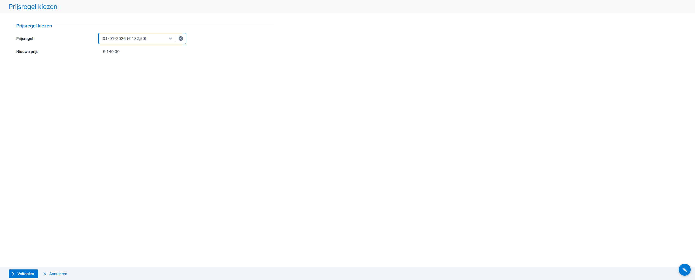

**Mockup met geopende keuzelijst:**

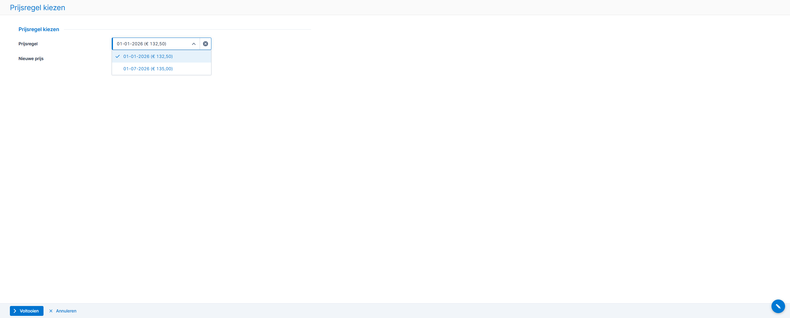

#### Actie Afwijkende prijzen op abonnementsregel

Vanuit de abonnementsregel is een actie "Afwijkende prijzen" beschikbaar in het contextmenu (Meer acties). Deze actie opent de weergave Abonnementstarieven. De weergave is gefilterd op de geselecteerde abonnementsregel. De actie is alleen navigatie.

De actie ondersteunt gebruikers die vanuit een abonnementsregel de afwijkende prijzen willen raadplegen of onderhouden. Er ontstaat geen koppeling tussen de Verkoopprijs en de abonnementsregel. Een Abonnementstarief blijft leidend voor de specifieke prijs op de abonnementsregel.

| Eigenschap | Waarde |
|---|---|
| Doel | Weergave Abonnementstarieven openen voor de geselecteerde abonnementsregel |
| Voorvulling | Geen |
| Aanmaak record | Nee |
| Effect op Abonnementstarief | Geen |
| Effect op facturatie | Geen |

##### Podium-specificatie

**Schermtype:** BoekingsLayout (uitbreiding bestaand abonnementsregelscherm)

###### Acties

| Actie-id | Label | Type | Positie | Zichtbaar als | Bevestigingsdialoog |
|---|---|---|---|---|---|
| afwijkende-prijzen | Afwijkende prijzen | contextmenu | Meer acties | regel geselecteerd | nee |

**Mockup boekingslay-out abonnementsregel met actie Afwijkende prijzen:**

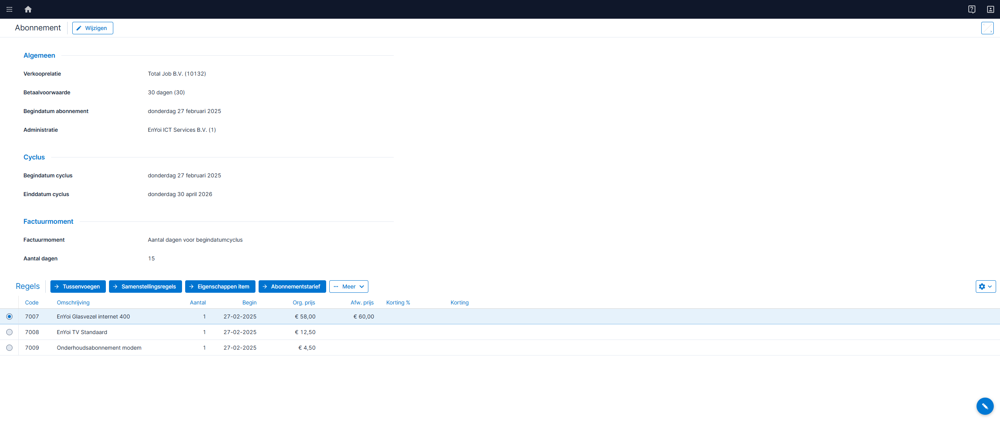

---

### 3.3 US03 – Vervallen

Deze user story is vervallen.

---

### 3.4 US04 – Eerste Abonnementstarief start op begindatum abonnement

**Als** gebruiker **wil ik** dat bij het eerste vastleggen van een prijs voor een abonnementsregel de begindatum automatisch de begindatum van het abonnement is, **zodat** de prijs vanaf contractstart klopt.

**Toelichting:** Dit voorkomt dat er per ongeluk een prijs "vanaf vandaag" ontstaat terwijl het contract al eerder startte. De automatische aanmaak geldt alleen als het veld Afwijkende prijs gevuld is.

**Functionele uitwerking:**

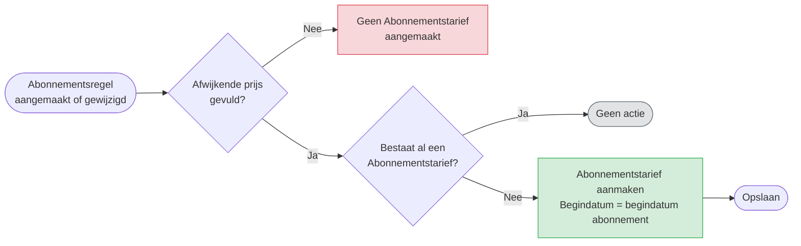
```mermaid 
flowchart LR
    START([Abonnementsregel
aangemaakt of gewijzigd]) --> CHECK{Afwijkende prijs
gevuld?}
    CHECK -- Nee --> GEEN[Geen Abonnementstarief
aangemaakt]
    CHECK -- Ja --> BESTAAT{Bestaat al een
Abonnementstarief?}
    BESTAAT -- Ja --> STOP([Geen actie])
    BESTAAT -- Nee --> AANMAKEN[Abonnementstarief aanmaken
Begindatum = begindatum abonnement]
    AANMAKEN --> OPSLAAN([Opslaan])

    style AANMAKEN fill:#d4edda,stroke:#28a745
    style GEEN fill:#f8d7da,stroke:#dc3545
    style STOP fill:#e2e3e5,stroke:#6c757d
```

- Als er nog geen Abonnementstarief bestaat voor de abonnementsregel én het veld Afwijkende prijs is gevuld: Begindatum = begindatum abonnement (uit kop of regelcontext).
- Als het veld Afwijkende prijs leeg is, wordt geen Abonnementstarief aangemaakt.
- Deze datum wordt niet als extra invoerveld gevraagd (geen UX-impact).

**Acceptatiecriteria:**

1. Eerste Abonnementstarief krijgt standaard Begindatum = begindatum abonnement, mits Afwijkende prijs gevuld is.
2. Als Afwijkende prijs leeg is, wordt geen Abonnementstarief aangemaakt.
3. Als begindatum abonnement wordt aangepast vóór facturatie, blijft prijsselectie consistent (prijs is datumafhankelijk; beheerder kan zo nodig prijsregels aanpassen via prijshistorie).

---

### 3.5 US05 – Factureren kiest Abonnementstarief op PeriodeVan

**Als** financieel medewerker **wil ik** dat bij factureren automatisch de juiste Abonnementstarief wordt gekozen op basis van PeriodeVan, **zodat** facturen altijd met de juiste datumafhankelijke prijs worden opgebouwd.

**Toelichting:** Dit is de kern: datumwerking van de prijs.

**Functionele uitwerking:**

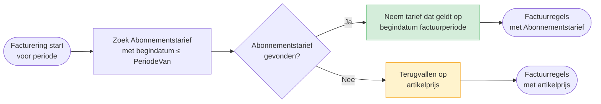
```mermaid
flowchart LR
    START([Facturering start
voor periode]) --> ZOEK[Zoek Abonnementstarief
met begindatum ≤ PeriodeVan]
    ZOEK --> GEVONDEN{Abonnementstarief
gevonden?}
    GEVONDEN -- Ja --> KIES[Neem tarief dat geldt op
begindatum factuurperiode]
    GEVONDEN -- Nee --> TERUGVAL[Terugvallen op
artikelprijs]
    KIES --> FACTUUR([Factuurregels
met Abonnementstarief])
    TERUGVAL --> FACTUUR2([Factuurregels
met artikelprijs])

    style KIES fill:#d4edda,stroke:#28a745
    style TERUGVAL fill:#fff3cd,stroke:#f59e0b
```

- Voor elke te factureren periode: selecteer Abonnementstarief met begindatum ≤ PeriodeVan; neem de regel met de meest recente begindatum.
- Als er geen Abonnementstarief gevonden wordt: val terug op de artikelprijs (bestaand gedrag). De Abonnementstarief vervangt het veld Afwijkende prijs; als die niet bestaat factureer je met de artikelprijs.

**Acceptatiecriteria:**

1. Bij meerdere Abonnementstarieven wordt de juiste prijs toegepast per periode.
2. Bij ontbreken van een Abonnementstarief voor een te factureren periode wordt de artikelprijs gebruikt.

---

### 3.6 US06 – Indexering vooruit vastleggen (handmatig en collectief)

**Als** financieel medewerker **wil ik** indexeringen met een toekomstige Begindatum kunnen vastleggen voor meerdere abonnementsregels tegelijk, **zodat** prijzen automatisch wijzigen op de afgesproken datum.

**Toelichting:** Dit is het "plannen" van indexering. Het bestaande menu-onderdeel `Abonnementen \ Collectief wijzigen \ Prijzen` blijft bestaan. Dit opent de weergave Prijswijzigingen abonnementsregels. Op deze weergave staat de actie Afwijkende prijzen wijzigen. De wizard maakt Abonnementstarieven aan in plaats van de afwijkende prijs direct te overschrijven.

**Functionele uitwerking:**

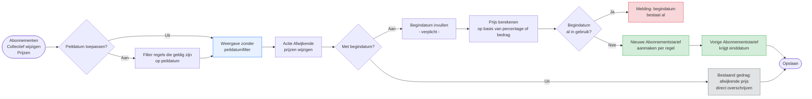
```mermaid
flowchart LR
    MENU([Abonnementen
Collectief wijzigen
Prijzen]) --> PEILDATUM{Peildatum toepassen?}
    PEILDATUM -- Uit --> WEERGAVE[Weergave zonder
peildatumfilter]
    PEILDATUM -- Aan --> FILTER[Filter regels die geldig zijn
op peildatum]
    FILTER --> WEERGAVE
    WEERGAVE --> ACTIE[Actie Afwijkende
prijzen wijzigen]
    ACTIE --> VINKJE{Met begindatum?}
    VINKJE -- Uit --> BESTAAND[Bestaand gedrag:
afwijkende prijs
direct overschrijven]
    VINKJE -- Aan --> DATUM[Begindatum invullen
- verplicht -]
    DATUM --> BEREKENEN[Prijs berekenen
op basis van percentage of bedrag]
    BEREKENEN --> DUBBEL{Begindatum
al in gebruik?}
    DUBBEL -- Ja --> FOUT[Melding: begindatum
bestaat al]
    DUBBEL -- Nee --> AANMAKEN[Nieuwe Abonnementstarief
aanmaken per regel]
    AANMAKEN --> EINDDATUM[Vorige Abonnementstarief
krijgt einddatum]
    EINDDATUM --> KLAAR([Opslaan])
    BESTAAND --> KLAAR

    style WEERGAVE fill:#e7f1ff,stroke:#0d6efd
    style BESTAAND fill:#e2e3e5,stroke:#6c757d
    style AANMAKEN fill:#d4edda,stroke:#28a745
    style FOUT fill:#f8d7da,stroke:#dc3545
    style EINDDATUM fill:#d4edda,stroke:#28a745
```

- Het bestaande menu-onderdeel `Abonnementen \ Collectief wijzigen \ Prijzen` blijft bestaan.
- Dit menu-onderdeel opent eerst de weergave Prijswijzigingen abonnementsregels.
- Op deze weergave staat de actie "Afwijkende prijzen wijzigen".
- Peildatum toepassen is optioneel.
- Als Peildatum toepassen aan staat, toont de weergave alleen regels die geldig zijn op die peildatum.
- De bestaande wizard Wijzigen afwijkende prijzen abonnementsregels krijgt een nieuw vinkje "Met begindatum".
- Als het vinkje aan staat verschijnt het veld Begindatum (verplicht).
- De wizard behoudt de bestaande velden: Percentage, Vast bedrag, Overnemen van artikel, Peildatum, Ook overnemen als afwijkende prijs leeg is, Afronding.
- Als het vinkje "Met begindatum" aan staat: de wizard maakt per geselecteerde abonnementsregel een nieuwe Abonnementstarief aan met de opgegeven begindatum en de berekende prijs.
- Als het vinkje uit staat: de wizard werkt zoals voorheen (bestaand gedrag).

**Acceptatiecriteria:**

1. Het menu-onderdeel `Abonnementen \ Collectief wijzigen \ Prijzen` blijft beschikbaar.
2. Het menu-onderdeel opent de weergave Prijswijzigingen abonnementsregels.
3. Peildatum toepassen is optioneel.
4. Als Peildatum toepassen aan staat, filtert de weergave op de gekozen peildatum.
5. De actie "Afwijkende prijzen wijzigen" is beschikbaar op de weergave.
6. Vinkje "Met begindatum" is beschikbaar in de wizard.
7. Als het vinkje aan staat is Begindatum zichtbaar en verplicht.
8. Als het vinkje uit staat is Begindatum verborgen en is het gedrag ongewijzigd.
9. Resultaat is zichtbaar in prijshistorie per abonnementsregel.
10. Bestaande Abonnementstarief met dezelfde begindatum kan niet dubbel ontstaan (wordt geblokkeerd of gemeld).
11. De vorige Abonnementstarief krijgt automatisch een einddatum (dag vóór de opgegeven begindatum).

#### Prijswijzigingen abonnementsregels

##### Podium-specificatie peildatum

**Schermtype:** WizardPage (voorloopstap bestaande weergave)

| Tabblad | Sectie-id | Veldgroeptitel | Veldlabel | Podium-type | Verplicht | Readonly | Inline editing | Cond. verplicht | Actief als | Groep actief als | Tooltip | Placeholder | Standaardwaarde | Keuzelijst-bron | Status | Mock-waarde |
|---|---|---|---|---|---|---|---|---|---|---|---|---|---|---|---|---|
| - | peildatum | Peildatum | Peildatum toepassen | yesNo | nee | nee | - | - | - | - | Filter de weergave op een peildatum | - | Ja | - | nieuw | Ja |
| - | peildatum | Peildatum | Peildatum | date | nee | nee | - | Peildatum toepassen = Ja | Peildatum toepassen = Ja | - | De weergave toont alleen regels die geldig zijn op deze datum | - | vandaag | - | nieuw | vandaag |

##### Podium-specificatie weergave

**Schermtype:** ListPage (bestaande weergave)

| Onderdeel | Waarde |
|---|---|
| Menu | `Abonnementen \ Collectief wijzigen \ Prijzen` |
| Weergave | Prijswijzigingen abonnementsregels |
| Actie | Afwijkende prijzen wijzigen |
| Filter | Alleen op peildatum als Peildatum toepassen aan staat |

**Mockup peildatum voor Prijswijzigingen abonnementsregels:**

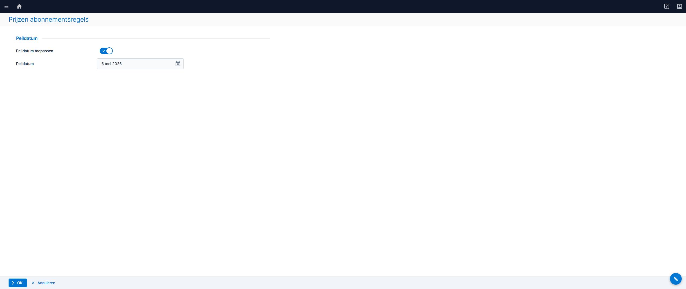

**Mockup weergave Prijswijzigingen abonnementsregels:**

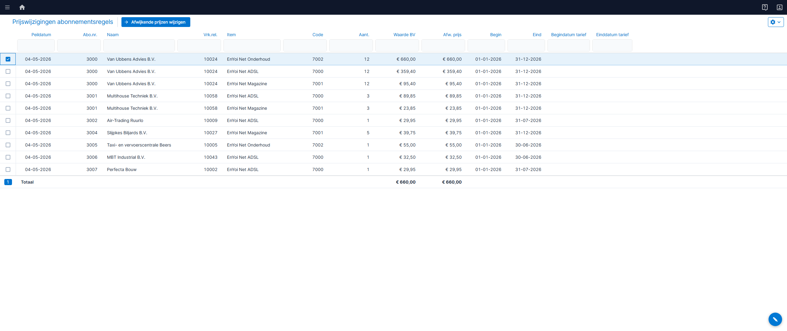

#### Wizard Wijzigen afwijkende prijzen abonnementsregels

##### Podium-specificatie

**Schermtype:** DetailPage (uitbreiding bestaande wizard)

| Tabblad | Sectie-id | Veldgroeptitel | Veldlabel | Podium-type | Verplicht | Readonly | Inline editing | Cond. verplicht | Actief als | Groep actief als | Tooltip | Placeholder | Standaardwaarde | Keuzelijst-bron | Status | Mock-waarde |
|---|---|---|---|---|---|---|---|---|---|---|---|---|---|---|---|---|
| - | algemeen | Algemeen | Met begindatum | yesNo | nee | nee | - | - | - | - | Maak een Abonnementstarief aan met een begindatum in plaats van de afwijkende prijs direct te wijzigen | - | Nee | - | nieuw | Ja |
| - | algemeen | Algemeen | Begindatum | date | nee | nee | - | Met begindatum = Ja | Met begindatum = Ja | - | Datum waarop de nieuwe prijs ingaat | - | - | - | nieuw | 01-01-2026 |

###### Meldingen

| Type | Veldlabel / scope | Conditie | Tekst |
|---|---|---|---|
| validatie | Begindatum | Dubbele begindatum voor een abonnementsregel in de selectie | Er bestaat al een Abonnementstarief met deze begindatum voor abonnementsregel {abonnementsregel}. |

**Mockup Prijswijzigingen abonnementsregels:**

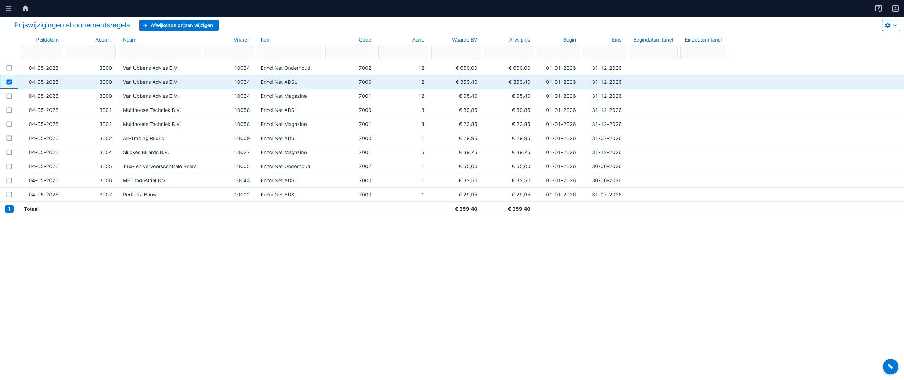

**Mockup Wijzigen afwijkende prijzen abonnementsregels (uitgebreid):**

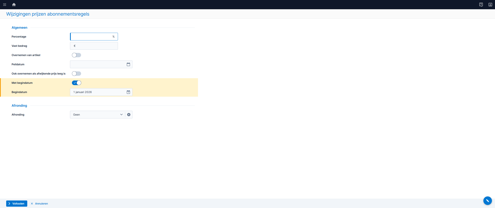

---

### 3.7 US07 – Indexcorrecties verwerken als terugdraaiing + nieuwe regel per periode

**Als** financieel medewerker **wil ik** prijswijzigingen met terugwerkende kracht kunnen verwerken via een terugdraaiingsregel en een nieuwe regel per periode, **zodat** de ontvanger begrijpt wat er wordt gecorrigeerd.

**Toelichting:** Een "verschilregel" is vaak onduidelijk. Twee regels (credit + debet) maakt het verklaarbaar.

**Functionele uitwerking:**

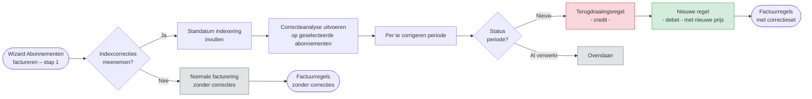
```mermaid
flowchart LR
    START([Wizard Abonnementen
factureren – stap 1]) --> VINK{Indexcorrecties
meenemen?}
    VINK -- Nee --> NORMAAL[Normale facturering
zonder correcties]
    VINK -- Ja --> STARTDATUM[Startdatum indexering
invullen]
    STARTDATUM --> ANALYSE[Correctieanalyse uitvoeren
op geselecteerde abonnementen]
    ANALYSE --> PERIODES[Per te corrigeren periode]
    PERIODES --> STATUS{Status
periode?}
    STATUS -- Nieuw --> CREDIT[Terugdraaiingsregel
- credit -]
    STATUS -- Al verwerkt --> SKIP[Overslaan]
    CREDIT --> DEBET[Nieuwe regel
- debet - met nieuwe prijs]
    DEBET --> FACTUUR([Factuurregels
met correctieset])
    NORMAAL --> FACTUUR2([Factuurregels
zonder correcties])

    style CREDIT fill:#f8d7da,stroke:#dc3545
    style DEBET fill:#d4edda,stroke:#28a745
    style SKIP fill:#e2e3e5,stroke:#6c757d
    style NORMAAL fill:#e2e3e5,stroke:#6c757d
```

- In de definitieve factuurwizard: optie "Indexcorrecties meenemen".
- Voor elke te corrigeren periode:
  - terugdraaiingsregel (credit) op basis van de oorspronkelijke factuurregel (zelfde context/kenmerken);
  - nieuwe regel (debet) met de nieuwe prijs (zelfde context/kenmerken).
- Omschrijvingen bevatten periode en label (terugdraaiing / nieuwe prijs).
- Omschrijvingssjabloon: `Indexcorrectie {terugdraaiing|nieuwe prijs} {MM-JJJJ}`, bijvoorbeeld "Indexcorrectie terugdraaiing 01-2026".

**Acceptatiecriteria:**

1. Correcties verschijnen op de nieuwe factuur als twee regels per periode.
2. Terugdraaiingsregel is negatief en volgt dezelfde btw/grootboek/dimensiecontext als de oorspronkelijke regel.
3. Nieuwe regel heeft de nieuwe prijs en dezelfde context als de oorspronkelijke regel.
4. Periode is zichtbaar in omschrijving.
5. Correctieregels hebben traceerbaarheid (bronfactuurregel en bronperiode).
6. Startdatum indexering is beschikbaar bij indexcorrecties en is verplicht zodra indexcorrecties zijn ingeschakeld.
7. De datasets tonen alleen correcties binnen de ingestelde startdatum.
8. Wijziging startdatum triggert herberekening van overzichten.

**Mockup factuurregels met correctieset:**

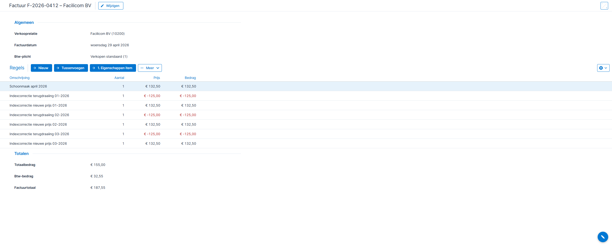

#### Wizard A – Abonnementen factureren (definitief)

##### Stap 1 – Instellingen

| Veld | Type | Verplicht | Default | Status |
|---|---|---|---|---|
| Administratie | keuze | ja | laatst gebruikt | bestaand |
| Peildatum | datum | ja | vandaag | bestaand |
| Factuurdatum | datum | ja | = peildatum | bestaand |
| Indexcorrecties meenemen | checkbox | nee | uit | nieuw |
| Startdatum indexering | datum | conditioneel (ja bij indexcorrecties) | leeg | nieuw; alleen zichtbaar bij vink |
| Meenemen te crediteren regels | checkbox | nee | bestaand | bestaand |
| Automatisch verstrekken | checkbox | nee | bestaand | bestaand |

**Schermsturing stap 1:**

- Openen: Startdatum indexering verborgen.
- "Indexcorrecties meenemen" aan → toon Startdatum; uit → verberg + leegmaken + datasets verbergen + analyse markeren als "herberekenen".
- Wijzigen Startdatum → markeer analyse "herberekenen".
- Wijzigen Peildatum → markeer analyse "herberekenen".

**Mockup stap 1:**

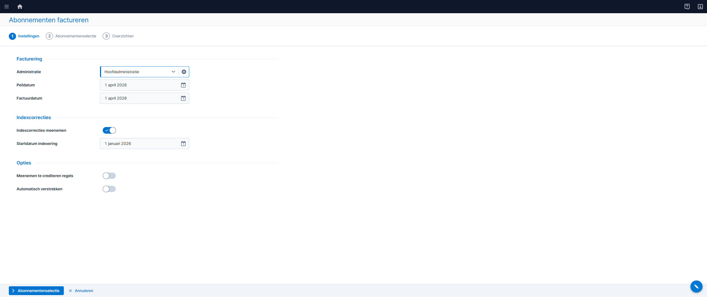

##### Stap 2 – Abonnementenselectie

Bestaande multiselect-grid; geen nieuwe velden. Wijziging selectie markeer analyse "herberekenen" (alleen als indexcorrecties aan).

**Mockup stap 2:**

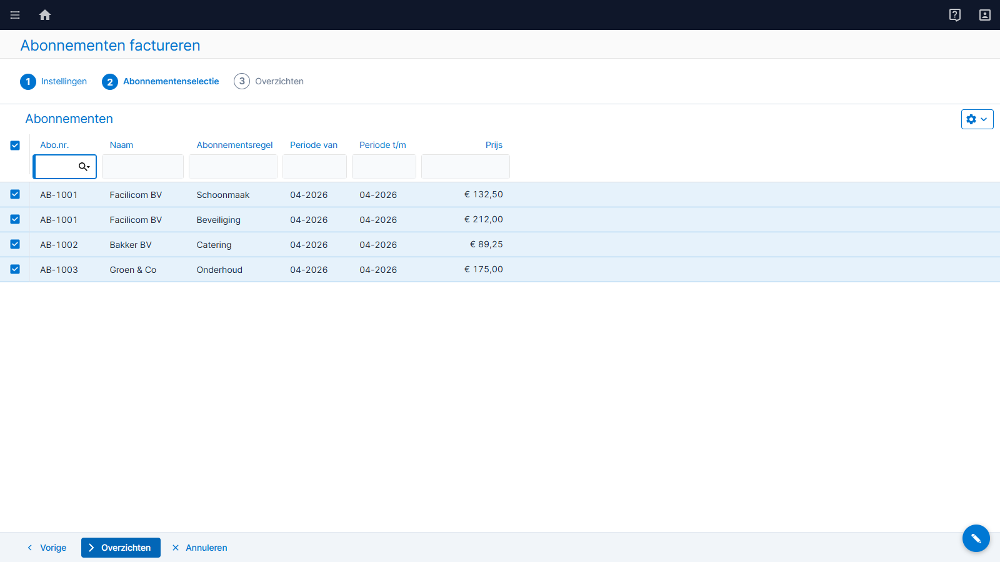

##### Stap 3 – Overzichten (dataset dropdown)

| Dataset | Zichtbaar wanneer |
|---|---|
| Abonnementen crediteren | altijd (bestaand) |
| Indexcorrecties | Indexcorrecties meenemen = aan |
| Te corrigeren factuurregels | Indexcorrecties meenemen = aan én Startdatum indexering geldig |

**Correctieanalyse bij openen dataset** (als "herberekenen"):

1. Voer correctieanalyse uit op selectie stap 2.
3. Bepaal status per kandidaat: Nieuw / Al verwerkt / Onvolledig.
4. Vul weergave; "Meenemen" alleen actief bij status Nieuw.

**Mockup stap 3 – Te corrigeren factuurregels:**

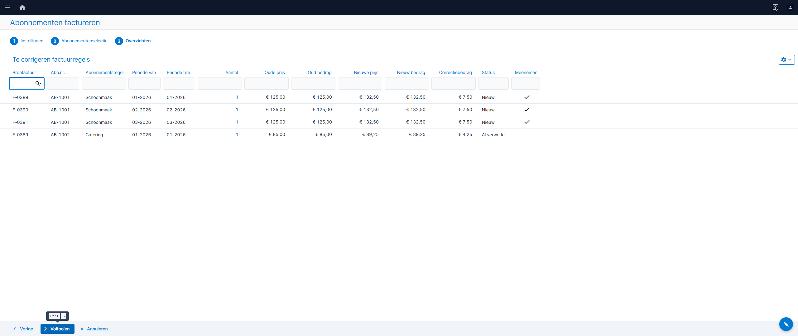

**Verwerken (voltooien wizard):**

- Reguliere factuurregels genereren op basis van Abonnementstarieven.
- Correctiesets aanmaken voor geselecteerde "Nieuw"-regels.
- Insert valt onder unieke borging; bij conflict: overslaan + log.

##### Podium-specificatie stap 1

**Schermtype:** DetailPage (uitbreiding bestaande wizardstap 1)

| Tabblad | Sectie-id | Veldgroeptitel | Veldlabel | Podium-type | Verplicht | Readonly | Inline editing | Cond. verplicht | Actief als | Groep actief als | Tooltip | Placeholder | Standaardwaarde | Keuzelijst-bron | Status | Mock-waarde |
|---|---|---|---|---|---|---|---|---|---|---|---|---|---|---|---|---|
| - | indexcorrecties | Indexcorrecties | Indexcorrecties meenemen | yesNo | nee | nee | - | - | - | - | Neem correcties met terugwerkende kracht op in de analyse | - | Nee | - | nieuw | Ja |
| - | indexcorrecties | Indexcorrecties | Startdatum indexering | date | nee | nee | - | Indexcorrecties meenemen = Ja | Indexcorrecties meenemen = Ja | - | Bepaal vanaf welke datum perioden worden beoordeeld | - | - | - | nieuw | 01-01-2026 |

###### Meldingen

| Type | Veldlabel / scope | Conditie | Tekst |
|---|---|---|---|

---

### 3.8 US08 – Proforma wizard gebruikt dezelfde prijsselectie

**Als** financieel medewerker **wil ik** dat de proforma wizard dezelfde prijsselectie gebruikt als definitieve facturatie, **zodat** proforma bedragen overeenkomen met definitief.

**Toelichting:** Proforma moet een betrouwbare simulatie zijn.

**Functionele uitwerking:**

- Proforma wizard gebruikt dezelfde prijsselectie op PeriodeVan.
- Proforma maakt geen definitieve factuurrecords en journaliseert niet.

**Acceptatiecriteria:**

1. Proforma toont dezelfde bedragen als definitief zou opleveren (bij gelijke input).
2. Proforma heeft geen database-effect op facturen/journalisering.
3. Proforma heeft geen effect op Abonnementstarieven.

#### Wizard B – Proforma facturen

Doel: simulatie met dezelfde prijs- en correctielogica als Wizard A.

| Verschil t.o.v. definitief | Toelichting |
|---|---|
| Geen opslag in definitieve factuurtabellen | Proforma slaat niet definitief op |
| Geen journalisering | Geen financiële boekingen |
| Geen gebruiksvlaggen | Geen markering op Abonnementstarieven |
| Reeds verwerkte perioden als "Nieuw" niet gepresenteerd | Status is consistent met definitief |

Stap 1 heeft dezelfde velden als Wizard A (inclusief `Proformadatum` i.p.v. `Factuurdatum` en inclusief Indexcorrecties meenemen en Startdatum indexering). Dezelfde schermsturing en validaties gelden.

---

### 3.9 US09 – Proforma wizard kan indexcorrecties meenemen

**Als** financieel medewerker **wil ik** in de proforma wizard indexcorrecties kunnen meenemen, **zodat** ik het effect van terugwerkende prijswijzigingen kan beoordelen vóór definitieve verwerking.

**Functionele uitwerking:**

- Proforma wizard krijgt optie "Indexcorrecties meenemen".
- Proforma toont correctiesets op dezelfde manier (terugdraaiing + nieuwe regel), maar alleen als simulatie.

**Acceptatiecriteria:**

1. Proforma toont correctieregels als twee regels per periode.
2. Geen opslag/journalisering.
3. Periode en labels zijn zichtbaar.
4. Reeds verwerkte perioden worden niet als "nieuw" gepresenteerd.

---

### 3.10 US10 – Correctie per abonnementsregel-periode maar één keer

**Als** financieel medewerker **wil ik** dat een indexcorrectie voor een abonnementsregel en periode niet opnieuw verwerkt kan worden, **zodat** ik geen dubbele correctieregels krijg bij herhaalde runs of gelijktijdig gebruik.

**Functionele uitwerking:**

- Tijdens analyse krijgt elke kandidaat een status: Nieuw / Al verwerkt / Onvolledig.
- "Al verwerkt" is niet selecteerbaar.
- Database borgt éénmaligheid met een unieke sleutel op de "nieuwe prijs"-correctieregel.

**Acceptatiecriteria:**

1. Een reeds gecorrigeerde periode verschijnt als "Al verwerkt" en kan niet opnieuw worden aangevinkt.
2. Bij gelijktijdige runs kan slechts één correctieset worden opgeslagen.
3. Als een tweede run toch probeert op te slaan, wordt dit overgeslagen met logging/melding.
4. Correctieregels worden niet opnieuw als bron voor analyse gebruikt.

---

### 3.11 US11 – Detailweergave "Te corrigeren factuurregels" met Correctiebedrag

**Als** financieel medewerker **wil ik** in de laatste stap van de wizard een detailweergave zien met de te corrigeren factuurregels en een kolom Correctiebedrag, **zodat** ik vóór verwerking inzicht heb in welke bronregels worden geraakt en wat het netto effect per regel is.

**Functionele uitwerking:**

- Als "Indexcorrecties meenemen" aan staat én een geldige Startdatum indexering is ingevoerd: in stap 3 verschijnt extra dataset "Te corrigeren factuurregels".
- Deze dataset toont op bronfactuurregel-niveau: bronfactuur, periode, oude prijs/bedrag, nieuwe prijs/bedrag, correctiebedrag, status.

**Acceptatiecriteria:**

1. Dataset verschijnt alleen onder de genoemde conditie.
2. Correctiebedrag = nieuwe bedrag − oude bedrag.
3. Status "Al verwerkt" is niet selecteerbaar.
4. Selectie (Meenemen) is consistent met de samenvattingsdataset (Indexcorrecties).

#### Detailweergave Te corrigeren factuurregels

##### Podium-specificatie

**Schermtype:** ListPage

| Kolom-id | Kolomkop | Podium-type | Sorteerbaar | Filter | Breedte | Status | Mock-waarde |
|---|---|---|---|---|---|---|---|
| bronfactuur | Bronfactuur | text | ja | ja | 100 | nieuw | F-0389 |
| abonr | Abo.nr. | text | ja | ja | 100 | nieuw | AB-1001 |
| abonregel | Abonnementsregel | text | ja | ja | 120 | nieuw | Schoonmaak |
| periodevn | Periode van | date | ja | ja | 90 | nieuw | 01-2026 |
| periodetm | Periode t/m | date | ja | ja | 90 | nieuw | 01-2026 |
| aantal | Aantal | number | nee | nee | 80 | nieuw | 1 |
| oudeprijs | Oude prijs | currencyAmount | nee | nee | 100 | nieuw | 125,00 |
| oudbedrag | Oud bedrag | currencyAmount | nee | nee | 100 | nieuw | 125,00 |
| nieuweprijs | Nieuwe prijs | currencyAmount | nee | nee | 100 | nieuw | 132,50 |
| nieuwbedrag | Nieuw bedrag | currencyAmount | nee | nee | 100 | nieuw | 132,50 |
| corrbedrag | Correctiebedrag | currencyAmount | nee | nee | 110 | nieuw | 7,50 |
| status | Status | text | ja | ja | 100 | nieuw | Nieuw |
| meenemen | Meenemen | yesNo | nee | nee | 80 | nieuw | Ja |

**Mockup dataset Te corrigeren factuurregels (stap 3):**

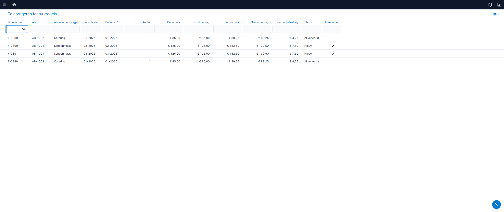

#### Dataset Indexcorrecties (stap 3)

Systeemfilter: `PeriodeVan ≥ Startdatum indexering`

| Kolomlabel | Sortering | Filter | Bijzonderheden |
|---|---|---|---|
| Abo.nr. | 1 | ja | |
| Verkooprelatie | | ja | |
| Naam | | ja | |
| Abonnementsregel | 2 | ja | |
| Omschrijving | | ja | |
| Periode van | 3 | ja | |
| Periode t/m | | ja | |
| Oude prijs | | | op basis van bronfactuurregel |
| Nieuwe prijs | | | op basis van Abonnementstarief |
| Aantal | | | op basis van bronfactuurregel |
| Correctiebedrag | | | = nieuwe bedrag − oude bedrag |
| Status | 4 | ja | Nieuw / Al verwerkt / Onvolledig |
| Gecorrigeerd op factuur | | ja | alleen bij Al verwerkt |
| Factuurdatum correctie | | ja | alleen bij Al verwerkt |
| Meenemen | | | checkbox; alleen enabled bij Nieuw |

Verborgen kolommen (niet tonen): Abonnementsregel, Bronfactuurregel, Bronverkoopprijs.

**Mockup factuurweergave correctieset:**

```
Indexcorrectie terugdraaiing 01-2026   1   -125,00   -125,00
Indexcorrectie nieuwe prijs  01-2026   1    132,50    132,50
```

**Mockup dataset Indexcorrecties (stap 3):**

```
┌─────────┬────────────┬────────────┬───────────┬───────────┬────────┬──────────────┬──────────────┬────────────┐
│ Abo.nr. │ Verkoopr.  │ Naam       │ Omschr.   │ Per. van  │ Per.tm │ Oude prijs   │ Nieuwe prijs │ Corr.bedr. │
├─────────┼────────────┼────────────┼───────────┼───────────┼────────┼──────────────┼──────────────┼────────────┤
│ AB-1001 │ Facilicom  │ Facilicom  │ Schoonm.  │ 01-2026   │ 01-26  │      125,00  │      132,50  │       7,50 │
│ AB-1001 │ Facilicom  │ Facilicom  │ Schoonm.  │ 02-2026   │ 02-26  │      125,00  │      132,50  │       7,50 │
│ AB-1002 │ Bakker BV  │ Bakker BV  │ Catering  │ 01-2026   │ 01-26  │       85,00  │       89,25  │       4,25 │
└─────────┴────────────┴────────────┴───────────┴───────────┴────────┴──────────────┴──────────────┴────────────┘
  Status: Nieuw   [ ] Meenemen
  Status: Nieuw   [ ] Meenemen
  Status: Nieuw   [ ] Meenemen
```

---

### 3.12 US12 – Updateconnector mutaties abonnement uitgebreid met begindatum afwijkende prijs

**Als** contractbeheerder **wil ik** bij het aanleveren van abonnementsmutaties via de updateconnector een begindatum voor de afwijkende prijs kunnen meegeven, **zodat** ik via de connector direct Abonnementstarieven kan aanmaken met de juiste Begindatum.

**Toelichting:** De bestaande Updateconnector mutaties abonnement wordt uitgebreid. Het veld Begindatum afwijkende prijs is optioneel. Als het veld gevuld is maakt de updateconnector een Abonnementstarief aan. Als het veld leeg is werkt de updateconnector zoals voorheen.

**Functionele uitwerking:**

- De updateconnector krijgt een nieuw optioneel veld Begindatum afwijkende prijs.
- Bij een gevulde begindatum:
  - Het systeem maakt een Abonnementstarief aan met de opgegeven begindatum en de afwijkende prijs uit de aanlevering.
  - Als er al een Abonnementstarief bestaat met dezelfde begindatum voor de abonnementsregel, wordt de prijs overschreven.
- Bij een lege begindatum:
  - De updateconnector werkt zoals voorheen (bestaand gedrag).

**Acceptatiecriteria:**

1. Het veld Begindatum afwijkende prijs is beschikbaar in de updateconnector.
2. Het veld is optioneel.
3. Bij gevulde begindatum wordt een Abonnementstarief aangemaakt met die Begindatum en de opgegeven prijs.
4. Bij een bestaande Abonnementstarief met dezelfde begindatum wordt de prijs overschreven.
5. Bij lege begindatum is het gedrag ongewijzigd.
6. Begindatum &lt; begindatum abonnement wordt geblokkeerd met een melding.
7. De vorige Abonnementstarief krijgt automatisch een einddatum (dag vóór de opgegeven begindatum).

#### Meldingsteksten

| Situatie | Melding |
|---|---|
| Begindatum &lt; begindatum abonnement | Begindatum afwijkende prijs mag niet vóór de begindatum van het abonnement liggen. |

---

### 3.13 US13 – Import abonnementen en Import abonnementmutatie uitgebreid met begindatum abonnementstarief

**Als** contractbeheerder **wil ik** bij het importeren van abonnementen en abonnementmutaties een begindatum voor het abonnementstarief kunnen meegeven, **zodat** ik via de import direct Abonnementstarieven kan aanmaken met de juiste begindatum.

**Toelichting:** De bestaande imports Import abonnementen en Import abonnementmutatie worden uitgebreid met een optioneel veld Begindatum abonnementstarief. Als het veld gevuld is, maakt de import een Abonnementstarief aan. Als het veld leeg is, werkt de import zoals voorheen.

**Functionele uitwerking:**

- Beide imports krijgen een nieuw optioneel veld Begindatum abonnementstarief.
- Bij een gevulde begindatum:
  - Het systeem maakt een Abonnementstarief aan met de opgegeven begindatum en de afwijkende prijs uit de importregel.
  - Als er al een Abonnementstarief bestaat met dezelfde begindatum voor de abonnementsregel, wordt de prijs overschreven.
- Bij een lege begindatum:
  - De import werkt zoals voorheen (bestaand gedrag).
- De einddatums van alle Abonnementstarieven voor de abonnementsregel worden automatisch herberekend (V20).

**Acceptatiecriteria:**

1. Het veld Begindatum abonnementstarief is beschikbaar in Import abonnementen.
2. Het veld Begindatum abonnementstarief is beschikbaar in Import abonnementmutatie.
3. Het veld is optioneel in beide imports.
4. Bij gevulde begindatum wordt een Abonnementstarief aangemaakt met die begindatum en de opgegeven prijs.
5. Bij een bestaande Abonnementstarief met dezelfde begindatum wordt de prijs overschreven.
6. Bij lege begindatum is het gedrag ongewijzigd.
7. Begindatum &lt; begindatum abonnement wordt geblokkeerd met een melding.
8. De vorige Abonnementstarief krijgt automatisch een einddatum (dag vóór de opgegeven begindatum).

#### Meldingsteksten

| Situatie | Melding |
|---|---|
| Begindatum &lt; begindatum abonnement | Begindatum abonnementstarief mag niet vóór de begindatum van het abonnement liggen. |

#### Import abonnementen (bestaand, uitbreiding)

**Type:** Nieuw

**Uitbreiding:** Nieuw optioneel veld.

| Veld | Verplicht | Type | Toelichting |
|---|---|---|---|
| Begindatum abonnementstarief | nee | datum | Bij gevulde waarde wordt een Abonnementstarief aangemaakt met deze begindatum en de afwijkende prijs uit de importregel. Bij lege waarde is het gedrag ongewijzigd. |

**Bereikbaarheid:** Bestaand menu-item (geen wijziging).

**Autorisatie:** Abonnementen onderhouden (bestaand).

#### Import abonnementmutatie (bestaand, uitbreiding)

**Type:** Mutatie

**Sleutelveld:** Abonnementsnummer + Regelnummer (bestaand).

**Uitbreiding:** Nieuw optioneel veld.

| Veld | Verplicht | Type | Toelichting |
|---|---|---|---|
| Begindatum abonnementstarief | nee | datum | Bij gevulde waarde wordt een Abonnementstarief aangemaakt met deze begindatum en de afwijkende prijs uit de importregel. Bij een bestaand Abonnementstarief met dezelfde begindatum wordt de prijs overschreven. Bij lege waarde is het gedrag ongewijzigd. |

**Bereikbaarheid:** Bestaand menu-item (geen wijziging).

**Autorisatie:** Abonnementen onderhouden (bestaand).

---

### 3.14 US14 – Conversie bestaande afwijkende prijzen naar Abonnementstarieven

**Wij** **zorgen ervoor** dat bestaande afwijkende prijzen automatisch worden omgezet naar Abonnementstarieven, **zodat** klanten na upgrade direct werken met de nieuwe prijsstructuur zonder handmatige aanpassing.

**Functionele uitwerking:**

- Conversie zoekt abonnementsregels met een gevuld veld Afwijkende prijs.
- Als nog geen Abonnementstarief bestaat: maak Abonnementstarief aan met begindatum = begindatum abonnement en prijs = waarde uit Afwijkende prijs.
- Na conversie vervalt het veld Afwijkende prijs op de abonnementsregel. De Abonnementstarief is de enige bron voor de prijs.

**Acceptatiecriteria:**

1. Per abonnementsregel met gevuld veld Afwijkende prijs wordt een Abonnementstarief aangemaakt met begindatum = Begindatum abonnement.
2. Als er al een Abonnementstarief bestaat voor de abonnementsregel, wordt de conversie overgeslagen.
3. Na conversie wordt het veld Afwijkende prijs niet meer gebruikt; de Abonnementstarief is leidend.

---

## 4. Datamodel

### 4.1 Nieuwe tabel: Abonnementstarief

Nieuwe tabel voor datumafhankelijke verkoopprijzen per abonnementsregel.

| Veld | Verplicht | Omschrijving |
|---|---|---|
| Abonnementsregel | ja | Koppeling naar de abonnementsregel waarvoor de prijs geldt |
| Begindatum | ja | Datum waarop de prijs ingaat |
| Einddatum | nee | Dag vóór de begindatum van de volgende prijsregel; leeg bij de meest recente prijs (readonly, berekend) |
| Prijs | ja | Verkoopprijs exclusief btw |

**Uniciteit:** Per abonnementsregel mag er maar één Abonnementstarief per begindatum bestaan.

### 4.2 Uitbreiding tabel: Factuurregel (bestaand)

| Veld | Verplicht | Omschrijving |
|---|---|---|
| Abonnementsregel | nee (gevuld bij correctieregels) | Koppeling naar de abonnementsregel waarop de correctie betrekking heeft |
| Bronfactuurregel | nee | Verwijzing naar de originele factuurregel die wordt gecorrigeerd |
| Bronverkoopprijs | nee | Verwijzing naar de Abonnementstarief waarmee de nieuwe prijs is bepaald |
| Bronperiode van | nee | Begindatum van de gecorrigeerde factuurperiode |
| Bronperiode t/m | nee | Einddatum van de gecorrigeerde factuurperiode |

**Uniciteit (éénmaligheidsborging):** Per abonnementsregel kan er maximaal één correctieset bestaan per combinatie van Bronperiode van en Bronperiode t/m.

### 4.3 ERD (conceptueel)

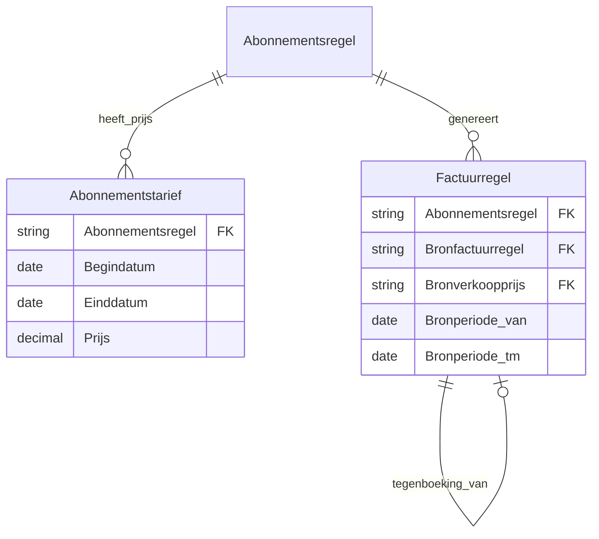
```mermaid
erDiagram
    Abonnementsregel ||--o{ Abonnementstarief : heeft_prijs
    Abonnementsregel ||--o{ Factuurregel : genereert
    Abonnementstarief {
        string Abonnementsregel FK
        date Begindatum
        date Einddatum
        decimal Prijs
    }
    Factuurregel {
        string Abonnementsregel FK
        string Bronfactuurregel FK
        string Bronverkoopprijs FK
        date Bronperiode_van
        date Bronperiode_tm
    }
    Factuurregel ||--o| Factuurregel : tegenboeking_van
```

---

## 5. Validaties en bedrijfsregels

### 5.1 Abonnementstarieven

| Regel | Omschrijving | US |
|---|---|---|
| V1 | Abonnementsregel is verplicht | US01 |
| V2 | Begindatum &lt; begindatum abonnement → blokkeren | US04 |
| V3 | Dubbele begindatum voor dezelfde abonnementsregel → blokkeren | US01, US06 |
| V4 | Tabblad Abonnementstarieven in Eigenschappen prijzen/kortingen Artikel toont alleen Abonnementstarieven voor abonnementsregels met het geopende artikel | US01 |
| V17 | Wijzigen van prijs of Begindatum op een Abonnementstarief is altijd toegestaan. Het prijsverschil wordt opgepikt door de correctieanalyse (US07) | US01 |
| V12 | Opslaan van prijs op abonnementsregel: bij 0 toekomstige prijzen → nieuwe Abonnementstarief (Begindatum = begindatum abonnement); bij 1 toekomstige prijs → prijs direct aanpassen; bij meerdere toekomstige prijzen → wizard starten. Bestaande historie blijft behouden | US02 |
| V21 | Leegmaken afwijkende prijs op abonnementsregel: bij 0 of 1 Abonnementstarief → verwijderen bij opslaan; bij meerdere Abonnementstarieven → blokkeren met melding (verwijzen naar actie Afwijkende prijzen) | US02 |
| V20 | Bij aanmaken, wijzigen of verwijderen van een Abonnementstarief herberekent het systeem automatisch de einddatums van alle Abonnementstarieven voor dezelfde abonnementsregel. De einddatum = dag vóór de begindatum van de chronologisch volgende prijsregel. De meest recente prijsregel heeft geen einddatum (leeg) | US01, US06, US12, US13 |
| V26 | De begindatum van het eerste Abonnementstarief is altijd gelijk aan de begindatum van de abonnementsregel. Bij wijziging van de begindatum op de abonnementsregel wordt de begindatum van het eerste Abonnementstarief automatisch bijgewerkt | US02 |

### 5.2 Factureren

| Regel | Omschrijving | US |
|---|---|---|
| V5 | Geen Abonnementstarief gevonden op PeriodeVan → val terug op de artikelprijs (bestaand gedrag) | US05 |
| V27 | Een Abonnementstarief is een specifieke uitzondering op de abonnementsregel. Algemene Verkoopprijzen per debiteur, artikel, prijslijst of project bepalen deze specifieke abonnementsregelprijs niet | US05 |

### 5.3 Indexcorrecties

| Regel | Omschrijving | US |
|---|---|---|
| V6 | Correcties alleen aanmaken bij daadwerkelijk prijsverschil | US07 |
| V6a | Bij terugdraaiingsregel wordt btw-code overgenomen van de bronfactuurregel; er vindt geen herberekening plaats | US07 |
| V7 | Startdatum indexering is alleen zichtbaar als "Indexcorrecties meenemen" is aangevinkt en is dan verplicht | US07 |
| V9 | EffectieveStartdatum = Startdatum indexering | US07 |
| V10 | Periode met status "Al verwerkt" is niet selecteerbaar | US10, US11 |
| V11 | Éénmaligheid geborgd: per abonnementsregel kan maximaal één correctieset bestaan per bronperiode | US10 |
| V16 | Status Onvolledig wordt toegekend als de bronfactuurregel of de geldige Abonnementstarief niet kan worden bepaald (ontbrekende koppeling of verwijderde brongegevens) | US10, US11 |

### 5.4 Proforma en conversie

| Regel | Omschrijving | US |
|---|---|---|
| V13 | Proforma gebruikt dezelfde prijsselectie en indexcorrectielogica als definitief, maar zonder opslag en journalisering | US08, US09 |
| V14 | Conversie maakt alleen Abonnementstarieven aan als er nog geen Abonnementstarief voor de abonnementsregel bestaat | US14 |
| V18 | Updateconnector mutaties: bij gevulde begindatum afwijkende prijs wordt een Abonnementstarief aangemaakt; bij lege begindatum is het gedrag ongewijzigd | US12 |
| V19 | Updateconnector mutaties: Begindatum afwijkende prijs &lt; begindatum abonnement → blokkeren | US12 |
| V24 | Import abonnementen/abonnementmutatie: bij gevulde Begindatum abonnementstarief wordt een Abonnementstarief aangemaakt; bij lege begindatum is het gedrag ongewijzigd | US13 |
| V25 | Import abonnementen/abonnementmutatie: Begindatum abonnementstarief &lt; begindatum abonnement → blokkeren | US13 |

---

## 6. Content

Overzicht van wijzigingen die het content team moet oppakken.

| # | Contentgebied | Verdict | Toelichting |
|---|---|---|---|
| 1 | Documenten, rapporten en analyses | Geen actie | — |
| 2 | Profielen en veldcontexten | Actie vereist | Nieuwe velden op wizardstap 1 (Indexcorrecties meenemen, Startdatum indexering), veld Begindatum in wizard Wijzigen afwijkende prijzen abonnementsregels, veld Begindatum afwijkende prijs in Updateconnector mutaties abonnement, veld Begindatum abonnementstarief in Import abonnementen en Import abonnementmutatie, actie Afwijkende prijzen op abonnementsregel en tabblad Abonnementstarieven in Eigenschappen prijzen/kortingen Artikel moeten in profielen worden opgenomen (US01, US02, US06, US07, US12, US13). |
| 3 | Icoontjes | Geen actie | — |
| 4 | OutSite-pagina's | Geen actie | Geen OutSite-functionaliteit in dit ontwerp. |
| 5 | Autorisatiegroep (Profit) | Actie vereist | Controleer of de bestaande autorisatiegroepen de nieuwe functionaliteit afdekken. Zie tabel hieronder. |
| 6 | Veldinfo content (informatiebolletje) | Actie vereist | Informatiebolletje toevoegen voor: weergave Abonnementstarieven, boekingslay-out Onderhouden abonnementstarieven, Indexcorrecties meenemen, Startdatum indexering, statuswaarden Nieuw / Al verwerkt / Onvolledig (US01, US07). |
| 7 | Pocket | Geen actie | — |
| 8 | Standaardpagina's InSite | Geen actie | — |
| 9 | Weergaven en boekingslay-outs | Actie vereist | Weergave Abonnementstarieven, tabblad Abonnementstarieven in Eigenschappen prijzen/kortingen Artikel en boekingslay-out Onderhouden abonnementstarieven inrichten (US01). Nieuwe datasets Indexcorrecties en Te corrigeren factuurregels in wizardstap 3 moeten worden ingericht met kolommen, sortering en filters (US11). |
| 10 | Workflows en condities | Geen actie | — |
| 11 | Autorisatierollen | Geen actie | Geen InSite/OutSite-rollen in dit ontwerp. |
| 12 | Bericht- en documentsjablonen | Geen actie | — |
| 13 | Signalen | Geen actie | — |

**Totaal actiepunten:** 4

### 6.1 Autorisatie

Alle nieuwe functionaliteit valt binnen bestaande autorisatiepolicies. Er zijn geen nieuwe rechten nodig.

| Functionaliteit | Bestaande policy | Toelichting |
|---|---|---|
| Abonnementstarieven aanmaken, wijzigen, verwijderen | Abonnementen onderhouden | Abonnementstarieven vallen onder de autorisatie van het abonnementenbeheer. |
| Tabblad Abonnementstarieven in Eigenschappen prijzen/kortingen Artikel | Artikelprijzen bekijken + Abonnementen onderhouden | Het tabblad toont Abonnementstarieven bij het geopende artikel. Onderhouden loopt via de bestaande boekingslay-out. |
| Collectief wijzigen abonnementstarieven (met begindatum) | Prijsmutatie | Uitbreiding bestaande wizard met veld Begindatum; maakt Abonnementstarieven aan. Gebruikt dezelfde autorisatie als collectieve prijsmutaties. |
| Abonnementen factureren (definitief, inclusief indexcorrecties) | Abonnementen factureren | Indexcorrecties zijn een uitbreiding van de bestaande factuurwizard; geen apart recht. |
| Proforma abonnementen factureren (inclusief indexcorrecties) | Abonnementen factureren | Proforma gebruikt hetzelfde proces als definitief factureren. |
| Prijshistorie bekijken vanuit abonnementsregel | Abonnementen onderhouden | Actie Afwijkende prijzen op de abonnementsregel navigeert naar de weergave Abonnementstarieven. |
| Boekingslay-out Onderhouden abonnementstarieven | Abonnementen onderhouden | Opent vanuit de weergave Abonnementstarieven; wijzigt bestaande Abonnementstarieven. |
| Updateconnector mutaties abonnement (met begindatum) | Abonnementen onderhouden | Uitbreiding bestaande updateconnector met optioneel veld Begindatum afwijkende prijs. Gebruikt dezelfde autorisatie als de updateconnector voor abonnementsmutaties. |
| Import abonnementen (met begindatum abonnementstarief) | Abonnementen onderhouden | Uitbreiding bestaande import met optioneel veld Begindatum abonnementstarief. Gebruikt dezelfde autorisatie als de import voor abonnementen. |
| Import abonnementmutatie (met begindatum abonnementstarief) | Abonnementen onderhouden | Uitbreiding bestaande import met optioneel veld Begindatum abonnementstarief. Gebruikt dezelfde autorisatie als de import voor abonnementmutaties. |

### 6.2 Niet van toepassing (Definition of Done)

| Onderdeel | Motivatie |
|---|---|
| Rapportages / gegevensverzamelingen | Gegevensverzameling Abonnementstarieven is beschreven in §8a. Bestaande facturatieoverzichten tonen correctieregels automatisch. |
| Signalen | Geen signalen voor prijswijzigingen of correcties in scope. |
| Connectors (Get/Update) | Geen nieuwe connectors. De bestaande Updateconnector mutaties abonnement wordt uitgebreid met een optioneel veld Begindatum afwijkende prijs (US12). De bestaande imports worden uitgebreid met een optioneel veld Begindatum abonnementstarief (US13). |

---

## 7. Conversie bestaande afwijkende prijzen

Bij de release worden bestaande afwijkende prijzen op abonnementsregels omgezet naar Abonnementstarieven. Na conversie vervangt de Abonnementstarief het veld Afwijkende prijs op de abonnementsregel.

**Conversieregel:** Per abonnementsregel waar het veld Afwijkende prijs gevuld is én nog geen Abonnementstarief bestaat:

- Maak een Abonnementstarief aan met begindatum = Begindatum abonnement en Prijs = waarde uit Afwijkende prijs.

**Na conversie:**

- Het veld Afwijkende prijs op de abonnementsregel wordt niet meer gebruikt.
- De Abonnementstarief is de enige bron voor de prijs bij facturering.

**Eigenschappen:**

- Herhaalbaar zonder dubbelen (controle op bestaan Abonnementstarief).
- Na afloop: rapportage met aantallen aangemaakt en overgeslagen (met reden).

---

## 8. Openstaande punten

| Nr | Punt | Eigenaar | Status |
|---|---|---|---|
| O1 | Definitieve naam van de velden op Factuurregel (Bronfactuurregel etc.) afstemmen met teamstandaard | Eric Zaal | Gesloten (B1) |
| O2 | Uitwerking actie "Prijshistorie" op het abonnementsregelscherm: apart tabblad of dialog? | Financial Basic | Gesloten (B2) |
| O3 | Vaststellen of Collectief wijzigen abonnementstarieven (met begindatum) ook via batch / Profit Server aangeboden wordt | Eric Zaal | Gesloten (B3) |
| O4 | Afhandeling btw bij terugdraaiingsregel: btw-code overnemen van bronregel of herberekenen? | Financial Basic / Facilicom | Gesloten (B4) |
| O5 | Conversieproces: definitie van "bestaande prijsafwijking" in het huidige datamodel bepalen | Financial Basic | Gesloten (B5) |

### 8.1 Besluiten

| Nr | Besluit |
|---|---|
| B1 | Veldnamen op Factuurregel zijn definitief: Bronfactuurregel, Bronverkoopprijs, Bronperiode van, Bronperiode t/m, Abonnementsregel. |
| B2 | Prijshistorie is beschikbaar via de actie Afwijkende prijzen op de abonnementsregel. Deze actie opent de weergave Abonnementstarieven, gefilterd op de geselecteerde abonnementsregel. |
| B3 | Collectief wijzigen abonnementstarieven (met begindatum) is beschikbaar voor batch / Profit Server-verwerking. |
| B4 | Voor terugdraaiingsregels wordt btw-code overgenomen van de bronfactuurregel; btw wordt niet herberekend. |
| B5 | Definitie "bestaande prijsafwijking": veld Prijsafwijking op de abonnementsregel is gevuld. Na conversie vervalt dit veld; de Abonnementstarief is leidend. |
| B6 | Staffelprijs en prijs via berekening zijn niet beschikbaar als afwijkende prijs op de abonnementsregel. De prijsbepaling op basis van het aantal (staffel) of de grondslag (berekening) levert een originele prijs op, maar dit resultaat wordt niet als afwijkende prijs overgenomen. De Abonnementstarief ondersteunt alleen een vaste afwijkende prijs. |
| B7 | Het vinkje Vaste prijs op de verkoopprijs blokkeert de prijs niet op de abonnementsregel. De afwijkende prijs blijft altijd te wijzigen. Dit is bestaand gedrag en wordt niet aangepast. |
| B8 | De instellingen Korting toestaan en Korting op orderregel wijzigen op de verkoopprijs werken niet door als blokkade op de abonnementsregel. De kortingsvelden blijven bewerkbaar. Dit is bestaand gedrag en wordt niet aangepast. |
| B9 | Abonnementstarief is een specifieke uitzondering op één abonnementsregel. Er is geen samenhang met algemene verkoopprijsafspraken per debiteur. Daarom komt er geen type Abonnement in de wizard Nieuwe verkoopprijs en krijgt de weergave Verkoopprijs (item) geen abonnementskolommen. De actie Afwijkende prijzen opent alleen de Abonnementstarieven voor de geselecteerde abonnementsregel. |
| B10 | Profit splitst een factuurperiode niet automatisch als het tarief wijzigt binnen die periode. Er geldt één tarief per factuurperiode, bepaald op PeriodeVan. |
| B11 | Correcties bestaan uit een minregel (oude prijs) en een plusregel (nieuwe prijs) per periode. Een enkele delta-regel is niet gekozen omdat dit bij klanten meer vragen oproept. Deze methode sluit aan bij flex-facturatie. |
