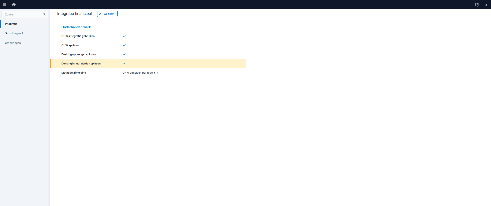
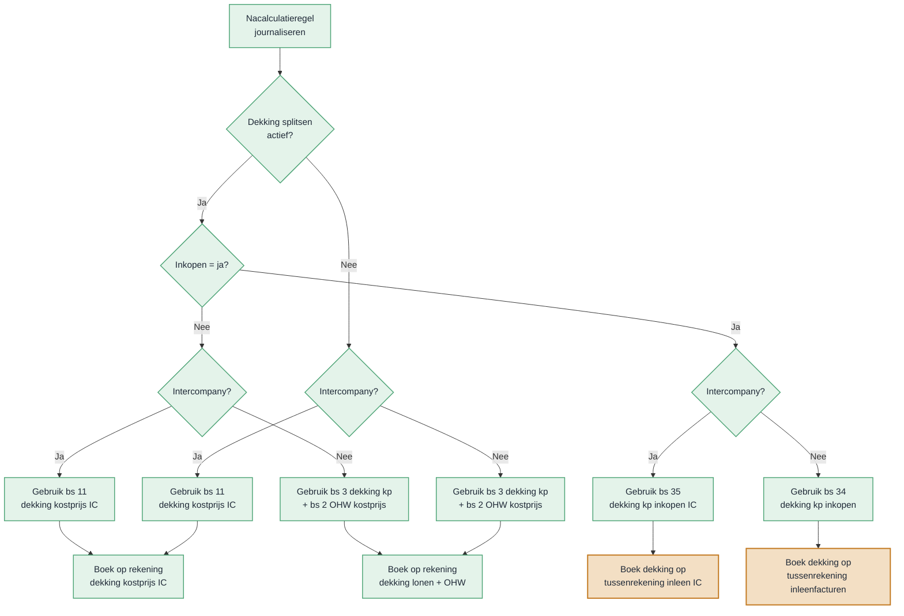
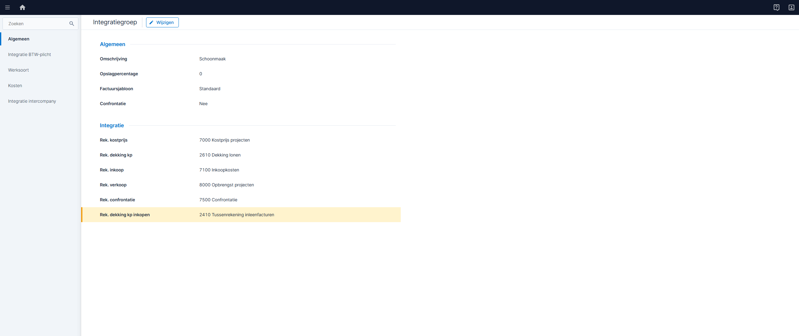
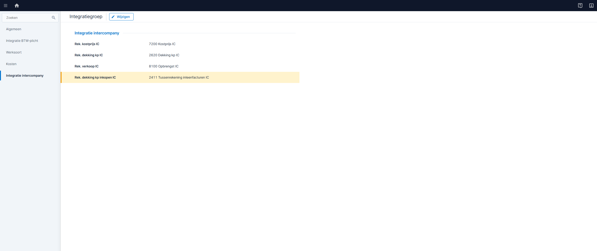
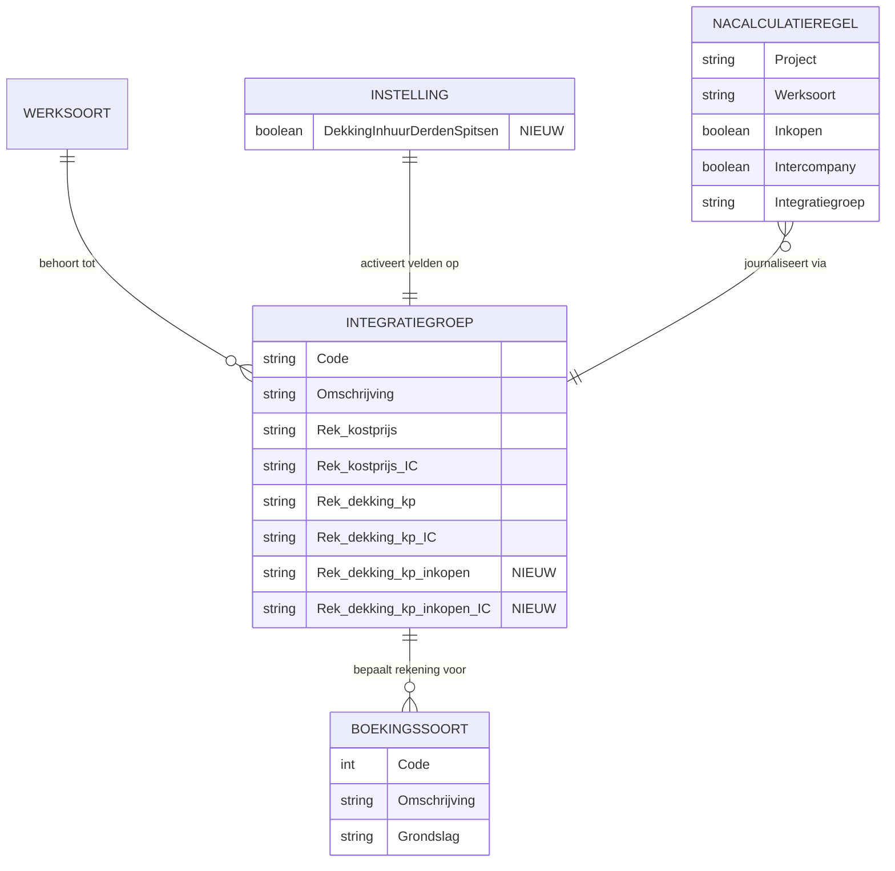

# Ontwerp RPT00751 — Financiële integratie integratierekening inhuur derden

| Gegeven | Waarde |
|---|---|
| Projectcode | RPT00751 |
| Projectnaam | Financiële integratie integratierekening inhuur derden |
| Ontwerper | EZA |
| Versie | Profit 9 |
| Datum | 21-04-2026 |
| Status | Concept |

## Versiehistorie

| Versie | Datum | Auteur | Toelichting |
|---|---|---|---|
| 0001 | 21-04-2026 | EZA | Eerste concept |

---

## 1. Inleiding

### Aanleiding

Bij klanten die werken met **inhuur derden** (externe medewerkers) ontstaan nacalculatieregels met het kenmerk "inkopen". Deze regels leiden tot een inkoopfactuur of een ontvangst waarvoor een factuur binnenkomt. De kosten zijn fundamenteel anders dan loonkosten van eigen medewerkers:

- **Eigen medewerker**: financiële integratie aan dekking lonen (kostenrekening in de 4xxx-reeks, bijvoorbeeld "dekking lonen").
- **Externe medewerker**: financiële integratie aan tussenrekening nog te ontvangen facturen (balanspositie, kortlopende schulden).

Op dit moment gebruikt Profit voor beide situaties dezelfde integratierekening via de integratiegroep op de werksoort. Het is niet mogelijk om specifiek voor "inkopen"-nacalculatieregels een andere integratierekening vast te leggen.

Het workaround — aparte werksoorten voor eigen en externe medewerkers — is onwerkbaar voor klanten met veel werksoorten. Bij Facilicom bijvoorbeeld wordt elke werksoort uitgesplitst naar tijdvak (overdag, avond, nacht, weekend, feestdag). Het verdubbelen van al deze werksoorten alleen voor de integratierekening is niet houdbaar qua beheer en tariefonderhoud.

**Intercompany** kent al een apart boekingssoort (11 in plaats van 3). Het ontbreekt aan een vergelijkbare scheiding voor reguliere inhuur derden.

### Vooronderzoek

- Analyse van de boekingsgang financiële integratie in de Profit-documentatie.
- Bestudering van de boekingssoorten.
- Analyse van de integratiegroep-inrichting bij Facilicom en Kleentec.
- Onderzoek naar bestaand patroon: intercompany gebruikt al boekingssoort 11 i.p.v. 3.
- Gesprekken met consultant Facilicom over werkbaarheid huidige workaround.

### Resultaat

Na dit project kan de beheerder per integratiegroep een aparte rekening instellen voor nacalculatieregels waarbij "inkopen" aanstaat. Profit gebruikt deze rekening automatisch bij het journaliseren van de financiële integratie voor inhuur derden. Dit geldt voor:

- **Dekking kostprijs** (regulier, project en administratie gelijk)
- **Dekking kostprijs intercompany** (bij gebruik van intercompany)

De beheerder hoeft geen aparte werksoorten meer aan te maken voor eigen en externe medewerkers.

**Gekoppelde POA's**: 442793, RPT00751

### Afbakening

| In scope | Toelichting |
|---|---|
| Nieuw boekingssoort dekking kostprijs inkopen | Aparte integratierekening voor dekking kostprijs bij inhuur |
| Nieuw boekingssoort dekking kostprijs inkopen IC | Aparte integratierekening voor dekking kostprijs bij intercompany inhuur |
| Nieuwe instelling "Dekking inhuur derden splitsen" | Master-schakelaar die de splitsing activeert |
| Aanpassing integratiegroep-onderhoud | Twee nieuwe rekeningvelden op de integratiegroep |
| Aanpassing journaliseringslogica | Selectie van boekingssoort op basis van instelling + "inkopen"-kenmerk |

### Randvoorwaarden

- De functionaliteit "Inhuur derden" moet actief zijn.
- De instelling "Dekking inhuur derden splitsen" moet aanstaan. Zonder deze instelling zijn de nieuwe velden verborgen en de boekingssoorten niet actief.
- Bestaande klanten die de huidige inrichting met aparte werksoorten gebruiken, blijven correct werken (backward compatible).
- Autorisatie: de instelling en de nieuwe velden vallen onder de bestaande autorisatierechten voor financiële instellingen en werksoort-onderhoud. Er zijn geen nieuwe rechten nodig.

### Begrippen

| Begrip | Omschrijving |
|---|---|
| Nacalculatieregel | Een boekingsregel in de projectadministratie die de werkelijke kosten vastlegt. |
| Inkopen | Kenmerk op een nacalculatieregel dat aangeeft dat de kosten afkomstig zijn van een externe partij (inhuur derden). |
| Integratiegroep | Groepering op werksoorten die bepaalt welke grootboekrekeningen worden gebruikt bij het journaliseren. |
| Boekingssoort | Een code die bepaalt naar welke grootboekrekening een journaalpost wordt geboekt (bijv. dekking kostprijs, OHW kostprijs). |
| Financiële integratie | Het proces waarbij nacalculatieboekingen worden vertaald naar journaalposten in de financiële administratie, met bijbehorende rekeningen per boekingssoort. |
| OHW | Onderhanden Werk — de waarde van nog niet afgeronde projecten op de balans. |
| Dekking kostprijs | De tegenrekening van de kostenboeking. Bij eigen medewerkers: dekking lonen. Bij inhuur: tussenrekening nog te ontvangen facturen. |
| Methode financiële integratie | De instelling op het project die bepaalt hoe financiële integratie wordt verwerkt. Methode 1–3: met financiële bron (factuur). Methode 8: zonder financiële bron (directe journalisering vanuit nacalculatie). |
| Afmelding OHW | Het terugdraaien van de OHW-boekingen bij het afsluiten of afmelden van een project (mutatiesoort 11/12). |
| Dekking inhuur derden splitsen | Instelling die bepaalt of de financiële integratie aparte boekingssoorten en rekeningen gebruikt voor nacalculatieregels met "inkopen". Vergelijkbaar met de bestaande instellingen voor het splitsen van financiële integratie. |

### § Bijlagen

| Bijlage | Onderwerp |
|---|---|
| [A – Samenvatting voor klant](#bijlage-a--samenvatting-voor-klant) | Korte uitleg voor klanten |
| [B – Open punten / beslissingen](#bijlage-b--open-punten--beslissingen) | Openstaande vragen en beslissingen |

---

## 2. User stories

### Overzicht

| Nr | User story | Toelichting |
|---|---|---|
| US01 | Aparte integratierekening voor inhuur derden — dekking kostprijs | Nieuw boekingssoort voor nacalculatieregels met "inkopen" bij reguliere projecten |
| US02 | Aparte integratierekening voor inhuur derden — intercompany | Nieuw boekingssoort voor nacalculatieregels met "inkopen" bij intercompany |
| US03 | Inrichting integratiegroep uitbreiden | Twee nieuwe rekeningvelden op de integratiegroep |
| US04 | Conversie bestaande omgevingen | Bestaande inrichtingen blijven werken zonder aanpassing |

---

### 2.1 US01 – Aparte integratierekening inhuur derden (dekking kostprijs)

Als **financieel beheerder** wil ik dat nacalculatieregels met het kenmerk "inkopen" een ander boekingssoort gebruiken voor de dekking kostprijs, zodat de journalisering op een andere integratierekening plaatsvindt dan bij eigen medewerkers.

#### Mockups

#### Functionele uitwerking

**Huidig gedrag (IST)**

Bij het journaliseren van nacalculatieregels (mutatiesoort 9 — financiële integratie kostprijs) gebruikt Profit boekingssoort **3** (dekking kostprijs) voor de tegenrekening. Dit geldt ongeacht of de regel van een eigen medewerker of van inhuur derden komt.

De boekingsgang voor een **eigen medewerker** is:

| Rekening | Omschrijving | Debet | Credit |
|---|---|---|---|
| 3400 | OHW kosten | 100 | |
| 7000 | Kostprijs projecten | 100 | |
| (via bs 3) | Dekking lonen (bijv. 2610) | | 100 |
| (via bs 2) | OHW kostprijs (bijv. 3200) | 100 | |

De boekingsgang voor **inhuur derden** is op dit moment identiek. De dekking loopt over dezelfde rekening (bijv. 2610 — dekking lonen), terwijl dit feitelijk een tussenrekening moet zijn (bijv. 2410 — tussenrekening nog te ontvangen facturen).

**Nieuw gedrag (SOLL)**

Wanneer een nacalculatieregel het kenmerk "inkopen" heeft, gebruikt Profit een **nieuw boekingssoort** voor de dekking kostprijs. Dit boekingssoort verwijst naar de rekening die is ingesteld op de integratiegroep in het nieuwe veld "Rekening dekking kostprijs inkopen".

De boekingsgang voor **inhuur derden** wordt dan:

| Rekening | Omschrijving | Debet | Credit |
|---|---|---|---|
| 3400 | OHW kosten | 100 | |
| 7000 | Kostprijs projecten | 100 | |
| (via bs 34) | Tussenrekening inleenfacturen (bijv. 2410) | | 100 |
| (via bs 2) | OHW kostprijs (bijv. 3200) | 100 | |

**Voorwaarde: instelling**

De nieuwe boekingssoorten zijn alleen actief als de instelling "Dekking inhuur derden splitsen" aanstaat. Als de instelling uitstaat, gebruikt Profit altijd de bestaande boekingssoorten (2, 3, 11). Dit volgt het patroon van de bestaande instellingen voor het splitsen van financiële integratie.

**Terugvalgedrag**

Als de instelling aanstaat maar de beheerder geen rekening heeft ingesteld voor "dekking kostprijs inkopen" op de integratiegroep, valt Profit terug op boekingssoort 3 (dekking kostprijs). De OHW kostprijs (bs 2) blijft ongewijzigd.

**Methode 8 — journaliseren zonder financiële bron**

Methode 8 (journaliseren zonder financiële bron) gebruikt dezelfde boekingssoort-routing. Het nieuwe boekingssoort voor inkopen geldt automatisch ook voor projecten met methode 8. Er is geen aparte logica nodig.

**Afmelding OHW**

Bij het afmelden van OHW (mutatiesoort 11/12) draait Profit de integratieboekingen terug. De afmeldingslogica controleert het "inkopen"-kenmerk op de nacalculatieregel en gebruikt hetzelfde boekingssoort als bij de oorspronkelijke integratie.

De boekingsgang bij afmelding van een **inhuur derden**-regel (inkopen = ja, instelling aan, rekening ingevuld):

| Rekening | Omschrijving | Debet | Credit |
|---|---|---|---|
| (via bs 34) | Tussenrekening inleenfacturen (bijv. 2410) | 100 | |
| (via bs 2) | OHW kostprijs (bijv. 3200) | | 100 |

Dit is de spiegeling van de oorspronkelijke integratieboeking. Bij een **eigen medewerker** (inkopen = nee) verandert er niets: de afmelding gebruikt bs 3 en bs 2 zoals voorheen.

Het terugvalgedrag is identiek aan de integratie: als de rekening "dekking kostprijs inkopen" niet is ingevuld, valt de afmelding terug op bs 3.

#### Acceptatiecriteria

1. Als de instelling "Dekking inhuur derden splitsen" aanstaat en een nacalculatieregel "inkopen = ja" heeft, wordt de dekking kostprijs gejournaliseerd met bs 34 (dekking kostprijs inkopen). De OHW kostprijs blijft op bs 2.
2. Als de instelling uitstaat, wordt altijd het bestaande gedrag gebruikt (bs 2/3/11), ongeacht het inkopen-kenmerk.
3. Een nacalculatieregel met "inkopen = nee" wordt gejournaliseerd met de bestaande boekingssoorten 2 (OHW kostprijs) en 3 (dekking kostprijs).
4. Als de instelling aanstaat maar de rekening "dekking kostprijs inkopen" niet is ingevuld, valt Profit terug op boekingssoort 3.
5. De boekingsgang is boekhoudkundig sluitend: debet = credit.
6. De bestaande werksoortinrichting bij Kleentec (aparte werksoorten voor inleen) blijft correct werken.
7. Bij afmelding OHW (mutatiesoort 11/12) gebruikt Profit hetzelfde boekingssoort als bij de oorspronkelijke integratie. Een afmelding van een "inkopen"-regel boekt terug via bs 34.

---

### 2.2 US02 – Aparte integratierekening inhuur derden (intercompany)

Als **financieel beheerder** wil ik dat bij intercompany-projecten nacalculatieregels met het kenmerk "inkopen" een apart boekingssoort gebruiken, zodat ook in de intercompany-boekingsgang de dekking kostprijs op de juiste rekening wordt geboekt.

#### Functionele uitwerking

**Huidig gedrag**

Bij intercompany gebruikt Profit boekingssoort **11** (dekking kostprijs intercompany) in plaats van boekingssoort 3. Dit geldt voor alle nacalculatieregels, ongeacht of het inkopen betreft.

**Nieuw gedrag**

Wanneer een nacalculatieregel "inkopen = ja" heeft én het een intercompany-boeking betreft, gebruikt Profit een **nieuw boekingssoort** voor "dekking kostprijs inkopen intercompany". De rekening wordt opgehaald uit het nieuwe veld "Rekening dekking kostprijs inkopen intercompany" op de integratiegroep. De volledige beslisboom staat in het diagram bij US01.

**Terugvalgedrag**

Als de rekening voor "dekking kostprijs inkopen intercompany" niet is ingevuld, valt Profit terug op boekingssoort 11 (dekking kostprijs intercompany).

#### Acceptatiecriteria

1. Een nacalculatieregel met "inkopen = ja" bij een intercompany-project wordt gejournaliseerd met het nieuwe intercompany-inkopen-boekingssoort.
2. Als de intercompany-inkopen-rekening niet is ingevuld, valt de journalisering terug op boekingssoort 11.
3. Reguliere intercompany-nacalculatieregels (zonder "inkopen") blijven boekingssoort 11 gebruiken.

---

### 2.3 US03 – Inrichting integratiegroep uitbreiden

Als **applicatiebeheerder** wil ik op de integratiegroep twee extra rekeningvelden kunnen vastleggen, zodat ik per integratiegroep de dekking kostprijs voor inhuur derden apart kan instellen.

#### Functionele uitwerking

Op het scherm **Integratiegroep** (onderdeel van werksoort-onderhoud) komen twee nieuwe velden:

| Veld | Omschrijving | Type | Verplicht |
|---|---|---|---|
| Rekening dekking kostprijs inkopen | Grootboekrekening voor de dekking kostprijs bij nacalculatieregels met "inkopen" | Zoekweergave (grootboekrekening) | Nee |
| Rekening dekking kostprijs inkopen intercompany | Grootboekrekening voor de intercompany-variant | Zoekweergave (grootboekrekening) | Nee |

**Zichtbaarheid**

- Beide velden zijn alleen zichtbaar als de instelling "Dekking inhuur derden splitsen" aanstaat én de functionaliteit "Inhuur derden" actief is.
- Het veld "Rekening dekking kostprijs inkopen intercompany" is daarnaast alleen zichtbaar als ook de functionaliteit "Intercompany" actief is.

**Scherm en gedrag**

De velden staan in het bestaande integratiegroep-onderhoud, direct onder de bestaande rekening "dekking kostprijs" en "dekking kostprijs intercompany".

#### Acceptatiecriteria

1. De twee nieuwe velden zijn zichtbaar op het integratiegroep-scherm als de bijbehorende condities actief zijn.
2. De velden zijn niet verplicht.
3. De zoekweergave filtert op actieve grootboekrekeningen (niet-geblokkeerd).
4. Handmatige invoer van een geblokkeerde rekening toont een melding.

#### Meldingstekst

| Situatie | Tekst | Type |
|---|---|---|
| Geblokkeerde rekening ingevoerd | De geselecteerde rekening is geblokkeerd en kan niet worden gebruikt. | Fout |

---

### 2.4 US04 – Conversie bestaande omgevingen

Als **AFAS** wil ik dat bestaande klantomgevingen zonder aanpassing correct blijven werken, zodat er geen regressie optreedt bij de uitrol.

#### Functionele uitwerking

De instelling "Dekking inhuur derden splitsen" staat standaard **uit**. Hierdoor verandert er niets voor bestaande klanten:

- De nieuwe velden op de integratiegroep zijn verborgen.
- De journaliseringslogica gebruikt de bestaande boekingssoorten (2, 3, 11).
- Er is geen dataconversie nodig.

Klanten die nu aparte werksoorten gebruiken voor eigen en externe medewerkers (zoals Kleentec) hoeven hun inrichting niet aan te passen. De bestaande werksoort-scheiding blijft werken.

Klanten die de splitsing willen activeren, zetten de instelling aan en vullen de gewenste rekeningen in op de integratiegroep.

#### Acceptatiecriteria

1. De instelling staat standaard uit bij alle bestaande omgevingen.
2. Na de update werkt de journalisering van bestaande nacalculatieregels ongewijzigd.
3. Klanten met de huidige workaround (aparte werksoorten) ondervinden geen verschil.
4. Er is geen conversie nodig.

---

## 3. Datamodel

### Nieuwe instelling

| Instelling | Type | Standaard | Patroon |
|---|---|---|---|
| Dekking inhuur derden splitsen | Boolean | Uit (false) | Vergelijkbaar met de bestaande instellingen voor het splitsen van financiële integratie |

De instelling wordt beheerd in de financiële instellingen. De instelling is alleen zichtbaar als de functionaliteit "Inhuur derden" actief is.

### Gewijzigde tabel: Integratiegroep

Twee nieuwe velden op de bestaande integratiegroeptabel:

| Veld | Type | Verplicht | Omschrijving |
|---|---|---|---|
| Rekening dekking kostprijs inkopen | Grootboekrekening (FK) | Nee | Tegenrekening voor dekking kostprijs bij nacalculatieregels met "inkopen" |
| Rekening dekking kostprijs inkopen intercompany | Grootboekrekening (FK) | Nee | Tegenrekening voor dekking kostprijs bij intercompany "inkopen"-regels |

### Nieuwe boekingssoorten

Twee nieuwe waarden in de boekingssoort-enumeratie. De huidige reeks loopt van 1 t/m 33. Nummer 9 is gereserveerd en wordt uitgesloten in filters.

| Boekingssoort | Omschrijving | Analoog aan | Terugval |
|---|---|---|---|
| 34 (voorstel) | Dekking kostprijs inkopen | bs 3 (dekking kostprijs) | Leeg → terugval op bs 3 |
| 35 (voorstel) | Dekking kostprijs inkopen IC | bs 11 (dekking kostprijs IC) | Leeg → terugval op bs 11 |

De definitieve nummers worden afgestemd met het team dat de boekingssoorten beheert (zie B01).

### ERD

---

## Bijlage A – Samenvatting voor klant

### Wat verandert er?

Bij projecten met inhuur derden (externe medewerkers) kun je nu een aparte grootboekrekening instellen voor de dekking kostprijs. Hierdoor kun je in de boekhouding onderscheid maken tussen:

- Loonkosten van eigen medewerkers (dekking lonen)
- Kosten van externe medewerkers (tussenrekening nog te ontvangen facturen)

### Wat moet je doen?

1. Zet de instelling "Dekking inhuur derden splitsen" aan in de financiële instellingen.
2. Vul de gewenste rekeningen in op de integratiegroep (bij werksoort-inrichting).

Als je de instelling niet aanzet, verandert er niets aan de huidige werking.

### Wat heb je eraan?

- Je krijgt een juiste balansweergave: loonkosten en kortlopende schulden staan op aparte rekeningen.
- Je hoeft geen aparte werksoorten meer aan te maken voor eigen en externe medewerkers.

---

## Bijlage B – Open punten / beslissingen

| Nr | Type | Onderwerp | Status | Toelichting |
|---|---|---|---|---|
| B01 | Beslissing | Nummering nieuwe boekingssoorten | Voorstel | De boekingssoorten lopen van 1 t/m 33. Nummer 9 is gereserveerd. Voorstel: **34** en **35** (eerstvolgende vrije nummers). Afstemmen met het team dat de boekingssoorten beheert. |
| O01 | Afgehandeld | Methode 8 — journaliseren zonder financiële bron | Afgehandeld | Methode 8 (journaliseren zonder financiële bron, mutatiesoorten 34/35) gebruikt dezelfde boekingssoort-routing. De nieuwe boekingssoorten gelden automatisch ook voor methode 8. Geen apart ontwerp nodig. |
| O02 | Afgehandeld | Symmetrie bij afmelding OHW | Afgehandeld | Afmeldingsgang is uitgewerkt in US01 met boekingsgangtabel en acceptatiecriterium 7. |
| O03 | Afgehandeld | Impact op rapportages | n.v.t. | Er zijn geen standaard uitgeleverde rapportages die specifiek filteren op boekingssoort 3 of 11. Niet van toepassing. |
| O04 | Beslissing | Overige mutatiesoorten | Afgehandeld | Overige mutatiesoorten (voorlopige kostprijs, dekking opbrengst, POC) vallen buiten scope van dit ontwerp. Indien nodig worden die in een apart project opgepakt. |

#### Podium-specificatie

<!-- podium-spec:rpt00751-integratiegroep -->

**Integratiegroep** (`rpt00751-integratiegroep`)

| Tabblad | Veldgroep | Veld | Property | Type | Status |
|---|---|---|---|---|---|
| Algemeen | Integratie | Rek. dekking kp inkopen | `RekDekkingKpInkopen` | text | nieuw |
| Integratie intercompany | Integratie intercompany | Rek. dekking kp inkopen IC | `RekDekkingKpInkopenIC` | text | nieuw |

<!-- /podium-spec:rpt00751-integratiegroep -->

<!-- podium-spec:rpt00751-integratie-financieel -->

**Integratie financieel** (`rpt00751-integratie-financieel`)

| Tabblad | Veldgroep | Veld | Property | Type | Status |
|---|---|---|---|---|---|
| Integratie | Onderhanden werk | Dekking inhuur derden splitsen | `DekkingInhuurDerdenSplitsen` | yesNo | nieuw |

<!-- /podium-spec:rpt00751-integratie-financieel -->
